<!--
author:   Marco Hamann

email:    marco.hamann@htw-dresden.de

version:  0.0.1

language: de

comment:  Dieser Kurs richtet sich an Studierende der Hochschule für Technik und Wirtschaft Dresden im Studiengang Fahrzeugtechnik im 1. Semester.

import: https://raw.githubusercontent.com/liaTemplates/algebrite/master/README.md

-->

# Mathematik 1 (I945)

Dieser Kurs richtet sich an Studierende der Hochschule für Technik und Wirtschaft Dresden im Studiengang Maschinenbau im 1. Semester.

Sie können diesen Kurs auf [LiaScript](https://liascript.github.io/course/?https://github.com/marco-hamann/Mathe1/blob/main/README.md) oder [Opal](https://bildungsportal.sachsen.de/opal/auth/RepositoryEntry/41149300739) aufrufen. Das Repository zu diesem Kurs finden Sie unter

https://github.com/marco-hamann/Mathe1


## Mengenlehre und Logik


Überblick
-----


In diesem ersten Kapitel lernen Sie allgemeine, elementare Begriffe der Mathematik kennen, die grundlegend für das Verständnis des strukturellen mathematischen Vorgehens sind. Dazu zählen u. a.

* Aussagen und Aussageverbindungen
* Prädikate und Quantoren
* Aussageformen
* Beweismethoden
* Mengen und Verknüpfungen von Mengen

Neben dieser strukturellen Sicht wird hierbei auch sichtbar, wie mathematische Aussagen unter Benutzung mathematischer Syntax notiert werden können.

Für einen Überblick über die Themen dieses Kapitels sehen Sie in der nachstehenden Graphik einige zentrale Begriffe. Schlagen Sie diese in diesem Abschnitt nach.

<!-- style="display: block; margin-left: auto; margin-right: auto; max-width: 1000px;" -->


Lernziele
-----


* Sie wissen, was eine logische Aussage ist und wie sie sich von anderen sprachlich und grammatikalisch korrekten Sätzen unterscheidet.
* Sie wandeln ausformulierte Aussageverbindungen in symbolische Schreibweise um und umgekehrt.
* Sie bestimmen den Wahrheitswert von Aussageverbindungen in Abhängigkeit der Wahrheitswerte der Teilaussagen und ihrer Verknüpfungen und erstellen Wahrheitstabellen.
* Sie begründen mit Hilfe äquivalenter Umformungen, dass eine Aussage eine Tautologie ist.
* Sie unterscheiden Aussagen und Aussageformen und nennen eigene Beispiele.
* Sie formulieren mathematische quantifizierbare Aussageformen vermöge der entsprechenden Quantoren und vice versa.
* Sie bilden Mengen und entscheiden, ob ein bestimmtes Objekt zu einer Menge gehört oder nicht.
* Sie verknüpfen Mengen miteinander und können Relationen zwischen gegebenen Mengen wie Gleichheit, Teilmengeneigenschaft u. a. untersuchen.


### Aussagen


Definition
===


Unter einer Aussage wird eine Äußerung verstanden, der man einen Wahrheitswert zuordnen kann.

>**Definition 1.** Eine [Aussage](https://de.wikipedia.org/wiki/Aussage) $p$ ist ein sprachlich sinnvoller, konstatierender Satz. Hier werden ausschließlich zweiwertige Aussagen betrachtet, d. h. Aussagen, die entweder wahr oder falsch sind.
>
>  Der Wahrheitswert (engl. value) einer Aussage $p$ ist $$
  v(p) :=
  \begin{cases}
    1 & \text{falls}\;p\;\text{wahr} \\
    0 & \text{falls}\;p\;\text{falsch}
  \end{cases}
$$

Aussagen werden hier zumeist mit lateinischen Kleinbuchstaben bezeichnet. Dem Bezeichner folgt, durch Doppelpunkt getrennt, die Aussage.

**Beispiel 1.** Es ist zu entscheiden, welche der nachstehenden sprachlichen Sätze Aussagen im Sinn von Definition 1 beschreiben. Nutzen Sie zur Anzeige der Begründungen die Navigation auf dieser Seite.

{0-1}{$p\,$: Die Gleichung $x^2+4x+4=0$ besitzt als einzige Lösung $x=-2$.} {1}{Zur Prüfung des Wahrheitswertes der Aussage $p$ ist $$
  x^2+4x+4=(x+2)^2=0\quad\Leftrightarrow\quad x_1=x_2=-2\quad\leadsto\quad v(p)=1
  $$ zu betrachten, d. h. $p$ bezeichnet eine wahre Aussage.}

{0-1}{$q\,$: Die Lösungen der [goniometrischen Gleichung](https://de.wikipedia.org/wiki/Trigonometrische_Gleichung) $\sin{\alpha}=\frac{1}{2}$ besitzen die Darstellung $$
  \alpha=30^\circ+k\cdot360^\circ\,,\quad k\in\mathbb{Z}
$$} {1}{Zur Prüfung des Wahrheitswertes der Aussage $q$ erhält man nach Einsetzen der Winkel $\alpha$ unter Verwendung des Additionstheorems für den Sinus für alle Parameterwerte $k$ eine wahre Aussage. Jedoch ist z. B. der Winkel $150^\circ$ ebenso eine Lösung, die nicht aus der Darstellung für $\alpha$ hervorgeht. Daher bezeichnet $q$ eine falsche Aussage.}

{0-1}{$r\,$: Es gilt $a^2+b^2=c^2$.} {1}{Der Satz $r$ bezeichnet keine Aussage, da weder $v(r)=1$ noch $v(r)=0$ zuordenbar ist. Der Wahrheitswert ist abhängig von der Wahl der Parameterwerte für $a$, $b$ und $c$ bzw. von deren geometrischer Interpretation als Seitenlängen eines (speziellen) Dreiecks.}

{0-1}{$s\,$: $\sqrt[3]{-8}=-2$.} {1}{Der Wahrheitswert $v(s)=0$, da der Radikant einer reellen $n$-ten Wurzel ($n\in\mathbb{N},n\geq1$) nicht negativ sein darf. Jedoch gilt für die Umkehrung $(-2)^3=-8$. Die Aussage $s$ ist eine falsche Aussage.}

Die Aussage $q$ lässt sich mit Hilfe der Javascript-Bibliothek [Algebrite](http://algebrite.org) interaktiv prüfen. Berechnen Sie den Sinus für verschiedene Winkel $\alpha$. Verwenden Sie $\alpha$ im Bogenmaß.

```javascript
alpha=30
sin(alpha/180*pi)
arcsin(1/2)/pi*180
```
@Algebrite.eval


Aussageverbindungen
===


Neue (zweiwertige) Aussagen entstehen durch logische Verknüpfungen mehrerer Aussagen.

>**Definition 2.** Es bezeichnen $p$ und $q$ zweiwertige Aussagen im Sinne von Definition 1. Dann lassen sich durch Verknüpfung die nachstehenden Aussagen bilden.[^1]
>
>| Symbol | Bezeichnung | Sprechweise | Definition |
>| :--------- | :--------- | :--------- | :--------- |
>| $\neg p$ | Negation | "Nicht $p$" | $v(\neg p)=1$ genau dann, wenn $v(p)=0$ |
>| $p \wedge q$ | Konjunktion | "$p$ und $q$" | $v(p\wedge q)=1$ genau dann, wenn $v(p)=v(q)=1$ |
>| $p \vee q$ | Disjunktion | "$p$ oder $q$" | $v(p\vee q)=1$ genau dann, wenn $v(p)=1$ oder $v(q)=1$ |
>| $p \veebar q$ | Alternative | "entweder $p$ oder $q$" | $v(p\veebar q)=1$ genau dann, wenn entweder $v(p)=1$ oder $v(q)=1$ |
>| $p \rightarrow q$ | Implikation | "wenn $p$ dann $q$" | $v(p\rightarrow q)=0$ genau dann, wenn $v(p)=1$ und $v(q)=0$ |
>| $p \leftrightarrow q$ | Äquivalenz | "genau dann $q$ wenn $p$" | $v(p\leftrightarrow q)=1$ genau dann, wenn $v(p)=v(q)=1$ oder $v(p)=v(q)=0$ |

**Bemerkung 1:** Entsprechend ihrer Verwendung zur Bildung mathematischer Aussagen gibt es für die *Implikation* alternative Sprechweisen:

* "aus Aussage $p$ folgt Aussage $q$"
* "Aussage $p$ impliziert Aussage $q$"
* "Aussage $p$ ist hinreichend für Aussage $q$"
* "Aussage $q$ ist notwendig für Aussage $p$"
* "Aussage $p$ ist Voraussetzung / Prämisse, Aussage $q$ ist Schlussfolgerung / Konklusion"

In gleicher Weise sind die nachstehende alternativen Sprechweisen für eine *Äquivalenz* zu nennen.

* "Aussage $p$ gilt dann und nur dann, wenn Aussage $q$ gilt"
* "Aussage $p$ ist notwendig und hinreichend für Aussage $q$"

Siehe auch [materielle Äquivalenz](https://de.wikipedia.org/wiki/Bikonditional).

**Beispiel 2.** Gegeben sind die folgenden Aussagen $p$ und $q$.

{0-1}{$p\,$: Jede ungerade natürliche Zahl $n$ besitzt die Darstellung $$
  n=2m-1\,,\quad \left(m\in\mathbb{N}, m\geq1\right) $$} {1}{$p$ ist eine wahre Aussage, d. h. $v(p)=1$.}

{0-1}{$q\,$: Der Nachfolger einer jeden ungeraden natürlichen Zahl $n$ ist gerade. $$
  n\mapsto S(n)=n+1\,,\quad n\in\mathbb{N} $$ bezeichnet dabei die Nachfolgerfunktion.} {1}{$q$ ist eine wahre Aussage, d. h. $v(q)=1$.}

Der Nachweis über deren Wahrheitswerte ist selbständig zu führen. Daneben sind die nachstehenden Aussagen zu bilden und deren Wahrheitswert abzuleiten. Nutzen Sie zur Anzeige der Begründungen die Navigation auf dieser Seite.

{0-1}{$\neg{p}\,$: Es gibt eine ungerade Zahl $n$, die nicht die Darstellung $n=2m-1$ besitzt.} {1}{Da $v(p)=1$ gilt, folgt $v(\neg{p})=0$, d. h. die Aussage $\neg{p}$ ist falsch.}

{0-1}{$\neg{q}\,$: Es gibt eine ungerade Zahl $n$, deren Nachfolger ungerade ist.} {1}{Da $v(q)=1$ gilt, folgt $v(\neg{q})=0$, d. h. die Aussage $\neg{q}$ ist falsch.}

{0-1}{$p\rightarrow q\,$: Besitzt eine natürliche Zahl $n$ die Darstellung $n=2m-1$, so ist ihr Nachfolger gerade.} {1}{Die Aussageverbindung besitzt den Wahrheitswert $v(p\rightarrow q)=1$, da $v(p)=v(q)=1$. Alternativ folgt aus $$
  n\mapsto n+1=\left(2\cdot m-1\right)+1=2\cdot m
$$ dass der Nachfolger der ungeraden, natürlichen Zahl $n$ den Faktor $2$ enthält und somit gerade ist.}

---

Für Aussageverbindungen lassen sich die Wahrheitswerte in Wahrheitstabellen angeben. Aus obiger Festlegung folgen

* für die Negation ( als einzige einstellige Operation):

<!-- data-type="none" -->
| $p$ | $\neg{p}$ |
| :------: | :------: |
| $1$ | $0$ |
| $0$ | $1$ |

* für die zweistelligen Operationen:

<!-- data-type="none" -->
| $p$ | $q$ | $p\wedge q$ | $p\vee q$ | $p\rightarrow q$ | $p\leftrightarrow q$ |
| :------: | :------: | :------: | :------: | :------: | :------: |
| $1$ | $1$ | $1$ | $1$ | $1$ | $1$ |
| $0$ | $1$ | $0$ | $1$ | $1$ | $0$ |
| $1$ | $0$ | $0$ | $1$ | $0$ | $0$ |
| $0$ | $0$ | $0$ | $0$ | $1$ | $1$ |

Aus der vorstehenden Wahrheitstabelle ergibt sich u. a., dass eine Implikation genau dann falsch ist, wenn die Prämisse wahr und die Schlussfolgerung falsch ist. Aus einer falschen Aussage lassen sich durch richtiges Schließen sowohl wahre als auch richtige Aussagen gewinnen.

Unter Benutzung der Javascript-Bibliothek [Algebrite](http://algebrite.org/) einfache logische Verknüpfungen wie `and(.,.)` oder `or(.,.)` bzw. `not(.) `interaktiv verwendet werden In den Klammern sind die Wahrheitswerte $1$ bzw. $0$ - entsprechend der Stelligkeit der Operation - durch Komma getrennt einzugeben.

```javascript
not(1)
and(1,1)
or(not(0),0)
```
@Algebrite.eval

**Beispiel 3.** Betrachtet werden die nachstehenden Implikationen.

1. Gegeben ist die Aussage $p:\, -1=1$ mit $v(p)=0$. Durch Quadrieren von linker und rechter Seite folgt hieraus $q:\, 1=1$, d. h. $v(q)=1$. Die Implikation $p\rightarrow q$ ("Quadrieren") ist wahr.
2. Gegeben ist die Aussage $p$. Durch Addieren von $1$ auf linker und rechter Seite folgt hieraus $q:\, 0=2$, d. h. $v(q)=0$. Die Implikation $p\rightarrow q$ ("Addieren von $1$") ist wahr.

Einen Überblick über Aussageverbindungen erhalten Sie im nachstehenden Video.

!?[Aussagenverbindungen](https://www.youtube.com/watch?v=Uq6661KAkYM "Daniel Jung, Überblick Aussagenlogik")

>**Definition 3.** Zwei Aussagen $p$ und $q$ im Sinne von Definition 1 heißen [logisch äquivalent](https://de.wikipedia.org/wiki/Logische_Äquivalenz), $p\Leftrightarrow q$, wenn beide Aussagen bei jeder möglichen Interpretation denselben Wahrheitswert annehmen.[^2]

**Beispiel 4.** Mit Hilfe einer Wahrheitstabelle sollen die logische Äquivalenz der nachstehenden Aussagen nachgewiesen werden.

1. *Negation der Negation* $\quad p\;\Leftrightarrow\;\neg{(\neg{p})}$

<!-- data-type="none" -->
| $p$ | $\neg{p}$ | $\neg{(\neg{p})}$ |
| :------: | :------: | :------: |
| $\textcolor{red}{1}$ | $0$ | $\textcolor{red}{1}$ |
| $\textcolor{red}{0}$ | $1$ | $\textcolor{red}{0}$ |

2. *"Auflösen" einer Implikation* $\quad (p\rightarrow q)\;\Leftrightarrow\;(\neg{p}\vee q)$

<!-- data-type="none" -->
| $p$ | $q$ | $p\rightarrow q$ | $\neg{p}$ | $\neg{p}\vee q$ |
| :------: | :------: | :------: | :------: | :------: |
| $1$ | $1$ | $\textcolor{red}{1}$ | $0$ | $\textcolor{red}{1}$ |
| $0$ | $1$ | $\textcolor{red}{1}$ | $1$ | $\textcolor{red}{1}$ |
| $1$ | $0$ | $\textcolor{red}{0}$ | $0$ | $\textcolor{red}{0}$ |
| $0$ | $0$ | $\textcolor{red}{1}$ | $1$ | $\textcolor{red}{1}$ |

Analog lassen sich die nachstehenden logischen Äquivalenzen beweisen. (Bitte selbständig führen.)

>**Satz 1.** Für zweiwertige Aussagen $p$, $q$ und $r$ im Sinne von Definition 1 gelten die nachstehenden logischen Äquivalenzen:
>
>| Form 1 | Form 2 | Gesetz |
>| :---: | :---: | :---: |
>| $\left(p\wedge q\right)\Leftrightarrow \left(q\wedge p\right)$ | $\left(p\vee q\right)\Leftrightarrow \left(q\vee p\right)$ | Kommutativgesetze |
>|$\left(p\wedge q\right)\wedge r\Leftrightarrow p\wedge\left(q\wedge r\right)$ | $\left(p\vee q\right)\vee r\Leftrightarrow p\vee\left(q\vee r\right)$ | Assoziativgesetze |
>| $\left(p\wedge q\right)\vee r\Leftrightarrow \left(p\vee r\right)\wedge\left(q\vee r\right)$ | $\left(p\vee q\right)\wedge r\Leftrightarrow \left(p\wedge r\right)\vee\left(q\wedge r\right)$ | Distributivgesetze |
>| $\neg\left(p\wedge q\right)\Leftrightarrow \left(\neg p\vee \neg q\right)$ | $\neg\left(p\vee q\right)\Leftrightarrow \left(\neg p\wedge \neg q\right)$ | Regeln von de Morgan |

**Bemerkung 2.** Aussageverbindungen lassen sich zur Beschreibung und Berechnung binärer Schaltnetze und Schaltwerke verwenden. Hierfür wird oft der Begriff [Schaltalgebra](https://de.wikipedia.org/wiki/Schaltalgebra) verwendet. Technische Elemente wie "AND", "OR", "NOT", "NAND" werden entsprechend der aussagenlogischen Verknüpfung benannt.

Bedeuten beispielsweise $"1"$ Stromfluss und $"0"$ kein Stromfluss in einer elektrischen Schaltung, so lässt sich die

1. *Reihenschaltung* zweier elektrischer Bauelemente formal mittels Konjunktion $\wedge$ darstellen.

<!-- data-type="none" -->
| $$s_1$$ | $$s_2$$ | $$s_1\wedge s_2$$ |
| :------ | :------ | :------ |
| $$1$$   | $$1$$   | $$1$$   |
| $$1$$   | $$0$$   | $$0$$   |
| $$0$$   | $$1$$   | $$0$$   |
| $$0$$   | $$0$$   | $$0$$   |

2. *Parallelschaltung* zweier elektrischer Bauelemente formal mittels Disjunktion $\vee$ darstellen.

<!-- data-type="none" -->
| $$s_1$$ | $$s_2$$ | $$s_1\vee s_2$$ |
| :------ | :------ | :------ |
| $$1$$   | $$1$$   | $$1$$   |
| $$1$$   | $$0$$   | $$1$$   |
| $$0$$   | $$1$$   | $$1$$   |
| $$0$$   | $$0$$   | $$0$$   |

Beispiel 4 (2) ist ebenso im nachstehenden Video besprochen.

!?[Implikation auflösen](https://www.youtube.com/watch?v=cj0pmLs1c6Y "Christian Spannagel, Aussagenlogik (Teil 3)")

Weitere Beispiele für logische Äquivalenzen finden Sie in den nachstehenden Videos.

!?[Logische Äquivalenz 1](https://www.youtube.com/watch?v=ymBFrK5LtHc "Daniel Jung, Beispiel 1 logische Äquivalenz")

!?[Logische Äquivalenz 2](https://www.youtube.com/watch?v=lNkTJugGPEI "Daniel Jung, Beispiel 2 logische Äquivalenz")


Sicher gewusst
===


Testen Sie Ihr erworbenes Wissen und beantworten Sie die nachstehenden Fragen.

**Frage 1.** Entscheiden Sie bei den nachgestellten Sätzen, ob es sich im mathematischen Sinn um (zweiwertige) Aussagen handelt.

[[wahr] [falsch] [keine Aussage]]
[(X) ( ) ( )]  $p\,:$ $73$ ist eine Primzahl.
[(X) ( ) ( )]  $q\,:$ Für alle natürlichen Zahlen $n\in\mathbb{N}$ mit $n\geq1$ gilt: $1+2+...+n=\frac{n\cdot(n+1)}{2}$
[( ) (X) ( )]  $r\,:$ Für alle natürlichen Zahlen $n\in\mathbb{N}$ gilt: $n^2\leq 2^n$.
[( ) ( ) (X)]  $s\,:$ "Diese Aussage ist nicht wahr."
[[?]] Für die Entscheidung, ob eine Aussage im mathematischen Sinn vorliegt, ist es nicht notwendig, deren Wahrheitswert bestimmen / nachzuweisen zu können. Es ist ausreichend, wenn die Frage, ob wahr oder falsch, sinnvoll ist.
****************************************

1. $p$ bezeichnet eine wahre Aussage, d. h. $73$ ist eine Primzahl. Für eine Prüfung lässt sich beispielsweise die Primfaktorzerlegung unter Nutzung der Javascript-Bibliothek [Algebrite](http://algebrite.org/) verwenden. Alternativ, siehe das [Sieb des Eratosthenes](https://de.wikipedia.org/wiki/Sieb_des_Eratosthenes).

```javascript
factor(73)
factor(74)
```
@Algebrite.eval

2. $q$ bezeichnet eine Aussage, die für jede natürliche Zahl $n\geq1$ wahr ist und [Gaußsche Summenformel](https://de.wikipedia.org/wiki/Gaußsche_Summenformel) genannt wird. Der Beweis dieser Aussage wird im Abschnitt [Reelle Zahlen](#Reelle-Zahlen) mittels vollständiger Induktion geführt.
3. $r$ bezeichnet eine falsche Aussage, da aus der Berechnung für die ersten natürlichen Zahlen $n$ folgt, dass $r$ nicht für alle natürlichen Zahlen erfüllt sein kann. Siehe nachstehende Tabelle. (Der Beweis dieser Aussage wird im Abschnitt [Reelle Zahlen](#Reelle-Zahlen) mittels vollständiger Induktion geführt.)

<!-- data-type="none" -->
| $n$ | $n^2$ | $2^n$ | $n^2\leq 2^n$ |
| :---: | :---: | :---: | :---: |
| $0$ | $0$ | $1$ | wahr |
| $1$ | $1$ | $2$ | wahr |
| $2$ | $4$ | $4$ | wahr |
| $\textcolor{red}{3}$ | $\textcolor{red}{9}$ | $\textcolor{red}{8}$ | falsch <!-- style="color:red" --> |
| $4$ | $16$ | $16$ | wahr |
| $5$ | $25$ | $32$ | wahr |

4. $s$ bezeichnet keine Aussage, da sich die Frage, ob wahr oder falsch, nicht beantworten lässt.

****************************************

---

**Frage 2.** Gegeben ist eine zweiwertige Aussage $p$. Bestimmen Sie den Wahrheitswert der Aussage $p\wedge\neg{p}$.

[(X)] $0$
[( )] $1$
[[?]] Bilden Sie die Wahrheitstabelle zur Aussage $p\wedge\neg{p}$.
****************************************

<!-- data-type="none" -->
| $p$ | $\neg{p}$ | $p\wedge\neg{p}$ |
| :---: | :---: | :---: |
| $1$ | $0$ | $0$ |
| $0$ | $1$ | $0$ |

****************************************

---

**Frage 3.** Gegeben ist die Wahrheitstabelle zweier Aussagen $p$ und $q$. Bestimmen Sie eine Verknüpfung beider Aussagen, für die die in der Tabelle aufgeführten Wahrheitswerte angenommen werden.

<!-- data-type="none" -->
| $p$ | $q$ | $?$ |
| :---: | :---: | :---: |
| $1$ | $1$ | $0$ |
| $0$ | $1$ | $0$ |
| $1$ | $0$ | $1$ |
| $0$ | $0$ | $0$ |

[[ ]] $p\rightarrow q$
[[ ]] $q\rightarrow p$
[[X]] $\neg{(p\rightarrow q)}$
[[ ]] $\neg{(q\rightarrow p)}$
[[X]] $p\wedge\neg{q}$
[[?]] Bilden Sie die Wahrheitstabellen zu den Aussagen der Antwortoptionen.
****************************************

<!-- data-type="none" -->
| $p$ | $q$ | $p\rightarrow q$ | $q\rightarrow p$ | $\neg{(p\rightarrow q)}$ | $\neg{(q\rightarrow p)}$ | $p\wedge\neg{q}$ |
| :---: | :---: | :---: | :---: | :---: | :---: | :---: |
| $1$ | $1$ | $1$ | $1$ | $\textcolor{red}{0}$ | $0$ | $\textcolor{red}{0}$ |
| $0$ | $1$ | $1$ | $0$ | $\textcolor{red}{0}$ | $1$ | $\textcolor{red}{0}$ |
| $1$ | $0$ | $0$ | $1$ | $\textcolor{red}{1}$ | $0$ | $\textcolor{red}{1}$ |
| $0$ | $0$ | $1$ | $1$ | $\textcolor{red}{0}$ | $0$ | $\textcolor{red}{0}$ |

Vergleiche Beispiel 4 (2) und Satz 1 (Regeln von de Morgan).

****************************************


[^1]: Die Aussagenverknüpfungen lassen sich in einstellige - und [zweistellige](https://de.wikipedia.org/wiki/Zweistellige_Verknüpfung) Verknüpfungen einteilen, je nachdem eine bzw. zwei Aussagen miteinander verknüpft werden. Die Negation ist eine einstellige Verknüpfung, alle anderen sind zweistellig.

[^2]: Der Begriff der logischen Äquivalenz soll unterschieden werden von der Äquivalenz im Sinne von Definition 2. In diesem Blick besitzen die Symbole $\leftrightarrow$ und $\Leftrightarrow$ verschiedene Bedeutung.


### Aussageformen


In diesem Abschnitt werden sogenannte Aussageformen eingeführt und ihre Verwendung bei der Konstruktion mathematischer Aussagen gezeigt.

>**Definition 1.** Ein Gebilde $p$ heißt [Aussageform](https://www.wikiwand.com/de/Aussageform " aus Wikipedia, der freien Enzyklopädie"), wenn die folgenden beiden Bedingungen erfüllt sind:
>
>1. $p=p(x)$ enthält (mindestens) eine Variable $x$
>2. wird die Variable durch ein entsprechendes Element ersetzt, entsteht eine Aussage.

**Bemerkung 1.** Die Variablenwerte $x$ entstammen einer Gesamtheit $X$ (Menge) von Objekten mit einem gemeinsamen Merkmal, vergleiche Abschnitt [Mengen](#Mengen).

**Beispiel 1.** Es bezeichne $X$ die Menge aller positiven ganzen Zahlen $x$. Des Weiteren $$
  p(x)\,:\quad\text{"$x$ ist eine Primzahl"}
$$ eine Aussageform. Dann bezeichnet $p(5)$ eine wahre Aussage, während $p(10)$ eine falsche Aussage ist. Für jedes $x$ aus der Grundgesamtheit $X$ lässt sich anhand der bis auf die Reihenfolge der Faktoren eindeutigen [Primfaktorzerlegung](https://de.wikipedia.org/wiki/Primfaktorzerlegung) prüfen, ob $p(x)$ wahr oder falsch ist.

Unter Benutzung der Javascript-Bibliothek [Algebrite](http://algebrite.org/) lässt sich eine ganze Zahl $x$ als Produkt ihrer Primfaktoren schreiben. Nutzen Sie hierfür den Befehl `factor(.)`.

```javascript
x=5
factor(x)
```
@Algebrite.eval

**Beispiel 2.** Es bezeichne $X$ die Menge aller geordneten $3$-Tupel natürlicher Zahlen. Des Weiteren $$
  q(a,b,c)\,:\quad a^2+b^2=c^2
$$ eine Aussageform. Dann bezeichnen:

1. $q(1,2,3)$ eine falsche Aussage, da $1^2+2^2\not=3^2$.
2. $q(3,4,5)$ eine wahre Aussage, da $3^2+4^2=25=5^2$.[^1]

Für jedes Tripel $(a,b,c)$ aus der Grundgesamtheit $X$ lässt durch Einsetzen in linke und rechte Seite prüfen, ob $q(a,b,c)$ wahr oder falsch ist.

Unter Benutzung der Javascript-Bibliothek [Algebrite](http://algebrite.org/) lässt sich durch den Befehl `subst(a,x,q(x))` der Variablenwert $a$ für die Variable $x$ in den Term $q(x)$ einsetzen. Die Funktion `test(m,n,p)` gibt den Ausdruck $n$ zurück, wenn $m$ wahr ist, andernfalls $p$.

```javascript
a=3
b=4
c=5
L=subst(a,x,subst(b,y,x^2+y^2))
R=subst(c,z,z^2)
test(L=R,wahr,falsch)
```
@Algebrite.eval

**Bemerkung 2.** In der Mathematik werden Aussagen in *Sätzen*, *Propositionen*, *Folgerungen* formuliert und besitzen oft eine der Formen:

1. "Wenn-dann" (Implikation, $\rightarrow$)
2. "Genau-dann-wenn" (Äquivalenz, $\leftrightarrow$)[^2]

Diese Aussagen sind zu beweisen, d. h. ihr Wahrheitswert zu prüfen. Die verschiedenen Beweisverfahren werden hier exemplarisch wiederholt.


Direkter Beweis
---


Die aussagenlogische Struktur des [Direkten Beweises](https://de.wikipedia.org/wiki/Beweis) ist nachstehend als Pseudocode dargestellt.

```python
WENN p gilt UND
  WENN aus p folgt q
DANN folgt q
```

Die Aussage $p$ bezeichnet darin die Prämisse (Voraussetzung) und $q$ die Konklusion (Schlussfolgerung). Der Direkte Beweis ist also durch die Aussageverbindung $$
  \;[p\wedge (p\rightarrow q)]\rightarrow q
$$ festgelegt. Die Wahrheitstabelle für diesen zeigt, dass die ihn festlegende Aussageverbindung immer wahr ist, unabhängig vom Wahrheitsgehalt der darin enthaltenen elementaren Aussagen.

<!-- data-type="none" -->
| $p$ | $q$ | $p\rightarrow q$ | $p\wedge(p\rightarrow q)$ | $[p\wedge (p\rightarrow q)]\rightarrow q$ |
| :---: | :---: | :---: | :---: | :---: |
| $1$ | $1$ | $1$ | $1$ | $1$ |
| $1$ | $0$ | $0$ | $0$ | $1$ |
| $0$ | $1$ | $1$ | $0$ | $1$ |
| $0$ | $0$ | $1$ | $0$ | $1$ |

**Beispiel 3.** Es lässt sich mithilfe eines Direkten Beweises zeigen:

"*Die dritte Potenz einer beliebigen ungeraden natürlichen Zahl ist eine ungerade natürliche Zahl.*"

Beweis: Für den Nachweis werden unter Benutzung von Beispiel 2 aus Abschnitt [Aussagen](#Aussagen) folgende elementare Aussageformen betrachtet: $$
  p(n)\,:\;n=2\cdot m+1\;\text{mit}\; m\in\mathbb{N}\,,\quad
  q(n)\,:\;n^3=2\cdot k+1\;\text{mit}\; k\in\mathbb{N}
$$ Hieraus ergibt sich die Implikation $p(n)\rightarrow q(n)$ in der Form

"*Wenn $n$ eine ungerade natürliche Zahl ist, dann ist ihre dritte Potenz eine ungerade natürliche Zahl.*"

Mit der Annahme $p(n)$ (Prämisse) folgt unter Verwendung des Binomischen Lehrsatzes für die dritte Potenz von $n$ $$
  n^3=(2\cdot m+1)^3=8\cdot m^3+12\cdot m^2+6\cdot m+1=
  2\cdot\left(4\cdot m^3+6\cdot m^2+3\cdot m\right)+1
$$ Der Ausdruck $$
  k=4\cdot m^3+6\cdot m^2+3\cdot m
$$ ist eine natürliche Zahl, da der Zahlbereich der natürlichen Zahlen abgeschlossen unter Addition und Multiplikation ist. Die Zahl $n^3=2\cdot k+1$ ist eine ungerade natürliche Zahl. $\square$


Indirekter Beweis
---


Die aussagenlogische Struktur des [Indirekten Beweises](https://de.wikipedia.org/wiki/Beweis) ist nachstehend als Pseudocode dargestellt.

```python
WENN p gilt UND
  WENN aus (Nicht q) folgt (Nicht p)
DANN folgt q
```

Die Aussage $p$ bezeichnet darin die Prämisse (Voraussetzung) und $q$ die Konklusion (Schlussfolgerung). Der Indirekte Beweis ist also durch die Aussageverbindung $$
  \;[p\wedge (\neg{q}\rightarrow \neg{p})]\rightarrow q
$$ festgelegt. Die Wahrheitstabelle für diesen zeigt, dass die ihn festlegende Aussageverbindung immer wahr ist, unabhängig vom Wahrheitsgehalt der darin enthaltenen elementaren Aussagen.

<!-- data-type="none" -->
| $p$ | $q$ | $\neg{p}$ | $\neg{q}$ | $\neg{q}\rightarrow \neg{p}$ | $p\wedge(\neg{q}\rightarrow \neg{p})$ | $[p\wedge (\neg{q}\rightarrow \neg{p})]\rightarrow q$ |
| :---: | :---: | :---: | :---: | :---: | :---: | :---: |
| $1$ | $1$ | $0$ | $0$ | $1$ | $1$ | $1$ |
| $1$ | $0$ | $0$ | $1$ | $0$ | $0$ | $1$ |
| $0$ | $1$ | $1$ | $0$ | $1$ | $0$ | $1$ |
| $0$ | $0$ | $1$ | $1$ | $1$ | $0$ | $1$ |

**Beispiel 4.** Es lässt sich mithilfe eines Indirekten Beweises zeigen:

"*Die Quadratwurzel aus $2$ ist eine [irrationale Zahl](https://de.wikipedia.org/wiki/Irrationale_Zahl).*"

Beweis: Für den Nachweis werden folgende elementare Aussagen betrachtet: $$
  p\,:\;\sqrt{2}\;\text{ist reell} \,,\quad
  q\,:\;\sqrt{2}\;\text{ist irrational}
$$ Die Zahl $\sqrt{2}$ ist nach Voraussetzung reell, d. h. entweder rational oder irrational. Siehe Abschnitt [Definition einer Menge](#Definition-einer-Menge). Hieraus ergibt sich die Implikation $\neg{q}\rightarrow \neg{p}$ in der Form

"*Falls $\sqrt{2}$ keine irrationale Zahl ist - und somit also rational -, dann ist diese darstellbar als ein gemeiner Bruch $\frac{m}{n}$ mit ganzzahligen Zähler / Nenner*."

Angenommen, $\sqrt{2}=\frac{m}{n}$ mit $m\in\mathbb{N}$ und $n\in\mathbb{N}$, $n\geq1$. Ohne Beschränkung der Allgemeinheit sind $m$ und $n$ teilerfremd angenommen, d. h. $\gcd{(m,n)}=1$ ist deren größter gemeinsamer Teiler. Dann ergebe sich durch Quadrieren linker und rechter Seite der Gleichung $$
  2=\frac{m^2}{n^2}\quad\rightarrow\quad 2\cdot n^2=m^2
$$ d. h. $2$ teilte $m^2$ (syntaktisch: $2|m^2$), der letzte Term wäre gerade. Hieraus folgte, dass $m$ selbst gerade ist (Nachweis selbständig führen) und somit $n$ nach Annahme $\gcd{(m,n)}=1$ ungerade sein müsste.

Andererseits folgte mit $m=2\cdot k$ mit $k\in\mathbb{N}$, $k\geq1$ $$
  m^2=(2\cdot k)^2=4\cdot k^2=2\cdot n^2\quad\leftrightarrow\quad 2\cdot k^2=n^2
$$ woraus $2|n^2$ und somit $2|n$ folgte. Die natürliche Zahl $n$ wäre gerade.

Aus dem Widerspruch, $n$ müsse gleichzeitig Gerade und ungerade sein, folgt, dass kein geordnetes Paar $(m,n)\in\mathbb{N}^2$ existiert, so dass $\frac{m}{n}=\sqrt{2}$. Die Quadratwurzel aus $2$ ist somit irrational. $\square$

**Bemerkung 3.** Direkter und indirekter Beweis sind logische Gesetze, so genannte [Tautologien](https://de.wikipedia.org/wiki/Tautologie). Das sind Aussageverbindungen, die immer wahr sind, unabhängig vom Wahrheitsgehalt der enthaltenen elementaren Aussagen. Weitere Beispiele sind:

* [Satz vom ausgeschlossenen Dritten](https://de.wikipedia.org/wiki/Satz_vom_ausgeschlossenen_Dritten) $ a\vee \neg a $
* [Kettenschluss](https://de.wikipedia.org/wiki/Kettenschluss) $ [(a\rightarrow b)\wedge(b\rightarrow c)]\rightarrow (a\rightarrow c) $
* [Kontraposition](https://de.wikipedia.org/wiki/Kontraposition) $ (a\rightarrow b)\Leftrightarrow (\neg{b}\rightarrow \neg{a}) $
* [Beweisverfahren der vollständigen Induktion](https://de.wikipedia.org/wiki/Vollständige_Induktion), siehe Abschnitt [Zahlen und Gleichungen](#Zahlen-und-Gleichungen)


Quantoren
=====


Zur kürzeren Darstellung von Aussagen / Aussageformen werden häufig [Quantoren](https://de.wikipedia.org/wiki/Quantor) verwendet. Diese legen u. a. fest, für welche Variablenwerte $x$ eine Aussage gelten soll. Die Aussage

1. "Für alle $x$ aus einer Gesamtheit $X$ gilt $p(x)$." lässt sich durch $$
  \forall\, x \,\left(p(x)\right)
$$ darstellen. Darin wird das Symbol $"\forall"$ *Allquantor* bzw. universeller Quantor genannt.
2. "Es existiert wenigstens ein $x$ aus einer Gesamtheit $X$, für welches $p(x)$ gilt." lässt sich durch $$
  \exists\, x \,\left(p(x)\right)
$$ darstellen. Darin wird das Symbol $"\exists"$ *Existenzquantor* genannt.

**Beispiel 5.** Es bezeichnet $x$ eine reelle Zahl. Dann sind jeweils alle Variablenwerte $x$ zu bestimmen, für die nachstehende Aussageformen zu einer wahren Aussage werden.

1. $\exists x\,\left(x^2\leq0\right)$ Diese Aussage ist eine Existenzaussage, die lediglich für $x=0$ wahr ist.
2. $\forall x\,\left(x^2\geq0\right)$ Diese Aussage ist eine Allaussage, die für alle reellen Zahlen $x$ wahr ist.

Eine kurze Erläuterung der beiden eingeführten Quantoren finden Sie im nachstehenden Video.

!?[Quantoren](https://www.youtube.com/watch?v=zyUBrP2QutE "Daniel Jung, Quantoren, Existenzquantor, Allquantor, Unimathematik")

>**Rechenregeln für Quantoren.**
>
>1. Bei der Negation von All- und Existenzaussagen sind äquivalent: $$
        \begin{split}
            \neg\,{\left(\textcolor{red}{\forall x}\,\left(\, a(x)\right)\right)}\quad & \Leftrightarrow\quad \textcolor{blue}{\exists x}\,\left(\; \neg\,a(x)\right) \\
            \neg\,{\left(\textcolor{blue}{\exists x}\,\left(\, a(x)\right)\right)}\quad & \Leftrightarrow\quad \textcolor{red}{ \forall x}\,\left(\; \neg\,a(x)\right)
        \end{split}
$$
>
>2. Bei der Quantorenverteilung gelten: $$
      \begin{split}
        \textcolor{red}{\forall x}\,\left(\; a(x)\wedge b(x)\right) & \Leftrightarrow\;\; \textcolor{red}{\forall x}\,\left(\; a(x)\right)\;\wedge\;\textcolor{red}{\forall x}\,\left(\; b(x)\right)\\
        \textcolor{red}{\forall x}\,\left(\; a(x)\vee b(x)\right) & \leftarrow\;\; \textcolor{red}{\forall x}\,\left(\; a(x)\right)\;\vee\;\textcolor{red}{\forall x}\,\left(\; b(x)\right) \\
        \textcolor{blue}{\exists x}\,\left(\; a(x)\wedge b(x)\right) & \rightarrow\;\; \textcolor{blue}{\exists x}\,\left(\; a(x)\right)\;\wedge\;\textcolor{blue}{\exists x}\,\left(\; b(x)\right) \\
        \textcolor{blue}{\exists x}\,\left(\; a(x)\vee b(x)\right) & \Leftrightarrow\;\; \textcolor{blue}{\exists x}\,\left(\; a(x)\right)\;\vee\;\textcolor{blue}{\exists x}\,\left(\; b(x)\right)
      \end{split}
$$
>
>3. Quantorenvertauschung bei mehrstelligen Aussagefunktionen: $$
      \begin{split}
        \textcolor{red}{ \forall x}\;\textcolor{blue}{ \forall y}\left(\;a(x,y)\right)\quad
        & \Leftrightarrow\quad\textcolor{blue}{\forall y}\;\textcolor{red}{\forall x}\,\left(\;a(x,y)\right) \\
        \textcolor{red}{ \exists x}\;\textcolor{blue}{ \exists y}\,\left(\; a(x,y)\right)\quad & \Leftrightarrow\quad\textcolor{blue}{ \exists y}\;\textcolor{red}{ \exists x}\,\left(\; a(x,y)\right) \\
        \textcolor{red}{ \exists x}\;\textcolor{blue}{ \forall y}\,\left(\; a(x,y)\right)\quad & \rightarrow\quad\textcolor{blue}{ \forall y}\;\textcolor{red}{ \exists x}\,\left(\; a(x,y)\right)
      \end{split}
$$

**Beispiel 4.** Es sind die Negationen der nachstehenden Aussagen zu bilden. Nutzen Sie zur Anzeige von Lösungen die Navigation auf dieser Seite.

---
1. {0}{*Für alle natürlichen Zahlen $n$ gilt $1+2+...+n=\frac{n\cdot(n+1)}{2}$.*}{1}{Dies ist eine Allaussage der Form "$\forall n\left(a(n)\right)$", worin $a(n)$ durch die aufgeführte Gleichung in der Variablen $n$ beschrieben ist.}{2}{Die Negation dieser Aussage lässt sich unter Verwendung der vorstehenden Rechenregeln etwa so formulieren: "*Es gibt eine natürliche Zahl, für die $1+2+...+n\not=\frac{n\cdot(n+1)}{2}$ gilt.*"}

---

2. {0}{*Es gibt reelle Zahlen $x$, welche die Ungleichungskette $4\leq x^2<9$ erfüllen.*}{1}{Dies ist eine Existenzaussage der Form "$\exists x\left(b(x)\right)$", worin $b(x)$ durch die aufgeführte Ungleichungskette beschrieben ist.}{2}{Die Negation dieser Aussage lässt sich unter Verwendung der vorstehenden Rechenregeln etwa so formulieren: "*Für alle reellen Zahlen $x$ gilt $x^2<4$ oder $9\leq x^2$*."}

---

3. {0}{*Für alle reellen Zahlen $\epsilon>0$ existiert eine natürliche Zahl $n$ mit $\left|{\frac{n}{n+1}-1}\right|<\epsilon$.*}{1}{Die Aussageform $a(\epsilon,n)$ ist von zwei Variablen abhängig, in den vorangestellten Rechenregeln als mehrstellig benannt. In der Aussage wird dann jeweils ein Quantor für die einzelnen Variablen benutzt, die Struktur der Aussage ist "$\forall \epsilon>0\; \exists n\in\mathbb{N}\;a(\epsilon,n)$", worin $$ a(\epsilon,n):\;\left(\left|{\frac{n}{n+1}-1}\right|<\epsilon\right)$$ bezeichnet.}{2}{Die Negation dieser Aussage lässt sich unter Verwendung der vorstehenden Rechenregeln etwa so formulieren: "*Es gibt eine reelle Zahl $\epsilon>0$, so dass für alle natürlichen Zahl $n$ gilt: $\left|{\frac{n}{n+1}-1}\right|\geq\epsilon$.*"}


Sicher gewusst
===


Hier können Sie Ihr in diesem Abschnitt erworbenes Wissen testen.

**Frage 1.** Folgende Aussage soll mithilfe eines indirekten Beweises nachgewiesen werden.

*Für beliebige natürliche Zahlen $n$ mit $n\geq1$ gilt $$
  \frac{n^3+2}{n^2+n}>\frac{1}{n^2} $$*

Bilden Sie die Gegenannahme zur Behauptung.

[( )] Für beliebige $n$ mit $n\geq1$ gilt $$ \frac{n^3+2}{n^2+n}\leq\frac{1}{n^2} $$
[(X)] Es existiert ein $n$ mit $n\geq1$, für das gilt $$ \frac{n^3+2}{n^2+n}\leq\frac{1}{n^2} $$
[( )] Es existiert ein $n$ mit $n\geq1$, für das gilt $$ \frac{n^3+2}{n^2+n}<\frac{1}{n^2} $$
[[?]] Für die Bildung der Gegenannahme ist zu beachten, dass das "Größer-kleiner-Zeichen" korrekt umgekehrt wird.
****************************************

Für die Negation der Behauptung ist es ausreichend, eine natürliche Zahl $n$ anzugeben, für die $$
  \frac{n^3+2}{n^2+n}\leq\frac{1}{n^2}
$$ gilt. Tatsächlich ist für $n\geq1$ $$
  \frac{n^3+2}{n^2+n}\leq\frac{1}{n^2} \quad\Leftrightarrow \quad
  (n^3+2)\cdot n^2\leq n^2+n \quad\Leftrightarrow \quad n^5+n^2-n=n\cdot(n^4+n-1)\leq0
$$ Das Produkt $n\cdot(n^4+n-1)$ ist jedoch für keine Wahl von $n$ kleiner/gleich Null, da beide Faktoren größer Null sind. Dies bedeutet, dass kein $n$ mit $n\geq1$ existiert, für welches $$
  \frac{n^3+2}{n^2+n}\leq\frac{1}{n^2}
$$ gilt. Damit gilt für alle $n$ aus dem Grundbereich $$
  \frac{n^3+2}{n^2+n}>\frac{1}{n^2}
$$

****************************************

**Frage 2.** Bilden Sie die Kontraposition zu folgender Aussage:

"*Wenn eine reelle Funktion $f$ an einer Stelle $x\in D$ differenzierbar ist, so ist sie dort stetig.*"

[( )] Ist $f$ in $x\in D$ nicht stetig, so ist sie dort trotzdem differenzierbar.
[( )] Ist $f$ in $x\in D$ nicht differenzierbar, so ist sie dort nicht stetig.
[(X)] Ist $f$ in $x\in D$ nicht stetig, so ist sie dort nicht differenzierbar.
[[?]] Stellen Sie obige Aussage als Implikation $a\rightarrow b$ elementarer Aussagen dar. $$ a\,:\;\text{"... differenzierbar"}\,,\quad
   b\,:\;\text{"... stetig"} $$ Bilden Sie anschließend die Negationen $\neg{a}$ und $\neg{b}$ sowie die Implikation $(\neg{b}\rightarrow \neg{a})$.
****************************************

Bezeichnen $a$ bzw. $b$ die Aussagen

* $a\,:\;f\text{ ist in } x\in D \text{ differenzierbar}$
* $b\,:\;f\text{ ist in } x\in D \text{ stetig}$

so besitzt die Aussage die logische Struktur $(a\rightarrow b)$.

Die erste Antwortoption besitzt die logische Struktur $(\neg{b}\rightarrow a)$, während sich die logische Struktur der zweiten Antwortoption durch $(\neg{a}\rightarrow \neg{b})$ darstellen lässt. Die dritte Antwortoption entspricht der Kontraposition $(\neg{b}\rightarrow \neg{a})$.

****************************************

**Frage 3.** Entscheiden Sie, welche der Aussagen aus Beispiel 4 wahr beziehungsweise falsch sind.

[[wahr] [falsch]]
[(X) ( )] Für alle natürlichen Zahlen $n$ gilt $1+2+...+n=\frac{n\cdot(n+1)}{2}$.
[(X) ( )] Es gibt reelle Zahlen $x$, welche die Ungleichungskette $4\leq x^2<9$ erfüllen.
[(X) ( )] Für alle reellen Zahlen $\epsilon>0$ existiert eine natürliche Zahl $n$ mit $\left|{\frac{n}{n+1}-1}\right|<\epsilon$.
[[?]] Die Entscheidung des Wahrheitswertes einer zweiwertigen Aussage lässt sich auch an der Negation der Aussage prüfen.
****************************************

1. "Für alle natürlichen Zahlen $n$ gilt $1+2+...+n=\frac{n\cdot(n+1)}{2}$." Diese Aussage soll im Abschnitt [Zahlen und Gleichungen](#Zahlen-und-Gleichungen) unter Verwendung des Beweisverfahrens der vollständigen Induktion beweisen werden. Hier soll zunächst eine Plausibilitätsbetrachtung unter Nutzung der nachstehenden Abbildung genügen.

<!-- width = "450px" -->

Aus den angeordneten Kreisen ergibt sich unmittelbar für beliebige natürliche Zahlen $n$ (hier nur für $n=3$ dargestellt) $$
  2\cdot\left(1+2+...+n\right)=n\cdot(n+1)\quad\Leftrightarrow\quad 1+2+...+n=\frac{n\cdot(n+1)}{2}
$$

2. "Es gibt reelle Zahlen $x$, welche die Ungleichungskette $4\leq x^2<9$ erfüllen." Um den Wahrheitsgehalt dieser zweiten Aussage zu untersuchen, wird zunächst die Ungleichungskette betrachtet $$
  4\leq x^2<9\quad\Leftrightarrow\quad 4\leq x^2\;\wedge\; x^2<9
$$ Hieraus lässt sich unter Verwendung der Regeln von de Morgan die Negation der Aussage formulieren, vergleiche Satz 1 im Abschnitt [Aussagen](#Aussagen): "Für alle reellen Zahlen $x$ gilt $x^2<4$ oder $9\leq x^2$". Diese Aussage ist jedoch falsch, da $x=-3$ oder $x=3$ Gegenbeispiele liefern. Die Negation der Aussage ist falsch, die in Frage 2 genannte Aussage damit korrekt.

3. "Für alle reellen Zahlen $\epsilon>0$ existiert eine natürliche Zahl $n$ mit $\left|{\frac{n}{n+1}-1}\right|<\epsilon$." Die darin enthaltene Aussageform $a(\epsilon,n)$ lässt sich schrittweise äquivalent umformen in $$
  \left|\frac{n}{n+1}-1\right|<\epsilon \quad\Leftrightarrow\quad
  1-\frac{n}{n+1}=\frac{1}{n+1}<\epsilon \quad\Leftrightarrow\quad
  n+1>\frac{1}{\epsilon} \quad\Leftrightarrow\quad
  n>\frac{1}{\epsilon}-1
$$ In Abhängigkeit jeder Zahl $\epsilon>0$ lässt sich somit eine natürliche Zahl finden, welche die Ungleichung erfüllen. Zu bemerken ist hiermit noch, dass die Quantoren in der vorstehenden dritten Aussage nicht vertauscht werden können.


****************************************


[^1]: Natürliche Zahlentripel $(a,b,c)$ mit der Eigenschaft $a^2+b^2=c^2$ heißen [pythagoräische Zahlentripel](https://de.wikipedia.org/wiki/Pythagoreisches_Tripel). Diese bilden nach dem Satz des Pythagoras die Seitenlängen eines rechtwinkligen Dreiecks.

[^2]: In diesem Skript wird oft die abkürzende Schreibweise "g. d. w." für eine Äquivalenz genutzt.


### Mengen


Grundbegriffe
=====


>**Definition 1.** Eine Menge $M$ ist die Gesamtheit von bestimmten, wohlunterschiedenen Objekten - Elemente genannt - zu einem Ganzen.

Im Unterschied zu den bereits eingeführten Aussagen, sollen Mengen mit lateinischen Großbuchstaben bezeichnet werden, d. h. $A$, $B$, ... , $A_1$, $A_2$ (Eine Indizierung des Bezeichners ist möglich.) Elemente einer Menge werden unter Nutzung lateinischer Kleinbuchstaben geschrieben. Hierbei werden folgende Schreibweisen vereinbart:

1. $a\in A$: das Objekt $a$ ist Element der Menge $A$
2. $b\not\in B$: das Objekt $b$ ist ~~nicht~~/~~kein~~ Element der Menge $B$
3. $c\in C$ sowie $C\ni c$ werden synonym verwendet.

**Beispiel 1.**

1. Es bezeichne $M:=\{1,2,3\}$ die aus den Zahlen $1$, $2$ und $3$ bestehende Menge. Es gelten $1\in M$, jedoch $4\not\in M$.
2. Die unendliche Menge der natürlichen Zahlen wird angegeben unter Verwendung des doppelt gestrichenen Buchstabens $$
  \mathbb{N}=\left\{0,1,2,3,...\right\}
$$ Die drei Punkte in der Aufzählung deuten an, dass diese beliebig und sinnvoll fortzuführen ist. Es gelten $0\in\mathbb{N}$, $73\in\mathbb{N}$, jedoch $-1\not\in\mathbb{N}$.
3. In analoger Weise lassen sich die ganzen Zahlen durch Aufzählung angeben $$
  \mathbb{Z}=\left\{...,-3,-2,-1,0,1,2,3,...\right\}
$$

**Beispiel 2.** Die aus der Schulmathematik bekannten rationalen Zahlen gestatten wie natürliche und ganze Zahlen auch eine (An-) Ordnung und ließen sich so - zumindest formal - durch Aufzählung angeben. Hier wird jedoch eine andere Darstellung vorgezogen $$
  \mathbb{Q}=\left\{\frac{m}{n}\,\left\vert\,m\in\mathbb{Z}\wedge n\in\mathbb{N}\wedge n\not=0\right.\right\}
$$ Die zur Menge $\mathbb{Q}$ gehörenden Elemente werden strukturell als gemeine Brüche angegeben, für deren Zähler und Nenner Grundmengen angeführt werden. Der senkrechte Strich in den Mengenklammern trennt diese beiden Angaben.

Es ist zu entscheiden, welche der nachstehenden Aussagen im Sinn von Definition 1 des Abschnitts [Aussagen](#Aussagen) wahr bzw. falsch sind. Nutzen Sie zur Anzeige der Begründungen die Navigation auf dieser Seite.

1. {0}{$3.75\in \mathbb{Q}$ wahr/falsch?} {1}{Diese Aussage ist wahr, da gilt: $3.75=\frac{375}{100}$ und $\frac{375}{100}\in\mathbb{Q}$}

2. {0}{$\sqrt{2}\in \mathbb{Q}$ wahr/falsch?} {1}{Diese Aussage ist falsch, da kein Paar $(m,n)$ existiert, für dass $\frac{m}{n}=\sqrt{2}$ gilt. Es gilt somit $\sqrt{2}\not\in\mathbb{Q}$. Der Nachweis erfolgt im Beispiel 4 im Abschnitt [Aussageformen](#Aussageformen).}

3. {0}{$0.\overline{17}\in\mathbb{Q}$ wahr/falsch?}{1}{Diese Aussage ist wahr, da gilt: $ 100\cdot0.\overline{17}=17.\overline{17}\quad\leadsto\quad 100\cdot0.\overline{17}-0.\overline{17}=99\cdot 0.\overline{17}=17 \quad\leftrightarrow\quad 0.\overline{17}=\frac{17}{99}\in\mathbb{Q}$}

Die rationalen Zahlen umfassen alle endlichen und nichtendlichen periodischen Dezimalbrüche.[^1]

**Bemerkung 1.** Mengen lassen sich durch Angabe aller Elemente beziehungsweise durch eine definierende Eigenschaft angeben. Sie werden unter Verwendung von Mengenklammern $\{.\}$ dargestellt und besitzen eine der nachstehenden Formen.

* Die Elemente werden zwischen den Mengenklammern, durch Komma getrennt, aufgeführt. $$ M=\{.\,,\,\ldots\,,\,.\} $$ Die Reihenfolge der aufgeführten Elemente ist ~~ohne~~ Bedeutung.
* Mengen lassen sich wie im vorangestellten Beispiel mittels $M=\{x|p(x)\}$ beschreiben, worin $x$ eine Variable und $p(x)$ eine Aussageform bezeichnet, die für alle $x\in M$ und nur für diese zu einer wahren Aussage wird.

Wir unterscheiden im Folgenden zwischen Mengen, die endlich viele beziehungsweise unendlich viele Elemente umfassen und nennen diese *endliche* beziehungsweise *unendliche* Mengen. Die Menge, welche kein Element enthält, heißt *leere* Menge und durch die speziellen Symbole $\emptyset$ oder $\{\,\}$ dargestellt.

>**Definition 2.** Eine Menge $A$ heißt [Teilmenge](https://de.wikipedia.org/wiki/Teilmenge) einer Menge $B$, wenn für jedes Element von $A$ gilt, dass es auch Element von $B$ ist. Kurz: $A\subseteq B$.

Unter Benutzung von Quantoren schreibt sich die vorstehende Definition:

1. $A$ ist Teilmenge von $B$, $\;A\subseteq B\;:\Leftrightarrow\; \forall x\in A\;\left( x\in B\right) $
2. $A$ ist ~~keine~~ Teilmenge von $B$, $\;A\not\subseteq B\;:\Leftrightarrow\; \exists x\in A\;\left( x\not\in B\right) $

>**Definition 3.** Zwei Mengen $A$ und $B$ heißen **gleich**, kurz $A=B$, falls $A$ eine Teilmenge von $B$ ist und $B$ eine Teilmange von $A$. Unter Benutzung aussagenlogischer Verknüpfungen $$
  A= B\;:\Leftrightarrow (A\subseteq B)\wedge (B\subseteq A)
$$

Damit sind zwei Mengen nicht gleich, $A\not=B$, falls $$
  A\not=B: \quad\Leftrightarrow\quad \neg\left((A\subseteq B)\wedge (B\subseteq A)\right)\quad\Leftrightarrow\quad \neg(A\subseteq B)\vee \neg(B\subseteq A)\quad\Leftrightarrow\quad (A\not\subseteq B)\vee (B\not\subseteq A)
$$ Siehe Regeln von de Morgan im Abschnitt [Aussagen](#Aussagen).

>**Definition 4.** Eine Menge $A$ heißt **echte Teilmenge** von $B$, falls $A$ eine Teilmenge von $B$ ist, jedoch $A\not=B$. Unter Benutzung aussagenlogischer Verknüpfungen $$
  A\subset B\;:\Leftrightarrow (A\subseteq B)\wedge (A\not= B)
$$

Im nachstehendem Video werden Begriffe wie Teilmenge und Obermenge an einem Beispiel erläutert.

!?[Teilmenge](https://www.youtube.com/watch?v=j9eQ5VDCTFs "Daniel Jung, Teilmenge und Obermenge")

**Beispiel 3.** Gegeben ist die Menge aller Buchstaben des deutschen Alphabets, d. h. $$
  \mathcal{A}=\{a,b,c,d,e,f,g,h,i,j,k,l,m,n,o,p,q,r,s,t,u,v,w,x,y,z,ä,ö,ü,ß\}
$$ Die Mengen des (modernen) lateinischen Alphabets bzw. der Selbstlautbuchstaben bzw. der drei Umlaute bzw. des Eszett bilden echte Teilmengen von $\mathcal{A}$. Geben Sie diese an.

**Beispiel 4.** Es bezeichnen in der Ebene $E$

* $T\;...\;$ die Menge der Trapeze
* $P\;...\;$ die Menge der Parallelogramme
* $R_e\;...\;$ die Menge der Rechtecke
* $R_a\;...\;$ die Menge der Rauten
* $Q\;...\;$ die Menge der Quadrate

Dann gelten $Q\subset R_e\subset P\subset T$, was beispielsweise $R_e\subset T$ impliziert. Daneben gelten $Q \subset R_a\subset P\subset T$. Welche Teilmengenbeziehung besitzen die Mengen $R_e$ und $R_a$?

**Beispiel 5.** $\mathbb{N}\subset\mathbb{Z}\subset\mathbb{Q}\subset\mathbb{R}$

**Bemerkung 2.** Nach der Definition einer Teilmenge gilt, dass die leere Menge Teilmenge jeder Menge ist.


Mengenoperationen
=====


Analog zum Vorgehen bei Aussagen und Aussageformen sollen hier Verknüpfungen von Mengen betrachtet werden.

>**Definition 5.** Der [Durchschnitt](https://mathepedia.de/Durchschnitt.html) zweier Mengen $A$ und $B$ ist definiert als $$
  A\cap B:=\{x|(x\in A)\wedge (x\in B)\}
$$ d. i. die Menge aller Elemente, die sowohl in $A$ alsauch $B$ enthalten sind.#
>
> Gilt $A\cap B=\emptyset$, so heißen $A$ und $B$ **durchschnittsfremd** beziehungsweise [disjunkt](https://de.wikipedia.org/wiki/Disjunkt).

 zweier Mengen $A$ und $B$ in einem Mengendiagramm.")<!-- style="display: block; margin-left: auto; margin-right: auto; max-width: 450px;" -->

**Beispiel 6.** Gegeben sind die beiden Mengen reeller Zahlen $x$ $$
  A=\{x|2\cdot x-4>0\}\quad\text{und}\quad B=\{x|x-3\leq0\}
$$ Der Durchschnitt $A\cap B$ lässt sich durch äquivalentes Umformen beider Ungleichungen bestimmen. $$
  2\cdot x-4>0\;\Leftrightarrow\; x>2\quad\text{und}\quad x-3\leq0\;\Leftrightarrow\; x\leq 3
$$ Hieraus ergibt sich $$
  A\cap B =\{x|2<x\leq 3\}=:(2,3]
$$ Grafisch entspricht die Schnittmenge $A\cap B$ auf der Zahlengerade dem Abschnitt zwischen den Punkten zu $x=2$ und $x=3$, wobei die Zahl $3$ zur Menge gehört, hingegen $2$ nicht.

<!-- style="display: block; margin-left: auto; margin-right: auto; max-width: 450px;" -->
``````````````````````````````````````````````````
    1         2         3         4
  --*---------*<------->*---------*----------

``````````````````````````````````````````````````

**Bemerkung 3.** Der Durchschnitt $A\cap B=(2,3]$ im vorangestellten Beispiel bezeichnet ein sogenanntes *Intervall*, d. i. eine spezielle Teilmenge reeller Zahlen. Allgemein legen wir diese wie folgt fest: $$
  \begin{split}
    [a,b] & :=\{x\in\mathbb{R}\vert a\leq x\leq b\} \quad\text{beidseitig geschlossenes Intervall} \\
    [a,b) & :=\{x\in\mathbb{R}\vert a\leq x< b\} \quad\text{linksseitig geschlossenes Intervall} \\
    (a,b] & :=\{x\in\mathbb{R}\vert a< x\leq b\} \quad\text{rechtsseitig geschlossenes Intervall} \\
    (a,b) & :=\{x\in\mathbb{R}\vert a< x< b\} \quad\text{beidseitig offenes Intervall}
  \end{split}
$$ worin $a$ die untere - und $b$ die obere *Intervallgrenze* bezeichnen. Außerdem legen $$
   [a,\infty):=\{x\in\mathbb{R}\vert a\leq x\}\quad\text{und}\quad (-\infty,b):=\{x\in\mathbb{R}\vert x<b\}
$$ Intervalle mit unbegrenzter Länge fest.[^2]

>**Proposition 1.** Für Mengen $A$, $B$ und $C$ gelten:
>
>1. $(A\cap B)=(B\cap A)$, d. h. die Operation $\cap$ ist kommutativ.
>2. $(A\cap B)\cap C=A\cap (B\cap C)$, d. h. die Operation $\cap$ ist assoziativ.
>3. $(A\cap B)\subseteq A$ und $(A\cap B)\subseteq B$
>4. $A\cap\emptyset=\emptyset$ und $A\cap A=A$


**Beweis.** Der Nachweis ist unter Verwendung von Definition 5 zu führen, d. h. mit Hilfe der Elemente einer Menge. Hierbei sind die Rechenregeln aussagenlogischer Verknüpfungen zu nutzen.

1. Die Beziehung $x\in(A\cap B)$ eines Elementes $x$ bedeutet nach Definition 5 die Beziehungen $x\in A$ ~~und~~ $x\in B$, wonach mit Satz 1 aus Abschnitt [Aussagen](#Aussagen) folgt $$
  (x\in A)\;\wedge\; (x\in B)\quad\Leftrightarrow\quad (x\in B)\;\wedge\; (x\in A)
$$ und demnach $x\in(B\cap A)$ für beliebige Elemente $x$ aus dem Durchschnitt $A\cap B$. Aus Definition 2 folgt die Teilmengeneigenschaft $(A\cap B)\subseteq(B\cap A)$. Analog folgt die umgekehrte Teilmengeneigenschaft $(B\cap A)\subseteq(A\cap B)$ und somit nach Definition 3 die nachzuweisende Mengengleichheit.
2. Die Eigenschaft der Assoziativität der Mengenoperation $\cap$ lässt sich ebenso unter Nutzung von Definition 5 (Durchschnitt zweier Mengen) sowie der Assoziativität der aussagenlogischen Konjunktion in Satz 1 im Abschnitt [Aussagen](#Aussagen) beweisen. Der Nachweis ist nach dem Beispiel von Eigenschaft 1 selbständig zu führen.
3. Die Beziehung $x\in(A\cap B)$ eines Elementes $x$ bedeutet nach Definition 5 die Beziehungen $x\in A$ ~~und~~ $x\in B$, wonach mit Definition 2  folgt $$
  (x\in A)\;\wedge\; (x\in B)\quad\leftarrow\quad (x\in A)
$$ und demnach $x\in(A)$ für beliebige Elemente $x$ aus dem Durchschnitt $A\cap B$. Aus Definition 2 folgt die zu beweisende Teilmengeneigenschaft. Entsprechend ist auch die zweite Teilmengeneigenschaft zu beweisen.
4. Der Nachweis der beiden Mengengleichheiten erfolgt direkt unter Nutzung der Definitionen für den Durchschnitt und die Mengengleichheit unter Nutzung von Bemerkung 1 in diesem Abschnitt.

$\square$

>**Definition 6.** Die [Vereinigung](https://mathepedia.de/Vereinigung.html) zweier Mengen $A$ und $B$ ist definiert als $$
  A\cup B:=\{x|(x\in A)\vee (x\in B)\}
$$ d. i. die Menge aller Elemente, die in $A$ oder in $B$ enthalten sind.

 zweier Mengen $A$ und $B$ in einem Mengendiagramm.")<!-- style="display: block; margin-left: auto; margin-right: auto; max-width: 450px;" -->

>**Definition 7.** Die [Differenz](https://mathepedia.de/Differenz.html) zweier Mengen $A$ und $B$ ist definiert als $$
  A\setminus B:=\{x|(x\in A)\wedge (x\not\in B)\}
$$ d. i. die Menge aller Elemente, die zwar in $A$, jedoch nicht in $B$ enthalten sind.

 zweier Mengen $A$ und $B$ in einem Mengendiagramm.")<!-- style="display: block; margin-left: auto; margin-right: auto; max-width: 450px;" -->

Im Folgenden wird für eingangs des Abschnitts betrachteten Mengen vereinbart:

* $\mathbb{N}^\times:=\mathbb{N}\setminus\{0\}$ ... Menge der natürlichen Zahlen ~~ohne~~ Null
* $\mathbb{Z}^\times:=\mathbb{Z}\setminus\{0\}$ ... Menge der ganzen Zahlen ~~ohne~~ Null
* $\mathbb{Q}^\times:=\mathbb{Q}\setminus\{0\}$ ... Menge der rationalen Zahlen ~~ohne~~ Null
* $\mathbb{R}^\times:=\mathbb{R}\setminus\{0\}$ ... Menge der reellen Zahlen ~~ohne~~ Null

>**Definition 8.** Sind zwei Mengen $A$ und $B$ gegeben mit $B\subseteq A$, so heißt die Differenz $$
  B^c_A:=A\setminus B:=\{x|(x\in A)\wedge (x\not\in B)\}
$$ Mengenkomplement von $B$ bezüglich $A$.

  einer Menge $B$ bezüglich einer Menge $A$ mit $B\subseteq A$ in einem Mengendiagramm.")<!-- style="display: block; margin-left: auto; margin-right: auto; max-width: 450px;" -->

Analog zu Proposition 1 gelten:

>**Proposition 2.** Für Mengen $A$, $B$ und $C$ gelten:
>
>1. $(A\cup B)=(B\cup A)$, d. h. die Operation $\cup$ ist kommutativ.
>2. $(A\cup B)\cup C=A\cup (B\cup C)$, d. h. die Operation $\cup$ ist assoziativ.
>3. $A\subseteq(A\cup B)$ und $B\subseteq(A\cup B)$
>4. $A\cup\emptyset=A$ und $A\cup A=A$

**Beweis.** Die Nachweise für die einzelnen Aussagen lassen sich analog zur Beweismethodik zu Proposition 1 durch Zurückführung auf aussagenlogische Verknüpfungen führen.

Im nachstehendem Video werden die verschiedenen Mengenoperationen an einem Beispiel erläutert.

!?[Mengenoperationen](https://www.youtube.com/watch?v=MbENCXQod1E "Daniel Jung, Rechnen mit Mengen, Schnitt, Vereinigung, Differenz, Komplement")

**Bemerkung 4.** Durchschnitt und Vereinigung lassen sich auch für mehr als zwei Mengen erklären: Seie $I$ eine Indexmenge, z. B. $\{1,2,...,n\}$ mit $n\in\mathbb{N}$ beziehungsweise $\mathbb{N}$ beziehungsweise $\mathbb{Z}$, dann sind $$
  \bigcup_{i\in I}{A_i}:=\left\{x|\,\exists j\in I\left(x\in A_j\right)\right\}\quad\text{sowie}\quad
  \bigcap_{i\in I}{A_i}:=\left\{x|\,\forall j\in I\left(x\in A_j\right)\right\}
$$ als Vereinigungs- beziehungsweise Schnittmenge der Mengen $A_i$ mit $i\in I$ erklärt.

>**Definition 9.** Gegeben sind zwei Mengen $A$ und $B$. Dann heißt $$
  A\times B:=\left\{(a,b)|(a\in A)\wedge(b\in B)\right\}
$$ das **kartesische Produkt** von $A$ und $B$, d. i. die Menge aller geordneten Paare von Elementen aus $A$ und $B$.

**Bemerkung 5.** Unter einem geordneten Paar $(a,b)$ versteht man die Zusammenfassung zweier Objekte $a\in A$ und $b\in B$, wobei die Reihenfolge bei der Angabe wesentlich ist: Im Gegensatz zur zweielementigen Menge, bei der $\{a,b\}=\{b,a\}$ gilt, gilt $$
  (a,b)=(b,a)\quad\Leftrightarrow\quad a=b
$$ Beachte: Die Schreibweise $(a,b)$ birgt mitunter die Gefahr der Verwechlung mit der Schreibweise für beidseitig offene Intervalle (Bemerkung 3). Hier ist der Kontext zu beachten.

**Beispiel 7.** Gegeben sind die Mengen $A=\{\textcolor{blue}{0},\textcolor{blue}{1}\}$ und $B=\{\textcolor{purple}{1},\textcolor{purple}{2},\textcolor{purple}{3}\}$.

1. Das kartesische Produkt $A\times B$ ist die sechselementige Menge $$
  A\times B=\{(\textcolor{blue}{0},\textcolor{purple}{1}),(\textcolor{blue}{0},\textcolor{purple}{2}),(\textcolor{blue}{0},\textcolor{purple}{3}),
  (\textcolor{blue}{1},\textcolor{purple}{1}),(\textcolor{blue}{1},\textcolor{purple}{2}),(\textcolor{blue}{1},\textcolor{purple}{3})\}
$$ während $$
  B\times A=\{(\textcolor{purple}{1},\textcolor{blue}{0}),(\textcolor{purple}{1},\textcolor{blue}{1}),(\textcolor{purple}{2},\textcolor{blue}{0}),(\textcolor{purple}{2},\textcolor{blue}{1}),(\textcolor{purple}{3},\textcolor{blue}{0}),(\textcolor{purple}{3},\textcolor{blue}{1})\}
$$
2. Es gilt $(A\times B)\not=(B\times A)$, da $(A\times B)\not\subseteq(B\times A)$ und $(B\times A)\not\subseteq(A\times B)$.
3. Durch Interpretation der geordneten Paare $(a,b)$ als Koordinatenpaare von Punkten der Ebene lassen sich die Produktmengen graphisch darstellen.

 und $B\times A$ (braune Punktmenge) in einem kartesischen Koordinatensystem. Die einander durch Vertauschung der Reihenfolge der Koordinaten zugeordneten Punkte sind bezüglich der Geraden $y=x$ (schwarz) gespiegelt.")<!-- style="display: block; margin-left: auto; margin-right: auto; max-width: 450px;" -->

Im nachstehenden Video wird der Begriff des kartesischen Produktes ("Kreuzprodukt") an einem Beispiel erläutert.

!?[Produkt](https://www.youtube.com/watch?v=_o9jdjA395g "Daniel Jung, Kreuzprodukt bei Mengen")

**Bemerkung 6.** Die Produktmenge ist auch für mehr als zwei Mengen bildbar $$
  A_1\times A_2\times\;...\;\times A_n=\left\{(a_1,a_2,...,a_n)|a_i\in A_i\;\forall i\in\{1,2,...,n\}\right\}
$$ wird $n$-faches kartesisches Produkt genannt. Die Elemente dieser Produktmenge heißen geordnete $n$-Tupel, z. B. speziell für

* $n=2$ geordnetes Paar
* $n=3$ geordnetes Tripel

Sicher gewusst
=====


Testen Sie Ihr Wissen dieses Abschnitts bei der Beantwortung der nachstehenden Fragen.

**Frage 1.** Gegeben sind die Teilmengen reeller Zahlen $$
  A=\left\{x|x\geq0\right\}\quad\text{und}\quad B=\{y^2|y\in\mathbb{R}\}
$$ Geben Sie die Teilmengenbeziehung beider Mengen an.

[[X]] $A\subseteq B$
[[X]] $B\subseteq A$
[[ ]] $A\subset B$
[[ ]] $B\subset A$
[[X]] $A=B$
[[ ]] $A\not=B$
[[?]] Nutzen Sie zur Untersuchung die Definitionen der jeweiligen Teilmengenbeziehung.
****************************************

Es gilt zum einen $A\subseteq B$, denn wegen $x=y^2$ mit $x\geq0$ bestimmt jedes $x\in A$ ein $y^2\in B$. Wegen $y^2\geq0$ für beliebige $y\in\mathbb{R}$ folgt entsprechend $B\subseteq A$, womit schließlich auch $A=B$ folgt.

Direkt aus den Definitionen folgt,dass damit die anderen Antwortoptionen nicht zutreffen.

****************************************

**Frage 2.** Gegeben sind die Mengen $A=[-1,2]$ und $B=\mathbb{R}$.

Es sind die kartesischen Produkte $A\times B$, $B\times A$ und $A\times A$ zu bilden und analog zu Beispiel 7 (3.) als Punktmengen bezüglich eines kartesischen Koordinatensystems graphisch darzustellen. Darin bezeichnen $(x,y)$ das Paar aus horizontaler und vertikaler Koordinate.

[[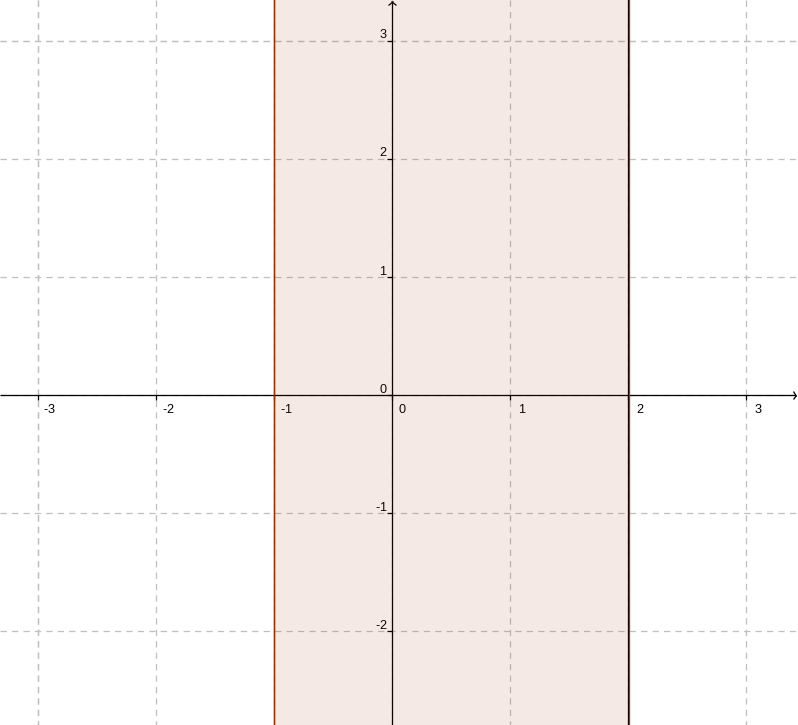<!-- style="display: block; margin-left: auto; margin-right: auto; max-width: 250px;" -->] [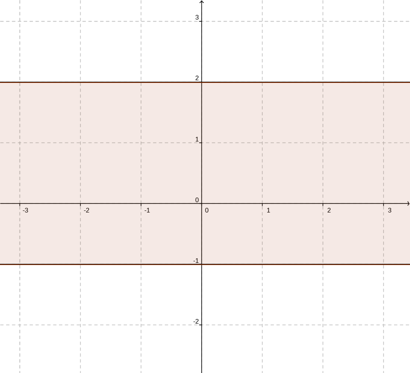<!-- style="display: block; margin-left: auto; margin-right: auto; max-width: 250px;" -->] [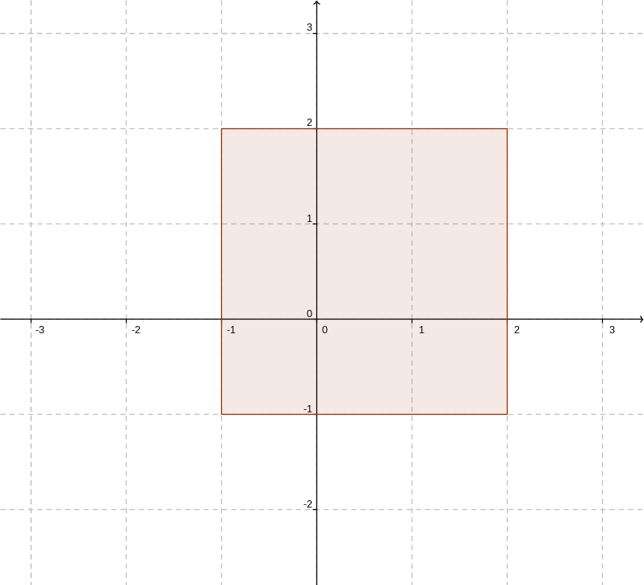<!-- style="display: block; margin-left: auto; margin-right: auto; max-width: 250px;" -->]]
[(X) ( ) ( )]  $A\times B$
[( ) ( ) (X)]  $A\times A$
[( ) (X) ( )]  $B\times A$
[[?]] Für die graphische Darstellung als Punktmengen sind die Elemente $(x,y)$ der kartesischen Produkte als Punktkoordinaten in einem kartesischen Koordinatensystem zu interpretieren. Finden Sie darin jeweils Bedingungen an die Koordinaten $x$ und $y$.
****************************************

1. Das zu bildende kartesische Produkt $$
  A\times B=\left\{(x,y)|(x\in[-1,2])\wedge(y\in\mathbb{R})\right\}
$$ lässt sich aufgrund der Beschränkung von $x$ und der Unbeschränktheit von $y$ in $(x,y)$ als "Streifen" parallel zur $y$-Achse interpretieren.
2. Das zu bildende kartesische Produkt $$
  B\times A=\left\{(x,y)|(x\in\mathbb{R})\wedge(y\in[-1,2])\right\}
$$ lässt sich aufgrund der Unbeschränktheit von $x$ und der Beschränktheit von $y$ in $(x,y)$ als "Streifen" parallel zur $x$-Achse interpretieren.
3. Das zu bildende kartesische Produkt $$
  A\times A=[-1,2]\times[-1,2]
$$ lässt sich aufgrund der Beschränktheit von $x$ und $y$ in $(x,y)$ als achsenparalleles Rechteck (hier sogar Quadrat) interpretieren.

****************************************

[^1]: Unendliche nichtperiodische Dezimalbrüche sind irrationalen Zahlen. Bekannte Beispiele sind $\sqrt{2}\approx 1.41$, die Kreiszahl $\pi\approx 3.14$ und die Eulersche Zahl $e\approx 2.71$. Es gilt außerdem $$\sin{\alpha}\not\in\mathbb{Q}\quad\text{für alle}\quad 0^\circ<\alpha<90^\circ\quad\text{mit Ausnahme}\quad\alpha=30^\circ$$

[^2]: Die Symbole $\infty$ und $-\infty$ bezeichnen keine reellen Zahlen, wonach die Klammern an diesen Grenzen nur runde Klammern und _keine_ eckigen sein dürfen.


## Zahlen und Gleichungen


Überblick
-----


In diesem Kapitel soll der Zahlbegriff betrachtet werden. Ein Fokus liegt dabei auf dem Lösen algebraischer Gleichungen. Ausgehend von den reellen Zahlen werden hierfür die komplexen Zahlen eingeführt. Es werden u. a. betrachtet:

* Rechengesetze für reelle Zahlen
* Zahlenbereichserweiterung zu den komplexen Zahlen
* Rechnen mit komplexen Zahlen
* Methoden zur Lösung algebraischer Gleichungen

Für einen Überblick über die Themen dieses Kapitels sehen Sie in der nachstehenden Graphik einige zentrale Begriffe. Schlagen Sie diese in diesem Abschnitt nach.

<!-- style="display: block; margin-left: auto; margin-right: auto; max-width: 1000px;" -->


Lernziele
-----


* Sie können die Gesetze für die Grundrechenarten zur Berechnung von Summen und Produkten endlich vieler reeller Zahlen anwenden.
* Sie kennen das Beweisverfahren der vollständigen Induktion und dessen Zusammenhang zum Aufbau des Zahlbereichs der natürlichen Zahlen.
* Sie nutzen Summen- und Produktzeichen zur Darstellung endlicher Summen und Produkte und können Rechengesetze zur Umformung anwenden.
* Sie konstruieren komplexe Zahlen aus Paaren reeller Zahlen und können diese in kartesischer - und Polarform angeben. Sie identifizieren eine komplexe Zahl mit einem Punkt in der Gaußsche_Zahlenebene.
* Sie beherrschen das Rechnen mit komplexen Zahlen wie Addieren, Subtrahieren, Multiplizieren und Dividieren. Sie können den Betrag einer komplexen Zahl berechnen, ebenso deren $n$-te Potenz beziehungsweise deren $n$-te komplexe Wurzeln.
* Sie kennen den Begriff einer algebraischen Gleichung vom Grad $n$ in einer Variablen.
* Auf der Grundlage des Fundamentalsatzes der Algebra können Sie eine Aussage zur Anzahl der Lösungen in Abhängigkeit des Grades der Gleichung treffen. Die Vielfachheit einer Lösung sowie das paarweise Auftreten nichtreeller Lösungen kennzeichnet dabei die Lösungsmenge.
* Sie wenden Methoden wie Koeffizientenvergleich, Polynomdivision und das Horner-Schema an, um die Lösungsmenge einer algebraischen Gleichung zu ermitteln.


### Reelle Zahlen


Grundrechenarten
=====

Im Abschnitt [Mengen](#Mengen) wurden die aus der Schulmathematik bekannten Teilmengen reeller Zahlen wiederholt.

* $\mathbb{N}$ ... Menge der natürlichen Zahlen
* $\mathbb{Z}$ ... Menge der ganzen Zahlen
* $\mathbb{Q}$ ... Menge der rationalen Zahlen
* $\mathbb{R}$ ... Menge der reellen Zahlen

Im Folgenden sollen noch einmal Operationen reeller Zahlen in den Blick genommen werden. Zunächst werden die in diesen Zahlbereichen erklärten Grundrechenoperationen mit den geltenden Rechenregeln angeführt.

>**Addition und Multiplikation.** Summe und Produkt natürlicher bzw. ganzer bzw. rationaler bzw. reeller Zahlen sind wieder Zahlen desselben Zahlbereichs. Man sagt:
>
>*Die Mengen $\mathbb{N}$ bzw. $\mathbb{Z}$ bzw. $\mathbb{Q}$ bzw. $\mathbb{R}$ sind bezüglich der Addition und Multiplikation abgeschlossen.*
>
>Es gelten darüber hinaus:
>
>1. *Assoziativität*[^1] $$ \left(p+q\right)+r=p+\left(q+r\right) \quad\text{sowie}\quad \left(p\cdot q\right)\cdot r=p\cdot \left(q\cdot r\right) $$
>2. *Kommutativität*[^1] $$ p+q=p+q\quad \text{sowie}\quad p\cdot q=q\cdot p $$
>3. *Distributivität*[^1] $$ \left(p+q\right)\cdot r=p\cdot r+q\cdot r $$
>3. *Neutrales Element*[^1] $$ p+0=p\quad\text{sowie}\quad q\cdot 1=q $$
>
>für beliebige natürliche bzw. ganze bzw. rationale bzw. reelle Zahlen $p$, $q$ und $r$.

>**Subtraktion und Division.** Die Division reeller Zahlen durch Null ist nicht erklärt. Darüber hinaus gelten für die jeweiligen Zahlbereiche:
>
>* *Natürliche Zahlen.* Subtraktion und Division können aus $\mathbb{N}$ herausführen, d. h. Differenz und Quotient sind nicht für jede Wahl der Argumente wieder natürliche Zahlen.
>* *Ganze Zahlen.* Die Menge $\mathbb{Z}$ ist gegenüber der Subtraktion abgeschlossen. Jedoch kann das Dividieren aus der Menge herausführen. Darüber hinaus besitzt jede ganze Zahl $p$ eine bezüglich der Addition eindeutig erklärte inverse Zahl $-p:=(-1)\cdot p$ mit $$
  p+ (-p)=(-p)+ p=0
$$ das $(-1)$-fache von $p$.
>* Die Menge der *rationalen Zahlen* ist gegenüber der Subtraktion und Division abgeschlossen. Ausnahme bildet die Division durch Null. Darüber hinaus besitzt jede rationale Zahl $p\in\mathbb{Q}^\times$ eine bezüglich der Multiplikation eindeutig erklärte inverse Zahl $p^{-1}:=\frac{1}{p}$ mit $$
  p\cdot p^{-1}=p^{-1}\cdot p=1
$$ den Kehrwert von $p$.


Vollständige Induktion
=====


Die Menge der natürlichen Zahlen kann mithilfe der **Nachfolgerfunktion** $$
  S:\mathbb{N}\to\mathbb{N}\quad\text{mit}\quad S(n)=n+1
$$ erklärt werden. Hierbei werden gefordert:

1. Sind die Nachfolger $S(a)$ und $S(b)$ zweier natürlicher Zahlen gleich, so sind $a$ und $b$ selbst gleich. Kurz: $$
  S(a)=S(b)\quad\rightarrow\quad a=b $$
2. Die Null ist nicht Nachfolger einer natürlichen Zahl.[^2] D. h. $$
  0\not\in S(\mathbb{N})=\left\{m|m=S(n)\wedge n\in\mathbb{N}\right\} $$ $S(\mathbb{N})$ bezeichnet hier die Bildmenge der Nachfolgerfunktion, also die Menge aller Nachfolger $S(n)$ einer natürlichen Zahl $n$.
3. Gilt $M\subseteq\mathbb{N}$ mit $0\in M$ und des Weiteren die Implikation $$
  n\in M\quad\rightarrow\quad S(n)\in M $$ so folgt $M=\mathbb{N}$.

An der dritten Forderung orientiert sich ein Beweisverfahren für Allaussagen $a(n)$ für beliebige $n\in\mathbb{N}$.

>**Vollständige Induktion.** Es bezeichnen $n$ und $k$ zwei natürliche Variablen und $a(n)$ eine Aussage in Abhängigkeit von $n$.
>
>*Induktionsanfang.* $a(n_0)$ eine wahre Aussage für ein $n_0\in\mathbb{N}$.
>
>*Induktionsschluss.* Folgt aus der Gültigkeit von $a(k)$ für ein beliebiges $k\in\mathbb{N}$ mit $k\geq n_0$ die Gültigkeit von $a(k+1)=a(S(k))$, so folgt mit dem Induktionsanfang die Gültigkeit für alle $n\in\mathbb{N}$ mit $n\geq n_0$.
> $$ \left(a(n_0)\;\wedge\; \big[\forall k\geq n_0\left(a(k)\rightarrow a(k+1)\right)\big]\right)\rightarrow a(n)\quad\forall n\geq n_0 $$

**Beispiel 1.** Nachzuweisen ist, dass $$
  a(n)=1+2+3+...+n=\frac{n\cdot(n+1)}{2}
$$ für beliebige natürliche Zahlen $n\geq 1$ gilt. Im nachstehenden Video erfolgt der Nachweis für die Summe der ersten einhundert natürlichen Zahlen, d. h. $$
  1+2+3+...+99+100=\frac{100\cdot 101}{2}=50\cdot 101=5050 $$
unter Nutzung von Assoziativ- und Kommutativgesetz bezüglich der Addition natürlicher Zahlen. Vergleiche auch mit einer der Reflexionsfragen im Abschnitt [Aussageformen]('Aussageformen').

!?[Gauss](https://www.youtube.com/watch?v=n2E_lfc2Bvc "Gaußsche Summenformel, Ausschnitt aus dem Film *Vermessung der Welt* nach dem gleichnamigen Roman von Daniel Kehlmann.")

Hier soll nun der Nachweis für beliebige Werte $n\in\mathbb{N}^\times$ mittels *vollständiger Induktion* geführt werden.

Induktionsanfang. Für $n=1$ gilt $1=\frac{1\cdot 2}{2}=1$.

Induktionsschluss. Für ein $n=k\geq 1$ gelte $$
  a(k)=1+2+3+...+k=\frac{k\cdot(k+1)}{2}
$$ Daraus folgt nach Addition von $k+1$ auf beiden Seiten der Gleichung $$
  1+2+3+...+k+\textcolor{purple}{(k+1)}=\frac{k\cdot(k+1)}{2}+\textcolor{purple}{(k+1)}
$$ Für die rechte Seite der Gleichung folgt $$
  \frac{k\cdot(k+1)}{2}+(k+1)=\frac{k\cdot(k+1)}{2}+\frac{2\cdot(k+1)}{2}=\frac{(k+1)\cdot(k+2)}{2}=a(k+1)
$$ Schließlich folgt hieraus unter Einbeziehung des Induktionsanfangs die Allgemeingültigkeit von $a(n)$ für alle $n\in\mathbb{N}$ mit $n\geq1$.

$\square$

Das vorstehende Beispiel wird im folgenden Video noch einmal erläutert.

!?[Gaußsche_Summenformel-2](https://www.youtube.com/watch?v=MD7U_vYaX58 "Daniel Jung, Beweis der Gaußschen Summenformel mithilfe des Beweisverfahrens der vollständigen Induktion.")

**Beispiel 2.** Analog zum vorigen Beispiel lässt sich mittels vollständiger Induktion beweisen:

{0-3}{Für beliebige natürliche Zahlen $n\in\mathbb{N}^\times$ gilt: $$ a(n)=1+3+5+...+2\cdot n-1=n^2 $$}

{1-3}{*Induktionsanfang.* Für $n=1$ gilt nach Einsetzen in die vorstehende Formel: $1=1^2$ (wahre Aussage).}

{2-3}{*Induktionsschluss.* Für $n=k$ mit $k\geq 1$ gelte: $$ 1+3+5+...+2\cdot k-1=k^2 $$ Hieraus folgt durch Addition von $2\cdot(k+1)-1$ zu beiden Seiten der Gleichung $$ (1+3+5+...+2\cdot k-1)+\textcolor{magenta}{2\cdot(k+1)-1}=k^2+\textcolor{magenta}{2\cdot(k+1)-1}=k^2+2\cdot k+1=(k+1)^2 $$ Mit dem Induktionsanfang folgt die Gültigkeit obiger Aussage für alle $n\in\mathbb{N}^\times$. $\quad\square$}

Benutzen Sie rechte und linke Cursortaste, um sich die einzelnen Beweisschritte anzuzeigen.


Endliche Summen und Produkte
===


Zur übersichtlichen Darstellung von Summen bzw. Produkten reeller Zahlen werden die nachfolgenden Schreibweisen vereinbart.

> **Summen- und Produktzeichen.** Es sind $i\in\{m,m+1,...,n-1,n\}\subset\mathbb{N}$ eine natürliche Variable und $a_i\in\mathbb{R}$ reelle Zahlen.
>
>1. Es bezeichnet $$ \sum_{i=m}^n{a_i}:=a_m+a_{m+1}+...+a_{n-1}+a_n $$ die [Summe](https://de.wikipedia.org/wiki/Summe) der reellen Zahlen $a_m$, $a_{m+1}$, ..., $a_{n-1}$ und $a_n$. Lies: "*Summe über alle Zahlen $a_i$ von $i$ gleich $m$ bis $n$*".
>2. Demgegenüber bezeichnet $$ \prod_{i=m}^n{a_i}:=a_m\cdot a_{m+1}\cdot ...\cdot a_{n-1}\cdot a_n $$ das Produkt der reellen Zahlen $a_m$, $a_{m+1}$, ..., $a_{n-1}$ und $a_n$. Lies: "*Produkt aller Zahlen $a_i$ von $i$ gleich $m$ bis $n$*".
>
>Die Variable $i$ der Summen- / Produktdarstellung wird auch **Laufvariable** genannt.

In den nachstehenden Videos wird die Verwendung des Summenzeichens zur Beschreibung endlicher Summen erläutert.

!?[Summenzeichen-1](https://www.youtube.com/watch?v=bX3nIvXmr6E "Daniel Jung, Verwendung des Summenzeichen zur Beschreibung endlicher Summen.")

**Beispiel 3.** Für die Summenformeln in den vorstehenden Beispielen kann somit geschrieben werden:

1. $$\sum_{i=1}^n{i}=1+2+3+...+n=\frac{n\cdot(n+1)}{2} \quad\text{(Beispiel 1)}$$
2. $$\sum_{i=1}^n{(2\cdot i-1)}=1+3+5+...+2\cdot n-1=n^2 \quad\text{(Beispiel 2)} $$

Darüber hinaus ergeben sich:

3. $$\sum_{i=1}^n{1}=1+1+1+...+1=n\cdot 1=n$$
4. $$\sum_{i=1}^n{j}=j+j+j+...+j=n\cdot j=n\cdot j$$

In den beiden letzten Beispielen hängen die zu summierenden Zahlen nicht von der Laufvariable ab.

**Beispiel 4.** Analog zum vorstehenden Beispiel lassen sich bilden:

1. Das Produkt der ersten $n$ natürlichen Zahlen $$ \prod_{i=1}^n{i}=1\cdot 2\cdot ...\cdot n=:n! $$ wird *Fakultät von $n$* genannt. Per Definition ist $0!=1$, darüber hinaus gelten $$ (n+1)!=n!\cdot (n+1) \quad\text{sowie}\quad \prod_{i=m}^n{i}=\frac{n!}{(m-1)!} $$
2. Das Produkt von Potenzen zur Basis $2$ unter Benutzung eines Potenzgesetzes $$\prod_{i=1}^n{(2^i)}=2^1\cdot 2^2\cdot ...\cdot 2^n=2^{1+2+...+n}=2^{\frac{n\cdot(n+1)}{2}}$$ worin ebenso die Gaußsche Summenformel (Beispiel 1) Anwendung findet.
3. Analog berechnet sich das Produkt unter Benutzung eines weiteren Potenzgesetzes $$\prod_{i=1}^n{(2^k)}=2^k\cdot 2^k\cdot ... \cdot 2^k=\left(2^k\right)^n=2^{k\cdot n}$$ Der auftretende Faktor hängt hier nicht von der Laufvariable ab.

Unter Benutzung der Javascript-Bibliothek [Algebrite](http://algebrite.org/) lassen sich Summen und Produkte interaktiv berechnen. So berechnet der Befehl `sum(a(j),j,m,n)` die Summe über alle Termwerte des von der Laufvariable $j$ abhängigen Terms $a(j)$ für jede Belegung $j\in\{m,m+1,m+2,...,n\}$. Zu beachten ist, dass der Bezeichner $i$ für die imaginäre Einheit verwendet wird und nicht als Laufvariable benutzt werden kann. Überlegen Sie, welches mathematische Objekt durch den in der letzten Zeile aufgeführten Befehl berechnet werden kann.

```javascript
m=1
n=3
a=1/(2^j)
sum(a,j,m,n)
product(j,j,1,n)/(product(j,j,1,m)*product(j,j,1,n-m))
```
@Algebrite.eval


>**Satz 1.** Für endlich viele Summanden gelten die nachstehenden Rechenregeln.
>
>1. Seien $a_i\in\mathbb{R}$ und $b_i\in\mathbb{R}$ mit $i\in\{m,m+1,...,n-1,n\}$. Dann gilt $$
  \sum_{i=m}^n{(a_i+b_i)}=\sum_{i=m}^n{a_i}+\sum_{i=m}^n{b_i} $$
>2. Für eine beliebige reelle Zahl $\lambda\in\mathbb{R}$ gilt ebenfalls $$
  \sum_{i=m}^n{(\lambda\cdot a_i)}=\lambda\cdot\sum_{i=m}^n{a_i} $$
>3. Für doppelte Summenbildung über die reellen Zahlen $c_{ik}$ mit $i\in\{m,m+1,...,n-1,n\}$ und $k\in\{a,a+1,...,b-1,b\}$ gilt $$
  \textcolor{purple}{\sum_{i=m}^n}{\left(\sum_{k=a}^b{c_{\textcolor{purple}{i}k}}\right)}=\sum_{k=a}^b{\left(\textcolor{purple}{\sum_{i=m}^n}{c_{\textcolor{purple}{i}k}}\right)} $$

**Beweis.** Der Nachweis der einzelnen Aussagen lässt sich unter Nutzung von Assoziativ- und Kommutativgesetz sowie dem Distributivgesetz für Summen endlich vieler reeller Zahlen führen. So lassen sich Eigenschaft 1 $$
  \sum_{i=m}^n{(a_i+b_i)}=
  (a_m+b_m)+(a_{m+1}+b_{m+1})+...+(a_{n-1}+b_{n-1})+(a_n+b_n)=(a_m+a_{m+1}+...+a_{n-1}+a_n)+(b_m+b_{m+1}+...+b_{n-1}+b_n)=
  \sum_{i=m}^n{a_i}+\sum_{i=m}^n{b_i} $$
und in gleicher Weise Eigenschaft 2 $$
  \sum_{i=m}^n{(\lambda\cdot a_i)}=
  (\lambda\cdot a_{m})+(\lambda\cdot a_{m+1})+...+(\lambda\cdot a_{n-1})+(\lambda\cdot a_{n})=
  \lambda\cdot (a_{m}+a_{m+1}+...+a_{n-1}+a_{n})=
  \lambda\cdot\sum_{i=m}^n{a_i} $$
nachrechnen. Für den Nachweis von Eigenschaft 3 werden zunächst die Summen von "innen nach außen" durch Auflösung des Summenzeichens geschrieben[^3] $$
  \textcolor{purple}{\sum_{i=m}^n}{\left(\sum_{k=a}^b{c_{\textcolor{purple}{i}k}}\right)}=
  \textcolor{purple}{\sum_{i=m}^n}{\left(c_{\textcolor{purple}{i},a}+c_{\textcolor{purple}{i},a+1}+...+c_{\textcolor{purple}{i},b-1}+c_{\textcolor{purple}{i},b}\right)}=
  \left(c_{\textcolor{purple}{m},a}+c_{\textcolor{purple}{m},a+1}+...+c_{\textcolor{purple}{m},b-1}+c_{\textcolor{purple}{m},b}\right)+\left(c_{\textcolor{purple}{m+1},a}+c_{\textcolor{purple}{m+1},a+1}+...+c_{\textcolor{purple}{m+1},b-1}+c_{\textcolor{purple}{m+1},b}\right)+...+\left(c_{\textcolor{purple}{n},a}+c_{\textcolor{purple}{n},a+1}+...+c_{\textcolor{purple}{n},b-1}+c_{\textcolor{purple}{n},b}\right)
$$ Werden die Summanden unter Anwendung von Assoziativ- und Kommutativgesetz nun in der Form $$
  \left(c_{\textcolor{purple}{m},a}+c_{\textcolor{purple}{m+1},a}+...+c_{\textcolor{purple}{n-1},a}+c_{\textcolor{purple}{n},a}\right)+\left(c_{\textcolor{purple}{m},{a+1}}+c_{\textcolor{purple}{m+1},{a+1}}+...+c_{\textcolor{purple}{n-1},{a+1}}+c_{\textcolor{purple}{n},{a+1}}\right)+...+\left(c_{\textcolor{purple}{m},b}+c_{\textcolor{purple}{m+1},b}+...+c_{\textcolor{purple}{n-1},b}+c_{\textcolor{purple}{n},b}\right)=\sum_{k=a}^b{\left(c_{\textcolor{purple}{m},k}+c_{\textcolor{purple}{m+1},k}+...+c_{\textcolor{purple}{n-1},k}+c_{\textcolor{purple}{n},k}\right)}=\sum_{k=a}^b{\left(\textcolor{purple}{\sum_{i=m}^n}{c_{\textcolor{purple}{i}k}}\right)}
$$ geschrieben.

$\square$

**Bemerkung 1.** Die Laufvariable $i$ in einer Summe $$
  \sum_{i=m}^n{a_i}=a_m+a_{m+1}+...+a_{n-1}+a_n
$$ ist eine lokale Variable und lässt innerhalb dieser Summe beliebig umbenennen, aber auch "verschieben". Zum Beispiel lässt sich die nachstehende Summe durch die **Indexverschiebung** $k=i-1\,\leftrightarrow\, i=k+1$ $$
  \sum_{i=1}^n{\left(2^{i-1}\right)}=2^0+2^1+...+2^{n-1}=\sum_{k=0}^{n-1}{\left(2^{k}\right)}
$$ äquivalent darstellen.

**Beispiel 5.** Der Laufindex $k$ in den nachstehenden Summen $$
  \sum_{k=6}^{12}{\frac{1}{3+k}}\quad\text{bzw.}\quad
  \sum_{k=1}^{21}{\frac{1}{k+2}}-\sum_{k=4}^{24}{\frac{1}{k-2}}
$$ ist zu verschieben. Die aufgeführte Differenz ist zu berechnen.

1. Der Laufindex ist zu verschieben, so dass von $i=1$ ab summiert wird. Mit $i=k-5$ ergibt sich $$
  \sum_{k=6}^{12}{\frac{1}{3+k}} = \sum_{i=1}^{7}{\frac{1}{8+i}}
$$ Mit der Indexverschiebung $i=k-3$ im Subtrahenden ergibt sich die Differenz $$
  \begin{split}
    \sum_{k=1}^{21}{\frac{1}{k+2}}-\sum_{k=4}^{24}{\frac{1}{k-2}}
    & = \sum_{i=1}^{21}{\frac{1}{i+2}}-\sum_{i=1}^{21}{\frac{1}{i+1}} \\
    & = \sum_{i=1}^{21}{\left({\frac{1}{i+2}}-{\frac{1}{i+1}}\right)} \\
    & = \frac{1}{3} -\frac{1}{2} + \frac{1}{4} - \frac{1}{3} +\frac{1}{5} -\frac{1}{4}+ \dots +\frac{1}{21}-\frac{1}{20}+\frac{1}{22}-\frac{1}{21}+\frac{1}{23}-\frac{1}{22} \\
    & = -\frac{1}{2} +\frac{1}{23} = -\frac{23}{46} + \frac{2}{46} = -\frac{21}{46} \approx -0.4565217
  \end{split}
$$
2. Der Laufindex ist zu verschieben, so dass über $\frac{1}{m}$ summiert wird. Mit $m=3+k$ ergibt sich $$
  \sum_{k=6}^{12}{\frac{1}{3+k}} = \sum_{m=9}^{15}{\frac{1}{m}}
$$ Analog ergibt sich mit $m=k+2$ im Minuend und $m=k-2$ im Subtrahend für die Differenz $$
 \begin{align*}
        \sum_{k=1}^{21}{\frac{1}{k+2}}-\sum_{k=4}^{24}{\frac{1}{k-2}}
        =\sum_{m=3}^{23}{\frac{1}{m}}-\sum_{m=2}^{22}{\frac{1}{m}}=\frac{1}{23}-\frac{1}{2}
\end{align*}
$$


Sicher gewusst
===


Testen Sie Ihr Wissen in diesem Abschnitt und Beantworten Sie die folgenden Fragen.

**Frage 1.** Entscheiden Sie. Führen Sie den Nachweis mittels vollständiger Induktion.

[( )] $$\forall n\in\mathbb{N}\;\left(2^n\geq n^2\right)$$
[( )] $$\forall n\in\mathbb{N}\,,n\geq 3\;\left(2^n\leq n^2\right)$$
[(X)] $$\forall n\in\mathbb{N}\,,n\geq 4\;\left(2^n\geq n^2\right)$$
[[?]] Eine Entscheidung lässt sich unter Benutzung der Funktionsgraphen zu den Funktionen $$
  n\mapsto 2^n\quad\text{und}\quad n\mapsto n^2
$$ ableiten. Die beiden Funktionsgraphen haben für $n\in[0,\infty)$ zwei Punkte gemeinsam, bei $n=2$ und $n=4$. Für $n=1$, $n=3$ und $n\in\mathbb{N}$ mit $n\geq 4$ sind die Funktionswerte beider Funktionen zu vergleichen. 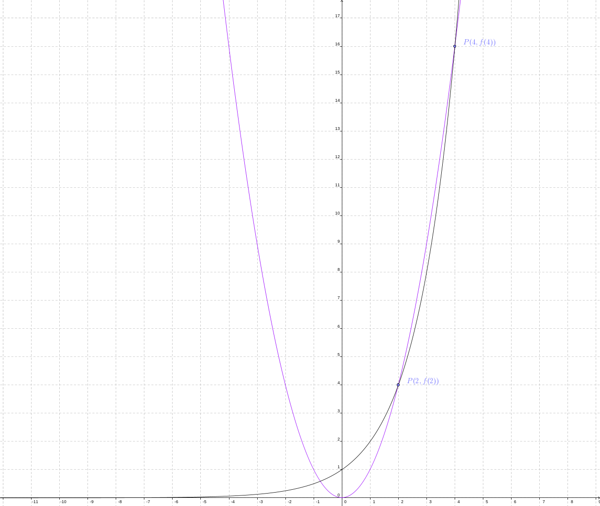
****************************************

Der Nachweis erfolgt mit Hilfe des Beweisverfahrens der vollständigen Induktion.

1. Für $n_0=4$ gilt $2^4=16=4^2$.
2. Aus der angenommenen Ungleichung $$
  2^k\geq k^2\quad\text{für}\quad k>4
$$ folgt unter Benutzung der Aussage für $k$ $$
  2^{k+\textcolor{magenta}{1}}=2\cdot 2^k\geq 2\cdot k^2=k^2+k\cdot k>k^2+4\cdot k=k^2+2\cdot k+2\cdot k>k^2+2\cdot k+1=(k+\textcolor{magenta}{1})^2
$$ Hieraus folgt also die Gültigkeit $2^n> n^2$ für alle natürlichen Zahlen $n>4$ und mit dem Induktionsanfang $$ 2^n\geq n^2\quad\forall\, n\geq 4 $$

$\square$

****************************************

**Frage 2.** Schreiben Sie Summe $$
  1-\frac{1}{2}+\frac{1}{3}-\frac{1}{4}+-\ldots-\frac{1}{100} $$ unter Benutzung des Summenzeichens.

[[ ]] $$ \sum_{k=1}^{100}{\left((-1)^{k}\cdot\frac{1}{k}\right)} $$
[[X]] $$ \sum_{k=1}^{100}{\left((-1)^{k-1}\cdot\frac{1}{k}\right)} $$
[[X]] $$ \sum_{k=0}^{99}{\left((-1)^{k}\cdot\frac{1}{k+1}\right)} $$
[[ ]] $$ \sum_{k=1}^{100}{\left(\frac{1}{k}-\frac{1}{k+1}\right)} $$
[[X]] $$ \sum_{k=1}^{50}{\left(\frac{1}{2\cdot k-1}-\frac{1}{2\cdot k}\right)} $$
[[?]] Stellen Sie die in den Antwortoptionen dargestellten Summen unter Auslassung des Summenzeichens dar und vergleichen Sie mit der oben dargestellten Summe. Es ist möglich, dass mehrere Antwortoptionen korrekt sind.
****************************************

1. Für die erste Antwortoption ergibt sich $$ \sum_{k=1}^{100}{\left((-1)^{k}\cdot\frac{1}{k}\right)} = -1+\frac{1}{2}-\frac{1}{3}\pm...-\frac{1}{99}+\frac{1}{100} $$
2. Demgegenüber ergibt die zweite Antwortoption $$ \sum_{k=1}^{100}{\left((-1)^{k-1}\cdot\frac{1}{k}\right)} = 1-\frac{1}{2}+\frac{1}{3}\mp...+\frac{1}{99}-\frac{1}{100} $$
3. Die dritte Antwortoption liefert die gleiche Summe $$ \sum_{k=0}^{99}{\left((-1)^{k}\cdot\frac{1}{k+1}\right)} = 1-\frac{1}{2}+\frac{1}{3}\mp...+\frac{1}{99}-\frac{1}{100} $$
4. Die vierte Antwortoption berechnet sich $$
  \sum_{k=1}^{100}{\left(\frac{1}{k}-\frac{1}{k+1}\right)}=\left(1-\frac{1}{2}\right)+\left(\frac{1}{2}-\frac{1}{3}\right)+...+\left(\frac{1}{98}-\frac{1}{99}\right)+\left(\frac{1}{99}-\frac{1}{100}\right) = 1-\frac{1}{2}+\frac{1}{2}-\frac{1}{3}\pm...+\frac{1}{98}-\frac{1}{99}+\frac{1}{99}-\frac{1}{100}=1-\frac{1}{100}=0.99 $$
5. Die fünfte Summe berechnet sich schrittweise unter Nutzung der Assoziativität $$ \sum_{k=1}^{50}{\left(\frac{1}{2\cdot k-1}-\frac{1}{2\cdot k}\right)}=\left(1-\frac{1}{2}\right)+\left(\frac{1}{3}-\frac{1}{4}\right)+...+\left(\frac{1}{99}-\frac{1}{100}\right) = 1-\frac{1}{2}+\frac{1}{3}-\frac{1}{4}\pm...+\frac{1}{99}-\frac{1}{100} $$


****************************************

**Frage 3.** Der Binomialkoeffizient zweier natürlicher Zahlen $n$ und $k$ mit $n\geq k$ ist definiert $$
  \binom{n}{k}=\frac{n!}{k!\cdot(n-k)!}
$$ worin $k!=1\cdot 2\cdot ...\cdot k$ und $0!=1$ selbst definiert sind.

Berechnen Sie unter Benutzung obiger Formel $$\binom{7}{2}+\binom{7}{3}$$

[( )] $21$
[( )] $35$
[(X)] $56$
[[?]] Nutzen Sie zur Kontrolle Ihrer Rechnung, dass gilt $$
  \binom{n}{k}+\binom{n}{k+1}=\binom{n+1}{k+1}
$$ Mit Hilfe dieser Formel lassen sich die [Binomialkoeffizienten]( https://de.wikipedia.org/wiki/Binomialkoeffizient) rekursiv bestimmen.
****************************************

Es berechnen sich $$
  \binom{7}{2}=\frac{7!}{2!\cdot 5!}=\frac{7\cdot 6}{1\cdot 2}=21\,,\quad
  \binom{7}{2}=\frac{7!}{3!\cdot 4!}=\frac{7\cdot 6\cdot 5}{1\cdot 2\cdot 3}=35\,,\quad
  \binom{7}{2}+\binom{7}{3}=56
$$ Dieser Wert entspricht $$
  \binom{8}{3}=\frac{8!}{3!\cdot 5!}=\frac{8\cdot 7\cdot 6}{1\cdot 2\cdot 3}=56
$$ Allgemein gilt $$
  \begin{split}
    \binom{n}{k}+\binom{n}{k+1} & = \frac{n!}{k!\cdot(n-k)!}+\frac{n!}{(k+1)!\cdot(n-k-1)!} \\
    & = \frac{n!\cdot\textcolor{red}{(k+1)}}{k!\cdot(n-k)!\cdot\textcolor{red}{(k+1)}}+\frac{n!\cdot\textcolor{purple}{(n-k)}}{(k+1)!\cdot(n-k-1)!\cdot\textcolor{purple}{(n-k)}} \\
    & = \frac{n!\cdot (k+1)}{(k+1)!\cdot(n-k)!}+\frac{n!\cdot(n-k)}{(k+1)!\cdot(n-k)!} \\
    & = \frac{n!\cdot (k+1)+n!\cdot(n-k)}{(k+1)!\cdot(n-k)!} \\
    & = \frac{n!\cdot ((k+1)+(n-k))}{(k+1)!\cdot(n-k)!} \\
    & = \frac{(n+1)!}{(k+1)!\cdot(n-k)!} =\binom{n+1}{k+1}
  \end{split}
$$

****************************************


[^1]: bezüglich der Operationen Addition und Multiplikation

[^2]: Null besitzt keinen Vorgänger.

[^3]: Zur übersichtlichen Darstellung wird der Doppelindex in der Rechnung durch Komma getrennt.


### Komplexe Zahlen


Motivation
===


**Beispiel 1.** Quadratische Gleichungen in der reellen Variablen $x$ besitzen maximal zwei Lösungen: zum Beispiel $$
  x^2-1=(x+1)\cdot(x-1)=0\quad\leftrightarrow\quad x_1=1\;\vee\;x_2=-1
$$ andererseits $$
  x^2-2\cdot x+1=(x-1)^2=0\quad\leftrightarrow\quad x=1
$$ oder $$
  x^2+1=0\quad\rightarrow\quad L=\emptyset
$$ Die letztere Gleichung besitzt keine reelle Lösung, denn es gilt genau einer der folgenden Fälle:

1. Für beliebige Werte $x\geq0$ gilt, dass $x^2\geq0$ und somit $x^2+1>0$ folgt.
2. Für beliebige Werte $x<0$ folgt in gleicher Weise, dass mit $-x>0$ und $$
  (-x)\cdot(-x)=(-1)^2\cdot x^2=x^2>0
$$ schließlich $x^2+1>0$ folgt.

Demnach gibt es kein $x\in\mathbb{R}$, dass die Gleichung $x^2+1=0$ löst.

**Bemerkung 1.** Die Formel zur Lösung quadratischer Gleichungen $$
  x^2+p\cdot x+q=0\quad\leftrightarrow\quad x_{1,2}=-\frac{p}{2}\pm\sqrt{\frac{p^2}{4}-q}
$$ gestattet eine Fallunterscheidung zur Anzahl der reellen Lösungen in Abhängigkeit der reellen Koeffizienten der Gleichung.

Für die Lösungen $x_1$ und $x_2$ gelten mit dem Radikanten[^2] $\frac{p^2}{4}-q=\frac{1}{4}\cdot(p^2-4\cdot q)$ der Wurzel $$
 \left\{\begin{array}{lcl}
         x_1\in\mathbb{R},\;x_2\in\mathbb{R}\;\text{mit}\; x_1\neq x_2 & \text{falls} & p^2-4\cdot q>0 \\
         x_1\in\mathbb{R},\;x_2\in\mathbb{R}\;\text{mit}\; x_1= x_2 & \text{falls} & p^2-4\cdot q=0 \\
         \not\exists\, x_{1,2}\in\mathbb{R} & \text{falls} & p^2-4\cdot q<0
        \end{array}
 \right.
$$

Unter Benutzung der Javascript-Bibliothek [Algebrite](http://algebrite.org/) lassen sich die Lösungen obiger Gleichungen interaktiv berechnen. Ausgaben, welche den Ausdruck $i$ enthalten, bezeichnen keine reelle Lösung.

```javascript
a=x^2-1
b=x^2+1
c=x^2+p*x+q
roots(a)
roots(b)
roots(c)
```
@Algebrite.eval


Konstruktion der komplexen Zahlen
===


>**Definition 1.** Die Zahl $i$ mit $i^2=-1$ heißt [imaginäre Einheit](https://de.wikipedia.org/wiki/Imagin%C3%A4re_Zahl).[^1]

Die in Beispiel 1 betrachtete Gleichung $x^2+1$ ergibt mit dieser Definition $$
  i^2+1=-1+1=0\quad\text{und}\quad
  (-i)^2+1=(-1\cdot i)^2=(-1)^2\cdot i^2=1\cdot(-1)+1=0
$$ nach Annahme der Gültigkeit der Potenzgesetze für die in Definition 1 erklärte imaginäre Einheit. Damit besitzt die Gleichung $x^2+1$ die beiden Lösungen $x_{1,2}=\pm i$.

>**Definition 2.** Eine Zahl $b\cdot i=bi$ mit $b\in\mathbb{R}$ und $i^2=-1$ heißt *imaginäre Zahl*.

Das Rechnen mit reellen Zahlen lässt sich auf imaginäre Zahlen übertragen.

**Beispiel 2.** Es berechnen sich

1. $3i+2i+ci=(5+c)\cdot i\;\text{für}\; c\in\mathbb{R}$
2. $pi\cdot qi=pq\cdot i^2=-pq\;\text{für}\; p\in\mathbb{R},\; q\in\mathbb{R}$
3. $i^5=i^{2+2+1}=i^2\cdot i^2\cdot i=(-1)\cdot(-1)\cdot i=i$
4. $i^{4n+3}=i^{4n}\cdot i^3=(i^2\cdot i^2)^n\cdot i^2\cdot i=1^n\cdot(-1)\cdot i=-1 \;\forall n\in\mathbb{N}$
5. $$\frac{1}{i^3}=\frac{1}{i^2\cdot i}=-\frac{1}{i}=-\frac{i}{i^2}=-\frac{i}{(-1)}=i$$

Unter Benutzung der Javascript-Bibliothek [Algebrite](http://algebrite.org/) können unter Verwendung des Bezeichners $i$ interaktiv reelle und imaginäre Zahlen verknüpft werden.

```javascript
i^2
simplify(2*i+a*i)
1/(i^3)
```
@Algebrite.eval

Die uneingeschränkte Anwendung der Rechengesetze für reelle Zahlen auf imaginäre Zahlen führt auf die Definition einer komplexen Zahl.

>**Definition 3.** Eine [komplexe Zahl](https://de.wikipedia.org/wiki/Komplexe_Zahl) ist ein Ausdruck der Form $$
  z=a+ib\quad\text{mit}\quad a\in\mathbb{R},\; b\in\mathbb{R},\; i^2=-1
$$ Die darin auftretende Zahl $a$ wird *Realteil* von $z$ genannt, während der Koeffizient $b$ von $i$ den *Imaginärteil* von $z$ bezeichnet. Man schreibt $$
  a=\operatorname{Re}{z}\,,\quad b=\operatorname{Im}{z}
$$ Die Menge aller komplexen Zahlen wird angegeben mit $$
  \mathbb{C}=\left\{z=a+ib\,|\, (a\in\mathbb{R})\,\wedge\, (b\in\mathbb{R})\,\wedge\,(i^2=-1)\right\}
$$ (engl.: ~~c~~omplex numbers).

Die in der Javascript-Bibliothek [Algebrite](http://algebrite.org/) zur Verfügung stehenden Befehle `real(.)` beziehungsweise `imag(.)` geben den Real- beziehungsweise Imaginärteil einer komplexen Zahl zurück.

```javascript
z=2+5*i
real(z)
imag(z)
```
@Algebrite.eval

Die reellen Zahlen sind in den komplexen Zahlen enthalten, d. h. es gilt $\mathbb{R}\subset \mathbb{C}$, da $$
  (bi-bi=(b-b)\cdot i=0\cdot i=0)\quad\Rightarrow\quad (z=a+0i=a\,(\in\mathbb{R}))
$$ Speziell ist $z=0+0i=0$. Damit folgt auch $\mathbb{N}\subset\mathbb{Z}\subset\mathbb{Q}\subset\mathbb{R}\subset\mathbb{C}$. Wie im Abschnitt [Mengen](#Mengen) vereinbaren wir $\mathbb{C}^\times=\mathbb{C}\setminus\{0\}$.

Die Begriffe 'imaginäre Einheit', 'imaginäre Zahl' und 'komplexe Zahl' werden im nachstehenden Video im Kontext der Lösung quadratischer Gleichungen an einem Beispiel erläutert.

!?[komplexe Zahl](https://www.youtube.com/watch?v=XQblFqzoMYo&list=PLLTAHuUj-zHgrAfietLRb01pO1mtji8qn&index=2 "Daniel Jung, Komplexe Zahlen, Einführung, imaginäre Einheit")

>**Definition 4.** Es sind $z_1\in\mathbb{C}$ und $z_2\in\mathbb{C}$ mit $$
  z_j=a_j+i\cdot b_j\,,\quad a_j=\operatorname{Re}{z_j}\,,\quad  b_j=\operatorname{Im}{z_j}\,,\quad i^2=-1
$$ zwei beliebige komplexe Zahlen. Die Zahlen $z_1$ und $z_2$ heißen **gleich**, kurz $z_1=z_2$, falls $$ a_1=a_2\quad\text{und}\quad b_1=b_2
$$ für die Real- und Imaginärteile gelten.

**Beispiel 3.** Gegeben sind zwei von Parametern $a\in\mathbb{R}$ und $b\in\mathbb{R}$ abhängige komplexe Zahlen $$
  z_1=a^2+1-2a\cdot i\,,\quad z_2=-2a+i\cdot(b+a)\,,\quad i^2=-1
$$ Es gilt $$
  z_1=z_2\quad\leftrightarrow\quad \operatorname{Re}{z_1}=\operatorname{Re}{z_2}\;\wedge\;\operatorname{Im}{z_1}=\operatorname{Im}{z_2}
$$ Hieraus ergibt sich das System von zwei Gleichungen in den Parametern $a$ und $b$ $$
  \left.\begin{array}{ccc} a^2+1 & = & -2a \\ -2a & = & b+a \end{array}\right\}=
  \left\{\begin{array}{ccc} (a+1)^2 & = & 0 \\ b & = & -3a \end{array}\right.
$$ mit den Lösungen $a_1=a_2=-1$ und $b=3$. Es ergibt sich nach Einsetzen $z_1=z_2=2+2i$.

>**Definition 5.** Zu einer Zahl $z\in\mathbb{C}$ mit $$
  z=a+i\cdot b\,,\quad a=\operatorname{Re}{z}\,,\quad  b=\operatorname{Im}{z}\,,\quad i^2=-1
$$ heißt $\bar{z}=a+(-1)\cdot b\cdot i$ die zu $z$ [komplex konjugierte Zahl](https://de.wikipedia.org/wiki/Konjugation).

**Beispiel 4.** Zu bestimmen sind jeweils die komplex konjugierten Zahlen. Es gilt wie zuvor $i^2=-1$.

1. $z_1=3+2i$. Hieraus lassen sich $\operatorname{Re}{z_1}=3$ und $\operatorname{Im}{z_1}=2$ ablesen. Für die komplex konjugierte Zahl folgt nach obiger Definition $\bar{z}_1=3+(-1)\cdot 2i=3-2i$.
2. $z_2=-i$. Es sind $\operatorname{Re}{z_2}=0$ und $\operatorname{Im}{z_2}=-1$ und somit $\bar{z}_2=0+(-1)\cdot (-i)=i$.
3. $z_3=7.1$ Es sind $\operatorname{Re}{z_3}=7.1$ und $\operatorname{Im}{z_2}=0$ und somit $\bar{z}_3=z_3=7.1$.
4. $z_4=a^2+1-2a\cdot i$ mit $a\in\mathbb{R}$. Hier sind in Abhängigkeit des Parameters $\operatorname{Re}{z_4}=a^2+1$ und $\operatorname{Im}{z_4}=-2a$, woraus sich die komplex konjugierte Zahl $\bar{z}_4=a^2+1+2a\cdot i$ ergibt.

In der Javascript-Bibliothek [Algebrite](http://algebrite.org/) steht zur Bildung der komplex konjugierten Zahl der Befehl `conj(.)` zur Verfügung. Testen Sie diesen Befehl an den Zahlen aus Beispiel 4.

```javascript
z=3+2*i
zc=conj(z)
zc
x=real(z)
y=imag(z)
w=x-y*i
test(zc=w,wahr,falsch)
```
@Algebrite.eval

**Bemerkung 2.** Aus dem vorstehenden Beispiel lassen sich unmittelbar für beliebige komplexe Zahlen $z\in\mathbb{C}$ ableiten:

1. Für Zahlen $z\in\mathbb{C}$ mit $\operatorname{Im}{z}=0$ folgt $\bar{z}=z$ und umgekehrt.
2. Für Zahlen $z\in\mathbb{C}$ mit $\operatorname{Re}{z}=0$ folgt $\bar{z}=-z$ und umgekehrt.
3. Der Realteil einer komplexen Zahl $z$ lässt sich bestimmen über $$
  \operatorname{Re}{z}=\frac{1}{2}\cdot\left(z+\bar{z}\right)
$$
4. Der Imaginärteil einer komplexen Zahl $z$ lässt sich bestimmen über $$
  \operatorname{Im}{z}=\frac{1}{2}\cdot\left(z-\bar{z}\right)
$$

Der Nachweis dieser Aussagen ist eine Übungsaufgabe.


Darstellungen komplexer Zahlen
===


Komplexe Zahlen $z\in\mathbb{C}$ mit der Darstellung $$
  z=a+b\cdot i\,,\quad \operatorname{Re}{z}=a\,,\quad \operatorname{Im}{z}=b\,,\quad i^2=-1
$$ stellen geordnete Paare reeller Zahlen dar, d. h. $$
  z=a+b\cdot i\quad\leftrightarrow\quad (a,b)\in\mathbb{R}^2
$$ Sie lassen sich somit als kartesische Koordinaten von Punkten in einer Ebene umkehrbar eindeutig identifizieren. In dieser Zuordnung entsprechen

1. die erste Koordinatenachse der reellen Zahlgeraden. Diese wird nachfolgend **reelle Achse** genannt. An dieser werden die Realteile komplexer Zahl (als Koordinaten) abgetragen.
2. die Punkte auf der zweiten Koordinatenachse den imaginären Zahlen. Diese Achse wird daher als **imaginäre Achse** bezeichnet. An dieser werden die Imaginärteile komplexer Zahl (als Koordinaten) abgetragen.

Die Darstellung komplexer Zahlen als Punkte in beschriebenen Koordinatensystem wird [Gaußsche Zahlenebene](https://mathepedia.de/Gauszsche_Zahlenebene.html) genannt. Die reelle Zahlengerade wird geometrisch durch eine zusätzliche Dimension zur "komplexen Zahlgerade" erweitert.

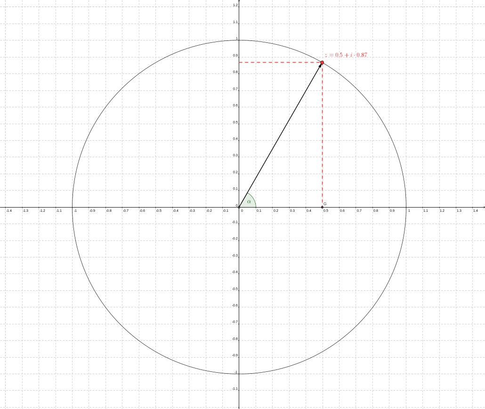<!-- style="display: block; margin-left: auto; margin-right: auto; max-width: 900px;" -->

**Beispiel 5.** In der Gaußschen Zahlenebene ist ein regelmäßiges Sechseck ('Zirkelmuster') mit Eckpunkten auf dem Umkreis mit Mittelpunkt $O(0,0)$ und Radius $r=4$ gegeben. Ein Eckpunkt liegt auf der reellen Achse.

Zu bestimmen ist die kartesische Form der zu den Eckpunkten gehörenden komplexen Zahlen.

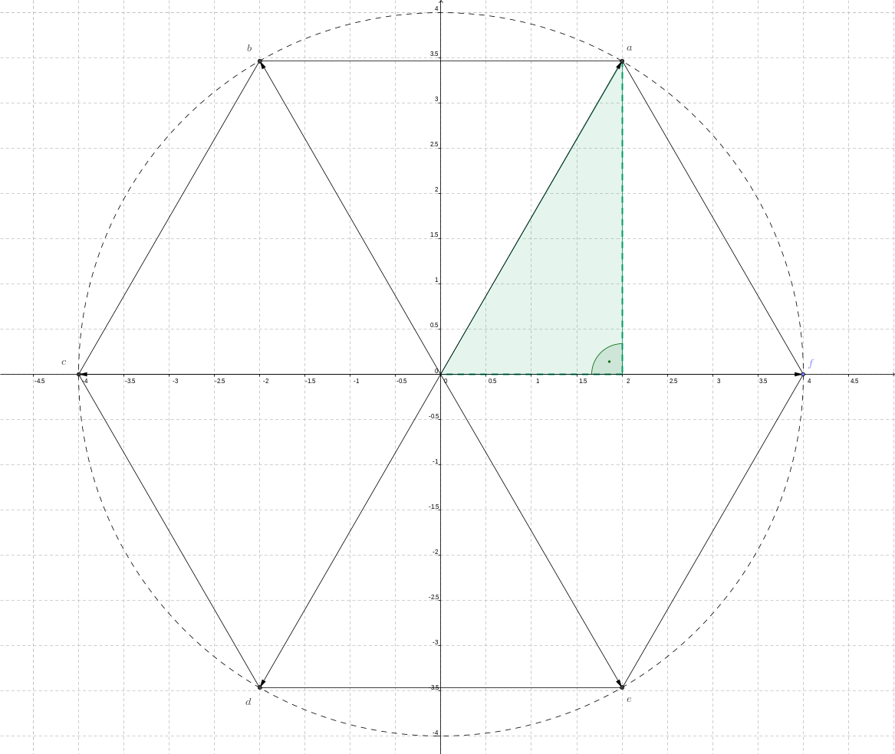<!-- style="display: block; margin-left: auto; margin-right: auto; max-width: 900px;" -->

Die Zeiger durch die Eckpunkte schließen mit der positiv orientierten reellen Achse Winkel der Größen $$
  \alpha\in\{0^\circ,60^\circ,120^\circ,180^\circ,240^\circ,300^\circ\}
$$ ein. Aus dem eingetragenen rechtwinkligen Dreieck lassen sich hiermit die kartesischen Koordinaten $(4\cdot\cos{\alpha},4\cdot\sin{\alpha})$ der Eckpunkte bestimmen. Zu diesen gehören somit die komplexen Zahlen

* $z_1=4\cdot\cos{0^\circ}+4\cdot\sin{0^\circ}\cdot i=4$
* $z_2=4\cdot\cos{60^\circ}+4\cdot\sin{60^\circ}\cdot i=2+2\sqrt{3}\cdot i$
* $z_3=4\cdot\cos{120^\circ}+4\cdot\sin{120^\circ}\cdot i=-2+2\sqrt{3}\cdot i$
* $z_4=4\cdot\cos{180^\circ}+4\cdot\sin{180^\circ}\cdot i=-4$
* $z_5=4\cdot\cos{240^\circ}+4\cdot\sin{240^\circ}\cdot i=-2-2\sqrt{3}\cdot i$
* $z_6=4\cdot\cos{300^\circ}+4\cdot\sin{300^\circ}\cdot i=2-2\sqrt{3}\cdot i$

**Bemerkung 3.** Die Ordnungsrelationen 'kleiner als', 'größer als' in der Menge der reellen Zahlen lassen sich nicht auf $\mathbb{C}$ übertragen. Insbesondere gibt es keine positiven oder negativen komplexen Zahlen.

Mit den vorstehenden Abbildungen lässt sich jedem Punkt / jeder Zahl $z\in\mathbb{C}^\times$ in der Gaußschen Zahlenebene umkehrbar eindeutig zuordnen:

1. das geordnete Paar kartesischer Koordinaten $(a,b)\in\mathbb{R}^2$ mit $a=\operatorname{Re}{z}$ und $b=\operatorname{Im}{z}$. Die Darstellung $z=a+i\cdot b$ aus Definition 3 wird **kartesische Form** der komplexen Zahl genannt.
2. das Paar $(r,\varphi)\in(0,\infty)\times (-\pi,\pi]$ mit Abstand $r$ von $z$ zum Koordinatenursprung sowie dem Winkel $\varphi$, den der Zeiger zu $z$ mit der positiv orientierten reellen Achse im Grundintervall einschließt.
3. Der Zahl $z=0$ entsprechen umkehrbar eindeutig die kartesischen Koordinaten $(a,b)=(0,0)$, jedoch ist für $r=0$ der Winkel $\varphi$ in der Polarform nicht eindeutig bestimmt.

>**Definition 6.** Die Koordinaten $(r,\varphi)$ eines vom Koordinatenursprung verschiedenen Punktes in der Gaußschen Zahlenebene werden [Polarkoordinaten](https://de.wikipedia.org/wiki/Polarkoordinaten) genannt. Die Darstellung $$
  z=r\cdot(\cos{\varphi}+i\cdot\sin{\varphi})\,,\quad r\in(0,\infty)\,,\quad \varphi\in(-\pi,\pi]\,,\quad i^2=-1
$$ wird als trigonometrische beziehungsweise **Polarfom** von $z\in\mathbb{C}^\times$ bezeichnet. Darin heißt $r$ **Betrag** und $\varphi$ **Argument** von $z$.

Für die Umrechnung zwischen kartesischen und Polarkoordinaten nutzt man das in den vorstehenden Abbildungen eingetragene Koordinatendreieck.

1. Es sei $z$ in der kartesischen Form gegeben, d. h. $z=a+i\cdot b$ gemäß Definition 3. Des Weiteren wird $a^2+b^2\not=0$ vorausgesetzt. Dann berechnen sich dessen Polarkoorinaten vermöge $$
  |z|=r=\sqrt{a^2+b^2}\quad\text{und weiter}\quad
  \varphi=\left\{\begin{array}{rcc} \arccos{\left(\frac{a}{r}\right)} & \text{für} & b\geq0 \\ -\arccos{\left(\frac{a}{r}\right)} & \text{für} & b<0\end{array}\right.
$$ woraus sich die Polarform von $z$ ableiten lässt.
2. Es sei umgekehrt $z$ in Polarform gegeben, d. h. $z=r\cdot(\cos{\varphi}+i\cdot\sin{\varphi})$ gemäß Definition 6. Hieraus folgen durch Ausmultiplizieren $$
  a=r\cdot\cos{\varphi}\quad\text{und}\quad b=r\cdot\sin{\varphi}
$$ für den Real- bzw. Imaginärteil in der kartesischen Form von $z$.

In der Javascript-Bibliothek [Algebrite](http://algebrite.org/) kann die kartesische Darstellungsform einer komplexen Zahl $z$ mit dem Befehl `rect(z)` berechnet werden. Zur Berechnung des Betrages und des Argumentes von $z$ werden die Befehle `abs(z)` bzw. `arg(z)` zur Verfügung gestellt. Letzterer verwendet zur Berechnung des Argumentes in $\varphi\in(-\pi,\pi]$ anstelle des 'Arcuskosinus' den 'Arcustangens' mit $$
  \varphi=\left\{
    \begin{array}{lclclcl}
    \arctan{\left(\frac{b}{a}\right)} & \text{für} & a>0 \\
    \arctan{\left(\frac{b}{a}\right)}+\pi & \text{für} & a<0 & \text{und} & b\geq 0 \\
    \arctan{\left(\frac{b}{a}\right)}-\pi & \text{für} & a<0 & \text{und} & b<0 \\
    \frac{\pi}{2} & \text{für} & a=0 & \text{und} & b>0 \\
    -\frac{\pi}{2} & \text{für} & a=0 & \text{und} & b<0 \\
    n. d. & \text{für} & a=0 & \text{und} & b=0
    \end{array}\right.
$$ für jedes $z\in\mathbb{C}$ mit $a\not=0$.

```javascript
z=3/2*(cos(pi/6)+i*sin(pi/6))
rect(z)
w=-3-2*i
abs(w)
arg(w)
```
@Algebrite.eval

**Bemerkung 4.** Das Argument ist zumeist im *Bogenmaß* anzugeben oder wird im Bogenmaß berechnet. Dies ist eine reelle Zahl. Hierbei gilt die folgende Umrechnung zwischen Bogen- und Gradmaß: $$
  \frac{b_\varphi}{2\pi}=\frac{\varphi}{360^\circ}\quad\leftrightarrow\quad
  b_\varphi==\frac{\varphi}{360^\circ}\cdot 2\pi\quad\leftrightarrow\quad
  \varphi=\frac{b_\varphi}{2\pi}\cdot 360^\circ
$$ wenn $b_\varphi$ den Winkel im Boden- und $\varphi$ den Winkel im Gradmaß bezeichnen.

Werden im Gegensatz zu Definition 6 Winkel $\varphi\in\mathbb{R}$ zugelassen, so legen $(r,\varphi)$ und $(r,\varphi+2k\pi)$ mit $k\in\mathbb{Z}$ dieselbe komplexe zahl $z$ fest, da nach [Additionstheoremen](https://de.wikipedia.org/wiki/Formelsammlung_Trigonometrie#Additionstheoreme) für Sinus und Kosinus $$
  \sin{(\varphi+2k\pi)}=\cos{\varphi}\cdot\sin{(2k\pi)}+\sin{\varphi}\cdot\cos{(2k\pi)}=\sin{\varphi}\quad\text{und}\quad
  \cos{(\varphi+2k\pi)}=\cos{\varphi}\cdot\cos{(2k\pi)}-\sin{\varphi}\cdot\sin{(2k\pi)}=\cos{\varphi}
$$ Der Winkel $\varphi$ mit $\varphi\in(-\pi,\pi]$ wird *Hauptwert* des Arguments von $z$ genannt.

**Beispiel 6.** Umzurechnen sind kartesische - und Polardarstellung einer komplexen Zahl.

1. Gegeben ist die Zahl $z_1=3+i\cdot \sqrt{3}$, d. h. in kartesischer Form. Es lassen sich aus dieser Real- und Imaginärteil der komplexen Zahl ablesen $$
  a_1=3\quad\text{und}\quad b_1=\sqrt{3}
$$ Hieraus berechnen sich schrittweise deren Betrag $$
  |z_1|=\sqrt{a_1^2+b_1^2}=\sqrt{3^2+\sqrt{3}^2}=\sqrt{12}=2\cdot\sqrt{3}
$$ und das (Haupt-) Argument $$
  \varphi_1=\arccos{\left(\frac{3}{2\cdot\sqrt{3}}\right)}=\arccos{\left(\frac{1}{2}\cdot\sqrt{3}\right)}=\frac{1}{6}\cdot\pi
$$ Hieraus ergibt sich die Polardarstellung von $z_1$ $$
  z_1=2\cdot\sqrt{3}\cdot\left(\cos{\left(\frac{\pi}{6}\right)}+i\cdot\sin{\left(\frac{\pi}{6}\right)}\right)
$$
2. Seien nun umgekehrt die Polarkoordinaten einer komplexen Zahl $z_2$ gegeben $$
  \varphi_2=\frac{\pi}{4}\quad\text{und}\quad r_2=|z_2|=\frac{1}{4}
$$ Hieraus lassen sich unmittelbar Rel- und Imaginärteil der komplexen Zahl berechnen $$
  a_2=\operatorname{Re}{z_2}=r_2\cdot\cos{\varphi_2}=\frac{1}{8}\cdot\sqrt{2}\,,\quad
  b_2=\operatorname{Im}{z_2}=r_2\cdot\sin{\varphi_2}=\frac{1}{8}\cdot\sqrt{2}
$$ woraus sich $z_2$ in kartesischer Form ergibt $$
  z_2=\frac{1}{8}\cdot\sqrt{2}+i\cdot\frac{1}{8}\cdot\sqrt{2}
$$

Im nachstehendem Video wird die Darstellung der komplex konjugierten Zahl in der Polarform hergeleitet.

!?[Darstellung-komplex](https://www.youtube.com/watch?v=ZPh2ZFVAZ_w&list=PLLTAHuUj-zHgrAfietLRb01pO1mtji8qn&index=10 "Daniel Jung, Polarform der komplex konjugierten Zahl")


Grundrechenoperationen
===

Auf der Menge der komplexen Zahlen lassen sich die Grundrechenoperationen definieren. Dies erfolgt mit der Maßgabe, dass die für das Rechnen in $\mathbb{R}$ bekannten Rechengesetze auch für das Rechnen mit komplexen Zahlen gelten.

>**Definition 7.**  Gegeben seien zwei beliebige komplexe Zahlen $z_k=a_k+{i} b_k$ mit $a_k=\operatorname{Re}{z_k}$, $b_k=\operatorname{Im}{z_k}$, $i^2=-1$ und $k\in\{1,2\}$. Es sind die Grundrechenoperationen erklärt:
>
>1. *Addition* $$
  z_1\oplus z_2=(a_1+i\cdot b_1)\oplus(a_2+i\cdot b_2):=(a_1+a_2)+i\cdot(b_1+b_2) $$
>2. *Subtraktion* $$
  z_1\ominus z_2=(a_1+i\cdot b_1)\ominus(a_2+i\cdot b_2):=(a_1-a_2)+i\cdot (b_1-b_2) $$
>3. *Multiplikation* $$
  z_1\odot z_2=(a_1+i\cdot b_1)\odot(a_2+i\cdot b_2):=(a_1\cdot a_2-b_1\cdot b_2)+i\cdot (a_1\cdot b_2+b_1\cdot a_2) $$
>4. *Division* (vorausgesetzt $z_2\not=0$) $$
  z_1\oslash z_2=(a_1+i\cdot b_1)\oslash(a_2+i\cdot b_2):=\frac{a_1\cdot a_2+b_1\cdot b_2}{a_2^2+b_2^2}+i\cdot \frac{b_1\cdot a_2-a_1\cdot b_2}{a_2^2+b_2^2} $$
>
> Besteht nicht die Gefahr einer Verwechslung, sollen im Folgenden die für $\mathbb{R}$ gebräuchlichen Rechenzeichen auch für das Rechnen in $\mathbb{C}$ verwendet werden.

**Bemerkung 5.** Die Grundrechenoperationen in $\mathbb{C}$ werden auf das Rechnen in $\mathbb{R}$ zurückgeführt. Dort geltende Rechenregeln wie Kommutativität, Assoziativität und Distributivität lassen sich auf das Rechnen in $\mathbb{C}$ übertragen und lassen sich forthin nutzen.

In den nachstehenden Videos werden die Grundrechenoperationen an Beispielen erläutert.

!?[Rechnen-komplex](https://www.youtube.com/watch?v=Ea4BjgzMIno&list=PLLTAHuUj-zHgrAfietLRb01pO1mtji8qn&index=5 "Daniel Jung, Rechnen mit komplexen Zahlen, Summe, Differenz, Produkt")

!?[Division-komplex](https://www.youtube.com/watch?v=knJiK08sWf0&list=PLLTAHuUj-zHgrAfietLRb01pO1mtji8qn&index=4 "Daniel Jung, Rechnen mit komplexen Zahlen, Quotient, Teilen mit Reellmachen des Nenners")

>**Proposition 1.** Für jede Zahl $z\in\mathbb{C}^\times$ mit $z=a+i\cdot b$ gemäß obiger Definition existiert jeweils genau eine komplexe Zahl, für die gilt:
>
>1. $(-z)+z=0$. Die Zahl $-z$ wird zu $z$ invers bezüglich der Addition genannt und berechnet sich $$
  -z=-a-i\cdot b
$$
>2. $z^{-1}\cdot z=1$. Die Zahl $z^{-1}$ heißt zu $z$ invers bezüglich der Multiplikation und berechnet sich $$
  z^{-1}=\frac{1}{z}=\frac{a}{a^2+b^2}-i\cdot\frac{b}{a^2+b^2}
$$

**Beweis.** Mit den Eingeführten Operationen folgt unmittelbar:

1. $z+(-z)=(a+i\cdot b)+(-a-i\cdot b)=(a+(-a))+i\cdot(b+(-b))=0+i\cdot 0=0$
2. Analog folgt für das Produkt $$
  z\cdot z^{-1}=(a+i\cdot b)\cdot \left(\frac{a}{a^2+b^2}-i\cdot\frac{b}{a^2+b^2}\right)
  =\left(\frac{a\cdot a}{a^2+b^2}-\frac{-b\cdot b}{a^2+b^2}\right)+i\cdot\left(\frac{a\cdot b}{a^2+b^2}+\frac{a\cdot (-b)}{a^2+b^2}\right)
  =1+i\cdot 0
  =1
$$

$\square$

Addition und Multiplikation komplexer Zahlen lassen sich in der Gaußschen Zahlenebene geometrisch interpretieren.

1. Der **Summe** $z_1+z_2$ entspricht die dem Ursprung des Koordinatensystems gegenüberliegende Ecke im von $0$, $z_1$ und $z_2$ aufgespannten Parallelogramm. Für die Bildung der Summe ist das Rechnen in der kartesischen Form sinnvoll.
2. Für die Polardarstellung des **Produktes** $z_1\cdot z_2$ erhält man $$
  |z_1\cdot z_2|=|z_1|\cdot |z_2|\quad\text{und}\quad
  \varphi_{z_1\cdot z_2}=\varphi_{z_1}+\varphi_{z_2}
$$ d. h. es sind "Beträge zu multiplizieren und Argumente zu addieren." Denn es gilt mit $$
  z_1=r_1\cdot(\cos{\varphi_1}+i\cdot\sin{\varphi_1})\,,\quad
  z_2=r_2\cdot(\cos{\varphi_2}+i\cdot\sin{\varphi_2})
$$ für das Produkt unter Nutzung der [Additionstheoreme](https://de.wikipedia.org/wiki/Formelsammlung_Trigonometrie#Additionstheoreme) für Sinus und Kosinus $$
  \begin{split}
    z_1\cdot z_2 & = (r_1\cdot r_2)\cdot(\cos{\varphi_1}+i\cdot\sin{\varphi_1})\cdot(\cos{\varphi_2}+i\cdot\sin{\varphi_2}) \\
    & = (r_1\cdot r_2)\cdot(\cos{\varphi_1}\cdot\cos{\varphi_2}+i^2\cdot\sin{\varphi_1}\cdot\sin{\varphi_2}+i\cdot\sin{\varphi_1}\cdot\cos{\varphi_2}+i\cdot\cos{\varphi_1}\cdot\sin{\varphi_2}) \\
    & = (r_1\cdot r_2)\cdot(\cos{(\varphi_1+\varphi_2)}+i\cdot\sin{(\varphi_1+\varphi_2)})
  \end{split}
$$ Hierfür erweist sich die Darstellung in Polarform als günstig.

In den nachstehenden Abbildungen sind beide Operationen dargestellt.

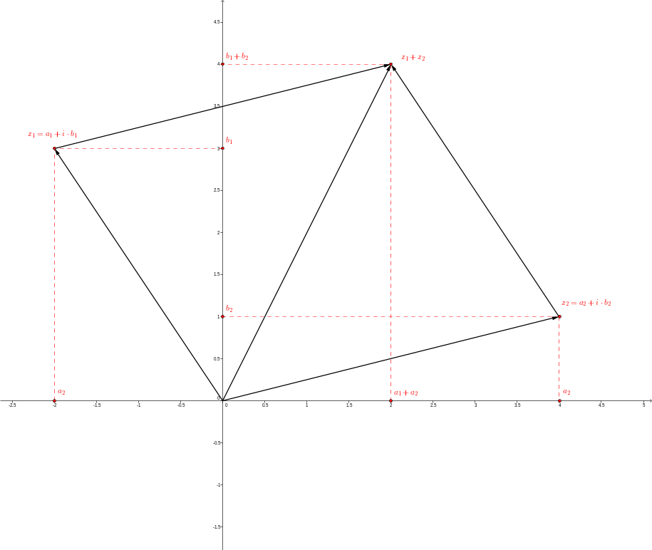


**Beispiel 7.** Gegeben sind die beiden Zahlen $$
  z_1=\frac{3}{2}\cdot\left(\cos{\left(\frac{\pi}{3}\right)}+i\cdot\sin{\left(\frac{\pi}{3}\right)}\right)\quad\text{und}\quad
  z_2=2\cdot\left(\cos{\left(\frac{\pi}{6}\right)}+i\cdot\sin{\left(\frac{\pi}{6}\right)}\right)
$$ Das Produkt der Beträge von $z_1$ und $z_2$ ergibt $|z_1|\cdot|z_2|=\frac{3}{2}\cdot 2=3$, die Argumente addieren sich zu $$
  \frac{\pi}{3}+\frac{\pi}{6}=\frac{\pi}{2}
$$ Hieraus ergibt sich das Produkt $$
  z_1\cdot z_2=2\cdot\left(\cos{\left(\frac{\pi}{2}\right)}+i\cdot\sin{\left(\frac{\pi}{2}\right)}\right)
$$

Mit Hilfe der Javascript-Bibliothek [Algebrite](http://algebrite.org/) lässt sich das Verfahren zur Bildung des Produktes zweier komplexer Zahlen interaktiv prüfen. Der Befehl `float(x)` gibt einen rationalen Näherungswert (Gleitkommazahl) einer reellen Zahl $x$ zurück.

```javascript
z=3/2*(cos(pi/3)+i*sin(pi/3))
w=2*(cos(pi/6)+i*sin(pi/6))
abs(z*w)
float(arg(z*w))
```
@Algebrite.eval

**Bemerkung 6.** Durch Bilden der Summe sind Argumente $\varphi=\varphi_1+\varphi_2$ mit $\varphi\in\mathbb{R}$ außerhalb des Grundintervalls möglich. Für das Hauptargument gilt $\varphi+2k\cdot\pi\in(-\pi,\pi]$ für ein $k\in\mathbb{Z}$.

Die geometrischen Interpretationen von Summe und Produkt lassen sich zur Beschreibung von Bewegungen der Ebene anwenden.

1. Ebene *Translationen* (Schiebungen) lassen sich durch Addition komplexer Zahlen beschreiben: Bezeichnet $P(a,b)\leftrightarrow z=a+i\cdot b$ einen Punkt der Ebene in allgemeiner Lage sowie $v=(x,y)\in\mathbb{R}^2\leftrightarrow z_v=x+i\cdot y$ eine beliebige, aber feste Richtung, so beschreibt $$
  z\mapsto z^\prime=z+z_v
$$ die Translation von $z$ (in Richtung $z_v$) nach $z^\prime$. Soll $z$ stetig in die feste Richtung $v$ verschoben werden, so kann beispielsweise $$
  t\in[0,1]\mapsto z_v(t)=t\cdot (x+i\cdot y)
$$ verwendet werden.
2. Ebene *Drehungen* um den Koordinatenursprung $O(0,0)$ mit Winkel $\varphi$ lassen sich durch Multiplikation mit einer komplexen Zahl darstellen. Bezeichnet $P(r,\alpha)\leftrightarrow z=r\cdot(\cos{\alpha}+i\cdot\sin{\alpha})$ wie zuvor einen Punkt der Ebene in allgemeiner Lage sowie $z_\varphi=\cos{\varphi}+i\cdot\sin{\varphi}$ eine zum Drehwinkel $\varphi$ gebildete komplexe Zahl, so beschreibt $$
  z\mapsto z^\prime=z\cdot z_\varphi=r\cdot 1\cdot(\cos{(\alpha+\varphi)}+i\cdot\sin{(\alpha+\varphi)})
$$ die Drehung von $z$ um $0$ nach $z^\prime$. Für ein kontinuierliches Drehen ist der Drehwinkel $$
  \phi\in[0,\varphi]\mapsto z_\phi=\cos{\phi}+i\cdot\sin{\phi}
$$ zu verwenden.

**Beispiel 8.** Ebene Rollkurven lassen sich als Ortskurven $c$ von Punkten $P$ erzeugen, die fest mit einer entlang einer Kurve $k_0$ abrollenden Kreisscheibe $k$ verbunden sind.

Ein interaktives Beispiel von Rollkurven, die durch Abrollen eines Kreises entlang einer Geraden entstehen, findet sich unter [Zykloiden](https://www.geogebra.org/m/Vjp9xEKc). Eine Parametrisierung dieser Ortkurven kann unter Benutzung komplexer Zahlen erfolgen. Im Beispiel gelten:

1. Der Punkt $P$ sei auf der Kreisscheibe fest vorgegeben. Liegt $k$ zu Beginn des Bewegungsvorgangs mit $M$ im Koordinatenursprung in der Gaußschen Ebene, so sind $$
  M=O\;\leftrightarrow\; z_M=0\quad \text{sowie}\quad z_P=\lambda\cdot i
$$ mit festem $\lambda<0$ und $|\lambda|=\overline{PM}$.
2. Das kontinuierliche Drehen von $k$ um den Mittelpunkt $M$ lässt sich durch Multiplikation von $z_P$ mit $$
  \varphi\in[0,\infty)\mapsto z_\varphi=\cos{(-\varphi)}+i\cdot\sin{(-\varphi)}
$$ modellieren. (Das Drehen erfolgt hier im Uhrzeigersinn.) Hieraus ergibt sich $$
  \varphi\mapsto z^\prime(\varphi)=z_P\cdot z_\varphi=\lambda\cdot i\cdot\left(\cos{(-\varphi)}+i\cdot\sin{(-\varphi)}\right)=
  \lambda\cdot\sin{\varphi}+i\cdot \lambda\cdot\cos{\varphi}
$$
3. Der Kreis $k$ soll kontinuierlich entlang einer Geraden $k_0$ rollen. Hierdurch bewegt sich $M$ im Abstand $r>0$ zu $k_0$. Seine Bewegung ist beschrieben durch $z_M=\varphi\cdot r$ und somit $$
  \varphi\in[0,\infty)\mapsto z^{\prime\prime}(\varphi)=z^\prime+z_M=
  (\lambda\cdot\sin{\varphi}+\varphi\cdot r)+i\cdot \lambda\cdot\cos{\varphi}
$$ Beide Teilbewegungen überlagern sich ungestört.[^3]

**Bemerkung 7.** In $\mathbb{Q}\subset\mathbb{R}\subset\mathbb{C}$ sind jeweils die Operationen der Addition und Multiplikation erklärt. Für beliebige Zahlen $x$ bzw. $x_j$ gelten die nachstehenden Rechengesetze:

1. $x_1+x_2=x_2+x_1$ (Kommutativität bezüglich $+$)
2. $x_1\cdot x_2=x_2\cdot x_1$ (Kommutativität bezüglich $\cdot$)
3. $x+0=0+x=x$ und $x\cdot 1=1\cdot x=x$ (neutrale Elemente bezüglich $+$ bzw. $\cdot$)
4. $\forall x\;\exists -x:\; x+(-x)=0$ (inverses Element bezüglich $+$)
5. $\forall x\not=0\;\exists x^{-1}:\; x\cdot(x^{-1})=1$  (inverses Element bezüglich $\cdot$)
6. $x_1+(x_2+x_3)=(x_1+x_2)+x_3$  (Assoziativität bezüglich $+$)
7. $x_1\cdot (x_2\cdot x_3)=(x_1\cdot x_2)\cdot x_3$ (Assoziativität bezüglich $\cdot$)
8. $x_1\cdot (x_2+x_3)= x_1\cdot x_2 +x_1\cdot x_3$ (Distributivität)
9. $0\not= 1$

Zahlenmengen mit diesen Eigenschaften werden [Körper](https://de.wikipedia.org/wiki/K%C3%B6rper_%28Algebra%29) genannt. Vergleiche auch den Abschnitt [Quaternionen](#Quaternionen).


Betrag einer komplexen Zahl
===


>**Proposition 2.** Für den Betrag beliebiger komplexer Zahlen $z$, beziehungsweise $z_1$ beziehungsweise $z_2$ gelten:
>
>1. $|z|\in\mathbb{R}$ mit $|z|\geq0$. Speziell ist $|z|=0\leftrightarrow z=0$
>2. $|z|^2=z\cdot\bar{z}$
>3. $|z_1\cdot z_2|=|z_1|\cdot|z_2|$
>4. Dreiecksungleichung $|z_1+z_2|\leq|z_1|+|z_2|$

**Beweis.** Für den Nachweis der Eigenschaften wird die komplexe Zahl $z=a+i\cdot b$ mit $a=\operatorname{Re}{z}$, $b=\operatorname{Im}{z}$ und $i^2=-1$ betrachtet. Entsprechende Bezeichnungen werden für $z_1$ und $z_2$ verwendet.

1. Die erste Eigenschaft folgt unmittelbar aus der Definition des Betrages $$
  |z|=\sqrt{a^2+b^2}\geq0\quad\text{und}\quad \sqrt{a^2+b^2}=0\;\leftrightarrow\; a=b=0
$$
2. Für das Produkt $z\cdot \bar{z}$ einer Zahl mit ihrer komplexkonjugierten Zahl ergibt sich $$
  z\cdot \bar{z}=(a+i\cdot b)\cdot (a-i\cdot b)=a^2+b^2+i\cdot(ab-ba)=a^2+b^2=|z|^2
$$
3. Mit der Eigenschaft 2 folgt für das Produkt schrittweise $$
  |z_1\cdot z_2|^2=(z_1\cdot z_2)\cdot\overline{(z_1\cdot z_2)}=
  (z_1\cdot z_2)\cdot(\bar{z}_1\cdot \bar{z}_2)=
  z_1\cdot \bar{z}_1\cdot z_2\cdot\bar{z}_2=
  |z_1|^2\cdot|z_2|^2
$$ Die hierin verwendete Eigenschaft $\overline{z_1\cdot z_2}=\bar{z}_1\cdot\bar{z}_2$ lässt sich direkt aus der Definition des Produktes komplexer Zahlen ableiten. Ihr Nachweis ist eine Übungsaufgabe. Unter Benutzung von Eigenschaft 1 lässt sich hieraus Eigenschaft 3 ableiten.
4. Mit der Eigenschaft 2 folgt ebenso für die Summe $$
  \begin{split}
    |z_1+z_2|^2 & = (z_1+z_2)\cdot\overline{(z_1+z_2)} = (z_1+z_2)\cdot{(\bar{z}_1+\bar{z}_2)} \\
    & = z_1\cdot\bar{z}_1+z_2\cdot\bar{z}_2+z_1\cdot\bar{z}_2+z_2\cdot\bar{z}_1=
    |z_1|^2+|z_2|^2+z_1\cdot\bar{z}_2+\overline{z_1\cdot\bar{z}_2}
  \end{split}
$$ Hierin ist die Teilsumme $z_1\cdot\bar{z}_2+\overline{z_1\cdot\bar{z}_2}$ reell und es gilt unter Verwendung von Eigenschaft 3 $$
  z_1\cdot\bar{z}_2+\overline{z_1\cdot\bar{z}_2}=2\cdot\operatorname{Re}{(z_1\cdot \bar{z}_2)}\leq 2\cdot|z_1\cdot \bar{z}_2|=2\cdot|z_1|\cdot|\bar{z}_2|=2\cdot|z_1|\cdot|z_2|
$$ Die hierin verwendete Eigenschaft $\overline{z_1+ z_2}=\bar{z}_1+\bar{z}_2$ lässt sich direkt aus der Definition der Summe komplexer Zahlen ableiten. Ihr Nachweis ist eine Übungsaufgabe. Damit folgt unter Benutzung von 1. und der strengen Monotonie der reellen Quadtratwurzelfunktion $$
  |z_1+z_2|^2\leq |z_1|^2+|z_2|^2+2\cdot|z_1|\cdot|z_2|=\left(|z_1|+|z_2|\right)^2\quad\leftrightarrow\quad
  |z_1+z_2|\leq |z_1|+|z_2|
$$

$\square$

Im nachstehenden Video wird die Eigenschaft 2 aus Proposition 2 erläutert.

!?[Betrag-komplex](https://www.youtube.com/watch?v=stftUv1NZp4&list=PLLTAHuUj-zHgrAfietLRb01pO1mtji8qn&index=11 "Daniel Jung, Quadrat des Betrages einer komplexen Zahl $z$ als Produkt von $z$ mit deren komplex konjugierter Zahl.")

**Beispiel 9.** Die Teilmenge komplexer Zahlen $$
  M=\left\{z\in\mathbb{C}\,||z-z_1|<\epsilon\,,\epsilon>0\,,z_1\in\mathbb{C}\right\}
$$ ist das Innere einer Kreisscheibe in der Gaußschen Zahlenebene um den Punkt $z_1$ mit Radius $\epsilon>0$, die $\epsilon$_Umgebung von $z_1$ genannt wird.


Potenzieren und Radizieren komplexer Zahlen
===


Das Potenzieren komplexer Zahlen mit natürlichen Exponenten lässt sich mithilfe der Multiplikation erklären. Seien $n\in\mathbb{N}^\times$ und $z=a+i\cdot b$ wie in Definition 3. Dann ist $$
  z^n:=z\cdot z\cdot z\cdot ...\cdot z
$$ wobei das Produkt auf der rechten Seite $n$-mal den Faktor $n$ enthält.

**Beispiel 10.** Für $z=i$ mit $i^2=-1$ gelten $i^3=-i$, $i^4=1$, $i^5=i$ usw.

Allgemein gilt: $$
  i^n=\left\{\begin{array}{rcl}
  1 & \text{für} & n=4\cdot k,\; k\in\mathbb{N}^\times \\
  i & \text{für} & n=4\cdot k+1,\; k\in\mathbb{N} \\
  -1 & \text{für} & n=4\cdot k+2,\; k\in\mathbb{N} \\
  -i & \text{für} & n=4\cdot k+3,\; k\in\mathbb{N}
  \end{array}\right.
$$ Die Allgemeingültigkeit der Aussage erfolgt in zwei Schritten:

1. Für den Fall $n=4\cdot k$ mit vollständiger Induktion.
* *Induktionsanfang.* Für $k=1$ ist $n=4\cdot 1=4$ und $i^4=1$ (wahr).
* *Induktionsschluss.* Für $k\in\mathbb{N}^\times$ gelte $i^{4\cdot k}=1$. Dann gilt für den Nachfolger $k+1$ $$
  i^{4\cdot (k+1)}=i^{4\cdot k+4}=i^{4\cdot k}\cdot i^4=i^{4\cdot k}=1
$$ (wahre Aussage) Damit ist $i^{4\cdot k}=1$ für alle $k\in\mathbb{N}^\times$.
2. Unter Verwendung der Nachfolgerfunktion $S:n\mapsto S(n)=n+1$ folgt außerdem $$
  i^{4\cdot k+1}=i^{4\cdot k}\cdot i^1=i\,,\quad
  i^{4\cdot k+2}=i^{4\cdot k}\cdot i^2=-1\quad\text{sowie}\quad
  i^{4\cdot k+3}=i^{4\cdot k}\cdot i^3=-i
$$ für alle $k\in\mathbb{N}^\times$.

$\square$

Die vorstehende Aussage zu Potenzen von $i$ mit natürlichem Exponenten ist im folgenden Video von erläutert. Hierbei wird Polardarstellung $$
  i=1\cdot(\cos{90^\circ}+i\cdot\sin{90^\circ})
$$ benutzt, wonach die (wiederholte) Multiplikation mit $i$ eine Drehung um den Ursprung des Koordinatensystems mit Drehwinkel $90^\circ$ bewirkt.

!?[Potenz-komplex](https://www.youtube.com/watch?v=UbhXdiUwaP8&list=PLLTAHuUj-zHgrAfietLRb01pO1mtji8qn&index=6 "Daniel Jung, Komplexe Zahlen, Potenzen von $i$ verdeutlicht am Einheitskreis")

>**Satz 3.** Es ist $z\in\mathbb{C}$ mit $z=r\cdot(\cos{\varphi}+i\cdot\sin{\varphi})$ beliebig gegeben. Für die $n$-te Potenz gilt $$
  z^n=r^n\cdot(\cos{(n\cdot\varphi)}+i\cdot\sin{(n\cdot\varphi)})
$$ mit $n\in\mathbb{N}^\times$.

**Beweis.** Der Nachweis lässt sich unmittelbar unter Nutzung der Rechenregeln für die Multiplikation komplexer Zahlen sowie der Potenzgesetze führen und wird als Übungsaufgabe gegeben.

**Beispiel 11.** Gegeben ist die komplexe Zahl $z=-\frac{3}{2}+\frac{1}{2}\cdot\sqrt{3}\cdot i$, worin $i^2=-1$. Gesucht ist die Potenz $z^6$.

1. Zunächst wird $z$ in Polarform dargestellt. Für den Betrag von $z$ ergibt sich $$
  r=|z|=\sqrt{\left(-\frac{3}{2}\right)^2+\left(\frac{1}{2}\cdot\sqrt{3}\right)^2}=\sqrt{3}
$$ woraus sich das Argument von $z$ unter Beachtung $\operatorname{Im}{z}>0$ berechnet $$
  \varphi=\arccos{\left(\frac{-\frac{3}{2}}{\sqrt{3}}\right)}=\arccos{\left(-\frac{\sqrt{3}}{2}\right)}=\frac{5}{6}\cdot\pi
$$  $z$ besitzt damit die Polarform $$
  z=\sqrt{3}\cdot\left(\cos{\left(\frac{5}{6}\cdot\pi\right)}+i\cdot\sin{\left(\frac{5}{6}\cdot\pi\right)}\right)
$$
2. Nach dem vorstehenden Satz folgt für die zu berechnende Potenz $$
  z^6=\left(\sqrt{3}\cdot\left(\cos{\left(\frac{5}{6}\cdot\pi\right)}+i\cdot\sin{\left(\frac{5}{6}\cdot\pi\right)}\right)\right)^6=
  \sqrt{3}^6\cdot\left(\cos{\left(6\cdot\frac{5}{6}\cdot\pi\right)}+i\cdot\sin{\left(6\cdot\frac{5}{6}\cdot\pi\right)}\right)=
  27\cdot\left(\cos{\pi}+i\cdot\sin{\pi}\right)=-27
$$ Beim vorletzten Schritt wurde die Periodizität von Sinus und Kosinus genutzt, um in das Hauptargument $\phi\in(-\pi,\pi]$ umzurechnen. Vergleiche Bemerkung 6.

Aus dem vorstehenden Satz ergibt sich durch Spezifikation von $r=|z|=1$ die nachstehende Formel.

>**Satz 4.** Für $\varphi\in\mathbb{R}$ und $n\in\mathbb{N}^\times$ gilt $$
  \left(\cos{\varphi}+i\cdot\sin{\varphi}\right)^n=\cos{(n\cdot\varphi)}+i\cdot\sin{(n\cdot\varphi)}
$$ (*Moivre*sche Formel)

Eine Umkehrung des Potenzierens ist das Radizieren: In einer Gleichung $w^n=z$ ist dabei bei gegebenem Exponenten $n$ und gegebenem Potenzwert $z$ die Basis $w$ der Potenz gesucht.

>**Definition 8.** Es seien $z\in\mathbb{C}$ und $n\in\mathbb{N}$ mit $n\geq 2$ beliebig gegeben. Jede komplexe Zahl $w$ mit $w^n=z$ heißt eine [komplexe n-te Wurzel](https://de.wikipedia.org/wiki/Wurzel_%28Mathematik%29#Wurzeln_aus_komplexen_Zahlen) der Zahl $z$.[^4]

>**Satz 5.** Es seien $z\in\mathbb{C}$ mit der Polardarstellung $$
  z=r\cdot(\cos{\varphi}+i\cdot\sin{\varphi})\,,\quad r\in(0,\infty),\;\varphi\in(-\pi,\pi]
$$ und $n\in\mathbb{N}$ mit $n\geq 2$ beliebig gegeben. Die komplexe Zahl $$
  w_k=\sqrt[n]{r}\cdot\left(\cos{\left(\frac{\varphi+2\cdot k\cdot\pi}{n}\right)}+i\cdot\sin{\left(\frac{\varphi+2\cdot k\cdot\pi}{n}\right)}\right)
$$ ist für jeden Indexwert $k\in\{0,1,...,n-1\}$ eine komplexe $n$-te Wurzel von $z$. Der Ausdruck $\sqrt[n]{r}$ in der vorstehenden Formel bezeichnet die eindeutig bestimmte reelle $n$-te Wurzel von $r$.

**Beweis.** Für jedes $k$ gilt nach dem Gesetz zum Potenzieren eines Produktes sowie Satz 3 $$
  \begin{split}
  (w_k)^n & =\left[\sqrt[n]{r}\cdot\left(\cos{\left(\frac{\varphi+2\cdot k\cdot\pi}{n}\right)}+i\cdot\sin{\left(\frac{\varphi+2\cdot k\cdot\pi}{n}\right)}\right)\right]^n = \left(\sqrt[n]{r}\right)^n\cdot\left(\cos{\left(\frac{\varphi+2\cdot k\cdot\pi}{n}\right)}+i\cdot\sin{\left(\frac{\varphi+2\cdot k\cdot\pi}{n}\right)}\right)^n \\
  & = r\cdot \left(\cos{\left(n\cdot\frac{\varphi+2\cdot k\cdot\pi}{n}\right)}+i\cdot\sin{\left(n\cdot\frac{\varphi+2\cdot k\cdot\pi}{n}\right)}\right) \\
  & = r\cdot \left(\cos{\left(\varphi+2\cdot k\cdot\pi\right)}+i\cdot\sin{\left(\varphi+2\cdot k\cdot\pi\right)}\right)
  \end{split}
$$ Unter Benutzung der Periodizität von Sinus und Kosinus $$
  \cos{\left(\varphi+2\cdot k\cdot\pi\right)}=\cos{\varphi}\quad\text{und}\quad \sin{\left(\varphi+2\cdot k\cdot\pi\right)}=\sin{\varphi}
$$ folgt $(w_k)^n=z$ für jede Wahl $k$.

$\square$

**Beispiel 12.** Zu berechnen sind

1. die $4$-ten komplexen Wurzeln der Zahl $z=1$, d. h. alle Lösungen der Gleichung $w^4=1$. Die rechte Seite lässt sich in Polarform darstellen $$
  z=1=\cos{0}+i\sin{0}\quad\leftrightarrow\quad (r,\varphi)=(1,0)
$$ Nach Einsetzen in die Formel für $w_k$ in Satz 5 ergeben sich unmittelbar $$
  \begin{split}
    w_0 & =\sqrt[4]{1}\cdot\left(\cos{\left(\frac{0}{4}\right)}+i\cdot\sin{\left(\frac{0}{4}\right)}\right)=1 \\
    w_1 & =\sqrt[4]{1}\cdot\left(\cos{\left(\frac{0+2\cdot\pi}{4}\right)}+i\cdot\sin{\left(\frac{0+2\cdot\pi}{4}\right)}\right)=i \\
    w_2 & =\sqrt[4]{1}\cdot\left(\cos{\left(\frac{0+2\cdot 2\cdot\pi}{4}\right)}+i\cdot\sin{\left(\frac{0+2\cdot 2\cdot\pi}{4}\right)}\right)=-1 \\
    w_3 & =\sqrt[4]{1}\cdot\left(\cos{\left(\frac{0+2\cdot 3\cdot\pi}{4}\right)}+i\cdot\sin{\left(\frac{0+2\cdot 3\cdot\pi}{4}\right)}\right)=-i
  \end{split}
$$ Offensichtlich gelten $1^4=1$, $i^4=1$, $(-1)^4=1$ und $(-i)^4=(-1)^4\cdot i^4=1$.
2. die $2$-ten komplexen Wurzeln der Zahl $z=-1$, d. h. alle Lösungen der Gleichung $w^2=-1$. Die rechte Seite lässt sich in Polarform darstellen $$
  z=1=\cos{\pi}+i\sin{\pi}\quad\leftrightarrow\quad (r,\varphi)=(1,\pi)
$$ Nach Einsetzen in die Formel für $w_k$ in Satz 5 ergeben sich unmittelbar $$
  \begin{split}
    w_0 & =\sqrt{1}\cdot\left(\cos{\left(\frac{\pi}{2}\right)}+i\cdot\sin{\left(\frac{\pi}{2}\right)}\right)=i \\
    w_1 & =\sqrt{1}\cdot\left(\cos{\left(\frac{\pi+2\cdot\pi}{2}\right)}+i\cdot\sin{\left(\frac{\pi+2\cdot\pi}{2}\right)}\right)=-i
  \end{split}
$$ $z=-1$ besitzt demnach zwar keine reelle Quadratwurzel, jedoch die beiden komplexen Wurzeln $\pm i$. Vergleiche Definition 1.
3. die $3$-ten komplexen Wurzeln der Zahl $z=1+i$, d. h. alle Lösungen der Gleichung $w^3=1+i$. Die rechte Seite lässt sich in Polarform darstellen $$
  z=\sqrt{5}\cdot\left(\cos{\left(\frac{\pi}{4}\right)}+i\sin{\left(\frac{\pi}{4}\right)}\right)\quad\leftrightarrow\quad (r,\varphi)=\left(\sqrt{5},\frac{\pi}{4}\right)
$$ Nach Einsetzen in die Formel für $w_k$ in Satz 5 ergeben sich unmittelbar $$
  \begin{split}
    w_0 & =\sqrt[3]{\sqrt{5}}\cdot\left(\cos{\left(\frac{\frac{\pi}{4}}{3}\right)}+i\cdot\sin{\left(\frac{\frac{\pi}{4}}{3}\right)}\right)=\sqrt[6]{5}\cdot\left(\cos{\left(\frac{\pi}{12}\right)}+i\cdot\sin{\left(\frac{\pi}{12}\right)}\right) \\
    w_1 & =\sqrt[3]{\sqrt{5}}\cdot\left(\cos{\left(\frac{\frac{\pi}{4}+2\cdot\pi}{3}\right)}+i\cdot\sin{\left(\frac{\frac{\pi}{4}+2\cdot\pi}{3}\right)}\right)=\sqrt[6]{5}\cdot\left(\cos{\left(\frac{3}{4}\cdot\pi\right)}+i\cdot\sin{\left(\frac{3}{4}\cdot\pi\right)}\right) \\
    w_2 & =\sqrt[3]{\sqrt{5}}\cdot\left(\cos{\left(\frac{\frac{\pi}{4}+2\cdot 2\cdot\pi}{3}\right)}+i\cdot\sin{\left(\frac{\frac{\pi}{4}+2\cdot 2\cdot\pi}{3}\right)}\right)=\sqrt[6]{5}\cdot\left(\cos{\left(\frac{17}{12}\cdot\pi\right)}+i\cdot\sin{\left(\frac{17}{12}\cdot\pi\right)}\right)=\sqrt[6]{5}\cdot\left(\cos{\left(-\frac{7}{12}\cdot\pi\right)}+i\cdot\sin{\left(-\frac{7}{12}\cdot\pi\right)}\right)
  \end{split}
$$ Bei der Wurzel $w_2$ wurde der Hauptwert des Arguments $$
  \frac{17}{12}\cdot\pi-2\pi=-\frac{7}{12}\cdot\pi\in(-\pi,\pi]
$$ angegeben, vergleiche Bemerkung 4.

Mit Hilfe der Javascript-Bibliothek [Algebrite](http://algebrite.org/) lassen sich die komplexen $n$-ten Wurzeln einer komplexen Zahl als Lösungen einer Polynomgleichung $$
  w^n=z\quad\leftrightarrow\quad p(w):=w^n-z=0
$$ mit Hilfe des Befehls `roots(p(w),w)` beziehungsweise `nroots(p(w),w)` (numerisch) interaktiv berechnen. Das erste Argument zwischen den Klammern der Befehle gibt den Term $p(w)$ der impliziten Gleichungsdarstellung an, das zweite Argument die Variable, nach der die Gleichung gelöst werden soll.

```javascript
z=-1
n=2
roots(w^n-z,w)
nroots(w^n-z,w)
```
@Algebrite.eval

Im nachstehenden Video wird das Radizieren unter Verwendung der Exponentialdarstellung erläutert und an einem Beispiel erklärt. Den Zusammenhang zwischen der Exponentialdarstelung zur oben benutzten Polardarstellung erhält man durch den Übergang $$
  z=\textcolor{purple}{r}\cdot\exp{(\textcolor{blue}{\varphi}\cdot i)}=\textcolor{purple}{r}\cdot{(\cos{\textcolor{blue}{\varphi}}+i\cdot\sin{\textcolor{blue}{\varphi}})}
$$ mit Argument $\textcolor{blue}{\varphi}$ und Betrag $\textcolor{purple}{r}$.

!?[Wurzel-komplex](https://www.youtube.com/watch?v=BKdqTn2iO4s "MathePeter, komplexe Zahlen radizieren.")

**Bemerkung 8.** Im Gegensatz zur reellen $n$-ten Wurzel ist die komplexe $n$-te Wurzel nicht eindeutig bestimmt. Im Beispiel 12 wurden jeweils $n$ Wurzeln zum Wurzelexponenten $n$ berechnet. Wird $z$ in $(w_k)^n=z$ unter Verwendung des Hauptwertes des Argumentes $\varphi\in(-\pi,\pi]$ dargestellt, so heißt $w_0$ jeweils *Hauptwurzel* von $z$. Die Wurzelwerte $w_k$ mit $k\in\{1,2,...,n-1\}$ werden $k$-te *Nebenwurzel* von $z$ genannt.

**Satz 6.** Alle komplexen $n$-ten Wurzeln einer Zahl $z\in\mathbb{C}$ liegen in der Gaußschen Zahlenebene auf einem Kreis um den Ursprung des Koordinatensystems und bilden die Eckpunkte eines regelmäßigen $n$-Ecks.

**Beweis.** Die beiden Eigenschaften lassen sich direkt aus den Argumenten und Beträgen der Zahlen $w_k$ schließen. Nach Satz 5 und Beispiel 12 sind diese in Polarform gegeben.

1. Nach Satz des Pythagoras gilt für jede Wahl $\varphi$: $$
  |\cos{\varphi}+i\cdot\sin{\varphi}|=\sqrt{(\cos{\varphi})^2+(\sin{\varphi})^2}=1
$$ Damit folgt für den Abstand von $w_k$ zum Koordinatenursprung des Koordinatensystems $$
  |w_k|=\left|\sqrt[n]{r}\cdot\left(\cos{\left(\frac{\varphi+2\cdot k\cdot\pi}{n}\right)}+i\cdot\sin{\left(\frac{\varphi+2\cdot k\cdot\pi}{n}\right)}\right)\right|=\left|\sqrt[n]{r}\right|\cdot\left|\cos{\left(\frac{\varphi+2\cdot k\cdot\pi}{n}\right)}+i\cdot\sin{\left(\frac{\varphi+2\cdot k\cdot\pi}{n}\right)}\right|=\left|\sqrt[n]{r}\right|
$$ d. h. unabhängig von der Wahl $k\in\{0,1,...,n-1\}$.
2. Für die Argumente zweier Wurzelwerte $w_j$ und $w_{j+1}$ mit $j\in\{0,1,...,n-1\}$ und $j+1\in\{0,1,...,n-1\}$[^5] gilt: $$
  \left(\frac{\varphi+2\cdot (j+1)\cdot\pi}{n}\right)-\left(\frac{\varphi+2\cdot j\cdot\pi}{n}\right)=\frac{2\cdot\pi}{n}
$$ d. h. die Differenz der Argumente zweier 'benachbarter' Wurzeln ist unabhängig von der Wahl $k\in\{0,1,...,n-1\}$. Der Vollwinkel wird in $n$ gleichgroße Winkel geteilt.

$\square$

**Bemerkung 9.** Vergleiche Beispiel 5: Die komplexen Zahlen $z_1$ bis $z_6$ erfüllen die Gleichung $z^6=2^{12}=4^6$, sind also als komplexe $6$-te Wurzeln von $4096$ auffassbar. Sie bilden ein regelmäßiges Sechseck, dessen Umkreis den Koordinatenursprung als Mittelpunkt besitzt und den Radius $4$.


Sicher gewusst
===


Testen Sie Ihr Wissen in diesem Abschnitt und Beantworten Sie die folgenden Fragen.

**Frage 1.** Stellen Sie die folgenden komplexen Zahlen durch Punkte in der Gaußschen Zahlenebene dar.

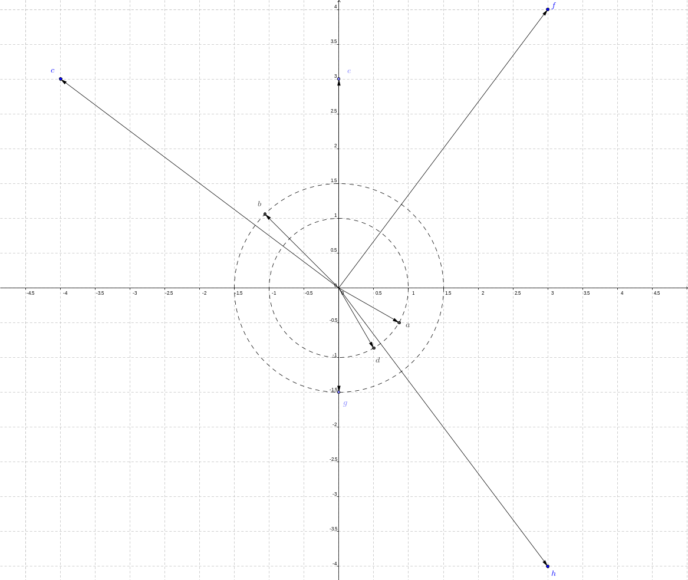<!-- style="display: block; margin-left: auto; margin-right: auto; max-width: 900px;" -->

[[$a$] [$b$] [$c$] [$d$] [$e$] [$f$] [$g$] [$h$]]
[( ) ( ) ( ) ( ) ( ) ( ) ( ) (X)] $3-4\cdot i$
[( ) ( ) (X) ( ) ( ) ( ) ( ) ( )] $-4+3\cdot i$
[( ) ( ) ( ) ( ) (X) ( ) ( ) ( )] $3\cdot i$
[( ) ( ) ( ) ( ) ( ) (X) ( ) ( )] $3+4\cdot i$
[( ) ( ) ( ) ( ) ( ) ( ) (X) ( )] $-\frac{3}{2}\cdot i$
[( ) (X) ( ) ( ) ( ) ( ) ( ) ( )] $\frac{3}{2}\left(\cos{\left(\frac{3}{4}\pi\right)}+\sin{\left(\frac{3}{4}\pi\right)}\cdot i\right)$
[( ) ( ) ( ) (X) ( ) ( ) ( ) ( )] $\cos{\left(\frac{1}{3}\pi\right)}-\sin{\left(\frac{1}{3}\pi\right)}\cdot i$
[(X) ( ) ( ) ( ) ( ) ( ) ( ) ( )] $\sin{\left(\frac{2}{3}\pi\right)}+\cos{\left(\frac{2}{3}\pi\right)}\cdot i$
[[?]] Bestimmen Sie Real- und Imaginärteil der komplexen Zahlen und interpretieren Sie diese als kartesische Koordinaten dieser Zahl in der Gaußschen Zahlenebene. Vergleichen Sie ggf. mit der Polardarstellung (trigonometrischen -) der komplexen Zahl.
****************************************

Die komplexen Zahlen sind in der vorstehenden Abbildung dargestellt.

1. Die ersten fünf komplexen Zahlen liegen in kartesischer Form vor. Es ergeben sich die nachstehenden Koordinatenpaare $$
  3-4\cdot i\;\leftrightarrow\; (3,-4)\,,\quad
  -4+3\cdot i\;\leftrightarrow\; (-4,3)\,,\quad
  3\cdot i\;\leftrightarrow\; (0,3)\,,\quad
  3+4\cdot i\;\leftrightarrow\; (3,4)\quad\text{und}\quad
  -\frac{3}{2}\cdot i\;\leftrightarrow\; \left(0,-\frac{3}{2}\right)
$$
2. Die sechste Zahl ist in Polardarstellung gegeben $$ \frac{3}{2}\left(\cos{\left(\frac{3}{4}\pi\right)}+\sin{\left(\frac{3}{4}\pi\right)}\cdot i\right) $$ Der zur komplexen Zahl gehörende Zeiger schließt mit der reellen Achse einen Winkel $3/4\cdot\pi=135^\circ$ ein und besitzt die Länge $\frac{3}{2}$.
3. Beachten Sie, dass die komplexe Zahl unter Benutzung der Symmetrie für Sinus bzw. Kosinus $$
  \cos{\left(\frac{1}{3}\pi\right)}-\sin{\left(\frac{1}{3}\pi\right)}\cdot i=\cos{\left(-\frac{1}{3}\pi\right)}+\sin{\left(-\frac{1}{3}\pi\right)}\cdot i
$$ in der Polarform angegeben werden kann: Argument und Betrag lassen sich hieraus direkt ablesen $$
  \varphi=-\frac{1}{3}\cdot \pi\,,\quad r=|z|=1
$$
4. Analog lässt sich unter Beachtung der Quadrantenbeziehungen für Sinus und Kosinus $$
  \begin{split}
  \sin{\left(\frac{2}{3}\pi\right)}+\cos{\left(\frac{2}{3}\pi\right)}\cdot i  \\
  & =\cos{\left(\frac{2}{3}\pi-\frac{1}{2}\pi\right)}-\sin{\left(\frac{2}{3}\pi-\frac{1}{2}\pi\right)}\cdot i  \\
  & =\cos{\left(\frac{1}{6}\pi\right)}-\sin{\left(\frac{1}{6}\pi\right)}\cdot i  \\
  & =\cos{\left(-\frac{1}{6}\pi\right)}+\sin{\left(-\frac{1}{6}\pi\right)}\cdot i
  \end{split}
$$ in Polardarstellung überführen. Alternativ lässt sich die letzte Zahl mit $-i$ multiplizieren, was einer Drehung dieser Zahl um den Koordinatenursprung mit Drehwinkel $-\frac{\pi}{2}$ entspricht.

****************************************

**Frage 2.** Zu berechnen sind die zu Zahlen $z\in\mathbb{C}$ bezüglich der Multiplikation inversen Zahlen $z^{-1}$. Diese sind in kartesischer Form anzugeben.

[[$1+2\cdot i$] [$2+i$] [$1-2\cdot i$]]
[( ) (X) ( )]  $\frac{2}{5}-\frac{1}{5}\cdot i$
[(X) ( ) ( )]  $\frac{1}{5}-\frac{2}{5}\cdot i$
[( ) ( ) (X)]  $\frac{1}{5}+\frac{2}{5}\cdot i$
[[?]] Berechnen Sie die multiplikativ inverse Zahl mittels der in Proposition 1 nachgewiesenen Formel.
****************************************

1. $$(1+2\cdot i)^{-1}=\frac{1}{5}-i\cdot\frac{2}{5}$$
2. $$(2+i)^{-1}=\frac{2}{5}-i\cdot\frac{1}{5}$$
3. $$(1-2\cdot i)^{-1}=\frac{1}{5}+i\cdot\frac{2}{5}$$

****************************************

[^1]: Achtung: In der Wechselstromtechnik wird der Bezeichner $i$ als Formelzeichen für die Wechselstromstärke verwendet.

[^2]: Der Ausdruck $D:=\frac{p^2}-4\cdot q$ wird [Diskriminante](https://de.wikipedia.org/wiki/Diskriminante) der quadratischen Gleichung genannt.

[^3]: Die Lage von $P$ bezüglich $k$ kann beschrieben werden mithilfe des Parameters $\mu=\overline{PM}/r$, worin $M$ den Mittelpunkt und $r$ den Radius von $k$ bezeichnen. Es werden unterschieden: Für eine Lage $P$ mit $\mu=0\;\leftrightarrow\;\overline{PM}=0$ fällt die Kurve $c$ mit der Ortskurve von $M$ zusammen, die den festen Abstand $r$ von $k_0$ besitzt. Für eine Lage $P$ mit $ \mu\in(0,1)\;\leftrightarrow\;\overline{PM}\in(0,r)$ befindet sich der Punkt $P$ im Kreisinneren von $k$ und erzeugt eine sogenannte *verkürzte* Rollkurve $c$. Für eine Lage $P$ mit $\mu=1\;\leftrightarrow\;\overline{PM}=r$ erzeugt der Punkt $P\in k$ eine sogenannte *gewöhnliche* Rollkurve $c$. Für eine Lage $P$ mit $\mu>1\;\leftrightarrow\;\overline{PM}>r$ befindet sich der Punkt $P$ außerhalb von $k$ und erzeugt eine sogenannte *verlängerte* Rollkurve $c$.

[^4]: Im Unterschied zu komplexen $n$-ten Wurzeln sind reelle $n$-ten Wurzeln nur für nichtnegative Radikanten erklärt. Die reelle $n$-te Wurzel einer Zahl ist per Definition nichtnegativ, woraus deren Eindeutigkeit folgt.

[^5]: Hier wird [modulo](https://de.wikipedia.org/wiki/Division_mit_Rest) gerechnet: Für $j=n-1\operatorname{mod} n$ ist $j+1=n\operatorname{mod}n=0$.


### Algebraische Gleichungen


In Verallgemeinerung der aus der Schulmathematik bekannten linearen und quadratischen Gleichungen werden in diesem Abschnitt algebraische Gleichungen untersucht.

>**Definition 1.** Eine Gleichung $p(x)=0$ in der Unbekannten $x$ der Form $$
  p(x)=a_0+a_1\cdot x+a_2\cdot x^2+...+a_{n-1}\cdot x^{n-1}+a_n\cdot x^n=\sum_{k=0}^n{a_k}\cdot x^k
$$ mit Koeffizienten $a_k\in\mathbb{R}$ für $k\in\{0,1,2,...,n\}$ und $a_n\not=0$ heißt **algebraische Gleichung** vom Grad $n$.

Für bestimmte Grade sind auch andere Bezeichnungen gebräuchlich.

| $n$ | Bezeichnung |
| :--- | :--- |
| 1 | linear |
| 2 | quadratisch |
| 3 | kubisch |
| 4 | quartisch |

**Beispiel 1.** Es bezeichnen $a$, $b$ reelle Koeffizienten sowie $x$ die reelle Variable. Die *lineare Gleichung* in der Variablen $x$ besitzt die Form $$
  a\cdot x+b=0\;\; \left(a\neq0\right)\quad\longleftrightarrow\quad x=-\frac{b}{a}\;\; (x\in\mathbb{R})
$$ Die Variable $x$ tritt in einer linearen Gleichung nur zur Potenz $1$ auf.

Die Lösung einer linearen Gleichung stellt genau einen Punkt auf der reeller Zahlengeraden $\mathbb{R}$ dar.

Unter Benutzung der Javascript-Bibliothek [Algebrite](http://algebrite.org/) können lineare Gleichungen interaktiv dargestellt und berechnet werden. Probieren Sie es aus und wählen die Koeffizienten $a$ und $b$ speziell.

```javascript
p=a*x+b
coeff(p,x,1)
coeff(p,x,0)
roots(p,x)
```
@Algebrite.eval

**Bemerkung 1.** Lineare Gleichungen sind auch in zwei und mehr reellen Variablen angebbar; zum Beispiel in zwei Variablen $x$ und $y$: $$
  a\cdot x+b\cdot y+c=0\;\; \left(a^2+b^2\neq 0\right)\quad\longleftrightarrow\quad y=-\frac{a}{b}x-\frac{c}{b}\;\text{ (falls } b\neq0)
$$ Die Lösungsmenge lässt sich als Gerade in der reellen Zahlenebene $\mathbb{R}^2$ darstellen. Analog beschreiben lineare Gleichungen in den Variablen $x\in\mathbb{R}$, $y\in\mathbb{R}$ und $z\in\mathbb{R}$ mit $$
  a\cdot x+b\cdot y+c\cdot z + d=0\quad
  a\in\mathbb{R},\;
  b\in\mathbb{R},\;
  c\in\mathbb{R},\;
  d\in\mathbb{R},\; a^2+b^2+c^2\neq0
$$ - genauer deren Lösungen - als Punktmengen Ebenen im dreidimensionalen Raum dar.

**Beispiel 2.** Es bezeichnen $a$, $b$ und $c$ reelle Koeffizienten sowie $x$ die reelle Variable. Die [quadratische Gleichung](https://de.wikipedia.org/wiki/Quadratische_Gleichung) in der Variablen $x$ besitzt die Form $$
   a\cdot x^2+b\cdot x+c =0\quad \left(a\neq0\right)\quad\longleftrightarrow\quad
   x^2+p\cdot x+q=0 \quad \text{mit} \quad p=\frac{b}{a},\; q=\frac{c}{a}
$$ Die rechte Seite der Äquivalenz heißt **Normalform** der quadratischen Gleichung.

Zur Lösung der Normalform einer quadratischen Gleichung kann die quadratische Ergänzung genutzt werden. $$
  x^2+p\cdot x+q=0 \quad\longleftrightarrow\quad
  x^2+2\cdot x\cdot \frac{p}{2}+\left(\frac{p}{2}\right)^2-\left(\frac{p}{2}\right)^2+q=0 \quad\longleftrightarrow\quad
  \left(x+\frac{p}{2}\right)^2=\left(\frac{p}{2}\right)^2-q
$$ Hieraus ergeben sich drei Fälle:

1. Unter der Voraussetzung, dass gilt $$
  \left(\frac{p}{2}\right)^2-q>0\quad\longleftrightarrow\quad p^2-4\cdot q=:D>0
$$ ergeben sich zwei reelle Lösungen $$
  x_{1,2}=-\frac{p}{2}\pm\sqrt{\frac{p^2}{4}-q}
$$ Die vorstehende Formel berechnet die Lösungen der quadratischen Gleichung direkt aus den auftretenden Koeffizienten $p$ und $q$ und wird **Lösungsformel** für quadratische Gleichungen in Normalform genannt. Der Ausdruck $D$ heißt [Diskriminante](https://de.wikipedia.org/wiki/Diskriminante) der normierten quadratischen Gleichung.
2. Aus dem Fall 1 ergibt sich für $$
  \left(\frac{p}{2}\right)^2-q=0\quad\longleftrightarrow\quad p^2-4\cdot q=:D=0
$$ ergibt sich eine doppelt zu zählende reelle Lösung $$
  x_{1,2}=-\frac{p}{2}
$$
3. Unter der Voraussetzung, dass gilt $$
  \left(\frac{p}{2}\right)^2-q<0\quad\longleftrightarrow\quad p^2-4\cdot q=:D<0
$$ ergeben sich zwei komplexe, nichtreelle Lösungen $$
  x_{1,2}=-\frac{p}{2}\pm i\cdot\sqrt{q-\frac{p^2}{4}}
$$ worin $i$ mit $i^2=-1$ die imaginäre Einheit bezeichnet.

Unter Benutzung der Javascript-Bibliothek [Algebrite](http://algebrite.org/) können lineare Gleichungen interaktiv dargestellt und berechnet werden. Probieren Sie es aus und ersetzen Sie die Koeffizienten $a$, $b$ und $c$ durch reelle Zahlen, dass die quadratische Gleichung zwei verschiedene reelle / eine reelle beziehungsweise zwei nichtreelle Lösungen besitzt.

```javascript
p=a*x^2+b*x+c
coeff(p,x,2)
coeff(p,x,1)
coeff(p,x,0)
roots(p,x)
```
@Algebrite.eval

>**Satz 1.** ([Fundamentalsatz der Algebra](https://de.wikipedia.org/wiki/Fundamentalsatz_der_Algebra)) Eine algebraische Gleichung in der Variablen $x$ vom Grad $n\in\mathbb{N}$, $n\geq1$, besitzt genau $n$ Lösungen $x_j\in\mathbb{C}$, $j\in\{1,2,...,n\}$ und lässt sich als Produkt $$
  p(x)=a_n\cdot(x-x_1)\cdot(x-x_2)\cdot...\cdot(x-x_n)=a_n\cdot\prod_{j=1}^n{(x-x_j)}=0
$$ in Linearfaktoren $(x-x_j)$ darstellen.

Im nachstehenden Video ist der Fundamentalsatz der Algebra erläutert.

!?[Fundamentalsatz](https://www.youtube.com/watch?v=QxdBXOspKXY)

**Beispiel 3.**

1. Die quadratische Gleichung $p(x)=x^2-4\cdot x-12=0$ besitzt die Koeffizienten $p=-4$ und $q=-12$. Die Diskriminante berechnet sich zu $$
  D=(-4)^2-4\cdot(-12)=64>0
$$ besitzt also zwei reelle Lösungen. Diese berechnen sich unter Benutzung der Lösungsformel zu $$
  x_{1,2}=2\pm\sqrt{4-(-12)}=2\pm 4
$$ also $x_1=6$ und $x_2=-2$. Die Produktdarstellung in Linearfaktoren ergibt sich hieraus zu $$
  p(x)=1\cdot(x-6)\cdot(x+2)
$$
2. Die quadratische Gleichung $p(x)=x^2-4\cdot x+13=0$ besitzt die Koeffizienten $p=-4$ und $q=13$. Die Diskriminante berechnet sich zu $$
  D=(-4)^2-4\cdot13=-36<0
$$ besitzt also zwei nichtreelle Lösungen. Diese berechnen sich unter Benutzung der Formel im Fall 3 (Beispiel 2) zu $$
  x_{1,2}=2\pm i\cdot\sqrt{13-4}=2\pm i\cdot 3
$$ also $x_1=2+3\cdot i$ und $x_2=2-3\cdot i=\bar{x}_1$. Die Produktdarstellung in Linearfaktoren ergibt sich hieraus $$
  p(x)=1\cdot(x-x_1)\cdot(x-\bar{x}_1)=(x-2-3\cdot i)\cdot(x-2+3\cdot i)
$$ beziehungsweise umgekehrt nach Ausmultiplizieren $$
  p(x)=x^2-(x_1+\bar{x}_1)\cdot x+x_1\cdot\bar{x}_1=x^2-2\cdot\mathrm{Re}{\,x_1}\cdot x+|x_1|^2=x^2-4\cdot x+13
$$

Im nachstehenden Video wird die Berechnung der Zerlegung eines Polynoms in Linearfaktoren im Zusammenhang der Nullstellenberechnung ganzrationaler Funktionen erläutert. Im darauf folgenden Video wird unter Voraussetzung nur reeller Nullstellen die Produktdarstellung in Linearfaktoren abgeleitet.

!?[Linearfaktoren-1](https://www.youtube.com/watch?v=wRc6AtV7HmY)

!?[Linearfaktoren-2](https://www.youtube.com/watch?v=rXMLZmKoNck)

>**Folgerung 2.** ([Satz von Vieta](https://de.wikipedia.org/wiki/Satz_von_Vieta)) Für eine beliebige algebraische Gleichung $p(x)=0$ vom Grad $n$ mit $$
  p(x)=\sum_{i=0}^n{\left(a_i\cdot x^i\right)}
$$ den Koeffizienten $a_i\in\mathbb{R}$ für $i\in\{0,1,2,\ldots,n-1\}$, $a_n=1$ sowie den Lösungen $$
  x_1\in\mathbb{C},\quad x_2\in\mathbb{C},\quad ...\quad x_n\in\mathbb{C}
$$ berechnen sich die Koeffizienten der Gleichung mittels $$
  \sum_{j=1}^n{x_j} = -a_{n-1}\,,\quad
  \sum_{j_1< j_2}{\left(x_{j_1}\cdot x_{j_2}\right)} = a_{n-2}\,,\quad
  \sum_{j_1< j_2<j_3}{\left(x_{j_1}\cdot x_{j_2}\cdot x_{j_3}\right)} = -a_{n-3}\,,\quad\ldots\,,\quad
  x_{1}\cdot x_{2}\cdot...\cdot x_n = (-1)^n\cdot a_{0}
$$ wobei über $j_1\in\{1,2,...,n\}$, $j_2\in\{1,2,...,n\}$, $j_3\in\{1,2,...,n\}$ usw. summiert wird.

**Beweis.** Die im vorstehenden Satz aufgeführten Gleichungen können in Abhängigkeit eines Index $k\in\{1,2,\ldots,n\}$ dargestellt werden $$
  \sum_{j_1<j_2<\ldots<j_k}{\left(x_{j_1}\cdot x_{j_2}\cdot\ldots\cdot x_{j_k}\right)}=(-1)^k\cdot a_{n-k}
$$ worin $j_1$, $j_2$ bis $j_k$ mit $j_1<j_2<\ldots<j_k$ eine (geordnete) Auswahl der Indizes $1,2,\ldots,n$ bedeuten.

Diese Formel soll nun durch Induktion nach $n$ für beliebige Grade (und für alle $k\in\{1,2,\ldots,n\}$) nachgewiesen werden.

~~Induktionsanfang~~ $(n=2)$. Für quadratische Gleichungen der Form $$
  p_2(x)=1\cdot x^2+a_1\cdot x+a_0=0
$$ mit $a_1\in\mathbb{R}$ und $a_0\in\mathbb{R}$ lässt sich der Satz von Vieta formulieren in der Form $$
  p_2(x)=(x-x_1)\cdot(x-x_2)=x^2-(x_1+x_2)\cdot x+x_1\cdot x_2
$$ d. h. die Koeffizienten $a_1=(-1)\cdot(x_1+x_2)$ und $a_0=x_1\cdot x_2$ lassen sich durch die Lösungen der quadratischen Gleichung darstellen.

$(n=3)$. Für kubische Gleichungen der Form $$
  p_3(x)=1\cdot x^3+b_2\cdot x^2+b_1\cdot x+b_0=0
$$ mit $b_2\in\mathbb{R}$, $b_1\in\mathbb{R}$ und $b_0\in\mathbb{R}$ lässt sich der Satz von Vieta formulieren in der Form $$
  p_3(x)=p_2(x)\,\textcolor{magenta}{\cdot\, (x-x_3)}
  = \left(x^2-(x_1+x_2)\cdot x+x_1\cdot x_2\right)\,\textcolor{magenta}{\cdot\, (x-x_3)}
  = x^3-(x_1+x_2\,\textcolor{magenta}{+\,x_3})\cdot x^2+(x_1\cdot x_2+x_1\,\textcolor{magenta}{\cdot\, x_3}+x_2\,\textcolor{magenta}{\cdot\, x_3})\cdot x-x_1\cdot x_2\,\textcolor{magenta}{\cdot\, x_3}
$$ unter Verwendung der Schreibweise für $p_2(x)$ aus dem Fall $n=2$. Die Koeffizienten des Polynoms $p_3(x)$ lassen sich dann darstellen als $$
  b_2 =-(x_1+x_2\,\textcolor{magenta}{+\,x_3})=a_1\,\textcolor{magenta}{-\,x_3}\cdot a_2\,,\quad
  b_1 = x_1\cdot x_2+x_1\,\textcolor{magenta}{\cdot\,  x_3}+x_2\,\textcolor{magenta}{\cdot\, x_3}= a_0+(\,\textcolor{magenta}{-\,x_3})\cdot (-a_1)\,,\quad
 b_0 = -x_1\cdot x_2\,\textcolor{magenta}{\cdot\,  x_3}=(\textcolor{magenta}{- x_3})\cdot a_0
$$ worin $x_1$, $x_2$ und $x_3$ die Lösungen der kubischen Gleichung darstellen.

~~Induktionsschritt~~ Für ein beliebiges $n=m$ sei $$
    p_m(x)=\sum_{i=0}^m{\left(a_i\cdot x^i\right)}
$$ mit Koeffizienten $a_i\in\mathbb{R}$, $i\in\{1,2,\ldots,m\}$, $a_m=1$ sowie Lösungen $x_1\in\mathbb{C}$, $x_2\in\mathbb{C}$, $\ldots$, $x_m\in\mathbb{C}$ gegeben, wobei $$
  \sum_{j_1<j_2<\ldots<j_k}{\left(x_{j_1}\cdot x_{j_2}\cdot\ldots\cdot x_{j_k}\right)}=(-1)^k\cdot a_{m-k}
$$ für alle $k\in\{1,2,\ldots,m\}$ gelte.

Für $n=m+1$ ließe sich ein Polynom $$
  p_{m+1}(x)=\sum_{k=0}^{m+1}{\left(b_k\cdot x^k\right)}
$$ mit Koeffizienten $b_k\in\mathbb{R}$, $k\in\{1,2,\ldots,m+1\}$, $b_{m+1}=1$, schreiben in der Form $$
  p_{m+1}(x)=p_m(x)\,\textcolor{magenta}{\cdot\, (x-x_{m+1})}
  = \left[\sum_{i=0}^m{\left(a_i\cdot x^i\right)}\right]\,\textcolor{magenta}{\cdot\, (x-x_{m+1})}
  = \sum_{i=0}^m{\left(a_i\cdot x^{i\,\textcolor{magenta}{+1}}\right)}\,\textcolor{magenta}{+\, (-x_{m+1})}\cdot \left[\sum_{i=0}^m{\left(a_i\cdot x^i\right)}\right]
$$ Für $n=m$ folgt für die Koeffizienten $b_{(m+1)-l}$ der Monome $x^{(m+1)-l}$ mit Indexwerten $l\in\{1,2,\ldots,m\}$ $$
  b_{(m+1)-l} = a_{m-l}\textcolor{magenta}{\,-\,x_{m+1}}\cdot a_{m-(l-1)}
  = (-1)^l\cdot\left[\sum_{j_1<j_2<\ldots<j_l}{\left(x_{j_1}\cdot x_{j_2}\cdot\ldots\cdot x_{j_l}\right)}\right]\textcolor{magenta}{\,-\,x_{m+1}}\cdot(-1)^{l-1}\cdot\left[\sum_{j_1<j_2<\ldots<j_{l-1}}{\left(x_{j_1}\cdot x_{j_2}\cdot\ldots\cdot x_{j_{l-1}}\right)} \right]
  = (-1)^{l}\cdot\left[\sum_{k_1<k_2<\ldots<k_l}{\left(x_{k_1}\cdot x_{k_2}\cdot\ldots\cdot x_{k_l}\right)}\right]
$$ mit $x_{k_1}\in\{x_1,\ldots,x_{m+1}\}$, $x_{k_2}\in\{x_1,\ldots,x_{m+1}\}$ bis $x_{k_l}\in\{x_1,\ldots,x_{m+1}\}$, beziehungsweise $$
 b_0=\textcolor{magenta}{-x_{m+1}\,}\cdot a_{0}=(-1)^{m+1}\cdot\prod_{i=1}^{m+1}{x_i}
$$

$\square$

**Beispiel 4.**

1. Gegeben ist die quadratische Gleichung $x^2+x-6=0$. Mit Hilfe der Lösungsformel für quadratische Gleichungen lassen sich die beiden Lösungen $x_1=2$ und $x_2=-3$ berechnen. Damit ergibt sich nach dem vorstehenden Satz 2 (Satz von Vieta) der Zusammenhang zu den Koeffizienten $$
  -(x_1+x_2)=1=a_1\quad\text{sowie}\quad x_1\cdot x_2=-6=a_0
$$
2. Für die kubische Gleichung $x^3-7\cdot x+6=0$ lässt sich die Lösung $x_1=1$ unmittelbar angeben. (Setzen Sie $x_1$ für $x$ in die Gleichung ein.) Nach dem Satz von Vieta gelten für die Koeffizienten die nachstehenden (nichtlinearen) Gleichungen $$
  \left.\begin{array}{rcl}
    x_1\cdot x_2\cdot x_3 =-a_0 & \leadsto & x_2\cdot x_3=-6 \\
    x_1\cdot x_2+x_1\cdot x_3+x_2\cdot x_3=a_1 & \leadsto & x_2+x_3+x_2\cdot x_3=-7 \\
    x_1+x_2+x_3=-a_2\; & \leadsto & 1+x_2+x_3=0
  \end{array}\right\}\quad\longleftrightarrow\quad
  \left\{\begin{array}{rcl} x_2\cdot x_3 & = & -6 \\ x_2+x_3 & = & -1 \end{array}\right.
$$ woraus sich die Lösungen $x_2=2$ und $x_3=-3$ berechnen lassen.

Aus Beispiel 3 lässt sich folgender Satz motivieren.

>**Satz 3.** Ist die komplexe Zahl $$
  z_0=|z_0|\cdot(\cos{\varphi_0}+i\cdot\sin{\varphi_0})\quad\text{mit}\quad |z_0|\in[0,\infty)\,,\quad \varphi_0\in\mathbb{R}
$$ eine Lösung einer - wie in Definition 1 gegebenen - algebraischen Gleichung $p(z)=0$, so ist auch die zu dieser Zahl komplex konjugierte Zahl $\bar{z}_0$ mit $$
  \bar{z}_0=|z_0|\cdot(\cos{\varphi_0}-i\cdot\sin{\varphi_0})
$$ eine Lösung der algebraischen Gleichung. D. h. aus $p(z_0)=0$ folgt $p(\bar{z}_0)=0$.

**Beweis.** Es sei $z_0$ mit $p(z_0)=0$ vorausgesetzt, d. h. $$
  p(z_0)=a_0+a_1\cdot z_0+a_2\cdot z_0^2+...+a_{n-1}\cdot z_0^{n-1}+a_n\cdot z_0^n=0
$$ Es ist zu zeigen, dass hieraus $$
  p(\bar{z}_0)=a_0+a_1\cdot \bar{z}_0+a_2\cdot \bar{z}_0^2+...+a_{n-1}\cdot \bar{z}_0^{n-1}+a_n\cdot \bar{z}_0^n=0
$$ folgt.

Für ein beliebiges Monom $z^m$ einer Zahl $z\in\mathbb{C}$ mit $m\in\mathbb{N}$ gilt unter Verwendung der Symmetrie von Sinus und Kosinus $$
  \sin{\varphi}=-\sin{(-\varphi)}\quad\text{sowie}\quad
  \cos{\varphi}= \cos{(-\varphi)}\quad\forall\;\varphi\in\mathbb{R}
$$ dass komplexe Konjugation und Potenzieren einer komplexen Zahl $z$ in der Reihenfolge vertauschbar sind, also $$
  \overline{(z^m)}=\overline{|z|^m\cdot(\cos{(m\cdot\varphi)}+i\cdot\sin{(m\cdot\varphi)})}=
  |z|^m\cdot(\cos{(m\cdot\varphi)}-i\cdot\sin{(m\cdot\varphi)})=
  |z|^m\cdot(\cos{(-m\cdot\varphi)}+i\cdot\sin{(-m\cdot\varphi)})=
  \left(\bar{z}\right)^m
$$ Hieraus folgt nun $$
  p(\bar{z}_0)=
  a_0+a_1\cdot \bar{z}_0+a_2\cdot \bar{z}_0^2+...+a_{n-1}\cdot \bar{z}_0^{n-1}+a_n\cdot \bar{z}_0^n=
  a_0+a_1\cdot \overline{z_0}+a_2\cdot \overline{z_0^2}+...+a_{n-1}\cdot \overline{z_0^{n-1}}+a_n\cdot \overline{z_0^n}
$$ und schließlich - nach Anwenden der Rechenregeln für die komplexe Konjugation $$
  p(\bar{z}_0)=\overline{a_0+a_1\cdot z_0+a_2\cdot z_0^2+...+a_{n-1}\cdot z_0^{n-1}+a_n\cdot z_0^n}=
  \overline{0}=0
$$ $\square$

**Bemerkung 2.** Jede kubische Gleichung besitzt - mit entsprechender Vielfachheit - genau drei komplexe Lösungen. Mit dem vorstehenden Satz 3 sind hierbei alleinig möglich:

1. drei reelle Lösungen
2. eine reelle Lösung und zwei nichtreelle, zueinander komplex konjugierte, Lösungen.

Eine kubische Gleichung hat mithin mindestens eine reelle Lösung. Diese Aussage ist auf algebraische Gleichungen ungeraden Grades verallgemeinerbar.

**Bemerkung 3.** Für die zu zwei komplex konjugierten Lösungen gehörenden Linearfaktoren einer algebraischen Gleichung $p(x)=0$ gilt allgemein $$
  (x-x_j)\cdot(x-\bar{x}_j)=x^2-x\cdot(x_j+\bar{x}_j)+x_j\cdot\bar{x}_j=
  x^2-2\cdot\mathrm{Re}{\,x_j}\cdot x+|x_j|^2
$$ worin $\mathrm{Re}{\,x_j}\in\mathbb{R}$ den Realteil und $|x_j|^2\in[0,\infty)$ das Quadrat des Betrages der komplexen Lösung $x_j$ bzw. $\bar{x}_j$ bezeichnen. Das Produkt der beiden nichtreellen Linearfaktoren ist ein reeller quadratischer Faktor des Polynoms $p(x)$. Hieraus folgt $$
  p(x)=a_n\cdot\left(x^2-2\cdot\mathrm{Re}{\,x_j}\cdot x+|x_j|^2\right)\cdot q(x)
$$ worin $a_n$ der Koeffizient von $x^n$ in $p(x)$ und $q(x)$ ein Polynom vom Grad $n-2$ ist.

**Beispiel 5.** Gegeben ist eine algebraische Gleichung $$
  p(x)=3\cdot x^3-6\cdot x^2+6\cdot x=0
$$ Das Polynom $p(x)$ lässt sich durch Ausklammern von $x$ als Produkt eines linearen Terms und eines quadratischen Terms schreiben. Es berechnet sich $$
  p(x)=3\cdot x\cdot\left(x^2-2\cdot x+2\right)
$$ Hieraus ergeben sich die Lösungen von $p(x)=0$ $$
  3\cdot x=0\quad\leftrightarrow\quad x=0
$$ sowie $$
  x^2-2\cdot x+2=0\quad\leftrightarrow\quad x=1\pm i
$$ wobei der quadratische Faktor das Produkt der beiden komplexen Linearfactoren $$
  x^2-2\cdot x+2=(x-(1+i))\cdot(x-(1-i))=(x-1-i)\cdot(x-1+i)
$$ ist.

Unter Benutzung der Javascript-Bibliothek [Algebrite](http://algebrite.org/) kann für reelle Polynome $p$, welche sich in (nicht notwendig lineare) Faktoren mit jeweils ganzzahligen Koeffizienten zerlegen lassen, unter Nutzung des Befehls `factor(p)` diese Zerlegung angegeben werden. Aus diesen Faktoren lassen sich unter Benutzung des Satzes von Vieta die Lösungen der zugehörigen algebraischen Gleichung ermitteln.

Angewendet auf eine natürliche Zahl $n$, berechnet der Befehl `factor(n)` das Produkt ihrer Primfaktoren.

```javascript
p=3*x^3-6*x^2+6*x
factor(p,x)
roots(p)
n=1275
factor(n)
```
@Algebrite.eval


Sicher gewusst
===


Testen Sie Ihr Wissen in diesem Abschnitt und Beantworten Sie die folgenden Fragen.

**Frage 1.** Eine algebraische Gleichung $p(x)=0$ mit dem Polynom $$
  p(x)=\sum_{k=0}^n{a_k\cdot x^k}\quad\text{mit}\quad a_k\in\mathbb{R}\;,\quad a_n\not=0\;,\quad n\geq 2
$$ mit besitzt die Lösung $x_0=-3+4\cdot i$, worin $i^2=-1$.

Berechnen Sie einen reellen quadratischen Faktor des Polynoms $p(x)$.

[( )] $$ x^2+6\cdot x-25 $$
[(X)] $$ x^2+6\cdot x+25 $$
[( )] $$ x^2-6\cdot x+25 $$
[[?]] Mit $x_0$ ist auch deren komplex konjugierte Zahl $\bar{x}_0=-3-4\cdot i$ eine Lösung der Gleichung. Bilden Sie die zugehörigen Linearfaktoren sowie deren Produkt.
****************************************

Es sind $(x-x_0)=(x-(-3+4\cdot i))$ und $(x-\bar{x}_0)=(x-(-3-4\cdot i))$ Faktoren des reellen Polynoms $p(x)$, damit auch $$
  (x-(-3+4\cdot i))\cdot(x-(-3-4\cdot i))=x^2+6\cdot x+25
$$

****************************************

**Frage 2.** Die komplexen Zahlen $$
  z_1=1+i\;,\quad z_2=-1+i\;,\quad z_3=-1-i\quad\text{und}\quad z_4=1-i\quad\text{mit}\quad i^2=-1
$$ sind Lösungen einer algebraischen Gleichung $$
  p(z)=z^4+a_3\cdot z^3+a_2\cdot z^2+a_1\cdot z^1+a_0=0
$$ worin $a_j\in\mathbb{R}$ für alle $j$ reelle Koeffizienten bezeichnen.

Berechnen Sie die das Polynom $p(z)$.

[( )] $$ p(z)=z^2-2\cdot z+2 $$
[( )] $$ p(z)=2\cdot z^4+8 $$
[(X)] $$ p(z)=z^4+4 $$
[[?]] Für jede Lösung $z_j$ von $p(z)=0$ lässt sich von $p(z)$ der Linearfaktor $(z-z_j)$ abspalten.
****************************************

Zu den Lösungen $z_j$, $j\in\{1,2,3,4\}$, können die Linearfaktoren $(z-z_j)$ gebildet werden. Da $z_1=\bar{z}_4$ sowie $z_2=\bar{z}_3$, können die reellen, quadratischen Faktoren $$
  (z-z_1)\cdot(z-z_4)=z^2-2\cdot z+2\quad\text{und}\quad
  (z-z_2)\cdot(z-z_3)=z^2+2\cdot z+2
$$ berechnet werden. Deren Produkt ergibt unter Verwendung einer der binomischen Formeln $$ \left(z^2+2\cdot z+2\right)\cdot\left(z^2-2\cdot z+2\right)=(z^2+2)^2-(2z)^2=z^4+4 $$ Der Koeffizient dieses Produktes ist $a_4=1$, so dass $$ p(z)=z^4+1 $$

****************************************


### Lösungsmethoden


Ziel der hier vorgestellten Methoden ist es, das Polynom $p(x)$ einer algebraischen Gleichung durch - gegebenenfalls wiederholtes - Abspalten von Linearfaktoren beziehungsweise von quadratischen Faktoren in ein Polynom $q(x)$ kleineren Grades zu reduzieren. Dies erfolgt exemplarisch am Beispiel der kubischen Gleichung $$
  p(x)=x^3-2\cdot x^2-5\cdot x+6=0
$$ deren Lösungen über $\mathbb{C}$ zu berechnen sind.


Koeffizientenvergleich
===


Der [Koeffizientenvergleich](https://de.wikipedia.org/wiki/Koeffizientenvergleich) wird hier im Zusammenhang des Vergleichs reeller Polynome erklärt.

>Zwei reelle Polynome vom Grad $n$ $$
  \sum_{i=0}^n{a_i\cdot x^i}\quad\text{und}\quad
  \sum_{i=0}^n{b_i\cdot x^i}
$$ sind genau dann gleich, wenn deren Koeffizienten übereinstimmen, d. h. wenn $a_i=b_i$ für alle $i\in\{0,...,n\}$ gelten.

1. Nach dem Fundamentalsatz der Algebra (siehe Abschnitt [Algebraische Gleichungen](#Algebraische-Gleichungen)) kann man ein reelles Polynom $p(x)$ vom Grad $n$ als Produkt darstellen $$
  p(x)=\sum_{i=0}^n{a_i\cdot x^i}=a_n\cdot\prod_{j=1}^n{(x-x_j)}
$$ worin $x_j\in\mathbb{C}$ die Lösungen der algebraischen Gleichung $p(x)=0$ bezeichnen.
2. Ist eine reelle Lösung $x_j$ bekannt, o. B. d. A. $x_1\in\mathbb{R}$, so kann $p(x)$ als Produkt zweier reeller Polynome dargestellt werden $$
  p(x)=(x-x_1)\cdot q(x)=(x-x_1)\cdot\left(\sum_{k=0}^{n-1}{b_k\cdot x^k}\right)
$$ Die Koeffizienten $b_k$ des Faktors $q(x)$ lassen sich durch Ausmultiplizieren der rechten Seite und dem anschließendem Vergleich der Koeffizienten berechnen. Es berechnen sich $$
  (x-x_1)\cdot\left(\sum_{k=0}^{n-1}{b_k\cdot x^k}\right)=
  \sum_{k=0}^{n-1}{\left(b_k\cdot x^{k+1}\right)}-
  \sum_{k=0}^{n-1}{\left(b_k\cdot x_1\cdot x^{k}\right)}=
  \sum_{k=1}^{n-1}{\left((b_{k-1}-b_k\cdot x_1)\cdot x^{k}\right)}-
  b_0\cdot x_1+b_{n-1}\cdot x^n
$$ woraus sich durch Vergleich der Koeffizienten das nachstehende System linearer Gleichungen ergibt $$
  a_i=\left\{\begin{array}{ccccl}
  b_{i-1} & & & \text{für} & i=n \\
  b_{i-1} & - & b_i\cdot x_1 & \text{für} & i\in\{1,...,n-1\} \\
  & - & b_i\cdot x_1 & \text{für} & i=0
  \end{array}\right.
$$ in dem sich die gesuchten Größen $b_i$ schrittweise bestimmt lassen. (Der Nachweis zur Existenz und Eindeutigkeit der Lösungen erfolgt später.)
3. Ist eine nichtreelle Lösung $x_j$ bekannt, o. B. d. A. $x_1\in\mathbb{C}\setminus\mathbb{R}$, so ist nach Satz 3 im Abschnitt [Algebraische Gleichungen](#Algebraische-Gleichungen) auch die zu $x_1$ komplex konjugerte Zahl $\bar{x}_1$ eine Lösung von $p(x)=0$. Das Polynom $p(x)$ kann entsprechend als Produkt zweier reeller Polynome dargestellt werden $$
  p(x)=\left((x-x_1)\cdot(x-\bar{x}_1)\right)\cdot q(x)=\left(x^2-2\cdot\mathrm{Re}{\,x_1}\cdot x-|x_1|^2\right)\cdot\left(\sum_{k=0}^{n-2}{b_k\cdot x^k}\right)
$$ Werden die Substitutionen $c=-2\cdot\mathrm{Re}{x_1}$ und $d=-|x_1|^2$ gewählt, berechnen sich die Koeffizienten aus dem Vergleich mit denen des Produktes $$
  \left(x^2+c\cdot x+d\right)\cdot\left(\sum_{k=0}^{n-2}{b_k\cdot x^k}\right)
$$ Entsprechend dem obigen Fall berechnen sich die Koeffizienten $b_i$ schrittweise mithilfe des nachstehenden Systems linearer Gleichungen $$
  a_i=\left\{\begin{array}{ccccccl}
  b_{i-2} & & & & & \text{für} & i=n \\
  b_{i-2} & + & c\cdot b_{i-1} & & & \text{für} & i=n-1 \\
  b_{i-2} & + & c\cdot b_{i-1} & + & d\cdot b_{i} & \text{für} & i\in\{2,...,n-2\} \\
  & & c\cdot b_{i-1} & + & d\cdot b_i & \text{für} & i=1 \\
  & & & & d\cdot b_i & \text{für} & i=0
  \end{array}\right.
$$ (Der Nachweis zur Existenz und Eindeutigkeit der Lösungen erfolgt später.)

**Beispiel 1.** Zur algebraischen Gleichung $p(x)=0$ sei die Lösung $x_1=1$ bekannt. Es gilt $$
  p(1)=1^3-2\cdot 1^2-5\cdot x+6=0
$$ Von $p(x)$ lässt sich somit der Linearfaktor $(x-x_1)=(x-1)$ abspalten und es ist nach dem Fundamentalsatz der Algebra (sieh Abschnitt [Algebraische Gleichungen](#Algebraische-Gleichungen)) $$
  p(x)=(x-1)\cdot(x^2+p\cdot x+q)
$$ mit einem noch zu bestimmenden quadratischen Polynom $x^2+p\cdot x+q$ und Koeffizienten $p\in\mathbb{R}$ und $q\in\mathbb{R}$. Da der Koeffizient des Monoms $x^3$ Eins ist, also $a_3=1$, kann das quadratische Polynom normiert angesetzt werden. Durch Multiplikation der Faktoren wird $$
  p(x)=x^3-2\cdot x^2-5\cdot x+6=x^3+x^2\cdot(p-1)+x\cdot(q-p)-q
$$ erhalten. Da reelle Polynome dann identisch sind, wenn die Koeffizienten von $x^k$ für alle $k\in{0,1,...,n}$ einander gleichen, ergibt sich im Fall des Beispiels der folgende Koeffizientenvergleich $$
  1=1\quad\wedge\quad
  -2=p-1\quad\wedge\quad
  -5=q-p\quad\wedge\quad
  6=-q
$$ d. h. ein System von vier linearen Gleichungen in den gesuchten Koeffizienten $p$ und $q$, von denen die erste Gleichung für jede Wahl von $p$ und $q$ identisch erfüllt ist. Durch schrittweises Lösen / Überprüfen der übrigen drei Gleichungen ergeben sich $q=-6$ und $p=-1$, wonach sich $$
  p(x)=x^3-2\cdot x^2-5\cdot x+6=(x-1)\cdot(x^2-x-6)
$$ ergibt.

Die quadratische Gleichung besitzt die [Diskriminante](https://de.wikipedia.org/wiki/Diskriminante) $$
  D=(-1)^2-4\cdot(-6)=25>0
$$ und somit zwei reelle, verschiedene Lösungen $x_2=3$ und $x_3=-2$. Das Polynom $p(x)$ besitzt somit die Produktdarstellung $$
  p(x)=(x-1)\cdot(x-3)\cdot(x+2)
$$ aus der die Lösungen der Gleichung $p(x)=0$ aus jedem der Linearfaktoren abzulesen sind.

**Bemerkung 1.** Gilt für eine - wie in Definition 1 gegebene - algebraische Gleichung vom Grad $n$, dass die Koeffizienten $a_j\in\mathbb{Z}$ für alle $j\in\{0,1,...,n\}$ und speziell $a_n=1$ sind, so müssen für Lösungen $x_m\in\mathbb{Q}$ der Gleichung gelten $$
  x_m\in\mathbb{Z}\quad\wedge\quad |x_m|\;\mid\; |a_0|\quad (|x_m|\,\text{teilt}\,|a_0|)
$$ da $$
  p(x)=\prod_{m=1}^n{(x-x_m)}=\sum_{j=0}^n{a_j\cdot x^j}\quad\text{mit}\quad a_0=\prod_{m=1}^n{(-x_m)}
$$ Wird davon abweichend $a_n\not=1$ vorausgesetzt, so ist $x_m\in\mathbb{Q}$ mit $$
  x_m=\frac{a}{b}\quad\wedge\quad |a|\;\mid\; |a_0|\quad\wedge\quad |b|\;\mid\; |a_n|
$$ Am Beispiel der algebraischen Gleichung $$
  p(x)=x^3-2\cdot x^2-5\cdot x+6=0
$$ sind alle Koeffizienten ganzzahlig $$
  a_3=1\,,\quad a_2=-2\,,\quad a_1=-5\,,\quad a_0=6
$$ Die Lösungen dieser Gleichung sind $x_1=1$, $x_2=3$ und $x_3=-2$ und mithin ganzzahlig mit $$
  1\mid 6\,,\quad 3\mid 6\quad\text{und}\quad 2\mid 6
$$


Polynomdivision
===


[Polynomdivision](https://de.wikipedia.org/wiki/Polynomdivision) ist ein Verfahren zur Division zweier Polynome, welche analog zur Division von Zahlen mit Rest verläuft. Es wird hier zur Reduktion des Grades eines Polynoms $p(x)$ durch Abspaltung eines Linearfaktors genutzt.

>**Definition 1.** Seien $p(x)$ und $q(x)$ zwei Polynome von derselben reellen Variablen $x$ vom Grad $\deg{p}=m$ bzw. $\deg{q}=n$ mit $m>n$. Das Polynom $q(x)$ soll verschieden sein vom Nullpolynom $o(x)$ $$
  q(x)\not=o(x)=\sum_{k=1}^n{\left(0\cdot x^k\right)}=0
$$ Dann sind zwei Polynome $t(x)$ und $r(x)$ eindeutig bestimmt mit $$
  p(x)=t(x)\cdot q(x)+r(x)\quad\forall\; x\in\mathbb{R}
$$ und $\deg{r(x)}<\deg{q(x)}$. Das Polynom $r(x)$ wird *Restpolynom* bei der Division von $p(x)$ durch $q(x)$ genannt.

Die Polynomdivision wird unter [Opal](https://bildungsportal.sachsen.de/opal/auth/RepositoryEntry/16615014400/CourseNode/98438441098079) "Schritt für Schritt" an einem Beispiel erläutert.

**Beispiel 2.** Im gewählten Beispiel sind $$
  p(x)=x^3-2\cdot x^2-5\cdot x+6\,,\quad q(x)=x-1\,,\quad t(x)=x^2-x-6\quad\text{und}\quad r(x)=0
$$ mit den Graden $$
  \deg{p(x)}=3\,,\quad\deg{q(x)}=1\,,\quad\deg{t(x)}=2\quad\text{und}\quad\deg{r(x)}=0
$$ Das Polynom $q(x)$ teilt hier $p(x)$ "ohne" Rest $r(x)$.

Die Polynomdivision $$
  \left(x^3-2\cdot x^2-5\cdot x+6\right)\div (x-1)=x^2-x-6 \quad\text{(ohne Rest)}
$$ kann unter dem Link [Polynomdivision](https://www.arndt-bruenner.de/mathe/scripts/polynomdivision.htm) mit kommentierten Lösungsweg nachvollzogen werden. Hierfür sind Dividend und Divisor in eine Eingabemaske einzugeben.

In den folgenden Videos wird die Polynomdivision an Beispielen erläutert.

!?[Polynomdivision-1](https://www.youtube.com/watch?v=Dg338bsBM1Y)

!?[Polynomdivision-2](https://www.youtube.com/watch?v=Or1F8W0s0TU)

!?[Polynomdivision-3](https://www.youtube.com/watch?v=OdlYNZXjmWA)


Horner-Schema
===

Das [Horner-Schema](https://de.wikipedia.org/wiki/Horner-Schema) ist ein Umformungsverfahren für Polynome $p(x)$, mit dem sich

1. der Polynomwert $p(x_0)$ an einer Stelle $x_0$ $(\in\mathbb{C})$[^1]
2. die Ableitung von $p(x)$ in $x_0$
3. die Polynomdivision (mit einem linearem Divisor)

vereinfacht berechnen lassen.

>**Definition 2.** Gegeben sei ein Polynom $n$-ten Grades in der Variablen $x$ $$
  p(x)=a_0+a_1\cdot x+a_2\cdot x^2+\ldots +a_{n-2}\cdot x^{n-2}+a_{n-1}\cdot x^{n-1}+a_{n}\cdot x^{n}
$$ das nach wiederholtem Ausklammern von $x$ $$
  p(x)=a_0+x\cdot\left(a_1+x\cdot\left(a_2+\ldots\left(a_{n-2}+x\cdot\left(a_{n-1}+x\cdot a_n\right)\right)\ldots\right)\right)
$$ mit $a_j\in\mathbb{R}$ für $j\in\{0,1,2,\ldots,n\}$ und $a_n\neq 0$.
>
>Für ein $x_0\in\mathbb{C}$ berechnet sich $p(x_0)$ nach dem **Horner-Schema** $$
  \begin{array}{c|cccccc}
   & a_n & a_{n-1} & a_{n-2} & \ldots & a_{1} & a_{0} \\\hline
   \left.x_0\right) & & \blue{x_0\cdot a_n} & \pink{x_0\cdot\left(a_{n-1}+x_0\cdot a_n\right)} & \purple{\ldots} & \ldots & \\\hline
   & \blue{a_n} & \pink{a_{n-1}+x_0\cdot a_n} & \purple{a_{n-2}+x_0\cdot\left(a_{n-1}+x_0\cdot a_n\right)} & \ldots & & p(x_0)
  \end{array}
$$

**Beispiel 3.** Für das Polynom $$
  p(x)=x^3-2\cdot x^2-5\cdot x+6
$$ werden die Koeffizienten nach fallenden Exponenten von $x^j$ geordnet in die erste Zeile des Schemas eingetragen, das sind von links nach rechts $$
  a_3=1\,,\quad
  a_2=-2\,,\quad
  a_1=-5\quad\text{und}\quad
  a_0=6
$$ der Koeffizient $a_3=1$ wird noch einmal darunter in die dritte Zeile eingetragen. Für $x_0=-2$ sind nun die restlichen Einträge im Schema im "Zickzack" zu berechnen: die Multiplikation mit $x_0$ und die Addition von $a_j$ mit der Indexliste $[2,1,0]\ni j$ wechseln sich ab. $$
  \begin{array}{r|rrrr}
   & 1 & -2 & -5 & 6 \\\hline
   x_0=-2 & & -2 & 8 & -6 \\\hline
   & 1 & -4 & 3 & 0
  \end{array}
$$ Der in diesem Schema rechts unten berechnete Wert $p(-2)=0$ ist der Polynomwert für $x_0=-2$, wonach letzterer eine Lösung der algebraischen Gleichung $p(x)=0$ darstellt. In gleicher Weise lassen sich $p(3)=0$ und $p(2)=-4$ berechnen. $$ \begin{array}{r|rrrr}
 & 1 & -2 & -5 & 6 \\\hline
 x_0=3 & & 3 & 3 & -6 \\\hline
 & 1 & 1 & -2 & 0
\end{array}
$$ beziehungsweise $$ \begin{array}{r|rrrr}
 & 1 & -2 & -5 & 6 \\\hline
 x_0=2 & & 2 & 0 & -10 \\\hline
 & 1 & 0 & -5 & -4
\end{array}
$$

Das Horner-Schema wird unter [Opal](https://bildungsportal.sachsen.de/opal/auth/RepositoryEntry/16615014400/CourseNode/98438441097904) "Schritt für Schritt" an einem Beispiel erläutert.

Im folgenden Video wird die Prüfung eines Polynomwertes $p(x_0)$ zu $x_0\in\mathbb{R}$ mit Hilfe des Horner-Schemas erläutert.

!?[Horner-Schema](https://www.youtube.com/watch?v=tMehEcEsRsY)


Sicher gewusst
===


Testen Sie Ihr Wissen in diesem Abschnitt und Beantworten Sie die folgenden Fragen.

**Frage 1.** Zerlegen Sie das Polynom $p(x)=x^4-1$ in ein Produkt von Linearfaktoren.

[(X)] $$ p(x)=\left(x-1\right)\cdot\left(x+1\right)\cdot\left(x-i\right)\cdot\left(x+i\right)\quad\text{mit}\quad i^2=-1$$
[( )] $$ p(x)=\left(x-1\right)\cdot\left(x+1\right)\cdot\left(x^2+1\right) $$
[( )] $$ p(x)=\left(x-1\right)^2\cdot\left(x+1\right)^2 $$
[[?]] Das Polygon $p(x)$ besitzt den Grad $n=4$, die Koeffizienten sind $a_4=1$, $a_3=a_2=a_1=0$ und $a_0=-1$. Die Gleichung $p(x)=0$ besitzt demnach vier Lösungen in den komplexen Zahlen, wobei mit jeder nichtreellen Lösung auch deren komplex konjugierte Zahl eine Lösung darstellt.
****************************************

Die ganzen Zahlen $x_1=1$ und $x_2=-1$ sind offensichtlich Lösungen von $x^4-1=0$, wonach sich von $p(x)$ der Faktor $$
  (x-1)\cdot(x+1)=x^2-1
$$ (Polynomdivision ohne Rest) abspalten lässt. Unter Benutzung der Binomischen Formel $$
  \left(x^2-1\right)\cdot\left(x^2+1\right)=x^4-1
$$ Die Gleichung $$
  x^2+1=0
$$ besitzt die beiden Lösungen $\pm i$.

****************************************

**Frage 2.** Prüfen Sie für das Polynom $$
  p(z)=(1-i)\cdot z^3-(4-2\cdot i)\cdot z^2+(5-i)\cdot z-(4+2\cdot i)
$$ ob $p(2-i)=0$ gilt, wobei $i^2=-1$.

[(X)] $$ p(2-i)\not=0 $$
[( )] $$ p(2-i)=0 $$
[[?]] Berechnen Sie den Polynomwert $p(2-i)$, wenden Sie zur Rechenvereinfachung das Horner-Schema an.
****************************************

Die Koeffizienten des Polynoms $p(z)$ sind $$
  a_3=1-i\;,\quad a_2=-(4-2\cdot i)=-4+2\cdot i\;,\quad a_1=5-i\quad\text{und}\quad a_0=-(4+2\cdot i)=-4-2\cdot i
$$ Mit dem Horner-Schema berechnet sich der Polynomwert $p(2-i)$ schrittweise $$ \begin{array}{r|rrrr}
 & 1-i & -4+2\cdot i & 5-i & -4-2\cdot i \\\hline
 x_0=2-i & & 1-3\cdot i & -7+i & -4+2\cdot i \\\hline
 & 1-i & -3-i & -2 & -8
\end{array}
$$ worin die einzelnen Multiplikationen mit $x_0$ sowie die Additionen von $a_j$ mit $j\in[2,1,0]$ wechselweise auszuführen sind.

****************************************

[^1]: Allgemeiner können Polynome aus einem Polynomring betrachtet werden.


### Quaternionen

Definition
===


Komplexe Zahlen bilden die Grundlage zur Beschreibung ebener Bewegungsvorgänge, die beispielsweise in ebenen [Koppelgetrieben](https://de.wikipedia.org/wiki/Koppelgetriebe) entstehen und Gegenstand der ebenen Kinematik beziehungsweise Robotik sind.

Auf der Suche, Bewegungen des dreidimensionalen Raumes elegant beschreiben zu können, entdeckte [Sir William Rowan Hamilton](https://de.wikipedia.org/wiki/William_Rowan_Hamilton) im Jahre 1843 die nach ihm benannten Quaternionen. Sie entstehen aus den reellen Zahlen durch Hinzufügen dreier neuer Zahlen, in Anlehnung an die imaginäre Einheit bei den komplexen Zahlen $i$, $j$ und $k$ genannt. Vergleiche Abschnitt [Komplexe Zahlen](#Komplexe-Zahlen).

Hier soll ein kurzer - in weiten Teilen unvollständiger - Einblick in diesen Zahlbereich gegeben werden, dessen alleiniger Fokus auf der Beschreibung von Drehungen und Schiebungen des dreidimensionalen Raumes liegt.

>**Definition 1.** Eine [Quaternion](https://de.wikipedia.org/wiki/Quaternion) (engl.: quaternion) ist ein Ausdruck der Form $$
  Q=a+i\cdot b+j\cdot c+k\cdot d
$$ mit reellen Koeffizienten $a$, $b$, $c$ und $d$ und den Multiplikationsregeln
>
><!-- data-type="none" -->
> | | $i$ | $j$ | $k$ |
>| :--------- | :--------- | :--------- | :--------- |
>| $i$  | $-1$ | $k$ | $-j$ |
>| $j$  | $-k$ | $-1$ | $i$ |
>| $k$  | $j$ | $-i$ | $-1$ |
>
> Die darin auftretende Zahl $a$ wird als *Realteil* von $Q$ bezeichnet, während die anderen Koeffizienten $(b,c,d)$ den *Imaginärraum* von $Q$ bilden.
>
> Die Menge aller Quaternionen wird mit $$
  \mathbb{H}=\left\{a+i\cdot b+j\cdot c+k\cdot d\,|\, (a,b,c,d)\in\mathbb{R}^4\,\wedge\,i^2=j^2=k^2=-1\;\wedge\;i\cdot j\cdot k=-1\right\}
$$ angegeben.[^1]


Rechenoperationen
===


Die Multiplikation der quaternionalen Einheiten $i$, $j$ und $k$ ist assoziativ. Hieraus folgt z. B. $$
  i\cdot j\cdot k=-1\quad\leftrightarrow\quad \textcolor{purple}{i}\cdot(i\cdot j\cdot k)=(i^2)\cdot j\cdot k=-j\cdot k=-\textcolor{purple}{i}
$$ ebenso die restlichen Multiplikationsregeln aus Definition 1.

<!-- style="background-color: lightgray;"-->
>Es seien zwei Quaternionen $Q_m=a_m+b_m\,{i}+c_m\,{j}+d_m\,{k}\in\mathbb{H}$ mit $m\in\{1,2\}$ gemäß Definition 1 gegeben. Es sind die folgenden Operationen erklärt:
>
>1. Die **Addition** von $Q_1$ und $Q_2$ erfolgt komponentenweise mit $$
  Q_1+Q_2=(a_1+a_2)+(b_1+b_2){i}+(c_1+c_2){j}+(d_1+d_2){k}
$$
>2. Die **Multiplikation** von $Q_1$ und $Q_2$ ist erklärt durch $$
  \begin{split}
    Q_1\cdot Q_2 & =\left(a_1a_2-b_1b_2-c_1c_2-d_1d_2\right) + \left(a_1b_2+b_1a_2+c_1d_2-d_1c_2\right){i} \\
    & + \left(a_1c_2+c_1a_2+d_1b_2-b_1d_2\right){j} + \left(a_1d_2+d_1a_2+b_1c_2-c_1b_2\right){k} \\
  \end{split}
$$ Dieses Produkt erhält man durch Ausmultiplizieren der Klammern unter Benutzung der Produktregeln in Definition 1.

**Beispiel 1.** Gegeben sind die Quaternionen $Q_1=1+j$ und $Q_2=1+i$. Dann berechnen sich die Produkte $$
  Q_1\cdot Q_2=(1+j)\cdot(1+i)=1+i+j-k\quad\text{sowie}\quad
  Q_2\cdot Q_1=(1+i)\cdot(1+j)=1+i+j+k
$$

**Bemerkung 1.** Aus Definition 1 und Beispiel 1 ist erkennbar, dass zwar die Addition von Quaternionen kommutativ ist, d. h. dass die Reihenfolge der Summanden vertauschbar ist, jedoch ist die Multiplikation zweier beliebiger Quaternionen im Allgemeinen nicht kommutativ: Das Produkt zweier Quaternionen liefert je nach Reihenfolge der Faktoren unterschiedliche Ergebnisse.

Werden in Definition 1 $(c_m,d_m)=(0,0)$ beziehungsweise $(b_m,d_m)=(0,0)$ beziehungsweise $(b_m,c_m)=(0,0)$ gesetzt, so ergeben sich die Rechenregeln in $\mathbb{C}$.

>**Definition 2.** Sei $Q\in\mathbb{H}$ mit $Q=a+i\cdot b+j\cdot c+k\cdot d$ eine beliebige Quaternion gemäß Definition 1. Dann heißt $$
  \tilde{Q}=a-i\cdot b-j\cdot c-k\cdot d=a-(i\cdot b+j\cdot c+k\cdot d)
$$ die zu $Q$ **quaternional konjugierte Zahl**.

Analog zu $\mathbb{C}$ lässt sich nun bilden:

<!-- style="background-color: lightgray;"-->
> Der **Betrag** einer Quaternion $Q=a+i\cdot b+j\cdot c+k\cdot d$ mit reellen Koeffizienten $(a,b,c,d)\in\mathbb{R}^4$ ist definiert als $$
  |Q|=\sqrt{Q\cdot\tilde{Q}}=\sqrt{a^2+b^2+c^2+d^2}\;\in[0,\infty)
$$ Somit gilt $|Q|=0\;\leftrightarrow\; Q=0+0\cdot i+0\cdot j+0\cdot k=0$

**Nachweis.** Für das Produkt  $Q\cdot\tilde{Q}$ folgt unter Benutzung der Multiplikationregel $$
\begin{split}
  Q\cdot\tilde{Q} & =
  (Q=a+i\cdot b+j\cdot c+k\cdot d)\cdot (a-i\cdot b-j\cdot c-k\cdot d) \\
  & = \left(a^2+b^2+c^2+d^2\right) + \left(-a\cdot b+b\cdot a-c\cdot d+d\cdot c\right){i} + \left(-a\cdot c+c\cdot a-d\cdot b+b\cdot d\right){j} + \left(-a\cdot d+d\cdot a-b\cdot c+c\cdot b\right){k} \\
  & = \left(a^2+b^2+c^2+d^2\right)
\end{split}
$$ Der Ausdruck ist reell und für jede Wagl der Parameter $a$, $b$, $c$ und $d$ nicht negativ, wonach $|Q|$ wohldefiniert ist.

$\square$


Drehungen des dreidimensionalen Raums
===


Drehungen des dreidimensionalen Raumes um eine Gerade durch den Koordinatenursprung $O(0,0,0)$ lassen sich in Analogie zu den komplexen Zahlen unter Benutzung der Multiplikation von Quaternionen darstellen. Siehe Abschnitt [Komplexe Zahlen](#Komplexe-Zahlen).

1. Die kartesischen Koordinaten $(x,y,z)$ eines Punktes werden umkehrbar eindeutig als imaginäre Quaternion dargestellt $$
  (x,y,z)\in\mathbb{R}^3\quad\leftrightarrow\quad Q=x\cdot i+y\cdot j+z\cdot k\;(\in\mathbb{H})
$$ Der Realteil der Quaternion $Q$ ist somit Null.
2. Die Richtung und Orientierung einer Drehachse $e$ durch $O$ kann unter Verwendung "geographischer Koordinaten" $(\lambda,\mu)\in[0,2\pi)\times\left[-\frac{\pi}{2},\frac{\pi}{2}\right]$ angegeben werden. Sie berechnet sich $$
  e=\left(\begin{array}{r} b \\ c \\ d \end{array}\right)=\left(\begin{array}{r} \cos{\lambda}\cdot\cos{\mu} \\ \sin{\lambda}\cdot\cos{\mu} \\ \sin{\mu} \end{array}\right)
$$ Hierbei gilt $b^2+c^2+d^2=1$ für alle Paare $(\lambda,\mu)$, was der Länge des Richtungsvektors $e$ entspricht.
3. Wird ein beliebiger Punkt um die Drehachse mit Drehwinkel $\varphi\in[0,2\pi)$ gedreht, so berechnen sich die kartesischen Koordinaten des Bildes des Punktes vermöge $$
  (x',y',z')\quad\leftrightarrow\quad Q'=x'\cdot i+y'\cdot j+z'\cdot k
$$ mit $$
  Q'=Q_\varphi\cdot Q\cdot\tilde{Q}_\varphi\quad\text{und}\quad Q_\varphi=\cos{\left(\frac{\varphi}{2}\right)}+\sin{\left(\frac{\varphi}{2}\right)}\cdot\left(b\cdot i+c\cdot j+d\cdot k\right)
$$ Wie bei komplexen Zahlen wie $z_\varphi\in\mathbb{C}$ mit $|z_\varphi|=1$ zur Beschreibung von Drehungen der Ebene gilt auch hier $$
  |Q_\varphi|^2=Q_\varphi\cdot\tilde{Q}_\varphi=\left(\cos{\left(\frac{\varphi}{2}\right)}\right)^2+\left(\sin{\left(\frac{\varphi}{2}\right)}\right)^2\cdot\left(b^2+c^2+d^2\right)=1\quad\leftarrow\quad b^2+c^2+d^2=1
$$ Die aus der Konstruktion der Drehachsenrichtung erhaltene Eigenschaft der Länge Eins (2.) ist für die Konstruktion des Bildes $Q'$ notwendig.

**Beispiel 2.** Die Drehung des dreidimensionalen Raums um die $x$-Achse des Koordinatensystems mit einem Drehwinkel $60^\circ$ soll unter Benutzung des Quaternionenkalküls beschrieben werden.

1. Die kartesischen Koordinaten $(x,y,z)$ eines Punktes in allgemeiner Lage werden umkehrbar eindeutig als imaginäre Quaternion dargestellt $$
  (x,y,z)\in\mathbb{R}^3\quad\leftrightarrow\quad Q=x\cdot i+y\cdot j+z\cdot k\;(\in\mathbb{H})
$$
2. Für die Drehachsenrichtung ergibt sich der Vektor $$
  e=\left(\begin{array}{r} 1 \\ 0 \\ 0 \end{array}\right)=\left(\begin{array}{r} \cos{0}\cdot\cos{0} \\ \sin{0}\cdot\cos{0} \\ \sin{0} \end{array}\right)
$$ Unter Berücksichtigung des Drehwinkels $\varphi=\frac{\pi}{3}$ ergibt sich die Quaternion $Q_\varphi$ zur Bechreibung der Drehung $$
  Q_\varphi=\cos{\left(\frac{\pi}{6}\right)}+\sin{\left(\frac{\pi}{6}\right)}\cdot\left(1\cdot i+0\cdot j+0\cdot k\right)=\cos{\left(\frac{\pi}{6}\right)}+\sin{\left(\frac{\pi}{6}\right)}\cdot i=\frac{1}{2}\cdot\sqrt{3}+\frac{1}{2}\cdot i
$$
3. Für das Bild $Q'$ von $Q$ unter der Drehung ergibt sich somit unter Nutzung der Multiplikationsregeln und der Assoziativität $$
  \begin{split}
    Q' & =Q_\varphi\cdot Q\cdot\tilde{Q}_\varphi \\
    & = \left(\frac{1}{2}\cdot\sqrt{3}+\frac{1}{2}\cdot i\right)\cdot(x\cdot i+y\cdot j+z\cdot k)\cdot\left(\frac{1}{2}\cdot\sqrt{3}-\frac{1}{2}\cdot i\right) \\
    & = \left[-\frac{x}{2}+i\cdot\frac{1}{2}\cdot\sqrt{3}\cdot x+j\cdot\left(\frac{1}{2}\cdot\sqrt{3}\cdot y-\frac{z}{2}\right)+k\cdot\left(\frac{1}{2}\cdot\sqrt{3}\cdot z+\frac{y}{2}\right)\right]\cdot\left(\frac{1}{2}\cdot\sqrt{3}-\frac{1}{2}\cdot i\right) \\
    & = -\frac{1}{4}\cdot\sqrt{3}\cdot x+i\cdot\frac{3}{4}\cdot x+j\cdot\left(\frac{3}{4}\cdot y-\frac{1}{4}\cdot\sqrt{3}\cdot z\right)+k\cdot\left(\frac{3}{4}\cdot z+\frac{1}{4}\cdot\sqrt{3}\cdot y\right)+i\cdot \frac{x}{4}+\frac{1}{4}\cdot\sqrt{3}\cdot x +k\cdot\left(\frac{1}{4}\cdot\sqrt{3}\cdot\cdot y-\frac{z}{4}\right)-j\cdot\left(\frac{1}{4}\cdot\sqrt{3}\cdot z+\frac{y}{4}\right) \\
    & = i\cdot x+ j\cdot\left(\frac{1}{2}\cdot y-\frac{1}{2}\cdot\sqrt{3}\cdot z\right)+k\cdot\left(\frac{1}{2}\cdot\sqrt{3}\cdot y+\frac{1}{2}\cdot z\right)
  \end{split}
$$ Der Bildpunkt besitzt somit die kartesischen Koordinaten $$
  Q\left[x,
  \left(\frac{1}{2}\cdot y-\frac{1}{2}\cdot\sqrt{3}\cdot z\right),
  \left(\frac{1}{2}\cdot\sqrt{3}\cdot y+\frac{1}{2}\cdot z\right)
\right]
$$


Sicher gewusst
===

**Frage 1.** Gegeben sind die Quaternionen $Q_1=4j-2k$ und $Q_2=1-i$ gegeben. Berechnen Sie die nachstehenden Ausdrücke.

[[$Q_1\cdot Q_2$] [$$Q_2\cdot Q_1$$]]
[( ) (X)]  $2j-6k$
[(X) ( )]  $6j+2k$
[[?]] Nutzen Sie zur Berechnung der Produkte die Multiplikationstafel in Definition 1.
****************************************

Die Produkte berechnen sich schrittweise $$
  Q_1\cdot Q_2=(4j-2k)\cdot(1-i)=4j-4ji-2k+2ki=4j+4k-2k+2j=6j+2k
$$ sowie $$
  Q_2\cdot Q_1=(1-i)\cdot(4j-2k)=4j-2k-4ij+2ik=4j-2k-4k-2j=2j-6k\;\neq Q_1\cdot Q_2
$$

****************************************

**Frage 2.** Eine Drehung des dreidimensionalen Raumes soll um die Gerade $$
  x=0\;\wedge\; z=y
$$ erfolgen. Der Drehwinkel ist $90^\circ$ angegeben.

Berechnen Sie die Quaternion $Q_\varphi$ im Ansatz  $Q'=Q_\varphi\cdot Q\cdot \tilde{Q}_\varphi$ zur Beschreibung der Drehung.

[[ ]] $$ \frac{1}{2}\cdot\sqrt{2}\cdot j+\frac{1}{2}\cdot\sqrt{2}\cdot k $$
[[X]] $$ \frac{1}{2}\cdot\sqrt{2}+\frac{1}{2}\cdot j+\frac{1}{2}\cdot k $$
[[X]] $$ \frac{1}{2}\cdot\sqrt{2}-\frac{1}{2}\cdot j-\frac{1}{2}\cdot k $$
[[ ]] $$ \frac{1}{2}\cdot\sqrt{2}+\frac{1}{2}\cdot\sqrt{2}\cdot j+\frac{1}{2}\cdot\sqrt{2}\cdot k $$
[[?]] Bestimmen Sie die Richtung der Drehachse und normieren Sie diesen Vektor. Setzen Sie dann in den Ansatz $$
  Q_\varphi=\cos{\left(\frac{\varphi}{2}\right)}+\sin{\left(\frac{\varphi}{2}\right)}\cdot\left(b\cdot i+c\cdot j+d\cdot k\right)
$$ ein, worin $(b,c,d)$ die Drehachsenrichtung und $\varphi$ den Drehwinkel bezeichnen.
****************************************

Für den Drehwinkel gilt $\frac{\varphi}{2}=45^\circ$ und damit $$
  \cos{\left(\frac{\varphi}{2}\right)}=\sin{\left(\frac{\varphi}{2}\right)}=\frac{1}{2}\cdot\sqrt{2}
$$ Für die Drehachsenrichtung ergeben sich die 'geographischen' Koordinaten $\lambda=\frac{\pi}{2}$ und $\mu=\frac{\pi}{4}$, also $$
  e=\left(\begin{array}{r} \cos{\left(\frac{\pi}{2}\right)}\cdot\cos{\left(\frac{\pi}{4}\right)} \\ \sin{\left(\frac{\pi}{2}\right)}\cdot\cos{\left(\frac{\pi}{4}\right)} \\ \sin{\left(\frac{\pi}{4}\right)} \end{array}\right)=
  \left(\begin{array}{r} 0 \\ \frac{1}{2}\cdot\sqrt{2} \\ \frac{1}{2}\cdot\sqrt{2} \end{array}\right)
$$ Alternativ berechnet sich $e$ über Stauchung des Vektors mit dem Parameter $\alpha$ $$
  e=\left(\begin{array}{r} 0 \\ \alpha \\ \alpha \end{array}\right)
$$ so dass $0^2+\alpha^2+\alpha^2=2\cdot\alpha^2=1$ gilt: Dies ist für $\alpha=\pm\frac{1}{2}\cdot\sqrt{2}$ erfüllt. Schließlich ergibt sich daraus $$
  Q_\varphi=\cos{\left(\frac{\pi}{4}\right)}+\sin{\left(\frac{\pi}{4}\right)}\cdot\left(\pm\frac{1}{2}\cdot\sqrt{2}\cdot j\pm\frac{1}{2}\cdot\sqrt{2}\cdot k\right)=\frac{1}{2}\cdot\sqrt{2}\pm\frac{1}{2}\cdot j\pm\frac{1}{2}\cdot k
$$ worin genau eines der Operationszeichen zu wählen ist.[^2]

Hingegen entfällt die erste Antwortoption, da dort nicht $\frac{\varphi}{2}$, sondern $\varphi$ verwendet wurde. Bei der letzten Antwortoption ist wurde vergessen, den Vektor $e$ zu normieren.

****************************************

[^1]: Die bei der Angabe von $\mathbb{H}$ abweichenden Multiplikationsregeln sind aus Gründen der Lesbarkeit gewählt und werden im folgenden Abschnitt erklärt.

[^2]: Bei Angabe der Quaternion $Q_\varphi$ ist nicht nur die Drehachse anzugeben, sondern auf deren Richtungssinn festzulegen. Der Drehwinkel wird bezüglich des gewählten Richtungssinns angegeben - 'plus' beziehungsweise 'minus'.


## Lineare Algebra


Ziel dieses Kapitels ist eine Einführung in den Themenbereich der linearen Algebra. Schwerpunkt ist unter anderem eine Vertiefung aus der Schulmathematik bekannter Begriffe "Vektor" und "lineare Gleichungssysteme". Darüber hinaus werden allgemeinere algebraische Strukturen wie Vektorräume, Matrizen und Determinanten betrachtet. Eine Verbindung zur analytischen Geometrie der Ebene und des dreidimensionalen Raumes wird nachfolgend gezogen.

Für einen Überblick über die Themen dieses Kapitels sehen Sie in der nachstehenden Graphik einige zentrale Begriffe. Schlagen Sie diese in diesem Abschnitt nach.

<!-- style="display: block; margin-left: auto; margin-right: auto; max-width: 1000px;" -->


Lernziele
-----


* Sie kennen die algebraische Struktur 'Vektorraum' und nutzen diese im Umgang mit vektoriellen Größen in physikalischen und technischen Anwendungen, z. B. resultierende Kraft eines Systems von Kräften
* Sie können ein System von Vektoren eines Vektorraumes auf lineare Unabhängigkeit / - Abhängigkeit untersuchen und berechnen die eindeutige Darstellung eines Vektors bezüglich einer gegebenen Basis. Sie kennen den Zusammenhang zwischen der Dimension eines Vektorraums und der Anzahl der Vektoren einer gegebenen Basis.
* Sie kennen die algebraische Struktur 'Untervektorraum' und können Durchschnitt und Summe von Untervektorräumen bilden sowie den Dimensionssatz für Untervektorräume anwenden.
* Sie kennen den Begriff 'reelle Matrix' sowie wesentliche die kennzeichnende Grundbegriffe und zentrale Beispiele für Matrizen.
* Sie beherrschen Operationen wie Transposition sowie die Addition und Skalarvielfachbildung von Matrizen und können zeigen, dass Matrizen gleichen Typs einen Vektorraum (über Körper) bilden. Sie können - dort, wo möglich - das Produkt von Matrizen bilden und die Rechenregeln beim Multiplizieren reeller Matrizen anwenden.
* Sie kennen den Begriff 'Determinante' als Eigenschaft quadratischer (reeller) Matrizen und setzen diese im Kontext der Untersuchung / des Lösens von Systemen linearer Gleichungen ein. Sie kennen Eigenschaften wie Multiplikationssatz und setzen diese bei der Berechnung von Determinanten ein. Mit dem Laplace‘schen Entwicklungssatz lassen sich Determinanten höherer Ordnung rekursiv berechnen.
* Sie können Systeme linearer Gleichungen mit Hilfe des Gaußschen Eliminationsverfahrens hinsichtlich der Lösbarkeit untersuchen bzw. die Lösungsmenge berechnen. Unter Verwendung von Koeffizientenmatrix und erweiterter Koeffizientenmatrix lässt sich die Berechnung effektiv darstellen. Sie können zur Untersuchung des Lösungsverhaltens eines allgemeinen Systems linearer Gleichungen den Begriff des 'Rang einer Matrix' benutzen.
* Im Fall ihrer Existenz kann die inverse Matrix der Koeffizientenmatrix zur Berechnung der eindeutig bestimmten Lösung verwendet werden. Sie können die inverse Matrix mit Hilfe des Gauss-Jordan Verfahrens berechnen.
* Sie kennen verschiedene Produkte mit Vektoren und können Eigenschaften dieser Produkte verwenden, um Terme in Rechnungen zu vereinfachen.
* Mit dem Orthogonalisierungsverfahren nach Gram-Schmidt lässt sich zu einem System linear unabhängiger Vektoren ein System orthogonaler Vektoren berechnen, die denselben Untervektorraum aufspannen.
* Sie können zu einer quadratischen Matrix die Eigenwertaufgabe aufstellen und sowohl Eigenwerte alsauch die zugehörenden Eigenräume berechnen. Sie kennen Anwendungen der Eigenwertaufgabe beispielsweise in der Kinematik.


### Vektoren


Vektorraum
=====


Aus technischen und physikalischen Anwendungen sind *skalare* versus *vektorielle* Größen bekannt.

Während skalare Größen durch eine Maßzahl und Einheit gekennzeichnet sind, besitzen bei [vektoriellen Größen](https://de.wikipedia.org/wiki/Vektorielle_Gr%C3%B6%C3%9Fe) auch Richtung und Richtungssinn eine Bedeutung. Die Richtung und der Richtungssinn einer vektoriellen Größe werden im Ingenieurwesen üblicherweise durch einen Pfeil dargestellt, dessen Länge ist ein Maß für den Betrag der Größe.

**Beispiel 1.** Es werden die vektoriellen Größen 'Geschwindigkeit' und 'Beschleunigung' einer gleichförmigen Kreisbewegung eines Massepunktes der Masse $m$ betrachtet. Siehe nachstehende Abbildung (oder folgenden [Comic](https://xkcd.com/1366/) ;)

1. Obwohl der Betrag der Geschwindigkeit zu jedem Zeitpunkt der Bewegung konstant ist, verändert sich die Richtung der Geschwindigkleit zu jedem Zeitpunkt der Bewegung. Der Geschwindigkeitsvektor $\vec{v}$ ist tangential zur Bahnkurve im jeweiligen Kurvenpunkt.
2. Die zum Mittelpunkt $D$ der Bahnkurve gerichtete Beschleunigung $\vec{a}$ von $m$ sorgt für eine kontinuierliche Richtungsänderung des Bewegungsvorgangs.


Einige weitere Beispiel skalarer beziehungsweise vektorieller Größen finden sich in nachstehender Tabelle, zusammen mit den Maßzahlen und ${\rm SI}$-Einheiten.

<!-- data-title="Beispiele skalarer versus vektorieller physikalischer Größen" -->
| Skalare Größen | Vektorielle Größen |
| :--------- | :--------- |
| Masse: $m=1{\rm kg}$ | Kraft: $\vec{F}=1{\rm N}$ |
| Weglänge: $s=1{\rm m}$ | elektrische Feldstärke: $\vec{E}=1{\rm \frac{V}{m}}$ |
| Zeit: $t=1{\rm s}$ | magnetische Flußdichte: $\vec{B}=1{\rm T}$ |

Bekannte Beispiele für Vektoren in der Mathematik sind u. a.

1. Die Menge der geordneten Paare reeller Zahlen $$
  \mathbb{R}^2:=\mathbb{R}\times\mathbb{R}=\left\{(x_1,x_2)\,|\; x_1\in\mathbb{R}\;\wedge\;x_2\in\mathbb{R}\right\}
$$ Jedes Element dieser Menge heißt ein Vektor und wird hier als Spalte geschrieben $$
  x=\begin{pmatrix} x_1 \\ x_2 \end{pmatrix} \quad\text{bzw.}\quad
  y=\begin{pmatrix} y_1 \\ y_2 \end{pmatrix}
$$ Die Einträge eines Vektors werden dessen **Komponenten** genannt. Besteht keine Gefahr der Verwechslung, so kann hier - im Gegensatz zu vektoriellen Größen in Technik und Physik - auf die Pfeildarstellung für Vektoren verzichtet werden.
2. Die Menge der geordneten Tripel reeller Zahlen $$
  \mathbb{R}^3:=\mathbb{R}\times\mathbb{R}\times\mathbb{R}=\left\{(x_1,x_2,x_3)\,|\; x_1\in\mathbb{R}\;\wedge\;x_2\in\mathbb{R}\;\wedge\;x_3\in\mathbb{R}\right\}
$$ Jedes Element dieser Menge wird in gleicher Weise als Spalte geschrieben $$
  x=\begin{pmatrix} x_1 \\ x_2 \\ x_3 \end{pmatrix}
$$

Diese Beispiele werden in der analytischen Geometrie zur Beschreibung ebener und räumlicher Problemstellungen verwendet.

Eine Vorstellung von Vektoren als 'Verschiebung' der (Punkte einer) Ebene ist im folgenden Video an einem Beispiel erläutert, in einem zweiten die Verwendung von Vektoren zur Beschreibung von Orten / Punkten in der analytischen Geometrie.

!?[Vektor](https://www.youtube.com/watch?v=9C1OOlLng2Q)

!?[Ortsvektor](https://www.youtube.com/watch?v=i27oqDASdUs)

>**Definition 1.** Für Vektoren $x\in\mathbb{R}^n$ und $y\in\mathbb{R}^n$, $n\in\mathbb{N}\setminus\{0\}$, und Skalar $\lambda\in\mathbb{R}$ lassen sich zwei Operationen erklären.
>
> 1. **Addition**. Die Abbildung $\mathbb{R}^n\times\mathbb{R}^n\to\mathbb{R}^n$ bildet je zwei Vektoren $x$ und $y$ vermöge $$
  (x,y)\mapsto x+y=\begin{pmatrix} x_1 \\ \vdots \\ x_n \end{pmatrix}+\begin{pmatrix} y_1 \\ \vdots \\ y_n \end{pmatrix}=
  \begin{pmatrix} x_1+y_1 \\ \vdots \\ x_n+y_n \end{pmatrix}
$$ die Summe $x+y$ zu.[^1] Dies ist wieder ein Vektor aus $\mathbb{R}^n$.
>2. **Skalarvielfachbildung.** Die Abbildung $\mathbb{R}^n\times\mathbb{R}\to\mathbb{R}^n$ bildet je einen Vektor $x$ und einen Skalar $\lambda$ vermöge $$
  (x,\lambda)\mapsto \lambda\cdot x=\lambda\cdot\begin{pmatrix} x_1 \\ \vdots \\ x_n \end{pmatrix}=
  \begin{pmatrix} \lambda\cdot x_1 \\ \vdots \\ \lambda\cdot x_n \end{pmatrix}
$$ das $\lambda$-fache $\lambda\cdot x$ zu.[^2] Dies ist wieder ein Vektor aus $\mathbb{R}^n$.

**Beispiel 2.** Gegeben sind die Vektoren $$
  x=\begin{pmatrix}  2 \\ -3 \end{pmatrix} \quad\text{und}\quad
  y=\begin{pmatrix} -1 \\  5 \end{pmatrix}
$$ sowie der Skalar $\lambda=\sqrt{3}$.

1. Der Summenvektor berechnet sich zu $$
  x+y=\begin{pmatrix}  2 \\ -3 \end{pmatrix}+\begin{pmatrix} -1 \\  5 \end{pmatrix}=
  \begin{pmatrix} 2+(-1) \\  -3+5 \end{pmatrix}=
  \begin{pmatrix} 1 \\  2 \end{pmatrix}
$$
2. Das $\sqrt{3}$-fache des Vektor $x$ berechnet sich zu $$
  \lambda\cdot x=\lambda\cdot\begin{pmatrix}  2 \\ -3 \end{pmatrix}=
  \begin{pmatrix} \lambda\cdot 2 \\ \lambda\cdot(-3) \end{pmatrix}=
  \begin{pmatrix}  2\cdot\sqrt{3} \\ (-3)\cdot\sqrt{3} \end{pmatrix}
$$

Im nachstehenden Video werden die Rechenoperationen für Vektoren des $\mathbb{R}^3$ an Beispielen ausgeführt.

!?[Operationen](https://www.youtube.com/watch?v=XKr6Qe9_trY)

**Bemerkung 1.** Die erklärten Operationen in $\mathbb{R}^n$ lassen sich graphisch visualisieren.

1. Werden zwei beliebige Vektoren $x$ und $y$ im Ursprung $O$ eines Koordinatensystems angetragen, so dass diese benachbarte Seiten eines Parallelogrammes aufspannen, so bildet der Summenvektor $x+y$ die von $O$ ausgehende Diagonale im aufgespannten Parallelogramm. Siehe nachstehende Abbildung.
2. Ein Vektor $$
  x\not=\begin{pmatrix} 0 \\ \vdots \\ 0 \end{pmatrix}
$$ und dessen Skalarvielfaches $\lambda\cdot x$ besitzen für $\lambda\not=0$ die gleiche Richtung, so dass letzterer als mit dem Faktor $\lambda$ gestreckter Vektor interpretiert werden kann.

Für die Operationen der Addition und Skalarvielfachbildung im $\mathbb{R}^n$ gelten die nachstehenden Rechenoperationen, die im Satz 1 zusammengefasst sind.

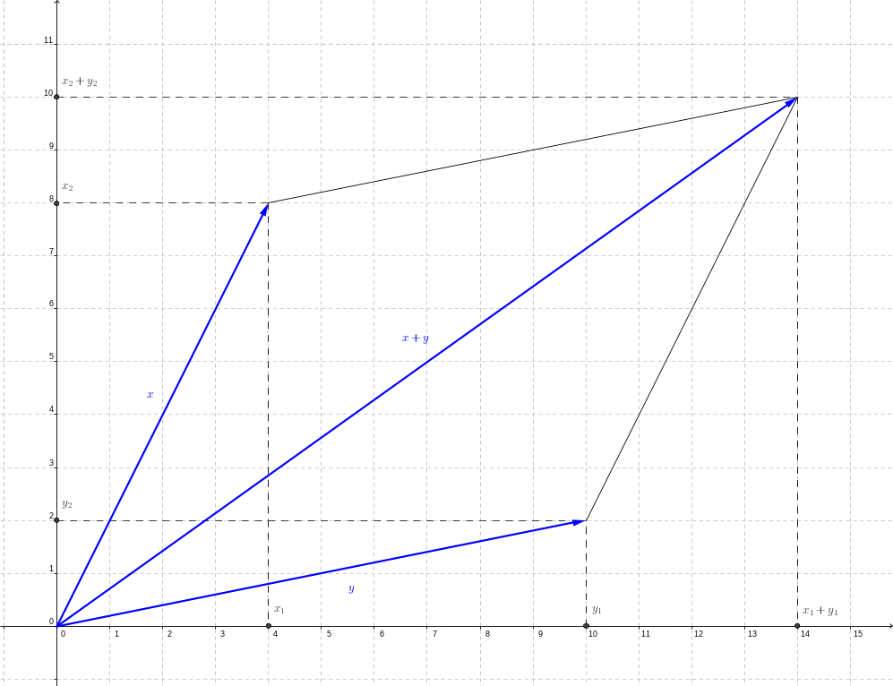

> **Satz 1.** Es gelten die folgenden Rechenregeln [^3]
>
> * Kommutativität $x+y=y+x$
> * Assoziativität $x+(y+z)=(x+y)+z$
> * Neutrales Element $o$ mit $x+o=x$
> * Inverses Element $-{x}$ mit ${x}+(-{x})={o}$
> * Distributivität $\lambda\cdot({x}+{y})=\lambda\cdot{x}+\lambda\cdot{y}$
> * Distributivität $(\lambda+\mu)\cdot{x}=\lambda\cdot{x}+\mu\cdot{x}$
> * Assoziativität für Vielfachbildung $(\lambda\cdot\mu)\cdot{x}=\lambda\cdot(\mu\cdot{x})$
>
> für beliebige $\{x,y,z\}\subset\mathbb{R}^n$ und $\{\lambda,\mu\}\subset\mathbb{R}$.

**Beweisidee.** Beide Operationen für Vektoren in $\mathbb{R}^n$, Addition und Skalarvielfachbildung, sind komponentenweise erklärt, so dass es ausreicht, die Rechenregeln aus Satz 1 im Körper der reellen Zahlen zu prüfen. Diese sind erfüllt.

Mit Hilfe der Javascript Bibliothek [Algebrite](http://algebrite.org/) können die Eigenschaften für das Rechnen mit Vektoren nachgerechnet werden. Hier dargestellt ist die Rechnung zur Prüfung der Kommutativität.

``` javascript
x = [[a],[b]]
y = [[c],[d]]
x + y
y + x
x + y - (y + x)
```
@Algebrite.eval

>**Definition 2.** Seien $V$ eine Menge von Elementen und $K$ ein Körper.
>
>1. Sind in $V$ sinngemäß zu Definition 1 eine Addition und Vielfachbildung mit Zahlen aus $K$ erklärt ~~und~~
>2. gelten alle Rechenregeln aus Satz 1 sinngemäß für das Rechnen in $V$
>
>so heißt $V$ ein [Vektorraum](https://de.wikipedia.org/wiki/Vektorraum) über $K$ und jedes Element $x\in V$ ein Vektor aus $V$.

**Beispiel 3.**

1. Die Menge geordneter $n$-Tupel reeller Zahlen $$
  \mathbb{R}^n:=\left\{\left.\begin{pmatrix} x_1 \\ \vdots \\ x_n\end{pmatrix}\right|\; x_j\in\mathbb{R},\;j\in\{1,...,n\}\right\}
$$ mit festem $n\in\mathbb{N}$ und $n>0$ bilden bezüglich der in Definition 1 eingeführten Operationen einen reellen Vektorraum (Vektorraum über $\mathbb{R}$). Im Speziellen bilden die reellen Zahlen $\mathbb{R}$, die geordneten Paare reeller Zahlen $\mathbb{R}^2$ und die geordneten Tripel reeller Zahlen $\mathbb{R}^3$ jeweils einen reellen Vektorraum.

2. Auf der Menge aller geordneten Paare komplexer Zahlen $$
  \mathbb{C}^2:=\left\{\left.\begin{pmatrix} z_1 \\ z_2 \end{pmatrix}\right|\; z_1\in\mathbb{C},\;z_2\in\mathbb{C}\right\}
$$ beziehungsweise - unter Verwendung der kartesischen Darstellung von $z_1$, $z_2$ $$
  \mathbb{C}^2=\left\{\left.\begin{pmatrix} a_1+i\cdot b_1 \\ a_2+i\cdot b_2 \end{pmatrix}\right|\; a_j\in\mathbb{R}\,,b_j\in\mathbb{R},\;j\in\{1,2\}\right\}
$$ mit imaginärer Einheit $i$, $i^2=-1$, kann sinngemäß zu Definition 1 *komponentenweise* eine Addition und Skalarvielfachbildung in $\mathbb{C}^2$ erklärt werden. Nach Definition 2 bilden diese einen komplexen Vektorraum (Vektorraum über $\mathbb{C}$) da sich alle Rechengesetze aus Satz 1 sinngemäß von $\mathbb{R}^2$ auf $\mathbb{C}^2$ übertragen lassen.
3. Gegeben ist die Menge aller reellen Polynomfunktionen $f$ vom Grad $\deg{f}\leq2$ $$
  V=\left\{ f:\mathbb{R}\to\mathbb{R}|\;y=f(x)=a\cdot x^2+b\cdot x+c,\;a\in\mathbb{R},\;b\in\mathbb{R},\;c\in\mathbb{R}\right\}
$$ Auf $V$ sind eine Addition $$
  V\times V\to V\quad\text{mit}\quad (f_1,f_2)(x)\mapsto (f_1+f_2)(x)=f_1(x)+f_2(x)\quad \forall\; x\in\mathbb{R}
$$ und $$
  f_1(x)+f_2(x)=(a_1\cdot x^2+b_1\cdot x+c_1)+(a_2\cdot x^2+b_2\cdot x+c_2)=
  (a_1+a_2)\cdot x^2+(b_1+b_2)\cdot x+(c_1+c_2)
$$ sowie eine Skalarvielfachbildung $$
  \mathbb{R}\times V\to V\quad\text{mit}\quad (\lambda,f)(x)\mapsto (\lambda\cdot f)(x)=\lambda\cdot f(x)\quad \forall\; x\in\mathbb{R}
$$ und $$
  \lambda\cdot f(x)=\lambda\cdot (a\cdot x^2+b\cdot x+c)=
  (\lambda\cdot a)\cdot x^2+(\lambda\cdot b)\cdot x+(\lambda\cdot c)
$$ erklärt. D. h. Summe und Skalarvielfaches von Polynomfunktion $f$ mit Grad $\deg{f}\leq2$ sind wieder Polynomfunktionen. Die Rechenregeln aus Satz 2 lassen sich unmittelbar nachrechnen: Beispielsweise bildet die 'Nullfunktion' $$
  o:x\mapsto y=o(x)=0\cdot x^2+0\cdot x+0=0\,,\quad x\in\mathbb{R}
$$ das neutrale Element und $$
  y=(-f)(x)=(-1)\cdot(a\cdot x^2+b\cdot x+c)=-a\cdot x^2-b\cdot x-c
$$ das zu $f$ inverse Element bezüglich der erklärten Addition. Die Menge $V$ der Polynomfunktionen bildet zusammen mit den erklärten Operationen einen Vektorraum über $\mathbb{R}$.

In nachstehenden Video wird das Prüfen der Rechenregeln für die Vektoroperationem an je einem der in 'Beispiel 3' aufgegriffenen Beispiele erläutert.

!?[Vektorraum3](https://www.youtube.com/watch?v=wKP53tZPHKU)

!?[Vektorraum4](https://www.youtube.com/watch?v=8UKQhjekmEg)

Mit den vorgenannten Beispielen wird deutlich, dass die Frage "*Was ist ein Vektor?*" zur graphischen Vorstellung hinter die Frage "*Welche Operationen sind erklärt und welche Regeln gelten für das Rechen mit Vektoren?*" zurücktritt.


Lineare Unabhängigkeit von Vektoren
=====


Aus den in einem Vektorraum erklärten Operationen 'Addition' und 'Skalarvielfachbildung' lässt sich die Bildung 'neuer' Vektoren ableiten.

>**Definition 3.** Für Vektoren $v_i\in V$ mit $i\in\{1,2,\ldots,n\}$ und Skalare $\lambda_i\in K$ heißt
>$$
  \sum_{i=1}^n{\left(\lambda_i\cdot v_i\right)}=\lambda_1\cdot v_1+\lambda_2\cdot v_2+...+\lambda_n\cdot v_n\in V
$$ eine **Linearkombination** der Vektoren $v_i$. Diese ist also wieder ein Vektor. Die Skalare $\lambda_i$ heißen Koeffizienten der Linearkombination.

**Beispiel 4.** Gegeben sind drei Vektoren des $\mathbb{R}^2$, die als Ortsvektoren der Eckpunkte zweier gleichseitiger Dreiecke der Kantenlänge 'Eins' in der nachstehenden Abbildung dargestellt sind.

, die zwei gleichseitige Dreiecke aufspannen. Dargestellt ist ebenso die Linearkombination $2\cdot a+3\cdot b-3\cdot c$ (schwarz) sowie alle Orte zur vom reellen Parameter $\lambda$ abhängigen Linearkombination $\lambda\cdot a+(1-\lambda)\cdot c$ (grün).")

Zu berechnen sind unter Benutzung der Rechenregeln für Vektoren in Satz 1:

1. die Linearkombination $a+b-c$ $$
  a+b-c=(a+b)-c=c-c=o
$$ worin $o$ den Nullvektor in $\mathbb{R}^2$ bezeichnet.
2. die Linearkombination $2\cdot a+3\cdot b-3\cdot c$ $$
  2\cdot a+3\cdot b-3\cdot c=-a+3\cdot\left(a+b-c\right)\stackrel{1.}{=}-a+o=-a
$$ unter Nutzung des vorherigen Ergebnisses.
3. die vom Parameter $\lambda$ abhängige Linearkombination $\lambda\cdot a+(1-\lambda)\cdot c$ $$
  \lambda\cdot a+(1-\lambda)\cdot c=c+\lambda\cdot(a-c)\stackrel{1.}{=}c-\lambda\cdot b
$$

Ein zentraler Begriff im Kontext der Vektorräume ist der der linearen Unabhängigkeit von Vektoren.

>**Definition 4.** Die Vektoren $v_i\in V$ mit $i\in\{1,2,\ldots,n\}$ heißen **linear unabhängig**, falls
>$$
  \sum_{i=0}^n{\left(\lambda_i\cdot v_i\right)}=o\;\rightarrow\;(\lambda_0,\lambda_1,\ldots,\lambda_n)=(0,0,\ldots,0)
$$ worin $o$ den Nullvektor in $V$ bezeichnet. Andernfalls wird die Menge $\{v_1,...,v_n\}$ linear abhängig genannt.

**Bemerkung 2.** Die vorstehende Definition besteht aus einer Implikation: Der Vordersatz ist eine vektorwertige, lineare Gleichung in den unbekannten Koeffizienten $\lambda_i$, deren rechte Seite der Nullvektor in $V$ ist. Der Nachsatz umfasst die Aussage, dass alle Koeffizienten als Lösungen dieser Gleichung 'Null' sind.

Das heißt, die lineare Unabhängigkeit der Vektoren $v_i$ ist daran gekoppelt, dass die vektorvertige, lineare Gleichung in Definition 4 ~~nur~~ für das Nulltupel $$
  (\lambda_0,\lambda_1,\ldots,\lambda_n)=(0,0,\ldots,0)
$$ lösbar ist. Diese wird auch *triviale Lösung* genannt. Existiert andernfalls ~~daneben~~ ein $$
  (\lambda_0,\lambda_1,\ldots,\lambda_n)\not=(0,0,\ldots,0)
$$ als Lösungstupel dieser Gleichung, so heißt die Menge der Vektoren $\left\{v_i|\, i\in\{1,2,...,n\}\right\}$ linear abhängig.

**Beispiel 5.** Es wird der Vektorraum $V=\mathbb{R}^2$ betrachtet.

1. Für die Vektoren $$
  v_1=\begin{pmatrix} 2 \\ 1 \end{pmatrix}\quad\text{und}\quad
  v_2=\begin{pmatrix} 1 \\ -1 \end{pmatrix}
$$ ist die Menge $\{v_1,v_2\}$ linear unabhängig, da gilt $$
  \lambda_1\cdot v_1+\lambda_2\cdot v_2=
  \lambda_1\cdot\begin{pmatrix} 2 \\ 1 \end{pmatrix}+\lambda_2\cdot\begin{pmatrix} 1 \\ -1 \end{pmatrix}=
  \begin{pmatrix} 2\cdot\lambda_1+\lambda_2 \\ \lambda_1-\lambda_2 \end{pmatrix}=
  \begin{pmatrix} 0 \\ 0 \end{pmatrix}=o\quad\leftrightarrow\quad (\lambda_1,\lambda_2)=(0,0)
$$ Es existiert nur das Paar von Koeffizienten $(\lambda_1,\lambda_2)=(0,0)$ als Lösung der linearen Gleichung.
2. Für die Vektoren $$
  u_1=\begin{pmatrix} 2 \\ 1 \end{pmatrix}\quad\text{und}\quad
  u_2=\begin{pmatrix} 0 \\ 0 \end{pmatrix}
$$ ist die Menge $\{u_1,u_2\}$ linear abhängig, da zum Beispiel gilt $$
  0\cdot u_1+7\cdot u_2=
  0\cdot\begin{pmatrix} 2 \\ 1 \end{pmatrix}+7\cdot\begin{pmatrix} 0 \\ 0 \end{pmatrix}=
  \begin{pmatrix} 0 \\ 0 \end{pmatrix}=o
$$ Es existiert ein Paar von Koeffizienten $(\lambda_1,\lambda_2)=(0,7)\not=(0,0)$ als Lösung dieser linearen Gleichung. Mit selbigem Ansatz folgt, dass die einelementige Menge $\{u_1\}$ linear unabhängig ist, währenddessen $\{u_2\}$ linear abhängig ist.[^4]
3. Für die Vektoren $$
  w_1=\begin{pmatrix} 2 \\ 1 \end{pmatrix}\,,\quad
  w_2=\begin{pmatrix} 1 \\ 1 \end{pmatrix}\quad\text{und}\quad
  w_3=\begin{pmatrix} -1 \\ 2 \end{pmatrix}
$$ besteht die Menge $\{w_1,w_2,w_3\}$ aus linear abhängigen Vektoren, da gilt $$
  -3\cdot w_1+5\cdot w_2-w_3=o
$$ Bitte nachrechnen!

>**Proposition 2.** Vektoren $v_i$ mit $i\in\{1,2,...,n\}$ und $n\in\mathbb{N}$, $n>1$ sind genau dann linear abhängig, wenn (mindestens) einer der Vektoren $v_i$ als Linearkombination der anderen dargestellt werden kann.

**Beweis.** Nach Definition 4 sind die Vektoren $v_i$ linear abhängig, falls ein Koeffizient $\lambda_i$ in der Gleichung $$
  \sum_{i=0}^n{\left(\lambda_i\cdot v_i\right)}=o
$$ verschieden von 'Null' gewählt werden kann. O. B. d. A. ist $\lambda_1\not=0$ (ggf. nach Umordnen). Es folgt umkehrbar $$
  \sum_{i=0}^n{\left(\lambda_i\cdot v_i\right)}=o\quad\stackrel{\lambda_1\not=0}{\longleftrightarrow}\quad
  v_1=-\frac{1}{\lambda_1}\cdot\left(\lambda_2\cdot v_2+...+\lambda_n\cdot v_n\right)=
  \sum_{k=2}^n{\left(-\frac{\lambda_k}{\lambda_1}\cdot v_k\right)}
$$ mit Koeffizienten $\mu_k:=-\frac{\lambda_k}{\lambda_1}$.

$\square$

**Beispiel 6.** Die Menge aller auf $\mathbb{R}$ stetigen, reellen Funktionen bildet bezüglich einer - formal wie in Beispiel 3 (3.) erklärten - 'punktweisen' Addition und Skalarvielfachbildung einen Funktionenvektorraum ([Funktionenraum](https://de.wikipedia.org/wiki/Funktionenraum)).

1. Gegeben sind die beiden stetigen, reellen Funktionen $$
  f:x\mapsto y=f(x)=\exp{x}\quad\text{und}\quad
  g:x\mapsto y=g(x)=\exp{(2\cdot x)}
$$ mit gemeinsamem Definitionsbereich $D=\mathbb{R}$. Die Funktionen $f$ und $g$ sind linear unabhängig, da kein reeller Skalar $\lambda$ existiert mit $$
  g(x)=\exp{(2\cdot x)}=\exp{x}\cdot\exp{x}=\lambda\cdot\exp{x}=\lambda\cdot f(x)
$$ für alle $x\in D$.
2. Je endlich viele, verschiedene der Funktionen $$
  f_i:x\mapsto y=f_i(x)=x^i\quad (i\in\mathbb{N}\,, i>0)\,,\quad f_0:x\mapsto y=f_0(x)=1
$$ mit gemeinsamem Definitionsbereich $D=\mathbb{R}$ sind linear unabhängig, denn für eine endliche Indexmenge $J\subset\mathbb{N}$ gilt nach Definition 4 $$
  \sum_{j\in J}{(\lambda_j\cdot f_j(x))}=0\quad\forall\; x\in\mathbb{R}\quad\rightarrow\quad
  \forall j\in J\;(\lambda_j=0)
$$

Aus dem letzten Beispiel lässt sich eine Methode zum Vergleich von reellen Polynomfunktionen entwickeln. Gegeben sind zwei Polynomfunktionen $n$-ten Grades durch die Polynome $$
    p(x)=\sum_{j=0}^n{\left(a_j\cdot x^j\right)}\quad\text{und}\quad
    q(x)=\sum_{j=0}^n{\left(b_j\cdot x^j\right)}
$$ mit $x\in\mathbb{R}$. Die Polynomfunktionen sind gleich $$
  p(x)=q(x)\;\;\forall x\in\mathbb{R}\quad\leftrightarrow\quad
  p(x)-q(x)=0\;\;\forall x\in\mathbb{R}\quad\leftrightarrow\quad
  \forall j\in\{0,1,...,n\}\;(a_j-b_j=0)
$$ d. h. falls die zum gleichen Indexwert gehörenden Koeffizienten gleich sind. Die Methode wird deshalb auch Methode des **Koeffizientenvergleichs** genannt.

**Beispiel 7.** Die Polynomfunktion $f:[0,1]\to\mathbb{R}$ mit $$
  f(t)=2\cdot t^3-t^2+t-1
$$ ist als Linearkombination $$
  f(t)=\sum_{j=0}^3{\left(\lambda_j\cdot B_j^3(t)\right)}
$$ der Bernstein-Polynome $$
  B_j^3(t)=\binom{3}{j}\cdot(1-t)^{3-j}\cdot t^j\,,\quad j\in{0,1,2,3}
$$ darzustellen (und ist damit von diesen linear abhängig).

1. Die Bernstein-Polynome zur Ordnung $3$ berechnen sich unter Festsetzung $t^0=1$ und $(1-t)^0=1$ für alle $t$ $$
  B_0^3(t)=\binom{3}{0}\cdot(1-t)^{3}=1-3\cdot t+3\cdot t^2-t^3
$$ beziehungsweise $$
  B_1^3(t)=\binom{3}{1}\cdot(1-t)^{2}\cdot t=3\cdot t-6\cdot t^2+3\cdot t^3
$$ beziehungsweise $$
  B_2^3(t)=\binom{3}{2}\cdot(1-t)^{1}\cdot t^2=3\cdot t^2-3\cdot t^3
$$ beziehungsweise $$
  B_3^3(t)=\binom{3}{3}\cdot t^3=t^3
$$
2. Die Linearkombination der Bernstein-Polynome mit Koeffizienten $\lambda_j$ ergibt nach Ausmultiplizieren, Zusammenfassen und Ordnen $$
  \sum_{j=0}^3{\left(\lambda_j\cdot B_j^3(t)\right)}=
  \lambda_0\cdot 1+
  (-3\cdot\lambda_0+3\cdot\lambda_1)\cdot t+
  (3\cdot\lambda_0-6\cdot\lambda_1+3\cdot\lambda_2)\cdot t^2+
  (-\lambda_0+3\cdot\lambda_1-3\cdot\lambda_2+\lambda_3)\cdot t^3
$$
3. Der Vergleich der Koeffizienten von $f(t)$ mit denen der Linearkombination $\sum_{j=0}^3{\left(\lambda_j\cdot B_j^3(t)\right)}$ ergibt ein System von vier linearen Gleichungen in den zu bestimmenden Koeffizienten $\lambda_j$ $$
  \lambda_0+1=0\,,\quad
  -3\cdot\lambda_0+3\cdot\lambda_1-1=0\,,\quad
  3\cdot\lambda_0-6\cdot\lambda_1+3\cdot\lambda_2+1=0\quad\text{und}\quad
  -\lambda_0+3\cdot\lambda_1-3\cdot\lambda_2+\lambda_3-2=0
$$ Diese kann schrittweise 'von oben nach unten' gelöst werden und besitzt die eindeutige Lösung $$
  \lambda_0=-1\,,\quad
  \lambda_1=-\frac{2}{3}\,,\quad
  \lambda_2=-\frac{2}{3}\quad\text{und}\quad
  \lambda_3=1
$$ Damit ist $$
  f(t)=(-1)\cdot B_0^3(t)-\frac{2}{3}\cdot B_1^3(t)-\frac{2}{3}\cdot B_2^3(t)+B_3^3(t)
$$


Basen in Vektorräumen
=====


In diesem Abschnitt ergänzen wir den Begriff der Basis eines Vektorraums .

>**Definition 5.** Sind in einem Vektorraum $V$ $n$ Vektoren linear unabhängig und stets $n+1$ Vektoren linear abhängig, so heißt $V$ endlich-dimensional. Die natürliche Zahl $n=\dim{V}$ mit $n\geq1$ wird **Dimension** des Vektorraums $V$ genannt.

>**Definition 6.** In einem Vektorraum $V$ der Dimension $\dim{V}=n$ heißt jede Menge von $n$ linear unabhängigen Vektoren eine **Basis** $B$ von $V$. $$
  B=\left\{x_1,x_2,...,x_n\right\}\subset V
$$ Darin wird $x_j\in V$, $j\in \{1,2,...,n\}$ Basisvektor zum Index $j$ genannt.

**Beispiel 8.** Die Vektoren $$
  e_1=\begin{pmatrix} 1 \\ 0 \end{pmatrix}\quad\text{und}\quad
  e_2=\begin{pmatrix} 0 \\ 1 \end{pmatrix}
$$ bilden eine Basis des Vektorraums $V=\mathbb{R}^2$. Diese Vektoren sind linear unabhängig, denn es folgt für die Linearkombination $$
  \lambda_1\cdot e_1+\lambda_2\cdot e_2 =
  \begin{pmatrix} \lambda_1 \\ \lambda_2 \end{pmatrix}=
  \begin{pmatrix} 0 \\ 0 \end{pmatrix}\quad\rightarrow\quad \lambda_1=\lambda_2=0
$$ Darüberhinaus kann jeder weitere Vektor $v$ als Linearkombination dieser Vektoren dargestellt werden. $$
  v=\lambda_1\cdot e_1+\lambda_2\cdot e_2\quad \leadsto\quad v=\begin{pmatrix} \lambda_1 \\ \lambda_2 \end{pmatrix}
$$ woraus die lineare Abhängigkeit von $\{v,e_1,e_2\}$ nach Proposition 2 folgt. Der Vektorraum $\mathbb{R}^2$ besitzt die Dimension $2$ $$
  B=\{e_1,e_2\}
$$ heißt *kanonische Basis* in $\mathbb{R}^2$.

Das Bildungsprinzip lässt sich auf Vektorräume $V=\mathbb{R}^n$ mit $n\in\mathbb{N}$ und $n>0$ übertragen: Die Menge $$
  B=\{e_1,e_2,...,e_n\}\quad\text{mit Basisvektoren}\quad e_j=\begin{pmatrix} \delta_{1j} \\ \delta_{2j} \\ \vdots \\ \delta_{nj} \end{pmatrix}\,, j\in\{1,2,...,n\}
$$ unter Nutzung des [Kronecker-Symbols](https://de.wikipedia.org/wiki/Kronecker-Delta) $$
  \delta_{ij}:=\left\{\begin{array}{rcl} 0 & \text{für} & i\not=j \\ 1 & \text{für} & i=j \end{array}\right.
$$ bildet die kanonische Basis des Vektorraums $V=\mathbb{R}^n$.

**Beispiel 9.** Die Menge $B$ der reellen Potenzfunktionen $$
  f_i:x\mapsto y=f_i(x)=x^i\quad (i\in\{1,2,...,n\}\,,n>0)\,,\quad f_0:x\mapsto y=f_0(x)=1
$$ mit gemeinsamem Definitionsbereich $D=\mathbb{R}$ bildet eine Basis im Vektorraum der reellen Polynomfunktionen vom Grad $k\leq n$ $$
  V=\left\{f:\mathbb{R}\to\mathbb{R}\left|\; f(x)=\sum_{j=0}^n{(a_j\cdot x^j)}\,, a_j\in\mathbb{R}\right.\right\}
$$ Die lineare Unabhängigkeit der Funktionen $f_i$ ist bereits im Beispiel 6 (2.) gezeigt worden. Es folgt $\dim{V}=n+1$.

>**Satz 3.** Zu jedem Vektor $v\in V$ eines endlich-dimensionalen Vektorraums $V$ mit Dimension $\dim{V}=n$ über einem Körper $K$ existiert zu einer gegebenem Basis $$
  B=\{x_1,x_2,...,x_n\}
$$ von Vektoren aus $V$ genau ein Tupel $$
  (\lambda_1,\lambda_2,...,\lambda_n)\in K^n
$$ von Koeffizienten, so dass sich $v$ eindeutig als Linearkombination in den Basisvektoren darstellen lässt $$
  v=\sum_{j=1}^n{(\lambda_j\cdot x_j)}
$$ Die Koeffizienten $\lambda_j$ werden **Koordinaten** von $v$ bezüglich $B$ genannt; der Vektor $$
  \begin{pmatrix} \lambda_1 \\ \lambda_2 \\ \vdots \\ \lambda_n \end{pmatrix}\in K^n
$$ heißt ** Koordinatenvektor** von $v$ bezüglich $B$.

**Beweis.** Die Existenz der Koeffizienten $\lambda_j$ folgt aus Definition 6 und Proposition 2.

Der Nachweis der Eindeutigkeit der Koeffizienten $\lambda_j$ in der Linearkombination bezüglich $B$ wird hier indirekt geführt: Angenommen, es gäbe zwei unterschiedliche Linearkombination zur Darstellung von $v$, d. h. zwei verschiedene Koordinatenvektoren $$
  \begin{pmatrix} \lambda_1 \\ \lambda_2 \\ \vdots \\ \lambda_n \end{pmatrix}\not=
  \begin{pmatrix} \mu_1 \\ \mu_2 \\ \vdots \\ \mu_n \end{pmatrix}
$$ so folgt aus den zugehörigen Linearkombinationen unter Verwendung der Rechenregeln für Vektoren $$
  v=\sum_{j=1}^n{(\lambda_j\cdot x_j)}=
  \sum_{j=1}^n{(\mu_j\cdot x_j)}\quad\rightarrow\quad
  \sum_{j=1}^n{(\lambda_j\cdot x_j)}-\sum_{j=1}^n{(\mu_j\cdot x_j)}=
  \sum_{j=1}^n{((\lambda_j-\mu)\cdot x_j)}=o
$$ Aufgrund der linearen Unabhängigkeit der Vektoren $x_j$ folgt hieraus, dass alle Koeffizienten $\lambda_j-\mu_j$ 'verschwinden' müssen, d. h. $$
  \lambda_j-\mu_j=0\quad\leftrightarrow\quad\lambda_j=\mu_j
$$ für alle $j\in\{1,2,...,n\}$.

$\square$

**Beispiel 10.** Es werden die Koordinatenvektoren für Vektoren in verschiedenen reellen Vektorräumen $V$ berechnet. Im letzten Punkt wird deutlich, dass $\mathbb{R}^n$ als Standardmodell für reelle Vektorräume genutzt werden kann.

1. Gegeben ist der Vektorraum $V=\mathbb{R}^3$. Bezogen auf die kanonische Basis $B=\{e_1,e_2,e_3\}$ (vergleiche Beispiel 8) ist der Koordinatenvektor zum Vektor $$
  v=\begin{pmatrix} 1 \\ 2 \\ 3 \end{pmatrix}
$$ zu berechnen. $$
  v=\sum_{j=1}^3{(\lambda_j\cdot e_j)}=
  \lambda_1\cdot\begin{pmatrix} 1 \\ 0 \\ 0 \end{pmatrix}+
  \lambda_2\cdot\begin{pmatrix} 0 \\ 1 \\ 0 \end{pmatrix}+
  \lambda_3\cdot\begin{pmatrix} 0 \\ 0 \\ 1 \end{pmatrix}=
  \begin{pmatrix} \lambda_1 \\ \lambda_2 \\ \lambda_3 \end{pmatrix}\quad\leadsto\quad
  \begin{pmatrix} \lambda_1 \\ \lambda_2 \\ \lambda_3 \end{pmatrix}=
  \begin{pmatrix} 1 \\ 2 \\ 3 \end{pmatrix}
$$ Der Vektor $v$ gleicht seinem zugehörigen Koordinatenvektor bezogen auf die kanonische Basis $B$.
2. Gegeben ist der Vektorraum $V=\mathbb{R}^2$. Bezogen auf die Basis $$
  B=\{b_1,b_2\}:=\left\{
    \begin{pmatrix} 2 \\ 1 \end{pmatrix}\,,\begin{pmatrix} 1 \\ 2 \end{pmatrix}
  \right\}
$$ (für den Nachweis der Basiseigenschaft vergleiche Beispiel 8) ist der Koordinatenvektor zum Vektor $$
  v=\begin{pmatrix} 3 \\ 3 \end{pmatrix}
$$ zu berechnen. $$
  v=\sum_{j=1}^2{(\lambda_j\cdot b_j)}=
  \lambda_1\cdot\begin{pmatrix} 2 \\ 1 \end{pmatrix}+
  \lambda_2\cdot\begin{pmatrix} 1 \\ 2 \end{pmatrix}=
  \begin{pmatrix} 2\cdot\lambda_1+\lambda_2 \\ \lambda_1+2\cdot\lambda_2 \end{pmatrix}\quad\leadsto\quad
  \begin{pmatrix} \lambda_1 \\ \lambda_2 \end{pmatrix}=
  \begin{pmatrix} 1 \\ 1 \end{pmatrix}
$$ Der Vektor $v$ besitzt bezogen auf die Basis $B$ den zugehörigen Koordinatenvektor $$
  \begin{pmatrix} \lambda_1 \\ \lambda_2 \end{pmatrix}=
  \begin{pmatrix} 1 \\ 1 \end{pmatrix}
$$
3. *Fortführung von Beispiel 9* für den Parameterwert $n=2$. Bezogen auf die Basis $$
  B=\{f_0,f_1,f_2\}
$$ mit den Basisfunktionen $$
  f_0:x\mapsto y=f_0(x)=1\,,\quad
  f_1:x\mapsto y=f_1(x)=x^1\quad\text{und}\quad
  f_2:x\mapsto y=f_2(x)=x^2
$$ ist der Koordinatenvektor zur Funktion $$
  g:x\mapsto y=g(x)=3\cdot x^2-5\cdot x+7\,,\quad x\in\mathbb{R}
$$ zu berechnen. $$
  g(x)=\sum_{j=0}^2{(\lambda_j\cdot f_j(x))}=
  \lambda_0\cdot 1+\lambda_1\cdot x+\lambda_2\cdot x^2=
  \quad\leadsto\quad
  \begin{pmatrix} \lambda_0 \\ \lambda_1 \\ \lambda_2 \end{pmatrix}=
  \begin{pmatrix} 7 \\ -5 \\ 3 \end{pmatrix}
$$ Der Funktion $f$ wird bezogen auf die Basis $B$ der reelle Koordinatenvektor $$
  \begin{pmatrix} \lambda_0 \\ \lambda_1 \\ \lambda_2 \end{pmatrix}=
  \begin{pmatrix} 7 \\ -5 \\ 3 \end{pmatrix}
$$ zugeordnet. Dieser enthält die Koeffizienten des Polynoms als Komponenten. In gleicher Weise werden den Basisfunktionen die Vektoren der natürlichen Basis des $\mathbb{R}^3$ als Koordinatenvektoren zugeordnet $$
  f_0\mapsto\begin{pmatrix} 1 \\ 0 \\ 0 \end{pmatrix}\,,\quad
  f_1\mapsto\begin{pmatrix} 0 \\ 1 \\ 0 \end{pmatrix}\,,\quad
  f_2\mapsto\begin{pmatrix} 0 \\ 0 \\ 1 \end{pmatrix}
$$

Eine Zusammenstellung der Aussagen zur linearen Unabhängigkeit findet sich im nachstehenden Video. Darin enthalten sind nicht nur eine praktische Anleitung zum Prüfen der Basiseigenschaft, die an Beispielen ausgeführt wird. Es wird auch eine Einordnung des Begriffs 'Basis' in den allgemeineren Begriffskontext eines 'Erzeugendensystems' gegeben.

!?[Erzeugendensystem](https://www.youtube.com/watch?v=Ot9Y24Xcsu8)


Untervektorraum
=====

In diesem Abschnitt wird der Begriff 'Untervektorraum' eines Vektorraums eingeführt. Dies treten beispielsweise als Lösungsmengen von Systemen homogener, linearer Gleichungen auf - vergleiche Abschnitt [Lineare Gleichungssysteme](#Lineare-Gleichungssysteme). Ebenso als Lösungsmengen von speziellen Differentialgleichungen, die in technischem Kontext beispielsweise zur Beschreibung von Schwingungsvorgängen verwendet werden - siehe [Fundamentalsystem einer Schwingungsgleichung](https://de.wikipedia.org/wiki/Schwingung).

>**Definition 7.** Eine Teilmenge $M \subseteq V$ heißt [Untervektorraum](https://de.wikipedia.org/wiki/Untervektorraum) des Vektorraums $V$ über dem Körper $K$ genau dann, wenn die folgenden Bedingungen erfüllt sind.
>
>1. $M\not=\emptyset$ ~~und~~
>2. $(\lambda_1\cdot v_1+\lambda_2\cdot v_2)\in M$ für beliebige Vektoren $v_1\in M$ und $v_2\in M$ sowie für beliebige Skalare $\lambda_1\in K$ uund $\lambda_2\in K$

**Bemerkung 3.** Jeder Untervektorraum $M$ eines Vektorraums $V$ ist selbst ein Vektorraum. Warum?

**Beispiel 11.**

1. Das nach Definition 2 in jedem Vektorraum enthaltene Nullelement $o\in V$ bildet einen Untervektorraum $U=\{o\}$ in $V$. Prüfen Sie die beiden Bedingungen aus Definition 7 zum Nachweis der Eigenschaft, Untervektorraum zu sein. Der Untervektorraum $U\subseteq V$ besitzt die Dimension $\dim{U}=0$. Umgekehrt enthält jeder Untervektorraum das Nullelement $o\in V$.
2. Jedes vom Nullelement $o\in V$ verschiedene Element $v\in V$ spannt einen eindimensionalen Untervektorraum $$
  U=\{\lambda\cdot v|\;\lambda\in K\}\,,\quad\dim{U}=1
$$ auf, worin $K$ den Skalarkörper zu V bezeichnet.
3. Die linear unabhängigen Vektoren $$
  e_1=\begin{pmatrix} 1 \\ 0 \end{pmatrix}\in\mathbb{R}^2\quad\text{und}\quad
  e_2=\begin{pmatrix} 0 \\ 1 \end{pmatrix}\in\mathbb{R}^2
$$ spannen den zweidimensionalen Untervektorraum $$
  W=\{\lambda_1\cdot e_1+\lambda_2\cdot e_2|\;\lambda_j\in \mathbb{R}\,,j\in\{1,2\}\}\,,\quad\dim{W}=2
$$ Es gilt sogar $W=V$, d. h. das Paar $(e_1,e_2)$ bildet eine Basis in $W$ und $V=\mathbb{R}^2$. Vergleiche 'kanonische Basis' in Beispiel 8.

Unter Nutzen von Mengenoperationen lassen sich nun Untervektorräume eines Vektorraumes verknüpfen. Dabei stellt sich die Frage, ob die Struktur eines Untervektorraumes erhalten bleibt.

>**Definition 8.** Der Durchschnitt zweier Untervektorräume $U_1\subseteq V$ und $U_2\subseteq V$ ist die Menge aller Elemente $$
  U_1\cap U_2=\{v\in V|\; v\in U_1\;\wedge\;v\in U_2\}
$$ d. h. alle Elemente $v\in V$, für die gleichzeitig $v\in U_1$ und $v\in U_2$ gelten.

>**Proposition 4.** Für je zwei Untervektorräume $U_1\subseteq V$ und $U_2\subseteq V$ eines Vektorraums $V$ ist der Durchschnitt $U_1\cap U_2$ ein Untervektorraum von $V$.

**Beweis.** Jeder Untervektorraum enthält offensichtlich das Nullelement $o\in V$, wonach $o\in (U_1\cap U_2)$ folgt. Vergleiche Beispiel 11 (1).

Enthalten die Unterräume $U_1\subseteq V$ und $U_2\subseteq V$ jeweils Vektoren in $\{v_1,...,v_k\}$ mit $k\geq1$, so folgt nach Definition 7 unmittelbar $$
   \{v_1,...,v_k\}\subset U_1\cap U_2
$$ Nach Definition 7 (2) sind auch alle Linearkombinationen der Vektoren $\{v_1,...,v_k\}$ jeweils in $U_1\subseteq V$ und $U_2\subseteq V$ enthalten, woraus $$
  (\lambda_1\cdot v_1+...+\lambda_k\cdot v_k)\in(U_1\cap U_2)
$$ für beliebige Skalare $\lambda_j$ mit $j\in\{1,...,k\}$ folgt.

$\square$

**Bemerkung 4.** Im Gegensatz zum Durchschnitt ist die *Vereinigung* zweier Untervektorräume $U_1\subseteq V$ und $U_2\subseteq V$ $$
  U_1\cup U_2=\{v\in V|\; v\in U_1\;\vee\;v\in U_2\}
$$ im Allgemeinen ~~kein~~ Untervektorraum. Denn, sind beispielsweise - bezogen auf die Vektoren $e_1\in\mathbb{R}^2$ und $e_2\in\mathbb{R}^2$ in Beispiel 11 (3) - die Untervektorräume $$
  U_1=\{\lambda_1\cdot e_1|\;\lambda_1\in \mathbb{R}\}\,,\quad\dim{U_1}=1\quad\text{sowie}\quad
  U_2=\{\lambda_2\cdot e_2|\;\lambda_2\in \mathbb{R}\}\,,\quad\dim{U_2}=1
$$ gegeben, so gilt mit Definition 8 $$
  (2\cdot e_1)\in(U_1\cup U_2) \quad\wedge\quad ((-1)\cdot e_2)\in(U_1\cup U_2)
$$ jedoch ist die Linearkombination $$
  (2\cdot e_1+(-1)\cdot e_2)\not\in(U_1\cup U_2)
$$ Nach Definition 7 (2) ist die Vereinigungsmenge $U_1\cup U_2$ kein Untervektorraum.

Im Anliegen der Verknüpfung von Untervektorräumen kann mit der vorstehenden Bemerkung definiert werden:

>**Definition 9.** Die [Summe](https://de.wikipedia.org/wiki/Untervektorraum#Summe) zweier Untervektorräume $U_1$ und $U_2$ eines Vektorraumes $V$ über dem Körper $K$ ist der Untervektorraum $$
  W=U_1+U_2:=\{\lambda_1\cdot v_1+\lambda_2\cdot v_2|\;\lambda_j\in K,\;v_j\in U_j,j\in\{1,2\}\}
$$ Gilt $U_1\cap U_2=\{o\}$ (aus Nullelement bestehender Untervektorraum), so heißt $U_1+U_2$ **direkte Summe** und wird mit $U_1\oplus U_2$ gekennzeichnet.

>**Satz 5.** ([Dimensionssatz](https://de.wikipedia.org/wiki/Untervektorraum#Summe)) Für beliebige Untervektorräume $U_1$ und $U_2$ eines Vektorraumes $V$ über dem Körper $K$ gilt $$
  \dim{U_1}+\dim{U_2}=\dim{(U_1\cap U_2)}+\dim{(U_1+U_2)}
$$ (*ohne Beweis*)

**Beispiel 12.** Gegeben sind die beiden Untervektorräume des $\mathbb{R}^2$ $$
  U_1=\left\{\lambda_1\cdot \begin{pmatrix} 1 \\ 0 \end{pmatrix}|\;\lambda_1\in \mathbb{R}\right\}\,,\quad\dim{U_1}=1\quad\text{sowie}\quad
  U_2=\left\{\lambda_2\cdot \begin{pmatrix} 1 \\ 1 \end{pmatrix}|\;\lambda_2\in \mathbb{R}\right\}\,,\quad\dim{U_2}=1
$$ Es gilt einerseits für den Durchschnitt $$
  \lambda_1\cdot \begin{pmatrix} 1 \\ 0 \end{pmatrix}=
  \lambda_2\cdot \begin{pmatrix} 1 \\ 1 \end{pmatrix}\quad\leftrightarrow\quad
  \begin{cases} \lambda_1=\lambda_2 \\ 0=\lambda_2 \end{cases}\quad\leftrightarrow\quad
  \begin{cases} \lambda_1=0 \\ \lambda_2=0 \end{cases}\quad\leadsto \quad
  U_1\cap U_2=\{o\}\,,\quad\dim{(U_1\cap U_2)}=0
$$ andererseits für die Summe (bitte nachrechnen) $$
  U_1+U_2=U_1\oplus U_2=\left\{\left.\lambda_1\cdot \begin{pmatrix} 1 \\ 0 \end{pmatrix}+
  \lambda_2\cdot \begin{pmatrix} 1 \\ 1 \end{pmatrix}\right|\;\lambda_1\in\mathbb{R},\;\lambda_2\in\mathbb{R}\right\}=\mathbb{R}^2\,,\quad\dim{(U_1+U_2)}=2
$$ In diesem Beispiel zeigt sich der Dimensionssatz $$
  \dim{U_1}+\dim{U_2}=1+1=0+2=\dim{(U_1\cap U_2)}+\dim{(U_1+U_2)}
$$


Sicher gewusst
=====

Nutzen Sie die folgenden Fragen, um ihre über Vektoren erworbenen Kenntnisse zu prüfen.

**Frage 1.** Für welches der folgenden Objekte ergibt die Aussage einen Sinn, "es sei linear abhängig" bzw. "linear unabhängig"?

[( )] Ein $n$-Tupel $(v_1,...,v_n)$ von reellen Vektorräumen.
[(X)] Ein $n$-Tupel $(v_1,...,v_n)$ von Elementen eines Vektorraumes.
[( )] Eine Linearkombination $\lambda_1\cdot v_1+...+\lambda_n\cdot v_n$
[[?]] Vergleiche Definition 4 in diesem Abschnitt zur linearen Unabhängigkeit.

**Frage 2.** Welche der folgenden Aussagen bedeutet die lineare Unabhängigkeit des $n$-Tupels von Elementen aus $V$? Das Element $o$ kennzeichnet in allen drei Aussagen den Nullvektor in $V$.

[( )] Wenn $\lambda_1=...=\lambda_n=0$ dann $\lambda_1\cdot v_1+...+\lambda_n\cdot v_n=o$
[( )] $\lambda_1\cdot v_1+...+\lambda_n\cdot v_n=o$ für alle $(\lambda_1,...,\lambda_n)$ in $K^n$
[(X)] $\lambda_1\cdot v_1+...+\lambda_n\cdot v_n=o$ nur, wenn $\lambda_1=...=\lambda_n=0$
[[?]] Vergleiche Definition 4 in diesem Abschnitt zur linearen Unabhängigkeit.
****************************************

---

Die erste Aussage ist ~~nicht~~ korrekt, da für $n=2$ z. B. gilt $$
  0\cdot\begin{pmatrix} 1 \\ 0 \end{pmatrix}+ 0\cdot\begin{pmatrix} 0 \\ 0 \end{pmatrix}=
  \begin{pmatrix} 0 \\ 0 \end{pmatrix}
$$ jedoch die Vektoren $$
  v_1=\begin{pmatrix} 1 \\ 0 \end{pmatrix}\quad\text{und}\quad
  v_2=\begin{pmatrix} 0 \\ 0 \end{pmatrix}
$$ linear abhängig sind. Vergleiche Beispiel 5 (2.): Gehört der Nullvektor zur Menge von Elementen aus $V$, so ist diese Menge linear abhängig.

Die zweite Aussage ist ebenso ~~nicht~~ korrekt, da z. B. für $n=1$ gilt $$
  \lambda\cdot v=\begin{pmatrix} 0 \\ 0 \end{pmatrix}\;\forall\; \lambda\in\mathbb{R}\quad\leftrightarrow\quad
  v=\begin{pmatrix} 0 \\ 0 \end{pmatrix}
$$ letzterer ist der Nullvektor (beispielsweise in $\mathbb{R}^2$).

Die dritte Aussage entspricht der in Definition 4 genutzten Implikation. Hiernach ist ein System von Elementen aus $V$ dann linear abhängig, wenn eine Linearkombination dieser alleinig für das Koeffiziententupel $(\lambda_1,...,\lambda_n)=(0,...,0)$ den Nullvektor erzeugt. Andernfalls heißen die Elemente aus $V$ linear abhängig.

****************************************

**Frage 3.** Die kanonische Basis von $(e_1,...,e_n)\subset\mathbb{R}^n$ ist definiert durch

[( )] $$ (e_1,...,e_n)=(1,...,1) $$
[(X)] $$ e_j=(0,...,0,\stackrel{j\text{-te Stelle}}{1},0,...,0) $$
[( )] $$ e_j=(1,...,1,\stackrel{j\text{-te Stelle}}{0},1,...,1) $$
[[?]] Vergleiche Definition 6 zum Begriff einer Basis und Beispiel 8 zur kanonischen Basis.


[^1]: Die Vektoraddition erfolgt *komponentenweise*: d. h. dass die Summe der Komponenten an den $j$-ten Stellen beider Vektoren die $j$-te Komponente der Summe ergibt, $j\in\{1,...,n\}$.

[^2]: Die Skalarvielfachbildung erfolgt *komponentenweise*: d. h. dass das Produkt der $j$-ten Komponente des Vektors mit dem Skalar $\lambda$ die $j$-te Komponente des $\lambda$-Fachen ergibt, $j\in\{1,...,n\}$.

[^3]: Die Rechenregeln werden zur axiomatischen Festlegung eines Vektorraumes genutzt. Hier ist zusätzlich $1\cdot x=x$ zu fordern.

[^4]: Enthält eine Menge von Vektoren aus $V$ den Nullvektor, so ist diese linear abhängig.


### Matrizen


Definition und Eigenschaften
============================


>**Definition 1.** Ein rechteckiges Zahlenschema der Form $$
  A=\begin{pmatrix}
    a_{11} & a_{12} & ... & a_{1n} \\
    a_{21} & a_{22} & ... & a_{2n} \\
    \vdots & \vdots & & \vdots \\
    a_{m1} & a_{m2} & ... & a_{mn}
  \end{pmatrix}=\left(a_{ij}\right)_{i=1,...,m,\; j=1,...,n}\quad (m,n)\in\left(\mathbb{N}^\times\right)^2
$$ mit Zahlen $a_{ij}\in\mathbb{R}$ (bzw. Körper $K$) heißt reelle **Matrix** vom Typ $(m,n)$.
>
>Die Menge aller reellen Matrizen vom gleichen Typ $(m,n)$ wird mit $R^{m,n}$ bezeichnet.

Hierin werden folgende Bezeichnungen vereinbart.

1. Die Matrix $A$ aus Definition 1 besitzt $m$ Zeilen und $n$ Spalten.
2. Der Index $i$ an ~~erster~~ Stelle der Indizierung bezeichnet die Zeilennummer und wird Zeilenindex genannt.
3. Der Index $j$ an ~~zweiter~~ Stelle der Indizierung bezeichnet die Spaltennummer und wird Spaltenindex genannt.
4. $a_{ij}$ bezeichnet die Komponente in der $i$-ten Zeile und in der $j$-ten Spalte der Matrix $A$.

**Bemerkung 1.** Vektoren aus dem Vektorraum $\mathbb{R}^m$ sind als Matrizen vom Typ $(m,1)$ ($1$ Spalte) beziehungsweise $(1,m)$ ($1$ Zeile) interpretierbar / darstellbar.

Umgekehrt lassen sich Matrizen vom Typ $(m,n)$ durch ihre $n$ Spaltenvektoren darstellen $$
  A=(a_1,a_2,...,a_n)\quad\text{mit}\quad a_j\in\mathbb{R}^m\;\forall\; j\in\{1,2,...,n\}
$$ die *Spaltenvektordarstellung* von $A$ genannt wird.

**Beispiel 1.** Die reelle Matrix

1. $$
  O=\begin{pmatrix} 0 & 0 & 0 \\ 0 & 0 & 0 \end{pmatrix}
$$ heißt *Nullmatrix* vom Typ $(2,3)$.
2. $$  
  A=\begin{pmatrix} 1 \\ 4 \\ 0 \\ 3 \end{pmatrix}
$$ heißt *Spaltenmatrix* vom Typ $(4,1)$.
3. $$
  M=(s_1,s_2)\quad\text{mit}\quad s_1=\begin{pmatrix} 1 \\ 2 \\ 3 \end{pmatrix}\in\mathbb{R}^3 \quad\text{und}\quad s_2=\begin{pmatrix} -1 \\ 0 \\ 1 \end{pmatrix}
$$ heißt *Spaltenvektordarstellung* einer Matrix vom Typ $(3,2)$.
4. $$
  D= \begin{pmatrix} 1 & 0 & 0 & 0 \\ 0 & 2 & 0 & 0 \\ 0 & 0 & 0 & 0 \\ 0 & 0 & 0 & 7 \end{pmatrix}=:\mathrm{diag}(1,2,0,7)
$$ wird *Diagonalmatrix* vom Typ $(4,4)$ genannt.

>**Definition 2.**
>
>1. Eine Matrix $A$ vom Typ $(m,m)$, d. h. für $m=n$, heißt **quadratisch** vom Typ $m$.
>2. Eine quadratische Matrix $$
  D=\left(a_{ij}\right)_{i=1,...,m,j=1,...,m}
$$ mit $a_{ij}=0$ für alle $i\neq j$ und mindestens einem $a_{ii}\neq0$ heißt **Diagonalmatrix** vom Typ $(m,m)$ beziehungsweise $m$-reihig $$
  D=\begin{pmatrix}
      a_{11} & 0 & 0 & \ldots & 0 & 0 \\ 0 & a_{22} & 0 & \ldots & 0 & 0 \\
      \vdots & \vdots & \vdots & \ddots & \vdots & \vdots \\
      0 & 0 & 0 & \ldots & 0 & a_{mm}
  \end{pmatrix}=
  \mathrm{diag}{\left(a_{11},a_{22},\ldots,a_{mm}\right)}
$$ Das $m$-Tupel $\left(a_{11},a_{22},\ldots,a_{mm}\right)$ bildet die Hauptdiagonale von $D$.
>3. Die $m$-reihige Diagonalmatrix $\mathrm{diag}{\left(1,1,\ldots,1\right)}$ heißt **Einheitsmatrix** vom Typ $m$.
>4. Eine reelle quadratische $m$-reihige Matrix der Form $$
  \begin{pmatrix}
    a_{11} & a_{12} & \ldots & a_{1m} \\
    0 & a_{22} & \ldots & a_{2m} \\
    \vdots & \vdots & \ddots & \vdots \\
    0 & 0 & \ldots & a_{mm}
  \end{pmatrix}\,,\quad
  \begin{pmatrix}
    a_{11} & 0 & \ldots & 0 \\
    a_{21} & a_{22} & \ldots & 0 \\
    \vdots & \vdots & \ddots & \vdots \\
    a_{m1} & a_{m2} & \ldots & a_{mm}
   \end{pmatrix}
$$ wird **obere** beziehungsweise **untere Dreiecksmatrix** genannt.[^1]

>**Definition 3.** Werden bei einer Matrix $A$ Zeilen und Spalten vertauscht, entsteht die *Transponierte* $A^\top$ der Matrix $A$. Die Abbildung $$
  A\to A^\top
$$ heißt *Transposition*.

**Beispiel 2.** Durch Transposition gehen ineinander über die reellen Matrizen

1. $$
  A=\begin{pmatrix} 1 & 3 \\ 4 & 2 \\ 0 & -8 \end{pmatrix}\quad\leftrightarrow\quad
  A^\top=\begin{pmatrix} 1 & 4 & 0 \\ 3 & 2 & -8 \end{pmatrix}
$$ $A$ ist vom Typ $(3,2)$, deren Transponierte $A^\top$ hingegen vom Typ $(2,3)$.
2. $$
  B=\begin{pmatrix} 1 \\ 2 \\ 9 \end{pmatrix}\quad\leftrightarrow\quad
  B^\top=\begin{pmatrix} 1 & 2 & 9 \end{pmatrix}
$$ Die Matrix $B$ ist vom Typ $(3,1)$ (Spaltenvektor), deren transponierte Matrix $B^\top$ hingegen vom Typ $(1,3)$ (Zeilenvektor).

Die Rechnung kann unter Benutzung der Javascript Bibliothek [Algebrite](http://algebrite.org/) nachvollzogen werden.

```javascript
A=[[a,b],[c,d],[e,f]]
B=transpose(A)
shape(A)
shape(B)
transpose(transpose(A))
```
@Algebrite.eval

Allgemein kann festgehalten werden

>**Proposition 1.** Durch Transposition wird der Typ $(m,n)$ der Matrix $A$ in den Typ $(n,m)$ der transponierten Matrix $A^\top$ übergeführt. Des Weiteren gilt $$
  A\quad\stackrel{\top}{\to}\quad A^\top\quad\stackrel{\top}{\to}\quad A
$$ für die Transposition einer Matrix. $A$.

Außerdem lässt sich für die Gleichheit von Matrizen festlegen:

>**Definition 4.** Zwei Matrizen $$
  A=(a_{ij})_{i=1,...,m,\; j=1,...,n}\quad\text{und}\quad B=(b_{kl})_{k=1,...,p\; l=1,...,r}
$$ heißen **gleich**, falls folgende Bedingungen erfüllt sind.
>
>1. Die Matrizen $A$ und $B$ besitzen den gleichen Typ, d. h. falls $m=p$ und $n=r$ gelten.
>2. Es gilt $$
  a_{ij}=b_{ij}\quad\forall\; i\in\{1,...,m\}\;\forall\; j\in\{1,...,n\}
$$ für die Komponenten der Matrizen $A$ und $B$.


Matrizen als Vektoren
=====================

Für Matrizen vom Typ $(m,n)$ über einem Körper $K$ lassen sich in gleicher wie für Vektoren aus $K^m$ zwei Operationen erklären: Addition und Vielfachbildung mit einem Skalar.

>**Definition 5.** Für beliebige Matrizen $$
  A=(a_{ij})_{i=1,...,m,\; j=1,...,n}\in K^{m,n}\,,\quad B=(b_{ij})_{i=1,...,m,\; j=1,...,n}\in K^{m,n}
$$ und Skalare $\lambda\in K$ sind erklärt
>
>1. *Addition* $$
  +:K^{m,n}\times K^{m,n}\to K^{m,n},(A,B)\mapsto C=A+B
$$ mit Summe $C=(c_{ij})_{i=1,...,m,\; j=1,...,n}$ und $$
  c_{ij}=a_{ij}+b_{ij}\quad\forall\; i\in\{1,...,m\}\quad\forall\; j\in\{1,...,n\}
$$ d. h. die Matrizen $A$ und $B$ werden ~~komponentenweise~~ addiert.
>2. *Vielfachbildung mit einem Skalar* $$
  \cdot:K\times K^{m,n}\to K^{m,n},(\lambda,B)\mapsto F=\lambda\cdot B
$$ mit Skalarvielfachem $F=(f_{ij})_{i=1,...,m,\; j=1,...,n}$ und $$
  f_{ij}=\lambda\cdot b_{ij}\quad\forall\; i\in\{1,...,m\}\quad\forall\; j\in\{1,...,n\}
$$ d. h. die Matrix $B$ wird ~~komponentenweise~~ mit $\lambda$ multipliziert.

**Beispiel 3.** Zu berechnen sind:

1. Die Summe vermöge $$
  \begin{pmatrix} 2 & -3 & 4 \\ 0 & 1 & -2 \end{pmatrix}+
  \begin{pmatrix} -2 & 2 & -3 \\ 1 & 2 & 2 \end{pmatrix}=
  \begin{pmatrix} 0 & -1 & 1 \\ 1 & 3 & 0 \end{pmatrix}
$$ Im Unterschied hierzu ist die Summe $$
  \begin{pmatrix} 2 & -3 & 4 \\ 0 & 1 & -2 \end{pmatrix}+
  \begin{pmatrix} -2 & 2 \\ 1 & 2 \end{pmatrix}
$$ nach der vorangestellten Definition nicht erklärt.
2. Das Skalarfache vermöge $$
  (-2)\cdot
  \begin{pmatrix} -1 & 0 \\ 0 & 1 \\ 2 & \frac{1}{2} \end{pmatrix}=
  \begin{pmatrix} 2 & 0 \\ 0 & -2 \\ -4 & -1 \end{pmatrix}
$$ Im Unterschied hierzu ist das Produkt $$
  \begin{pmatrix} 1 & -2 \end{pmatrix}\cdot
  \begin{pmatrix} -1 & 0 \\ 0 & 1 \\ 2 & \frac{1}{2} \end{pmatrix}
$$ zweier Matrizen nach der vorangestellten Definition nicht erklärt.[^2]

>**Satz 2.** Die Menge aller Matrizen aus $K^{m,n}$ bildet mit den in Definition 5 eingeführten Operationen einen Vektorraum über $K$.

**Beweisidee.** Es sind die Vektorraumaxiome zu überprüfen.

Bezeichnen $A$, $B$ und $C$ drei beliebige Matrizen aus $K^{m,n}$ sowie $\lambda$ und $\mu$ zwei beliebige Skalare aus $K$, so sind die folgenden Rechenregeln nachzuweisen.

1. $A+B=B+A$ Kommutativität bezüglich der Addition
2. $A+(B+C)=(A+B)+C$ Assoziativität bezüglich der Addition
3. Es gibt ein bezüglich der Addition neutrales Element $O\in K^{m,n}$ mit $$
  A+O=A
$$ Die Matrix $O$ ist die Nullmatrix vom Typ $(m,n)$.
4. Zu jedem $A$ existiert genau ein $(-A)\in K^{m,n}$ mit $A+(-A)=O$.[^3] Die bezüglich der Addition inverse Matrix ist $$
  -A=\left((-1)\cdot a_{ij}\right)_{i=1,...,m,\; j=1,...,n}
$$
5. $\lambda\cdot(A+B)=\lambda\cdot A+\lambda\cdot B$
6. $(\lambda+\mu)\cdot A=\lambda\cdot A+\mu\cdot A$
7. $(\lambda\cdot\mu)\cdot A=\lambda\cdot(\mu\cdot A)$
8. $1\cdot A=A$

Da die Addition und Skalarvielfachbildung komponentenweise erklärt ist und - bezogen auf jede Komponente - in $K$ die genannten Eigenschaften gelten, übertragen sich die vorstehenden Rechenregeln auf das Rechnen mit Matritzen in $K^{m,n}$.

**Bemerkung 2.** Mit dem vorstehenden Satz lassen sich aus der Vektorrechnung bekannte Begriffe wie

1. Linearkombination von Vektoren
2. Lineare Unabhängigkeit / - Abhängigkeit von Vektoren
3. Basis eines Vektorraumes
4. Dimension eines Vektorraumes

auf den Vektorraum $K^{m,n}$ aller Matrizen anwenden.

Zum Beispiel lassen Linearkombinationen typgleicher Matrizen konstruieren. Unter Benutzung der Javascript Bibliothek [Algebrite](http://algebrite.org/) lässt sich analog zu Beispiel 3 bilden.

```javascript
A=[[2,-3,4],[0,1,-2]]
B=[[-2,2,-3],[1,2,2]]
r=3
s=-1
r*A+s*B
```
@Algebrite.eval

**Beispiel 4.** Im Vektorraum der reellen Matrizen vom Typ $(2,2)$ können die Matrizen $$
  E_{11}=\begin{pmatrix} 1 & 0 \\ 0 & 0 \end{pmatrix}\,,\quad
  E_{12}=\begin{pmatrix} 0 & 1 \\ 0 & 0 \end{pmatrix}\,,\quad
  E_{21}=\begin{pmatrix} 0 & 0 \\ 1 & 0 \end{pmatrix}\quad\text{und}\quad
  E_{22}=\begin{pmatrix} 0 & 0 \\ 0 & 1 \end{pmatrix}
$$ verwendet werden, um jede reelle Matrix vom gleichen Typ als Linearkombination eindeutig darzustellen: Es gilt $$
  A=\begin{pmatrix} a_{11} & a_{12} \\ a_{21} & a_{22} \end{pmatrix}=
  \sum_{i,j}{(a_{ij}\cdot E_{ij})}
$$ Die Matrizen $\{E_{11},E_{12},E_{21},E_{22}\}$ sind linear unabhängig, da gilt $$
  \lambda_{11}\cdot E_{11}+
  \lambda_{12}\cdot E_{12}+
  \lambda_{21}\cdot E_{21}+
  \lambda_{22}\cdot E_{22}=\begin{pmatrix} 0 & 0 \\ 0 & 0 \end{pmatrix}\quad\leftrightarrow\quad
  \lambda_{ij}=0\quad\forall\; ij\in\{11,12,21,22\}
$$ (Bitte nachrechnen!) Auf der linken Seite dieser Äquivalenz bildet die Nullmatrix vom Typ $(2,2)$ das neutrale Element.

Die Matrizen $E_{11}$, $E_{12}$, $E_{21}$ und $E_{22}$ bilden die natürliche Basis des Vektorraumes $\mathbb{R}^{2,2}$ aller reellen Matritzen vom Typ $(2,2)$, wonach $\mathbb{R}^{2,2}$ die reelle Dimension $\dim{\mathbb{R}^{2,2}}=4$ besitzt.


Matrixmultiplikation
====================

>**Definition 6.** Seien Matrizen $$
  A=(a_{ij})_{i=1,...,m,\; j=1,...,n}\quad
  B=(b_{jl})_{j=1,...,n,\; l=1,...,p}
$$ gegeben. Dann ist ein Matrixprodukt erklärt, $C=A\cdot B$ mit $$
  C=(c_{il})_{i=1,...,m,\; l=1,...,p}\quad\text{und}\quad
  c_{il}=\sum_{j=1}^n{(a_{ij}\cdot b_{jl})}
$$ *Kurz*: "$i$-te Zeile von $A$ 'mal' $l$-te Spalte von $B$"

Die Definition kann unter Benutzung der Javascript Bibliothek [Algebrite](http://algebrite.org/) nachvollzogen werden.

```javascript
A=[[a,b],[c,d]]
B=[[m,n,p],[q,r,s]]
C=inner(A,B)
C[2][1]
inner(A[2],transpose(B)[1])
```
@Algebrite.eval

**Bemerkung 3.** Zur übersichtlichen Berechnung des Matrixproduktes kann das [Falksche Schema](https://de.wikipedia.org/wiki/Falksches_Schema) verwendet werden.

**Beispiel 5.** Zu berechnen sind die nachstehenden Matrixprodukte

1. $$
  \begin{pmatrix} 1 & 4 & 2 \\ 4 & 0 & -3 \end{pmatrix}\cdot
  \begin{pmatrix} 1 & 1 & 0 \\ -2 & 3 & 5 \\ 0 & 1 & 4 \end{pmatrix}=
  \begin{pmatrix} -7 & 15 & 28 \\ 4 & 1 & -12 \end{pmatrix}
$$ Linker bzw. rechter Faktor sind Matrizen vom Typ $(2,3)$ bzw. $(3,3)$, während das Produkt den Typ $(2,3)$ besitzt.
2. Das Produkt $$
  a\cdot b^\top=\begin{pmatrix} 1 \\ 2 \end{pmatrix}\cdot
  \begin{pmatrix} -3 & 2 \end{pmatrix}=
  \begin{pmatrix} -3 & 2 \\ -6 & 4 \end{pmatrix}
$$ Linker bzw. rechter Faktor sind Matrizen vom Typ $(2,1)$ bzw. $(1,2)$, während das Produkt den Typ $(2,2)$ besitzt.
3. $$
  \begin{pmatrix} a & b \\ c & d \end{pmatrix}\cdot
  \begin{pmatrix} 1 & 0 \\ 0 & 1 \end{pmatrix}=
  \begin{pmatrix} a & b \\ c & d \end{pmatrix}
$$ Der rechte Faktor verhält sich im Matrixprodukt wie die Eins beim Multiplizieren reeller Zahlen: daher der Name zweireihige Einheitsmatrix $E$. Vergleiche Definition 2.

**Beispiel 6.** Unter Benutzung spezieller Matrixprodukte lassen sich Drehungen der Ebene um den Koordinatenursprung eines kartesischen Koordinatensystems darstellen.

1. Die Drehung eines Punktes $$
  P(x,y)\mapsto P^\prime\left(x^\prime,y^\prime\right)
$$ um den Koordinatenursprung $O(0,0)$ ist beschrieben durch das Matrixprodukt in $$
  \begin{pmatrix} x^\prime \\ y^\prime \end{pmatrix}=
  \begin{pmatrix}
    \textcolor{magenta}{\cos{\varphi}} & \textcolor{magenta}{-\sin{\varphi}} \\ \textcolor{magenta}{\sin{\varphi}} & \textcolor{magenta}{\cos{\varphi}}
  \end{pmatrix}\cdot
  \begin{pmatrix}
    \textcolor{blue}{x} \\ \textcolor{blue}{y}
  \end{pmatrix}=
  \begin{pmatrix}
    \textcolor{magenta}{\cos{\varphi}}\cdot \textcolor{blue}{x} - \textcolor{magenta}{\sin{\varphi}}\cdot \textcolor{blue}{y} \\ \textcolor{magenta}{\sin{\varphi}}\cdot \textcolor{blue}{x} + \textcolor{magenta}{\cos{\varphi}}\cdot \textcolor{blue}{y}
  \end{pmatrix}
$$ worin $\varphi$ den Drehwinkel bezeichnet.
2. Für die Hintereinanderausführung zweier Drehungen um $O$ mit Drehwinkeln $\varphi$ bzw. $\psi$ gelten $$
  \begin{pmatrix}
    \textcolor{magenta}{\cos{\varphi}} & \textcolor{magenta}{-\sin{\varphi}} \\ \textcolor{magenta}{\sin{\varphi}} & \textcolor{magenta}{\cos{\varphi}}
  \end{pmatrix}\cdot
  \begin{pmatrix}
    \textcolor{blue}{\cos{\psi}} & \textcolor{blue}{-\sin{\psi}} \\ \textcolor{blue}{\sin{\psi}} & \textcolor{blue}{\cos{\psi}}
  \end{pmatrix}=
  \begin{pmatrix}
    \textcolor{magenta}{\cos{\varphi}}\cdot\textcolor{blue}{\cos{\psi}}-\textcolor{magenta}{\sin{\varphi}}\cdot\textcolor{blue}{\sin{\psi}} &
    -\textcolor{magenta}{\sin{\varphi}}\cdot\textcolor{blue}{\cos{\psi}}-\textcolor{magenta}{\cos{\varphi}}\cdot\textcolor{blue}{\sin{\psi}} \\
    \textcolor{magenta}{\sin{\varphi}}\cdot\textcolor{blue}{\cos{\psi}}+\textcolor{magenta}{\cos{\varphi}}\cdot\textcolor{blue}{\sin{\psi}} &
    \textcolor{magenta}{\cos{\varphi}}\cdot\textcolor{blue}{\cos{\psi}}-\textcolor{magenta}{\sin{\varphi}}\cdot\textcolor{blue}{\sin{\psi}}
  \end{pmatrix}
$$ wobei mit Hilfe der Additionstheoreme für Sinus und Kosinus gilt $$
  \begin{pmatrix}
    \textcolor{magenta}{\cos{\varphi}}\cdot\textcolor{blue}{\cos{\psi}}-\textcolor{magenta}{\sin{\varphi}}\cdot\textcolor{blue}{\sin{\psi}} &
    -\textcolor{magenta}{\sin{\varphi}}\cdot\textcolor{blue}{\cos{\psi}}-\textcolor{magenta}{\cos{\varphi}}\cdot\textcolor{blue}{\sin{\psi}} \\
    \textcolor{magenta}{\sin{\varphi}}\cdot\textcolor{blue}{\cos{\psi}}+\textcolor{magenta}{\cos{\varphi}}\cdot\textcolor{blue}{\sin{\psi}} &
    \textcolor{magenta}{\cos{\varphi}}\cdot\textcolor{blue}{\cos{\psi}}-\textcolor{magenta}{\sin{\varphi}}\cdot\textcolor{blue}{\sin{\psi}}
  \end{pmatrix}=
  \begin{pmatrix}
    \cos{\left(\varphi+\psi\right)} & -\sin{\left(\varphi+\psi\right)} \\ \sin{\left(\varphi+\psi\right)} & \cos{\left(\varphi+\psi\right)}
  \end{pmatrix}
$$ d. h. das Matrixprodukt ist erneut eine Matrix von gleicher Bauart zum Parameter $\varphi+\psi$.

Die Rechnung kann unter Benutzung der Javascript Bibliothek [Algebrite](http://algebrite.org/) nachvollzogen werden.

```javascript
D=[[cos(t),-sin(t)],[sin(t),cos(t)]]
D1=subst(u,t,D)
D2=subst(v,t,D)
inner(D1,D2)
```
@Algebrite.eval

Für die Matrixmultiplikation gelten die folgenden Rechenregeln.

>**Satz 3.** Es bezeichnen ${A}$ bzw. ${B}$ bzw. ${C}$ Matrizen vom Typ $$
  (m,n)\quad\text{bzw.}\quad (n,p)\quad\text{bzw.}\quad (p,r)
$$ Außerdem ist $\lambda\in\mathbb{R}$. Dann gelten die  folgenden Rechenregeln.
>
>1. $A\cdot(B\cdot C)=(A\cdot B)\cdot C$, d. h. die Matrixmultiplikation ist assoziativ.
>2. $\lambda\cdot\left(A\cdot B\right)=\left(\lambda\cdot A\right)\cdot B= A\cdot\left(\lambda\cdot B \right)$
>3. $\left(A\cdot B\right)^\top= B^\top\cdot A^\top$[^4]
>
>Ist ${A}$ speziell eine quadratische Matrix vom Typ $(n,n)$, so gelten außerdem:
>
>4. ${A}\cdot{E}={E}\cdot{A}={A}$ für die $n$-reihige Einheitsmatrix ${E}$
>5. ${A}\cdot{O}={O}\cdot{A}={O}$ für die $n$-reihige Nullmatrix ${O}$
>
>Außerdem gelten die Distributivregeln
>
>6. ${A}\cdot\left({B}+{C}\right)={A}\cdot{B}+{A}\cdot{C}$ falls gleicher Typ $(n,p)=(p,r)$
>7. $\left({A}+{B}\right)\cdot{C}={A}\cdot{C}+{B}\cdot{C}$ falls gleicher Typ $(m,n)=(n,p)$


Sicher gewusst
===============

Sie können Ihr Wissen gern bei der Beantwortung der nachstehenden Fragen testen.

**Frage 1.** Gegeben ist eine reelle Matrix $A$ vom Typ $(m,n)$.

[(X)] $A$ hat $m$ Zeilen und $n$ Spalten.
[( )] $A$ hat $n$ Zeilen und $m$ Spalten.
[( )] Die Zeile von $A$ haben die Länge $m$ und die Spalten von $A$ haben die Länge $n$.
****************************************

Die gegebene Matrix $A$ hat $m$ Zeilen und $n$ Spalten. Jeder Spaltenvektor ist ein Vektor aus $\mathbb{R}^m$, besitzt also die Länge $m$. Umgekehrt ist jeder Zeilenvektor ein Vektor aus $\mathbb{R}^n$, besitzt also die Länge $n$.

****************************************

**Frage 2.** Es bezeichne $E$ die $n$-reihige reelle Einheitsmatrix. Dann ergibt sich die transponierte Matrix $E^\top$

[( )] $$ \begin{pmatrix} & & 1 \\ & .^{.^.} & \\ 1 & & \end{pmatrix} $$
[(X)] $$ \begin{pmatrix} \rm T & & \\ & \ddots & \\ & & \rm T \end{pmatrix} $$
[(X)] $$ \begin{pmatrix} 1 & & \\ & \ddots & \\ & & 1 \end{pmatrix} $$


**Frage 3.** Welche der folgenden Eigenschaften besitzt die Matrixmultiplikation ~~nicht~~?

[( )] Assoziativität
[(X)] Kommutativität
[( )] Distributivität
[[?]] Matrixmultiplikation und -addition sind nicht für beliebige Paare von Matrizen definiert: Das Matrixprodukt zweier Matrizen ist erklärt, wenn die Spaltenzahl des linken Faktors mit der Zeilenzahl des rechten Faktors übereinstimmt. Die Summe zweier Matrizen ist für typgleiche Matrizen erklärt.
****************************************

Werden beispielsweise $$
  A=\begin{pmatrix} 1 & 1 \\ 0 & 0 \end{pmatrix}\quad\text{und}\quad
  B=\begin{pmatrix} 1 & 0 \\ 1 & 0 \end{pmatrix}
$$ gewählt, so berechnen sich $$
  A\cdot B=\begin{pmatrix} 1 & 1 \\ 0 & 0 \end{pmatrix}\cdot
  \begin{pmatrix} 1 & 0 \\ 1 & 0 \end{pmatrix}=
  \begin{pmatrix} 2 & 0 \\ 0 & 0 \end{pmatrix}
$$ währenddessen $$
  B\cdot A=\begin{pmatrix} 1 & 0 \\ 1 & 0 \end{pmatrix}\cdot \begin{pmatrix} 1 & 1 \\ 0 & 0 \end{pmatrix}=
  \begin{pmatrix} 1 & 1 \\ 1 & 1 \end{pmatrix}
$$ Das Matrixprodukt ist für quadratische Matrizen gleichen Typs in der Form $A\cdot B$ und $B\cdot A$ erklärt, jedoch gilt ~~nicht immer~~ $A\cdot B=B\cdot A$.

****************************************

[^1]: Alle Elemente unterhalb beziehungsweise oberhalb der Hauptdiagonalen sind gleich Null und mindestens eines der anderen verschieden von Null.

[^2]: Die Multiplikation zweier Matrizen ist hiervon unberührt.

[^3]: Statt $A+(-B)$ schreibt man kurz $A-B$.

[^4]: Zu beachten ist, dass auf der rechten Seite der Gleichung sich die Reihenfolge der Faktoren ändert.


### Determinanten

Jede quadratische Matrix $A$ über einem Körper $K$ besitzt eine Determinante $\det{A}\in K$. Der Begriff wird hier zunächst im Zusammenhang der Lösung [linearer Gleichungssysteme](#Lineare-Gleichungssysteme) eingeführt und entwickelt.


Determinanten zweiter Ordnung
=============================

Begriff
-------

**Beispiel 1.** Zu berechnen sind die gemeinsamen Punkte zweier Geraden $g_1$ und $g_2$.

1. Die Geraden besitzen die Gleichungen $$
  \left.\begin{array}{rrrrr}
    2\cdot x & + & y & = & 5 \\ -x & + & 2\cdot y & = & -5
  \end{array}\right\}\quad\stackrel{\textcolor{magenta}{Z_2-2\cdot Z_1\to Z_2}}{\longleftrightarrow}\quad
  \left\{\begin{array}{rrrrr}
    2\cdot x & + & y & = & 5 \\ \textcolor{magenta}{-5\cdot x} & \textcolor{magenta}{+} & & \textcolor{magenta}{=} & \textcolor{magenta}{-15}
  \end{array}\right.
$$ Das System linearer Gleichungen besitzt die eindeutige Lösung $$
  L=\{x=3\;\wedge\; y=-1\}
$$
2. Abweichend besitzen die Geraden die Gleichungen $$
\left.\begin{array}{rrrrr}
  2\cdot x & + & y & = & 5 \\ 4\cdot x & + & 2\cdot y & = & 20
\end{array}\right\}\quad\stackrel{\textcolor{magenta}{Z_2-2\cdot Z_1\to Z_2}}{\longrightarrow}\quad
\left\{\begin{array}{rrrrr}
  2\cdot x & + & y & = & 5 \\ & & \textcolor{magenta}{0} & \textcolor{magenta}{=} & \textcolor{magenta}{10}
\end{array}\right.
$$ Das System linearer Gleichungen besitzt demnach die keine Lösung $$
  L=\emptyset
$$
3. Abweichend besitzen die Geraden die Gleichungen $$
\left.\begin{array}{rrrrr}
  2\cdot x & + & y & = & 5 \\ 4\cdot x & + & 2\cdot y & = & 10
\end{array}\right\}\quad\stackrel{\textcolor{magenta}{Z_2-2\cdot Z_1\to Z_2}}{\longleftrightarrow}\quad
\left\{\begin{array}{rrrrr}
  2\cdot x & + & y & = & 5 \\ & & \textcolor{magenta}{0} & \textcolor{magenta}{=} & \textcolor{magenta}{0}
\end{array}\right.
$$ Das System linearer Gleichungen besitzt demnach eine einparametrige Lösung $$
  L=\left\{\begin{pmatrix} x \\ y \end{pmatrix}=\begin{pmatrix} 0 \\ 5 \end{pmatrix}+\lambda\cdot\begin{pmatrix} 1 \\ -2 \end{pmatrix}\;\wedge\;\lambda\in\mathbb{R}\right\}
$$

Die Verschiedenheit der Lösungsmengen $L$ lässt sich unmittelbar geometrisch mithilfe der relativen Lagen der Geraden $g_1$ und $g_2$ unter Benutzung der [Normalenform](https://de.wikipedia.org/wiki/Normalenform) der Gleichungen begründen.

1. Beide Geraden sind zueinander nicht parallel und schneiden sich im Punkt $S(3,-1)$.
2. Beide Geraden sind zueinander parallel und nicht identisch, besitzen demnach keine gemeinsamen Punkte.
3. Beide Geraden sind zueinander parallel und identisch. Jeder Punkt der Geraden ist ein gemeinsamer Punkt.

Die Systeme linearer Gleichungen lassen sich unter Benutzung des [Matrixproduktes](#Matrizen) darstellen.

1. $$ \begin{pmatrix} 2 & 1 \\ -1 & 2 \end{pmatrix}\cdot\begin{pmatrix} x \\ y \end{pmatrix}=\begin{pmatrix} 5 \\ -5\end{pmatrix}
$$
2. $$ \begin{pmatrix} 2 & 1 \\ 4 & 2 \end{pmatrix}\cdot\begin{pmatrix} x \\ y \end{pmatrix}=\begin{pmatrix} 5 \\ 20\end{pmatrix}
$$
3. $$ \begin{pmatrix} 2 & 1 \\ 4 & 2 \end{pmatrix}\cdot\begin{pmatrix} x \\ y \end{pmatrix}=\begin{pmatrix} 5 \\ 10\end{pmatrix}
$$

**Bemerkung 1.** Die Koeffizientenmatrix in den Matrixdarstellungen besteht im ersten Beispiel aus linear unabhängigen Zeilen bzw. Spalten, im zweiten und dritten Beispiel nicht. Ziel wird es sein, das Lösungsverhalten eines Systems linearer Gleichungen anhand u. a. der zugehörigen Koeffizientenmatrix zu untersuchen.

**Beispiel 2.** Gegeben ist ein allgemeines System $A\cdot x=b$ zweier linearer Gleichungen in den beiden Unbekannten $x_1$ und $x_2$, worin $$
  A=\begin{pmatrix} a_{11} & a_{12} \\ a_{21} & a_{22} \end{pmatrix}\in\mathbb{R}^{2,2}\,,\quad
  x=\begin{pmatrix} x_1 \\ x_2 \end{pmatrix}\in\mathbb{R}^{2}\quad\text{bzw.}\quad
  b=\begin{pmatrix} b_1 \\ b_2 \end{pmatrix}\in\mathbb{R}^{2}
$$ die reelle *Koeffizientenmatrix*, den *Lösungsvektor* beziehungsweise den Vektor der *Absolutglieder* bezeichnen. $A\cdot x=b$ wird Matrixdarstellung des Gleichungssystems genannt.

Die Lösung des Gleichungssystems kann - dort, wo möglich (!) - durch Multiplikation linker und rechter Seite mit der Matrix $$
  B=\frac{1}{a_{11}\cdot a_{22}-a_{12}\cdot a_{21}}\cdot\begin{pmatrix} a_{22} & -a_{12} \\ -a_{21} & a_{11} \end{pmatrix}
$$ von links erfolgen, denn $$
  x=E\cdot x=(\textcolor{magenta}{B}\cdot A)\cdot x=\textcolor{magenta}{B}\cdot (A\cdot x)= \textcolor{magenta}{B}\cdot b
$$ worin $E$ die zweireihige Einheitsmatrix bezeichnet.[^1]

>**Definition 1.** Für eine quadratische Matrix $A\in K^{2,2}$ mit Komponenten $a_{ij}\in K$ heißt $$
  \det{A}=\det{\begin{pmatrix} \textcolor{magenta}{a_{11}} & \textcolor{blue}{a_{12}} \\ \textcolor{blue}{a_{21}} & \textcolor{magenta}{a_{22}}  \end{pmatrix}}=\textcolor{magenta}{a_{11}\cdot a_{22}}-\textcolor{blue}{a_{12}\cdot a_{21}}\in K
$$ die **Determinante** von $A$ (zweiter Ordnung).

Neben der Schreibweise $\det{A}$ sind auch $$
  D\,,\quad |A|\,,\quad\left|(a_{ij})_{i=1,2\,,\,j=1,2}\right|
$$ übliche Schreibweisen für die Determinante einer Matrix $A$, letzte auch als $\left|(a_{ij})\right|$, falls sich Spalten-/Zeilenzahl aus dem Kontext ablesen lassen.

Die Komponenten $\textcolor{magenta}{a_{ii}}$ bilden die Hauptdiagonale, $\textcolor{blue}{a_{ij}}$ mit $i\not=j$ die Nebendiagonale der Matrix $A$. Entsprechend bildet sich die Determinante von $A$ durch Differenz des Produktes der Nebendiagonalelemente vom Produkt der Hauptdiagonalelemente.

>**Satz 1.** Sei $A\in K^{2,2}$ eine quadratische Matrix in Spaltenvektordarstellung $$
  A=(s_1,s_2)\quad\text{mit}\quad
  s_1=\begin{pmatrix} a_{11} \\ a_{21} \end{pmatrix}\quad\text{und}\quad
  s_2=\begin{pmatrix} a_{12} \\ a_{22} \end{pmatrix}
$$ Dann gilt $$
  \det{A}=0\quad\leftrightarrow\quad \{s_1,s_2\} \;\text{linear abhängig}
$$

**Beweis.** Für den Nachweis der Äquivalenz sind beide Implikationen nachzuweisen.

1. $(\leftarrow)$ Sind $\{s_1,s_2\}$ linear abhängig, so existiert ein Paar $(\lambda_1,\lambda_2)\not=(0,0)$ mit $$
  \lambda_1\cdot s_1+\lambda_2\cdot s_2=o
$$ dem Nullvektor als Linearkombination. Ist $\lambda_1\not=0$, so folgt $$
  s_1=-\frac{\lambda_2}{\lambda_1}\cdot s_2=:\lambda\cdot s_2\quad\leftrightarrow\quad\left\{\begin{array}{ll} a_{11}=\lambda\cdot a_{12} \\ a_{21}=\lambda\cdot a_{22} \end{array}\right.
$$ andernfalls unter der Annahme $\lambda_2\not=0$ $$
  s_2=-\frac{\lambda_1}{\lambda_2}\cdot s_1=\lambda^{-1}\cdot s_1\quad\leftrightarrow\quad\left\{\begin{array}{ll} a_{12}=\lambda^{-1}\cdot a_{11} \\ a_{22}=\lambda^{-1}\cdot a_{21} \end{array}\right.
$$ Somit ist $$
  \det{A}=\lambda\cdot a_{12}\cdot a_{22}-a_{12}\cdot\lambda\cdot a_{22}=0
$$ beziehungsweise $$
  \det{A}=a_{11}\cdot\lambda^{-1}\cdot a_{21}-\lambda^{-1}\cdot a_{11}\cdot a_{21}=0
$$
2. $(\rightarrow)$ Aus $\det{A}=0$ folgt unmittelbar $$
  a_{11}\cdot a_{22}=a_{12}\cdot a_{21}
$$ Sind linke (und damit rechte) Seite ungleich Null, so folgt hieraus $$
  \frac{a_{11}}{a_{12}}=\frac{a_{21}}{a_{22}}=\mu\in\mathbb{R}\setminus0\quad\leftrightarrow\quad s_1=\mu\cdot s_2
$$ d. h. die Spaltenvektoren $\{s_1,s_2\}$ sind linear abhängig. Analog ist die lineare Abhängigkeit im Fall 'gleich Null' zu diskutieren.  $\square$

**Bemerkung 2.** Satz 1 lässt sich in gleicher Weise unter Benutzung der Zeilenvektoren der Matrix $$
  A=\left(a_{ij}\right)_{i=1,2\;,\;j=1,2}
$$ das heißt unter Verwendung von $$
  z_1=\begin{pmatrix} a_{11} & a_{12} \end{pmatrix}\quad\text{und}\quad
  z_2=\begin{pmatrix} a_{21} & a_{22} \end{pmatrix}
$$ formulieren und beweisen: Es gilt $$
    \det{A}=0\quad\leftrightarrow\quad \{z_1,z_2\} \;\text{linear abhängig}
$$

**Beispiel 3.** Unter Benutzung von Satz 1 ist zu begründen:

1. $$ \det{\begin{pmatrix} 1 & 5 \\ 0 & 0 \end{pmatrix}}=0 $$ da für die Zeilen- bzw. Spaltenvektoren gelten: $$
  \left\{\begin{pmatrix} 1 & 5 \end{pmatrix}, \begin{pmatrix} 0 & 0 \end{pmatrix}\right\}\quad\text{bzw.}\quad
  \left\{\begin{pmatrix} 1 \\ 0 \end{pmatrix}, \begin{pmatrix} 5 \\ 0 \end{pmatrix}\right\}
$$ sind jeweils linear abhängig.
2. $$ \det{\begin{pmatrix} 4 & 2 \\ 8 & 4 \end{pmatrix}}=0 $$ da für die Zeilen- bzw. Spaltenvektoren gelten: $$
  \left\{\begin{pmatrix} 4 & 2 \end{pmatrix}, \begin{pmatrix} 8 & 4 \end{pmatrix}\right\}\quad\text{bzw.}\quad
  \left\{\begin{pmatrix} 4 \\ 8 \end{pmatrix}, \begin{pmatrix} 2 \\ 4 \end{pmatrix}\right\}
$$ sind jeweils linear abhängig.
3. $$ \det{\begin{pmatrix} 1 & 0 \\ 0 & 0 \end{pmatrix}}=0 $$ da für die Zeilen- bzw. Spaltenvektoren gelten: $$
  \left\{\begin{pmatrix} 1 & 0 \end{pmatrix}, \begin{pmatrix} 0 & 0 \end{pmatrix}\right\}\quad\text{bzw.}\quad
  \left\{\begin{pmatrix} 1 \\ 0 \end{pmatrix}, \begin{pmatrix} 0 \\ 0 \end{pmatrix}\right\}
$$ sind jeweils linear abhängig (Einer der beiden Vektoren ist jeweils der Nullvektor).


Rechenregeln
------------

>**Satz 2.** Es bezeichne $$  
  A=\begin{pmatrix} a_{11} & a_{12} \\ a_{21} & a_{22} \end{pmatrix}=
  \begin{pmatrix} s_{1} & s_{2} \end{pmatrix}\in K^{2,2}
$$ eine zweireihige Matrix über $K$ mit den Spaltenvektoren $s_1$, $s_2$. Dann gelten die folgenden Rechenregeln:
>
>1. $$ \det{A}=\det{A^\top} $$
>2. Durch einmaliges Tauschen beider Spalten wird die Determinante mit dem Faktor 'Minus Eins' multipliziert $$
  \det{A}=-\det{B} \quad\text{mit}\quad B=\begin{pmatrix} s_{2} & s_{1} \end{pmatrix}
$$
>3. Wird eine der Spaltenvektoren der Matrix $A$ mit dem Faktor $\lambda\in K$ multipliziert, so ändert sich die Determinante mit dem Faktor $\lambda$ $$
  \lambda\cdot\det{A}=\det{C}\quad\text{mit}\quad C=\begin{pmatrix} \lambda\cdot s_{1} & s_{2} \end{pmatrix}\quad\text{bzw.}\quad C=\begin{pmatrix} s_{1} & \lambda\cdot s_{2} \end{pmatrix}
$$
>4. Wird zu einem der Spaltenvektoren der Matrix $A$ ein Vielfaches des anderen Spaltenvektors von $A$ addiert, so ändert sich die Determinante von $A$ nicht, d. h. $$
  \det{A}=\det{D}\quad\text{mit}\quad D=\begin{pmatrix} s_{1}+\mu\cdot s_2 & s_{2} \end{pmatrix}\quad\text{bzw.}\quad D=\begin{pmatrix} s_{1} & s_{2}+\mu\cdot s_1  \end{pmatrix}
$$ für beliebige Skalare $\mu\in K$.

Der Beweis der vorstehenden Aussagen kann leicht unter Benutzung der Definition der Determinante zweiter Ordnung einer zweireihigen Matrix geführt werden. Das direkte 'Nachrechnen' ist eine Übungsaufgabe.

Eine Kontrolle der Aussagen kann nachfolgend unter Verwendung der Javascript Bibliothek [Algebrite](http://algebrite.org/) vorgenommen werden.

```javascript
A=[[a,b],[c,d]]
det(A)-det(transpose(A))
B=[A[2],A[1]]
det(B)+det(A)
C=[lambda*A[1],A[2]]
simplify(det(C)/det(A))
D=[A[1]+mu*A[2],A[2]]
det(D)-det(A)
```
@Algebrite.eval

**Bemerkung 3.** Mit der ersten Aussage des vorstehenden Satzes gelten die für Spaltenvektoren formulierten Aussagen sinngemäß auch für Zeilenvektoren in $$  
  A=\begin{pmatrix} z_{1} & z_{2} \end{pmatrix}^\top\in K^{2,2}\quad\text{mit}\quad
  z_1=\begin{pmatrix} a_{11} \\ a_{12} \end{pmatrix}\,,\quad
  z_2=\begin{pmatrix} a_{21} \\ a_{22} \end{pmatrix}
$$

>**Satz 3.** Für beliebige Matrizen $A\in K^{2,2}$ und $B\in K^{2,2}$ gilt $$
  \det{A}\cdot\det{B}=\det{(A\cdot B)}
$$ Diese Aussage wird **Multiplikationssatz** für Determinanten (zweiter Ordnung) genannt.

Der Multiplikationssatz kann nachfolgend unter Verwendung der Javascript Bibliothek [Algebrite](http://algebrite.org/) verifiziert werden.

```javascript
A=[[a11,a12],[a21,a22]]
B=[[b11,b12],[b21,b22]]
C=inner(A,B)
det(C)-det(A)*det(B)
```
@Algebrite.eval

**Beweis.** Für zwei Matrizen $A\in K^{2,2}$ und $B\in K^{2,2}$ mit $$
  A=\begin{pmatrix} a_{11} & a_{12} \\ a_{21} & a_{22} \end{pmatrix}\quad\text{und}\quad
  B=\begin{pmatrix} b_{11} & b_{12} \\ b_{21} & b_{22} \end{pmatrix}
$$ berechnen sich einerseits die Determinanten unmittelbar zu $$
  \det{A}=a_{11}\cdot a_{22}-a_{21}\cdot a_{12}\quad\text{und}\quad
  \det{B}=b_{11}\cdot b_{22}-b_{21}\cdot b_{12}
$$ Andererseits berechnet sich die Produktmatrix $$
  C=A\cdot B=\begin{pmatrix}
      a_{11}\cdot b_{11}+a_{12}\cdot b_{21} &
      a_{11}\cdot b_{12}+a_{12}\cdot b_{22} \\
      a_{21}\cdot b_{11}+a_{22}\cdot b_{21} &
      a_{21}\cdot b_{12}+a_{22}\cdot b_{22} \\
     \end{pmatrix}
$$ und mithin die Determinante $$
\begin{array}{rl}
  \det{C} & =\left(a_{11}\cdot b_{11}+a_{12}\cdot b_{21}\right)\cdot
  \left(a_{21}\cdot b_{12}+a_{22}\cdot b_{22}\right) \\
  & -\left(a_{21}\cdot b_{11}+a_{22}\cdot b_{21}\right)\cdot\left(a_{11}\cdot b_{12}+a_{12}\cdot b_{22}\right)\\
  & = a_{11}\cdot a_{22}\cdot\left(b_{11}\cdot b_{22}-b_{21}\cdot b_{12}\right) + a_{12}\cdot a_{21}\cdot\left(b_{21}\cdot b_{12}-b_{11}\cdot b_{22}\right) \\
  & + a_{11}\cdot a_{21}\cdot\left(b_{11}\cdot b_{12}-b_{11}\cdot b_{12}\right) + a_{12}\cdot a_{22}\cdot\left(b_{21}\cdot b_{22}-b_{21}\cdot b_{22}\right) \\
  & = \det{A}\cdot\det{B}
\end{array}
$$ $\square$

**Beispiel 4.** Für die beiden reellen Matrizen $$
  A=\begin{pmatrix} 1 & 4 \\ 5 & -2 \end{pmatrix}\quad\text{und}\quad
  B=\begin{pmatrix} -2 & -3 \\ 4 & 1 \end{pmatrix}
$$ ist die Determinante $\det{A\cdot B}$ zu berechnen.

1. Es berechnen sich schrittweise $$
  \det{A}=1\cdot(-2)-5\cdot 4=-22\quad\text{und}\quad
  \det{B}=(-2)\cdot 1-(-3)\cdot 4=10
$$ Unter Benutzung des Multiplikationssatzes für Determinanten ergibt sich schließlich $$
  \det{(A\cdot B)}=\det{A}\cdot\det{B}=-220
$$
2. Alternativ lässt sich zunächst das Produkt $$
  A\cdot B=
  \begin{pmatrix} 1 & 4 \\ 5 & -2 \end{pmatrix}\cdot\begin{pmatrix} -2 & -3 \\ 4 & 1 \end{pmatrix}=\begin{pmatrix} 14 & 1 \\ -18 & -17 \end{pmatrix}
$$ berechnen. Hiermit berechnet sich die Determinante $$
  \det{(A\cdot B)}=14\cdot (-17)-(-18)\cdot 1=-220
$$


Determinanten dritter Ordnung
=============================

Im Zusammenhang der Untersuchung der Lösbarkeit von Systemen linearer Gleichungen der Form $A\cdot x=b$ mit $$
  A=\begin{pmatrix} a_{11} & a_{12} & a_{13} \\ a_{21} & a_{22} & a_{23} \\ a_{31} & a_{32} & a_{33} \end{pmatrix}\in\mathbb{R}^{3,3}\,,\quad
  x=\begin{pmatrix} x_1 \\ x_2 \\ x_3 \end{pmatrix}\in\mathbb{R}^{3}\quad\text{bzw.}\quad
  b=\begin{pmatrix} b_1 \\ b_2 \\ b_3 \end{pmatrix}\in\mathbb{R}^{3}
$$ soll analog zu Beispiel 2 eine Matrix $B\in\mathbb{R}^{3,3}$ ermittelt werden, die $$
  x=E\cdot x=(\textcolor{magenta}{B}\cdot A)\cdot x=\textcolor{magenta}{B}\cdot (A\cdot x)= \textcolor{magenta}{B}\cdot b
$$ erfüllt, worin $E$ die dreireihige Einheitsmatrix bezeichnet. Der Lösungsvektor $x=B\cdot b$ kann - falls die Matrix $B$ existiert - eindeutig als Matrixprodukt berechnet werden.

```javascript
A=[[a11,a12,a13],[a21,a22,a23],[a31,a32,a33]]
B=inv(A)
inner(A,B)
B[1][1]
denominator(B[1][1])
det(A)-denominator(B[1][1])
```
@Algebrite.eval

>**Definition 2.** Für eine Matrix $A\in\mathbb{K}^{3,3}$ mit der Komponentendarstellung $$
  A=\left(a_{ij}\right)_{i=1,...,3,\; j=1,...,3}
$$ heißt $\det{A}\in K$ mit $$
  \begin{array}{rcl}
    \det{A} & = &
      a_{11}\cdot a_{22}\cdot a_{33}
      +a_{12}\cdot a_{23}\cdot a_{31}
      +a_{13}\cdot a_{21}\cdot a_{32} \\
      & - & a_{13}\cdot a_{22}\cdot a_{31}
      -a_{11}\cdot a_{23}\cdot a_{32}
      -a_{12}\cdot a_{21}\cdot a_{33}
  \end{array}
$$ **Determinante** von $A$ (dritter Ordnung).

Das **Rechenschema von Sarrus** bietet eine visuelle Unterstützung, die Determinante einer dreireihigen Matrix zu  berechnen.

1. Die ersten drei Summanden zur Berechnung der Determinante $$
  \begin{array}{rcl}
    \det{A} & = &
      \textcolor{magenta}{a_{11}\cdot a_{22}\cdot a_{33}}
      +\textcolor{pink}{a_{12}\cdot a_{23}\cdot a_{31}}
      +\textcolor{blue}{a_{13}\cdot a_{21}\cdot a_{32}} \\
      & - & a_{13}\cdot a_{22}\cdot a_{31}
      -a_{11}\cdot a_{23}\cdot a_{32}
      -a_{12}\cdot a_{21}\cdot a_{33}
  \end{array}
$$ entsprechen den Produkten in dem rechteckig erweiterten Schema der Komponenten der Matrix $A$ $$
  \begin{array}{|rrr|rr}
    \textcolor{magenta}{a_{11}} & \textcolor{pink}{a_{12}} & \textcolor{blue}{a_{13}} & a_{11} & a_{12} \\
    a_{21} & \textcolor{magenta}{a_{22}} & \textcolor{pink}{a_{23}} & \textcolor{blue}{a_{21}} & a_{22} \\
    a_{31} & a_{32} & \textcolor{magenta}{a_{33}} & \textcolor{pink}{a_{31}} & \textcolor{blue}{a_{32}}
  \end{array}
$$
2. Die letzten drei Subtrahenden zur Berechnung der Determinante $$
  \begin{array}{rcl}
    \det{A} & = &
      a_{11}\cdot a_{22}\cdot a_{33}
      +a_{12}\cdot a_{23}\cdot a_{31}
      +a_{13}\cdot a_{21}\cdot a_{32} \\
      & - & \textcolor{brown}{a_{13}\cdot a_{22}\cdot a_{31}}
      -\textcolor{orange}{a_{11}\cdot a_{23}\cdot a_{32}}
      -\textcolor{red}{a_{12}\cdot a_{21}\cdot a_{33}}
  \end{array}
$$ entsprechen den Produkten in dem rechteckig erweiterten Schema der Komponenten der Matrix $A$ $$
  \begin{array}{|rrr|rr}
    a_{11} & a_{12} & \textcolor{brown}{a_{13}} & \textcolor{orange}{a_{11}} & \textcolor{red}{a_{12}} \\
    a_{21} & \textcolor{brown}{a_{22}} & \textcolor{orange}{a_{23}} & \textcolor{red}{a_{21}} & a_{22} \\
    \textcolor{brown}{a_{31}} & \textcolor{orange}{a_{32}} & \textcolor{red}{a_{33}} & a_{31} & a_{32}
  \end{array}
$$

**Beispiel 5.** Betrachtet wird die nachstehende Gleichung in den Unbekannten $x$ und $y$ $$
  \det{
    \left(\begin{array}{rrr}
      x & y & 1 \\ x_1 & y_1 & 1 \\ x_2 & y_2 & 1
    \end{array}\right)
  }=x\cdot(y_1-y_2)+y\cdot(x_2-x_1)+(x_1\cdot y_2-x_2\cdot y_1)=0
$$ worin $x_i\in\mathbb{R}$ und $y_i\in\mathbb{R}$ mit $i\in\{1,2\}$ und $$
  (x_1-x_2)^2+(y_1-y_2)^2\not=0
$$ reelle Parameter bezeichnen. Werden $(x_i,y_i)$ als kartesische Koordinaten zweier verschiedener (!) Punkte interpretiert, so lassen die Lösungen $(x,y)$ der vorstehenden Gleichung sich als geometrischer Ort interpretieren.

1. Die Gleichung ist linear in den Unbekannten $(x,y)$, beschreibt demnach eine Gerade $g$ in der Ebene.
2. Die lineare Gleichung ist erfüllt für $$
  (x,y)=(x_1,y_1)\quad\text{und}\quad (x,y)=(x_2,y_2)
$$ da nach Substitution die Matrix in obiger Gleichung jeweils zwei identische (und somit linear abhängige) Zeilen besitzt, demnach die Determinante Null besitzt. Hieraus folgt, dass die Gerade $g$ die Punkte $P_1(x_1,y_1)$ und $P_2(x_2,y_2)$ enthält, sie wird also als deren Verbindungsgerade erkannt.

Ist $x_2-x_1\not=0$, kann die Gleichung äquivalent umgeformt werden in die Form $$
  y=m\cdot x+n:=\frac{y_2-y_1}{x_2-x_1}\cdot x-\frac{x_1\cdot y_2-x_2\cdot y_1}{x_2-x_1}
$$ Der Anstieg $m$ und das Absolutglied $$
  n=-\frac{x_1\cdot y_2-x_2\cdot y_1}{x_2-x_1}\quad\leftrightarrow\quad
  \frac{n-y_1}{n-y_2}=\frac{x_1}{x_2}\quad\text{bzw.}\quad
  \frac{n-y_2}{n-y_1}=\frac{x_2}{x_1}
$$ lassen sich in der nachstehenden Abbildung ablesen.

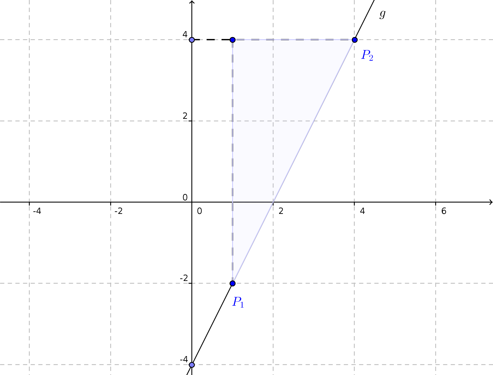

Ebenso lassen sich Ebenen als Verbindungsebenen dreier Punkte durch Determinantengleichungen beschreiben.

>**Satz 4.** Die Sätze 1, 2 und 3 gelten sinngemäß auch für Determinanten dritter Ordnung.

>**Definition 3.** Gegeben sei eine Matrix $A\in K^{3,3}$ mit Komponentendarstellung $$
  A=\left(a_{ij}\right)_{i=1,...,3,\; j=1,...,3}
$$ mit der Determinante dritter Ordnung $\det{A}\in K$.
>
>Dann bezeichnet $D_{ij}$ die gebildete *Unterdeterminante* zweiter Ordnung der aus $A$ durch Streichen der $i$-ten Zeile und der $j$-ten Spalte resultierenden Matrix.
>
> Der Ausdruck $$
  A_{ij}=(-1)^{i+j}\cdot D_{ij}
$$ heißt *algebraisches Komplement* von $a_{ij}$.

Es können insgesamt neun Unterdeterminanten zweiter Ordnung einer Matrix $A\in K^{3,3}$ gebildet werden. $$
  D_{11}\sim a_{11}\,,\quad D_{12}\sim a_{12}\,,\quad\ldots\quad, D_{33}\sim a_{33}
$$ Beispielsweise berechnen sich $$
  D_{23}=\det{\left(\begin{array}{rr} a_{11} & a_{12} \\ a_{31} & a_{32} \end{array}\right)}\quad\leftrightarrow\quad
  \begin{pmatrix} a_{11} & a_{12} & \textcolor{magenta}{a_{13}} \\ \textcolor{magenta}{a_{21}} & \textcolor{magenta}{a_{22}} & \textcolor{magenta}{a_{23}} \\ a_{31} & a_{32} & \textcolor{magenta}{a_{33}} \end{pmatrix}\quad\sim\quad a_{23}
$$ und somit $$
  A_{23}=(-1)^{2+3}\cdot D_{23}=-\det{\left(\begin{array}{rr} a_{11} & a_{12} \\ a_{31} & a_{32} \end{array}\right)}
$$

Die Determinante $\det{A}$ lässt sich durch algebraische Komplemente darstellen, beispielsweise $$
  \begin{array}{rcl}
    \det{A} & = &
      a_{11}\cdot (a_{22}\cdot a_{33}-a_{23}\cdot a_{32})+
      a_{12}\cdot (a_{23}\cdot a_{31}-a_{21}\cdot a_{33})+
      a_{13}\cdot (a_{21}\cdot a_{32}-a_{22}\cdot a_{31}) \\
      & = & a_{11}\cdot A_{11}+a_{12}\cdot A_{12}+a_{13}\cdot A_{13}
  \end{array}
$$ Man sagt, die Determinante ist entwickelt nach (den Komponenten) der ersten Zeile.

>**Satz 5.** Sei $A\in K^{3,3}$ mit Komponentendarstellung $$
  A=\begin{pmatrix} a_{ij} \end{pmatrix}_{i=1,...,3,\;j=1,...,3}
$$ und Determinante $\det{A}\in K$.
>
> Dann berechnet sich
>
>1. $$ \det{A}=\sum_{i=1}^3{(a_{ik}\cdot A_{ik})}\,,\quad k\in\{1,2,3\} $$ durch Entwicklung nach der $k$-ten Spalte.
>2. $$ \det{A}=\sum_{k=1}^3{(a_{ik}\cdot A_{ik})}\,,\quad i\in\{1,2,3\} $$ durch Entwicklung nach der $i$-ten Zeile.
>
>Diese Aussage wird **Entwicklungssatz von Laplace** genannt. (Ohne Nachweis.)

**Beispiel 6.** Gegeben ist die Matrix $$
  A=\begin{pmatrix} 1 & -5 & 3 \\ 4 & 0 & 2 \\ 3 & 6 & -7 \end{pmatrix}
$$
Durch Entwicklung von $\det{A}$ nach der ersten Zeile ergibt sich $$
  \begin{array}{rcl}
  \det{A} & = &
  1\cdot(-1)^{1+1}\cdot \det{\begin{pmatrix} 0 & 2 \\ 6 & -7 \end{pmatrix}}+
  (-5)\cdot(-1)^{1+2}\cdot \det{\begin{pmatrix} 4 & 2 \\ 3 & -7 \end{pmatrix}}+
  3\cdot(-1)^{1+3}\cdot \det{\begin{pmatrix} 4 & 0 \\ 3 & 6 \end{pmatrix}} \\ & = &
  -12+5\cdot(-34)+3\cdot 24 \\
  & = & -110
  \end{array}
$$ Wird hingegen beispielsweise nach der zweiten Spalte entwickelt, sind ~~nur~~ zwei Unterdeterminanten zweiter Ordnung von $A$ zu berechnen. $$
  \begin{array}{rcl}
  \det{A} & = &
  (-5)\cdot(-1)^{1+2}\cdot \det{\begin{pmatrix} 4 & 2 \\ 3 & -7 \end{pmatrix}} +
  0\cdot(-1)^{2+2}\cdot \det{\begin{pmatrix} 1 & 3 \\ 3 & -7 \end{pmatrix}} + 6\cdot(-1)^{3+2}\cdot \det{\begin{pmatrix} 1 & 3 \\ 4 & 2 \end{pmatrix}} \\ & = &
  5\cdot(-34)+0-6\cdot (-10) \\
& = & -110
\end{array}
$$

Eine Kontrolle des Ergebnisses kann unter Verwendung der Javascript Bibliothek [Algebrite](http://algebrite.org/) vorgenommen werden.

```javascript
A=[[1,-5,3],[4,0,2],[3,6,-7]]
det(A)
```
@Algebrite.eval


Determinanten $n$-ter Ordnung
=============================

Gegeben ist eine $n$-reihige Matrix $A\in K^{n,n}$ mit der Komponentendarstellung $$
 A=\left(
  \begin{array}{ccc} a_{11} & \ldots & a_{1n} \\ \vdots & \ddots & \vdots \\ a_{n1} & \ldots & a_{nn} \end{array}
 \right) = \left( a_{ij} \right)_{i=1,...,n,\; j=1,...,n}\quad\text{mit}\quad n\in\mathbb{N}\setminus\{0\}
$$ Es lässt sich rekursiv der Wert der Determinante $n$-ter Ordnung $\det{A}$ berechnen $$
  \det{A} =\sum_{j=1}^n{a_{1j}\cdot A_{1j}}=a_{11}\cdot A_{11}+a_{12}\cdot A_{12}+\ldots +a_{1n}\cdot A_{1n}
$$ worin $$
  A_{1j}=(-1)^{1+j}\cdot D_{1j}
$$  das algebraische Komplement zu $a_{1j}$ und $D_{1j}$ Unterdeterminante $(n-1)$-ter Ordnung sind.

**Beispiel 7.** Zu berechnen ist die nachstehende Determinante der Matrix $A$. $$
\det{\left(
  \begin{array}{rrrr}
   \textcolor{blue}{2} & \textcolor{blue}{1} & \textcolor{blue}{3} & \textcolor{blue}{0} \\ 1 & -1 & 4 & 4 \\ 4 & 2 & 4 & -2 \\ -1 & 3 & 1 & -1
  \end{array}
  \right)}
$$ Unter Anwendung des Laplaceschen Entwicklungssatzes bezogen auf die erste Zeile[^3] berechnet sich die Determinante $$
  \begin{array}{rcl}
  \det{A} & = & \textcolor{blue}{2}\cdot(-1)^{1+1}\cdot \det{\left(\begin{array}{rrr} -1 & 4 & 4 \\ 2 & 4 & -2 \\ 3 & 1 & -1\end{array}\right)}
  + \quad\textcolor{blue}{1}\cdot(-1)^{1+2}\cdot \det{\left(\begin{array}{rrr} 1 & 4 & 4 \\ 4 & 4 & -2 \\ -1 & 1 & -1\end{array}\right)} \\
  & + & \quad\textcolor{blue}{3}\cdot(-1)^{1+3}\cdot \det{\left(\begin{array}{rrr} 1 & -1 & 4 \\ 4 & 2 & -2 \\ -1 & 3 & -1\end{array}\right)}
  + \quad\textcolor{blue}{0}\cdot(-1)^{1+4}\cdot \det{\left(\begin{array}{rrr} 1 & -1 & 4 \\ 4 & 2 & 4 \\ -1 & 3 & 1\end{array}\right)} \\
  & = & -108-54+162 = 0
\end{array}
$$ Dieses Ergebnis bestätigt sich unter der Beobachtung dass für die Spaltenvektordarstellung von $$
  A=\begin{pmatrix} s_1 & s_2 & s_3 & s_4 \end{pmatrix}
$$ gilt $s_1+s_2-s_3+s_4=o$ (Nullvektor), die Spalten mithin linear abhängig sind.


Rechenregeln
------------

Für Determinanten $n$-ter Ordnung lassen sich die für $n=2$ und $n=3$ bekannten Rechenregeln beweisen.

>**Satz 6.** Gegeben sind eine $n$-reihige Matrix $A\in K^{n,n}$ mit der Spaltenvektordarstellung $$
  A=\left(
 \ldots \textcolor{magenta}{s_i}\ldots \textcolor{blue}{s_j}\ldots\,
 \right)\quad\text{wobei}\quad {s_i},{s_j}\in\mathbb{R}^n\quad\forall i,j\in\{1,\ldots,n\}
$$ sowie $\lambda,\nu\in K$. Es gelten:
>
>1. Die *Transposition* der Matrix $A\rightarrow A^\top$ transformiert die Determinante gemäß $$
  \det{A}=\det{A^\top}
$$
>2. Das *Vertauschen zweier Spalten* $$
  A\rightarrow\left(\ldots \textcolor{blue}{s_j}\ldots \textcolor{magenta}{s_i}\ldots\right)=:B
$$ transformiert die Determinante gemäß $$
  \det{A}=-\det{B}
$$
>3. Das *Addieren des Vielfachen einer anderen Spalte* $$
  A\rightarrow\left(\ldots \textcolor{magenta}{s_i}+\nu\cdot \textcolor{blue}{s_j}\ldots \textcolor{blue}{s_j}\ldots\right)=:C
$$ transformiert die Determinante gemäß $$
  \det{A}=\det{C}
$$
>4. Die *Vielfachbildung* einer Spalte $$
  A\rightarrow\left(\ldots \lambda\cdot\textcolor{magenta}{s_i}\ldots \textcolor{blue}{s_j}\ldots\right)=:D
$$ transformiert die Determinante gemäß $$
  \det{A}=\lambda\cdot\det{D}
$$
>5. Für die Matrix $A$ und jede weitere Matrix $B\in K^{n,n}$ gilt stets der Multiplikationssatz $$
  \det{(A\cdot B)}=\det{A}\cdot\det{B}
$$


Sicher gewusst
===============

Sie können Ihr Wissen gern bei der Beantwortung der nachstehenden Fragen testen.

**Frage 1.** Entscheiden Sie möglichst ohne direkte Berechnung, welche der nachstehenden Determinanten zweiter Ordnung Null beziehungsweise von Null verschieden ist.[^2]

[[$\det{A}=0$] [$\det{A}\not=0$]]
[( ) (X)]  $$ A=\begin{pmatrix} 2 & 1 \\ -1 & 2 \end{pmatrix} $$
[(X) ( )]  $$ A=\begin{pmatrix} 2 & 1 \\ 4 & 2 \end{pmatrix} $$
[[?]] Nutzen Sie zur Entscheidung Satz 1 sowie Beispiel 3.
****************************************

1. $$ \det{\begin{pmatrix} 2 & 1 \\ -1 & 2 \end{pmatrix}}\not=0 $$ da für die Zeilen- bzw. Spaltenvektoren gelten: $$
  \left\{\begin{pmatrix} 2 & 1 \end{pmatrix}, \begin{pmatrix} -1 & 2 \end{pmatrix}\right\}\quad\text{bzw.}\quad
  \left\{\begin{pmatrix} 2 \\ -1 \end{pmatrix}, \begin{pmatrix} 1 \\ 2 \end{pmatrix}\right\}
$$ sind jeweils linear unabhängig.
2. $$ \det{\begin{pmatrix} 2 & 1 \\ 4 & 2 \end{pmatrix}}=0 $$ da für die Zeilen- bzw. Spaltenvektoren gelten: $$
  \left\{\begin{pmatrix} 2 & 1 \end{pmatrix}, \begin{pmatrix} 4 & 2 \end{pmatrix}\right\}\quad\text{bzw.}\quad
  \left\{\begin{pmatrix} 2 \\ 4 \end{pmatrix}, \begin{pmatrix} 1 \\ 2 \end{pmatrix}\right\}
$$ sind jeweils linear abhängig.

****************************************

**Frage 2.** Gegeben sind die reellen zweireihigen Matrizen $A$, $B$ und $C$ sowie der Skalar $\lambda\in\mathbb{R}$ .

Entscheiden Sie, welche der folgenden Aussage korrekt bzw. falsch sind.

[[Wahr] [Falsch]]
[(X) ( )]  $$ \det{(\lambda\cdot A)}=\lambda^2\cdot \det{A} $$
[( ) (X)]  $$ \det{(\lambda\cdot A)}=\lambda\cdot \det{A} $$
[( ) (X)]  $$ \det{(A+B)}=\det{A}+\det{B} $$
[(X) ( )]  $$ \det{((A\cdot B)\cdot C)}=\det{A}\cdot\det{B}\cdot\det{C} $$
[[?]] Nutzen Sie die Regeln für das Rechnen mit Determinanten. Durch ein Gegenbeispiel kann nachgewiesen werden, dass eine Aussage falsch ist.
****************************************

Für die Gültigkeit der ersten Aussage kann die Spaltenvektordarstellung der Matrix $A$ genutzt werden $$
  \det{(\lambda\cdot A)}=\det{\begin{pmatrix} \lambda\cdot s_1 & \lambda\cdot s_2\end{pmatrix}}
  =\lambda\cdot\det{\begin{pmatrix} s_1 & \lambda\cdot s_2\end{pmatrix}}
  =\lambda^2\cdot\det{\begin{pmatrix} s_1 & s_2\end{pmatrix}}
  =\lambda^2\cdot\det{A}
$$ Die Determinante des $\lambda$-fachen einer ~~zweireihigen~~ Matrix ist gleich dem $\lambda^2$-fachen der Determinante von $A$. Die zweite Aussage ist in diesem Kontext also falsch für alle Parameter $\lambda\not\in\{0,1\}$. Siehe Satz 2 (3.) in diesem Abschnitt.

Die dritte Aussage ist falsch, wie man sofort erkennt für $A=E$ und $B=-E$ mit zweireihiger Einheitsmatrix $E$, denn $$
  0=\det{O}=\det{(E+(-E))}\not=\det{E}+\det{((-1)\cdot E)}=\det{E}+(-1)^2\cdot\det{E}=2
$$

Die Gültigkeit der letzten Aussage folgt sofort aus dem Multiplikationssatz für Determinanten unter Benutzung der Assoziativität des Matrixproduktes. Siehe Satz 3 in diesem Abschnitt.

****************************************

**Frage 3.** Berechnen Sie $$
  \det{\begin{pmatrix} \lambda & \lambda & \lambda \\ \lambda & \lambda & \lambda \\ \lambda & \lambda & \lambda \end{pmatrix}}
$$ in Abhängigkeit von $\lambda\in\mathbb{R}$.

[(X)] $0$
[( )] $\lambda$
[( )] $\lambda^2$
[[?]] Für die Matrix gilt nach Anwendung einer der Rechenregeln aus Satz 4 in diesem Abschnitt $$
  L=\begin{pmatrix} \lambda & \lambda & \lambda \\ \lambda & \lambda & \lambda \\ \lambda & \lambda & \lambda \end{pmatrix}=
  \lambda\cdot\begin{pmatrix} 1 & 1 & 1 \\ 1 & 1 & 1 \\ 1 & 1 & 1 \end{pmatrix}
$$
****************************************

---

Für die Matrix gilt nach Anwendung der Rechenregeln aus Satz 4 in diesem Abschnitt $$
  L=\begin{pmatrix} \lambda & \lambda & \lambda \\ \lambda & \lambda & \lambda \\ \lambda & \lambda & \lambda \end{pmatrix}=
  \lambda\cdot\begin{pmatrix} 1 & 1 & 1 \\ 1 & 1 & 1 \\ 1 & 1 & 1 \end{pmatrix}\quad\leadsto\quad
  \det{L}=\lambda^3\cdot\det{\begin{pmatrix} 1 & 1 & 1 \\ 1 & 1 & 1 \\ 1 & 1 & 1 \end{pmatrix}}=0\;\;\forall\;\lambda\in\mathbb{R}
$$ da die Spalten / Zeilen der Matrix identisch, und damit linear abhängig sind.

****************************************

[^1]: Bitte die Produkte $E=B\cdot A$ und $B\cdot b$ berechnen. Die Matrix $B$ wird im Fall ihrer Existenz zu $A$ *invers* genannt.

[^2]: Vergleiche Beispiel 1.

[^3]: Der Wert der Determinante ändert sich nicht, falls anstelle  der ersten Zeile nach $i$-ter Zeile bzw. $j$-ter Spalte entwickelt wird.


### Lineare Gleichungssysteme

In diesem Abschnitt werden Systeme von linearen Gleichungen der Form $$
  \begin{array}{rrrrrrrrr}
    a_{11}\cdot x_1 & + & a_{12}\cdot x_2 & + & ... & + & a_{1n}\cdot x_n & = & b_1 \\
    a_{21}\cdot x_1 & + & a_{22}\cdot x_2 & + & ... & + & a_{2n}\cdot x_n & = & b_2 \\
    & & & & & & & \vdots & \\
    a_{m1}\cdot x_1 & + & a_{m2}\cdot x_2 & + & ... & + & a_{mn}\cdot x_n & = & b_m
  \end{array}
$$ in den Unbekannten $x_1$, $x_2$, ..., $x_n$ untersucht. Für die Koeffizienten gelten $a_{ij}\in\mathbb{R}$ sowie $b_i\in\mathbb{R}$ für jede Wahl von $i\in\{1,2,...,m\}$ und $j\in\{1,2,...,n\}$. Die natürlichen Zahlen $m$ beziehungsweise $n$ bezeichnen die Anzahl der Gleichungen beziehungsweise die Anzahl der Unbekannten des Gleichungssystems, $(m,n)$ wird dessen Typ genannt.

Die grundlegenden, aus der Schulmathematik bekannten Begriffe werde kurz in nachstehendem Video erklärt.

!?[Gleichungssystem](https://www.youtube.com/watch?v=6H8WVGIc2Qs)

Das vorstehende System von Gleichungen lässt sich unter Benutzung eines Matrixproduktes in *Matrixform* darstellen $$
  \begin{pmatrix} a_{11} & ... & a_{1n} \\ \vdots & & \vdots \\ a_{m1} & ... & a_{mn} \end{pmatrix}\cdot
  \begin{pmatrix} x_1 \\ \vdots \\ x_n \end{pmatrix}=
  \begin{pmatrix} b_1 \\ \vdots \\ b_m \end{pmatrix}
$$ worin $$
  A=\begin{pmatrix} a_{11} & ... & a_{1n} \\ \vdots & & \vdots \\ a_{m1} & ... & a_{mn} \end{pmatrix}\in\mathbb{R}^{m,n}\,,\quad
  x=\begin{pmatrix} x_1 \\ \vdots \\ x_n \end{pmatrix}\in\mathbb{R}^{n,1}\,,\quad
  b=\begin{pmatrix} b_1 \\ \vdots \\ b_m \end{pmatrix}\in\mathbb{R}^{m,1}
$$ Koeffizientenmatrix beziehungsweise Lösungsvektor beziehungsweise Vektor der Absolutglieder bezeichnen. Für die Untersuchung des Gleichungssystems und der Berechnung der Lösung wird die Matrix $$
  (A|b)=\begin{pmatrix} a_{11} & ... & a_{1n} & \textcolor{magenta}{b_1} \\ \vdots & & \vdots \\ a_{m1} & ... & a_{mn} & \textcolor{magenta}{b_m} \end{pmatrix}\in\mathbb{R}^{m,n+1}
$$ verwendet, die *erweiterte Koeffizientenmatrix* genannt wird.

>**Definition 1.** Das reelle System linearer Gleichungen $A\cdot x=b$ heißt
>
>1. *homogen*, falls $b=o$ (Nullvektor)
>2. *inhomogen*, falls $b\not=o$ ist.

Die Unterscheidung zwischen homogenen und inhomogenen linearen Gleichungssystemen ist in nachfolgendem Video anhand von Beispielen erläutert.

!?[Homogen versus inhomogen](https://www.youtube.com/watch?v=oIQ_V8nfmi4)


Gleichungssysteme vom Typ $(n,n)$
=================================

>**Definition 2.** Existiert zu einer Matrix $A\in K^{n,n}$ eine Matrix $A^{-1}$ mit $$
  A^{-1}\cdot A=A\cdot A^{-1}=E
$$ ($n$-reihige Einheitsmatrix), so heißt $A^{-1}$ *inverse Matrix* zu $A$.

>**Satz 1.** Existiert die inverse Matrix $A^{-1}$ zu $A\in K^{n,n}$, so berechnet sich $$
  A^{-1}=\frac{1}{\det{A}}\cdot\begin{pmatrix} A_{11} & ... & A_{1n} \\ \vdots & \ddots & \vdots \\ A_{n1} & ... & A_{nn} \end{pmatrix}^\top
$$ mit algebraischen Komplementen $A_{ij}$ zu den Komponenten $a_{ij}$ von $A$.

Am Faktor $(\det{A})^{-1}$ in Satz 1 ist zu erkennen, dass die inverse Matrix zu einer gegebenen Matrix $A\in K^{n,n}$ dann und nur dann existiert, wenn $\det{A}\not=0$.

>**Definition 3.** Eine Matrix $A\in K^{n,n}$ heißt *regulär*, falls $\det{A}\not=0$, für $\det{A}=0$ hingegen *singulär*.

**Beispiel 1.** Gegeben sind die reellen Matrizen $$
  A=\begin{pmatrix} 1 & -5 & 3 \\ 4 & 0 & 2 \\ 3 & 6 & -7 \end{pmatrix}\quad\text{und}\quad
  B=\begin{pmatrix} 1 & -5 & 3 \\ 4 & 0 & -7 \\ 3 & 5 & -10 \end{pmatrix}
$$ Die Determinanten der Matrizen berechnen sich $$
  \det{A}=-110\quad\text{und}\quad \det{B}=0
$$ Matrix $A$ ist also regulär und besitzt eine inverse Matrix $A^{-1}$, Matrix $B$ ist hingegen singulär: ihre inverse Matrix existiert nicht.

Die algebraischen Komplemente $A_{ij}$ zu den Komponenten $a_{ij}$ von $A$ berechnen sich einzeln $$
  A_{11}=(-1)^{1+1}\cdot\det{\begin{pmatrix} 0 & 2 \\ 6 & -7 \end{pmatrix}}=-12\,,\quad
  A_{12}=(-1)^{1+2}\cdot\det{\begin{pmatrix} 4 & 2 \\ 3 & -7 \end{pmatrix}}=34\,,\quad
  A_{13}=(-1)^{1+3}\cdot\det{\begin{pmatrix} 4 & 0 \\ 3 & 6 \end{pmatrix}}=24
$$ für den Zeilenindex $i=1$ sowie $$
  A_{21}=(-1)^{2+1}\cdot\det{\begin{pmatrix} -5 & 3 \\ 6 & -7 \end{pmatrix}}=-17\,,\quad
  A_{22}=(-1)^{2+2}\cdot\det{\begin{pmatrix} 1 & 3 \\ 3 & -7 \end{pmatrix}}=-16\,,\quad
  A_{23}=(-1)^{2+3}\cdot\det{\begin{pmatrix} 1 & -5 \\ 3 & 6 \end{pmatrix}}=-21
$$ für den Zeilenindex $i=2$ und schließlich $$
  A_{31}=(-1)^{3+1}\cdot\det{\begin{pmatrix} -5 & 3 \\ 0 & 2 \end{pmatrix}}=-10\,,\quad
  A_{32}=(-1)^{3+2}\cdot\det{\begin{pmatrix} 1 & 3 \\ 4 & 2 \end{pmatrix}}=10\,,\quad
  A_{33}=(-1)^{3+3}\cdot\det{\begin{pmatrix} 1 & -5 \\ 4 & 0 \end{pmatrix}}=20
$$ Die inverse Matrix $A^{-1}$ berechnet sich damit $$
  A^{-1}=\frac{1}{-110}\cdot
  \begin{pmatrix}
    -12 & 34 & 24 \\ -17 & -16 & -21 \\ -10 & 10 & 20
  \end{pmatrix}^\top=
  \frac{1}{-110}\cdot\left(
  \begin{array}{rrr}
    -12 & -17 & -10 \\ 34 & -16 & 10 \\ 24 & -21 & 20
  \end{array}\right)
$$

Eine Berechnung der inversen Matrix $A^{-1}$ kann unter Verwendung der Javascript Bibliothek [Algebrite](http://algebrite.org/) vorgenommen werden.

```javascript
A=[[1,-5,3],[4,0,2],[3,6,-7]]
det(A)
adj(A)
cofactor(A,1,2)
1/det(A)*adj(A)[1][1]
inv(A)-1/det(A)*adj(A)
```
@Algebrite.eval

>**Satz 2.** Gegeben ist ein System linearer Gleichungen $A\cdot x=b$ vom Typ $(n,n)$ mit dem Lösungsvektor $x\in K^{n,1}$.
>
>Ist die Koeffizientenmatrix $A$ regulär, so besitzt des Gleichungssystem genau die Lösung $x=A^{-1}\cdot b$.

Ist die Koeffizientenmatrix $A$ singulär, so besitzt das Gleichungssystem entweder keine oder unendlich viele Lösungen. Siehe Beispiel 1 im Abschnitt [Determinanten](#Determinanten). (Nachweis später)

**Beweis.** Ist die Koeffizientenmatrix $A$ regulär, so existiert die zu $A$ inverse Matrix $A^{-1}$. Damit berechnet sich der Lösungsvektor gemäß $$
  x=\textcolor{magenta}{A^{-1}}\cdot A\cdot x=\textcolor{magenta}{A^{-1}}\cdot b
$$ ist also eindeutig bestimmt. $\square$

**Beispiel 2.** Gegeben ist ein System linearer Gleichungen $A\cdot x=b$ vom Typ $(4,4)$ mit $$
  A=\begin{pmatrix} 1 & -2 & 0 & -1 \\ 4 & 1 & 1 & 1 \\ 1 & -2 & 1 & 3 \\ 0 & -1 & 4 & 4 \end{pmatrix}\,,\quad
  x=\begin{pmatrix} x_1 \\ x_2 \\ x_3 \\ x_4 \end{pmatrix}\,,\quad
  b=\begin{pmatrix} 107 \\ 214 \\ 0 \\ 321 \end{pmatrix}
$$ Zu berechnen ist die Menge aller Lösungen dieses Gleichungssystems.

1. Die Determinante der Koeffizientenmatrix $A$ berechnet sich $\det{A}=-107$, $A$ ist also regulär und besitzt eine inverse Matrix. Diese berechnet sich $$
  A^{-1}=-\frac{1}{107}\cdot\begin{pmatrix} 10 & 23 & 5 & -7 \\ -32 & 12 & -16 & 1 \\ 25 & 4 & -41 & 36 \\ -33 & -1 & 37 & -9 \end{pmatrix}
$$ Bitte nachrechnen.
2. Das System linearer Gleichungen besitzt nach Satz 2 die eindeutige Lösung $$
  x=A^{-1}\cdot b= -\frac{1}{107}\cdot\begin{pmatrix} 10 & 23 & 5 & -7 \\ -32 & 12 & -16 & 1 \\ 25 & 4 & -41 & 36 \\ -33 & -1 & 37 & -9 \end{pmatrix}\cdot \begin{pmatrix} 107 \\ 214 \\ 0 \\ 321 \end{pmatrix}=
  \begin{pmatrix} 35 \\ -5 \\ 141 \\ -62 \end{pmatrix}
$$ kann also durch ein Matrixprodukt berechnet werden.

Eine Berechnung der Lösung des Gleichungssystems kann unter Verwendung der Javascript Bibliothek [Algebrite](http://algebrite.org/) vorgenommen werden.

```javascript
A=[[1,-2,0,-1],[4,1,1,1],[1,-2,1,3],[0,-1,4,4]]
b=[107,214,0,321]
det(A)
B=inv(A)
inner(B,b)
```
@Algebrite.eval

**Beispiel 3.** Zu berechnen sind die elektrischen Stromstärken $I_1$, $I_2$, $I_3$ in einer kombinierten Reihen- und Parallelschaltung: Die Bauelemente $2$ und $3$ sind untereinander parallel und zum Bauelement $1$ in Reihe geschaltet.[^1]

Es bezeichnen mit $i\in\{1,2,3\}$:

1. $R_i$ den elektrischen Widerstand der Bauelemente.
2. $U_i$ die elektrische Spannung am jeweiligen Bauelement
3. $I_i$ die elektrische Stromstärke durch das Bauelement


Es gelten nach dem Ohmschen Gesetzt $$
  U_i=R_i\cdot I_i\,,\quad i\in\{1,2,3\}
$$

Die Berechnung der elektrischen Stromstärken kann nach den folgenden Schritten erfolgen:

1. Aufstellen eines Systems linearer Gleichungen. $$
  \begin{array}{lllllll}
    I_1 & - & I_2 & - & I_3 & = & 0 \\
    R_1\cdot I_1 & + & R_2\cdot I_2 & & & = & U \\
    & & R_2\cdot I_2 & - & R_3\cdot I_3 & = & 0
  \end{array}
$$ Die sind drei lineare Gleichungen in den Unbekannten $I_1$, $I_2$ und $I_3$.
2. Schreibe das Gleichungssystem in Matrixform $A\cdot x= b$ mit $$
  A=\left(\begin{array}{lll}
    1 & -1 & -1 \\ R_1 & R_2 & 0 \\ 0 & R_2 & -R_3
  \end{array}\right)\,,\quad
  x=\left(\begin{array}{c}
    I_1 \\ I_2 \\ I_3
  \end{array}\right)\,,\quad
  b=\left(\begin{array}{r}
    0 \\ U \\ 0
  \end{array}\right)
$$
3. Berechne die inverse Matrix $ A^{-1}$ der Koeffizientenmatrix $A$ $$
  A^{-1}=\frac{1}{\lambda}\left(\begin{array}{ccc}
  -R_2\cdot R_3 & -(R_2+R_3) & R_2 \\ R_1\cdot R_3 & -R_3 & -R_1 \\ R_1\cdot R_2 & -R_2 & R_1+R_2
  \end{array}\right)
$$ mit $$ \lambda=-(R_1\cdot R_2+R_2\cdot R_3+R_1\cdot R_3)=\det{A} $$
4. Für $\det A\not=0$ ist dann $$
  x=\left(\begin{array}{c}
    I_1 \\ I_2 \\ I_3
  \end{array}\right)=
  A^{-1} b=-\frac{1}{R_1\cdot R_2+R_2\cdot R_3+R_1\cdot R_3}\cdot
  \left(\begin{array}{c}
    -(R_2+R_3)\cdot U \\ -R_3\cdot U \\ -R_2\cdot U
  \end{array}\right)
$$ die einzige Lösung von $A\cdot x= b$.


Gleichungssysteme vom Typ $(m,n)$
=================================

Da die Koeffizientenmatrix $A$ eines Systems linearer Gleichungen vom Typ $(m,n)$ für $m\not=n$ nicht invertierbar ist, ist hier ein anderes Lösungsverfahren zu entwickeln, dass sich auf den allgemeinen Fall $(m,n)$ anwenden lässt: Im Folgenden wird das nach Carl Friedrich Gauß benannte [Gaußsche Eliminationsverfahren[^2]](https://de.wikipedia.org/wiki/Gau%C3%9Fsches_Eliminationsverfahren) eingeführt.

Ziel des Verfahrens ist es, ein Gleichungssystem der Form $A\cdot x=b$ in ein Gleichungssystem $A^\star\cdot x=b^\star$ überzuführen, ohne die Lösungsmenge zu ändern. Die Umformungsschritte werden so gewählen, dass die Koeffizientenmatrix eine sogenannte *Stufenform* besitzt $$
  A^\star=\begin{pmatrix}
  a_{11}^\star & a_{12}^\star & ... & a_{1n}^\star \\
  0 & a_{22}^\star & ... & a_{2n}^\star \\
  \vdots & \ddots & \ddots & \vdots \\
  0 & 0 & ... & a_{nn}^\star
  \end{pmatrix}\in K^{n,n}\quad\text{bzw.}\quad
  A^\star=\begin{pmatrix}
  a_{11}^\star & a_{12}^\star & & ... & a_{1n}^\star \\
  0 & \ddots & & ... & \vdots \\
  0 & \ddots & a_{rr}^\star & ... & a_{rn}^\star \\
  0 & ... & 0 & ... & 0 \\
  \vdots & & \vdots & & \vdots \\
  0 & ... & 0 & ... & 0
  \end{pmatrix}\in K^{m,n}
$$ d. h. eine (obere) Dreiecksmatrix ist oder Trapezform besitzt. Für die Komponenten ist $a_{ii}\not=0$ für alle $i\in\{1,...,n\}$ im Fall der Dreiecksmatrix beziehungsweise für alle $i\in\{1,...,r\}$ im Fall der Trapezform zu fordern.

<!-- style="background-color: lightgray;"-->
>Elementare Umformungsschritte sind nachstehend aufgeführt. Diese ändern einsichtig nicht die Lösungsmenge eines Systems linearer Gleichungen, führen also zu äquivalenten Umformungen.
>
>1. *Vertauschen zweier Gleichungen*. Hierdurch vertauschen sich die entsprechenden Zeilen der Koeffizientenmatrix $A$ $$
  A=\begin{pmatrix} ... & \textcolor{blue}{z_k} & ... & \textcolor{magenta}{z_l} & ... \end{pmatrix}^\top\quad\to\quad
  A'=\begin{pmatrix} ... & \textcolor{magenta}{z_l} & ... & \textcolor{blue}{z_k} & ... \end{pmatrix}^\top
$$ und in gleicher Weise der erweiterten Koeffizientenmatrix $(A|b)$.
>2. *Multiplizieren einer Gleichung mit einem Skalar* $\lambda\in K\setminus\{0\}$. Hierdurch werden die Komponenten der entsprechenden Zeile von $A$ mit dem Faktor $\lambda$ multipliziert. $$
  A=\begin{pmatrix} ... & \textcolor{blue}{z_k} & ... \end{pmatrix}^\top\quad\to\quad
  A'=\begin{pmatrix} ... & \textcolor{blue}{\lambda\cdot z_k} & ... \end{pmatrix}^\top
$$ und in gleicher Weise für die erweiterte Koeffizientenmatrix $(A|b)$ .
>3. *Addieren des $\lambda$-fachen einer anderen Gleichung*. Hierdurch werden die Komponenten der Zeile und die $\lambda$-fachen der entsprechenden Komponenten der (anderen!) Zeile addiert. $$
  A=\begin{pmatrix} ... & \textcolor{blue}{z_k} & ... & \textcolor{magenta}{z_l} & ... \end{pmatrix}^\top\quad\to\quad
  A'=\begin{pmatrix} ... & \textcolor{blue}{z_k}+\textcolor{magenta}{\lambda\cdot z_l} & ... & \textcolor{magenta}{z_l} & ... \end{pmatrix}^\top
$$
>
>Die aufgeführten Umformungen der Gleichungen lassen sich also als Zeilenumformungen der Koeffizientenmatrix $A$ und erweiterten Koeffizientenmatrix $(A|b)$ darstellen und werden aus diesem Blick heraus auch **elementare Zeilenumformungen** genannt.

In der gestuften Form kann das Gleichungssystem schrittweise "von unten noch oben" nach den Variablen $x_r$, $x_{r-1}$, ..., $x_1$ gelöst werden.

**Beispiel 4.** Mit Hilfe des Gauß-Verfahrens ist die Lösungsmenge des nachstehenden Systems linearer Gleichungen $A\cdot x=b$ zu berechnen, worin $$
  A=\begin{pmatrix} 1 & 2 & -2 \\ 2 & 3 & 0 \\ 2 & 1 & 8 \end{pmatrix}\,,\quad
  x=\begin{pmatrix} x_1 \\ x_2 \\ x_3 \end{pmatrix}\,,\quad
  b=\begin{pmatrix} 7 \\ 0 \\ -28 \end{pmatrix}
$$ Dies ist ein inhomogenes Gleichungssystem.

1. Die Determinante der Koeffizientenmatrix $A$ berechnet sich unter Benutzung der Rechenregeln für Determinanten und des Entwicklungssatzes nach Laplace (angewendet auf die dritte Spalte) $$
  \det{\begin{pmatrix} 1 & 2 & -2 \\ 2 & 3 & 0 \\ 2 & 1 & 8 \end{pmatrix}}\stackrel{Z_3+4\cdot Z_1\to Z_3}{=}
  \det{\begin{pmatrix} 1 & 2 & -2 \\ 2 & 3 & 0 \\ 6 & 9 & 0 \end{pmatrix}}=(-2)\cdot(-1)^{1+3}\det{\begin{pmatrix} 2 & 3 \\ 6 & 9 \end{pmatrix}}=0
$$ d. h. $A$ ist singulär.
2. Unter Benutzung der erweiterten Koeffizientenmatrix wird das Gauß-Verfahren zur Berechnung der Lösung des Gleichungssystems angewendet. $$
  (A|\textcolor{magenta}{b})=
  \begin{pmatrix} 1 & 2 & -2 & \textcolor{magenta}{7} \\ 2 & 3 & 0 & \textcolor{magenta}{0} \\ 2 & 1 & 8 & \textcolor{magenta}{-28} \end{pmatrix}\stackrel{Z_2-2\cdot Z_1\to Z_2}{\to}
  \begin{pmatrix} 1 & 2 & -2 & \textcolor{magenta}{7} \\ 0 & -1 & 4 & \textcolor{magenta}{-14} \\ 2 & 1 & 8 & \textcolor{magenta}{-28} \end{pmatrix}\stackrel{Z_3-2\cdot Z_1\to Z_3}{\to}
  \begin{pmatrix} 1 & 2 & -2 & \textcolor{magenta}{7} \\ 0 & -1 & 4 & \textcolor{magenta}{-14} \\ 0 & -3 & 12 & \textcolor{magenta}{-42} \end{pmatrix}\stackrel{Z_3-3\cdot Z_2\to Z_3}{\to}
  \begin{pmatrix} 1 & 2 & -2 & \textcolor{magenta}{7} \\ 0 & -1 & 4 & \textcolor{magenta}{-14} \\ 0 & 0 & 0 & \textcolor{magenta}{0} \end{pmatrix}=(A^\star|\textcolor{magenta}{b^\star})
$$
3. Die Stufenform der erweiterten Koeffizientenmatrix gestattet das schrittweise Lösen nach den Lösungsvariablen. Die Gleichung zur zweiten Zeile (die dritte Zeile ist eine Nullzeile) besitzt das *Pivot* $a_{22}^\star=-1$ und kann somit nach $x_2$ gelöst werden $$
  x_2=\frac{1}{-1}\cdot(-14-4\cdot x_3)=14+4\cdot x_3
$$ Die Lösung ist abhängig von $x_3$. Die erste Gleichung besitzt das Pivot $a_{11}^\star=1$ und lässt sich nach $x_1$ lösen. Hierfür ist die Lösung $x_2$ einzusetzen. $$
  x_1=7-2\cdot x_2+2\cdot x_3=7-2\cdot(14+4\cdot x_3)+2\cdot x_3=-21-6\cdot x_3
$$ In den Lösungen $x_1$ und $x_2$ kann $x_3$ beliebig (aber gleich!) gewählt werden. Wird $x_3=\lambda\in\mathbb{R}$ als reeller Lösungsparameter verwendet, lässt sich die Lösung angeben gemäß $$
  \begin{pmatrix} x_1 \\ x_2 \\ x_3 \end{pmatrix}=
  \begin{pmatrix} -21 \\ 14 \\ 0 \end{pmatrix}+\lambda\cdot
  \begin{pmatrix} -6 \\ 4 \\ 1 \end{pmatrix}
$$ Die Lösung entspricht also der Punktmenge einer Geraden in $\mathbb{R}^3$. Die Lösung enthält einen freien reellen Lösungsparameter $\lambda$.

An einfachen Beispielen ist in folgenden Videos die Berechnung der Lösungsmenge eines linearen Gleichungssystems mithilfe des Gauß-Verfahrens vorgeführt. Genutzt werden elementare Gleichungsumformungen.

!?[Gauß1](https://www.youtube.com/watch?v=1IBuhdLyCdA)

!?[Gauß2](https://www.youtube.com/watch?v=8Uut7RAnqEI)

In den folgenden Videos wird das Gauß-Verfahren unter Nutzung der erweiterten Koeffizientenmatrix durchgeführt.

!?[Gauß3](https://www.youtube.com/watch?v=c8ofg4ZxnVM)

!?[Gauß4](https://www.youtube.com/watch?v=yJ2LHr5YPYM)


Gauß-Jordan-Verfahren
=====================

Das Gauß-Verfahren kann - in erweiterter Form - zur Berechnung der inversen Matrix zu einer gegebenen Matrix $A$ verwendet werden. Hierfür ist das Gleichungssystem durch einen zusätzlichen Umformungsschritt auf die reduzierte Stufenform zu transformieren (Komponenten "oberhalb" der Elemente $a_{ii}\not=0$ zu Null umformen). Dieses Verfahren wird **Gauß-Jordan-Verfahren** genannt. $$
  A\cdot X=E\quad A\in K^{n,n},\; X\in K^{n,n},\; E\in K^{n,n}
$$ worin $A$ die zu invertierende Matrix, $X$ die Lösungsmatrix und $E$ die $n$-reihige Einheitsmatrix bezeichnen. Durch Multiplikation von links mit $A^{-1}$ berechnet sich daraus $$
  X=\textcolor{magenta}{A^{-1}}\cdot A\cdot X=\textcolor{magenta}{A^{-1}}\cdot E\quad\leftrightarrow\quad
  E\cdot X=A^{-1}
$$ Die zugehörigen erweiterten Koeffizientenmatrizen sind $$
  (A|E)\quad\leftrightarrow\quad (E|A^{-1})
$$

Hieraus ergibt sich folgendes Verfahren:

1. Bilde die Matrix $\left({A}\vert{E}\right)$ vom Typ $(n,2n)$ mit $$
  \left({A}\vert\textcolor{blue}{{E}}\right)=\left(
  \begin{array}{rrrr|rrrr}
      a_{11} & a_{12} & \ldots & a_{1n} & \textcolor{blue}{1} & \textcolor{blue}{0} & \textcolor{blue}{\ldots} & \textcolor{blue}{0} \\
      a_{21} & a_{22} & \ldots & a_{2n} & \textcolor{blue}{0} & \textcolor{blue}{1} & \textcolor{blue}{\ldots} & \textcolor{blue}{0} \\
      \vdots & \vdots & \ddots & \vdots & \textcolor{blue}{\vdots} & \textcolor{blue}{\vdots} & \textcolor{blue}{\ddots} & \textcolor{blue}{\vdots} \\
      a_{n1} & a_{n2} & \ldots & a_{nn} & \textcolor{blue}{0} & \textcolor{blue}{0} & \textcolor{blue}{\ldots} & \textcolor{blue}{1}
  \end{array}\right)
$$
2. Durch elementare Zeilenumformungen in $\left({A}\vert{E}\right)$ wird diese schrittweise auf die Form $\left({E}\vert{B}\right)$ umgeformt. Die Matrix[^3] am ursprünglichen Platz von ${E}$ ist ${B}={A}^{-1}$. Umformungsschritte sind:

* Vertauschen zweier Zeilen der Matrix
* Multiplikation einer Zeile mit $\lambda\in\mathbb{R}^\star$
* Addieren eines reellen Vielfachen einer Zeile zu einer anderen Zeile

**Beispiel 5.** Die inverse Matrix zu $$
  A=\begin{pmatrix} 1 & 1 & 2 \\ 1 & 0 & -1 \\ 1 & 0 & -2 \end{pmatrix}
$$ ist unter Nutzung des Gauss-Jordan-Verfahrens zu berechnen.

1. Forme ${\left(A|E\right)}$ schrittweise um, so dass erste Spalte zu $\left(\begin{array}{rrr} 1 & 0 & 0 \end{array}\right)^\top$ wird $$
  \left(\begin{array}{rrr|rrr}
    1 & 1 & 2 & 1 & 0 & 0 \\ 1 & 0 & -1 & 0 & 1 & 0 \\ 1 & 0 & -2 & 0 & 0 & 1
  \end{array}\right)\xrightarrow{\tiny{(Z_2-Z_1)\rightarrow Z_2}}
  \left(\begin{array}{rrr|rrr}
    1 & 1 & 2 & 1 & 0 & 0 \\ 0 & -1 & -3 & -1 & 1 & 0 \\ 1 & 0 & -2 & 0 & 0 & 1
  \end{array}\right)\xrightarrow{\tiny{(Z_3-Z_1)\rightarrow Z_3}}
  \left(\begin{array}{rrr|rrr}
    \textcolor{blue}{1} & 1 & 2 & 1 & 0 & 0 \\ \textcolor{blue}{0} & -1 & -3 & -1 & 1 & 0 \\ \textcolor{blue}{0} & -1 & -4 & -1 & 0 & 1
  \end{array}\right)
$$
2. Zusätzlich die zweite Spalte zu $\left(\begin{array}{rrr} 0 & 1 & 0 \end{array}\right)^\top$ $$
  \left(\begin{array}{rrr|rrr}
    \textcolor{blue}{1} & 1 & 2 & 1 & 0 & 0 \\ \textcolor{blue}{0} & -1 & -3 & -1 & 1 & 0 \\ \textcolor{blue}{0} & -1 & -4 & -1 & 0 & 1
  \end{array}\right)\xrightarrow{\tiny{\begin{array}{r}(Z_1+Z_2)\rightarrow Z_1\\ (Z_3-Z_2)\rightarrow Z_3\\ (-1)\cdot Z_2\rightarrow Z_2 \end{array}}}
  \left(\begin{array}{rrr|rrr}
    \textcolor{blue}{1} & \textcolor{red}{0} & -1 & 0 & 1 & 0 \\ \textcolor{blue}{0} & \textcolor{red}{1} & 3 & 1 & -1 & 0 \\ \textcolor{blue}{0} & \textcolor{red}{0} & -1 & 0 & -1 & 1
  \end{array}\right)
$$
3. Zusätzlich die dritte Spalte zu $\left(\begin{array}{rrr} 0 & 0 & 1 \end{array}\right)^\top$. $$
  \left(\begin{array}{rrr|rrr}
    \textcolor{blue}{1} & \textcolor{red}{0} & -1 & 0 & 1 & 0 \\ \textcolor{blue}{0} & \textcolor{red}{1} & 3 & 1 & -1 & 0 \\ \textcolor{blue}{0} & \textcolor{red}{0} & -1 & 0 & -1 & 1
  \end{array}\right)\xrightarrow{\tiny \begin{array}{r} (Z_1-Z_3)\rightarrow Z_1\\ (Z_2+3\cdot Z_3)\rightarrow Z_2\\ (-1)Z_3\rightarrow Z_3 \end{array}}
  \left(\begin{array}{rrr|rrr}
    \textcolor{blue}{1} & \textcolor{red}{0} & \textcolor{cyan}{0} & 0 & 2 & -1 \\ \textcolor{blue}{0} & \textcolor{red}{1} & \textcolor{cyan}{0} & 1 & -4 & 3 \\ \textcolor{blue}{0} & \textcolor{red}{0} & \textcolor{cyan}{1} & 0 & 1 & -1
  \end{array}\right)
$$  Die inverse Matrix ${A}^{-1}$ ergibt sich als Untermatrix in ${\left(E|A^{-1}\right)}$.

**Beispiel 6.** Das Gauß-Jordan-Verfahren zur Bestimmung der inversen Matrix führt bei einer singulären Matrix nicht zum Ziel, da für diese Matrix keine inverse Matrix existiert.

Für die Matrix $$
  A=\begin{pmatrix} 1 & 1 & 2 \\ 1 & 0 & -1 \\ 2 & 1 & 1 \end{pmatrix}
$$ ist $\det{A}=0$, d. h. $A$ ist singulär.

1. Forme ${\left(A|E\right)}$ schrittweise um, so dass erste Spalte zu $\left(\begin{array}{rrr} 1 & 0 & 0 \end{array}\right)^\top$ wird $$
  \left(\begin{array}{rrr|rrr}
    1 & 1 & 2 & 1 & 0 & 0 \\ 1 & 0 & -1 & 0 & 1 & 0 \\ 2 & 1 & 1 & 0 & 0 & 1
  \end{array}\right)\xrightarrow{\tiny{(Z_2-Z_1)\rightarrow Z_2}}
  \left(\begin{array}{rrr|rrr}
    1 & 1 & 2 & 1 & 0 & 0 \\ 0 & -1 & -3 & -1 & 1 & 0 \\ 2 & 1 & 1 & 0 & 0 & 1
  \end{array}\right)\xrightarrow{(Z_3-2\cdot Z_1)\rightarrow Z_3}
  \left(\begin{array}{rrr|rrr}
    \textcolor{blue}{1} & 1 & 2 & 1 & 0 & 0 \\ \textcolor{blue}{0} & -1 & -3 & -1 & 1 & 0 \\ \textcolor{blue}{0} & -1 & -3 & -2 & 0 & 1
  \end{array}\right)
$$
2. Zusätzlich die zweite Spalte zu $\left(\begin{array}{rrr} 0 & 1 & 0 \end{array}\right)^\top$ $$
  \left(\begin{array}{rrr|rrr}
    \textcolor{blue}{1} & 1 & 2 & 1 & 0 & 0 \\ \textcolor{blue}{0} & -1 & -3 & -1 & 1 & 0 \\ \textcolor{blue}{0} & -1 & -3 & -2 & 0 & 1
  \end{array}\right)\xrightarrow{\tiny{\begin{array}{r} (Z_1+Z_2)\rightarrow Z_1\\ (Z_3-Z_2)\rightarrow Z_3\\ (-1)\cdot Z_2\rightarrow Z_2 \end{array}}}
  \left(\begin{array}{rrr|rrr}
    \textcolor{blue}{1} & \textcolor{magenta}{0} & -1 & 0 & 1 & 0 \\ \textcolor{blue}{0} & \textcolor{magenta}{1} & 3 & 1 & -1 & 0 \\ \textcolor{blue}{0} & \textcolor{magenta}{0} & \textcolor{red}{0} & -1 & -1 & 1
  \end{array}\right)
$$
3. ~~Aber~~: Mittels Zeilenumformungen lässt sich dritte Spalte nicht zusätzlich zu $$
  \left(\begin{array}{rrr} 0 & 0 & 1 \end{array}\right)^\top
$$ umformen, d. h. ${A}$ lässt sich nicht vollständig zu $\mathrm{diag}(1,1,1)$ umformen.

~~Damit~~: Das Gauß-Jordan-Verfahren führt nicht zum Ziel: ${A}^{-1}$ zu ${A}$ existiert nicht.

Ein weiteres Beispiel zur Nutzung des Gauß-Jordan-Verfahrens zur Berechnung der Inversen einer Matrix ist im nachtehenden Video erläutert.

!?[Inverse1](https://www.youtube.com/watch?v=YGnCxuE2LKg)

Die Berechnung der inversen Matrix einer regulären Matrix vom Typ $(2,2)$ als Lösung eines linearen Gleichungssystems vom Typ $(4,4)$ ist im nachfolgenden Video durchgeführt.

!?[Inverse2](https://www.youtube.com/watch?v=AFKJmlZ8kTQ)


Lösungsverhalten eines linearen Gleichungssystems
=================================================

Für die Untersuchung des Lösungsverhaltens wird ein allgemeines System linearer Gleichungen $A\cdot x=b$ vom Typ $(m,n)$ vorausgesetzt, dass durch Anwendung etwa des Gaußschen Eliminationsverfahrens in gestufter Form $(\star)$ vorliegt. Die erweiterte Koeffizientenmatrix $(A|b)$ des Gleichungssystems besitz die nachstehende Gestalt $$
  \left(A^\star\vert\textcolor{blue}{b^\star}\right)=
  \left(
    \begin{array}{cccc|ccc|c}
      \textcolor{magenta}{a_{11}^\star} & a_{12}^\star & \ldots & a_{1r}^\star & a_{1,r+1}^\star & \ldots & a_{1n}^\star & \textcolor{blue}{b_{1}^\star} \\
      0 & \textcolor{magenta}{a_{22}^\star} & \ldots & a_{2r}^\star & a_{2,r+1}^\star & \ldots & a_{2n}^\star & \textcolor{blue}{b_{2}^\star} \\
      \vdots & \ddots & \ddots & \vdots & \vdots & & \vdots & \textcolor{blue}{\vdots} \\
      0 & \ldots & 0 & \textcolor{magenta}{a_{rr}^\star} & a_{r,r+1}^\star & \ldots & a_{rn}^\star & \textcolor{blue}{b_{r}^\star} \\
      \hline
      0 & 0 & \ldots & 0 & 0 & \ldots & 0 & \textcolor{blue}{b_{r+1}^\star} \\
      \vdots & \vdots & & \vdots & \vdots & & \vdots & \textcolor{blue}{\vdots} \\
      0 & 0 & \ldots & 0 & 0 & \ldots & 0 & \textcolor{blue}{b_{m}^\star} \\
    \end{array}\right)
$$ wobei $$
  \textcolor{magenta}{a_{ii}^\star\neq 0\quad \forall i\in\{1,2,\ldots,r\}}
$$ Zur Überführung in die gestaffelte Form sind gegebenenfalls

1. elementare Zeilenumformungen auszuführen
2. Spalten von $A$ zu tauschen

Für die Untersuchung des Lösungsverhaltens ist folgende Definition hilfreich.

>**Definition 4.** Der Rang einer Matrix $A\in K^{m,n}$ ist die Maximalzahl linear unabhängiger Zeilenvektoren in $A$. Kurz: $\mathrm{rg}{A}$.

Unter Betrachtung der elementaren Zeilenumformungen folgen unmittelbar $$
  \mathrm{rg}{A}=\mathrm{rg}{A^\star}\quad\text{und}\quad
  \mathrm{rg}{(A|b)}=\mathrm{rg}{(A^\star|b^\star)}
$$ Damit gilt offenbar $$
  r:=\mathrm{rg}{A}\leq\mathrm{rg}{(A|b)}
$$ abgelesen an der Anzahl der nichtverschwindenden Zeilen in $A^\star$ beziehungsweise $(A^\star|b^\star)$.

>**Satz 3.** Sei $A\cdot x=b$ ein System linearer Gleichungen vom Typ $(m,n)$ mit den Darstellungen $$
  A\in \mathbb{R}^{m,n}\,,\quad x\in \mathbb{R}^{n,1}\,,\quad b\in \mathbb{R}^{m,1}
$$ der Koeffizientenmatrix, des Lösungsvektors beziehungsweise des Vektors der Absolutglieder.
>
>Das Gleichungssystem ist dann und nur dann lösbar, wenn $$
  r=\mathrm{rg}{A}=\mathrm{rg}{(A|b)}
$$ Es ergeben sich die folgenden Fälle.
>
>1. Keine Lösung, falls $$
  \mathrm{rg}{A}<\mathrm{rg}{(A|b)} $$
>2. Genau eine Lösung, falls $$
  \mathrm{rg}{A}=\mathrm{rg}{(A|b)}\quad\text{mit}\quad r=n $$
>3. Unendlich viele Lösungen, falls $$
  \mathrm{rg}{A}=\mathrm{rg}{(A|b)}\quad\text{mit}\quad r<n
$$ In diesem Fall sind die Lösungsvariablen $x_{r+1}$, ..., $x_n$ frei wählbar und können als Lösungsparameter verwendet werden.
>
>Allgemein gilt in den Fällen 2 und 3 für die Dimension des Lösungsraumes $L$ $$
  \dim{L}=n-\mathrm{rg}{A}
$$

**Bemerkung 1.** Für die Untersuchung der Lösbarkeit eines linearen Gleichungssystems mit rationalen Koeffizienten sowie die Berechnung dessen Lösungsmenge kann die Website [Gauß-Verfahren](https://bildungsportal.sachsen.de/opal/auth/RepositoryEntry/13723271171/CourseNode/95364212454741?5) genutzt werden. Gleichungssysteme können unter Wahl des Typs und Angabe der rationalen Koeffizienten und Absolutglieder interaktiv gestellt und automatisch berechnet werden.

**Bemerkung 2.** Für eine System linearer Gleichungen $A\cdot x=b$ vom Typ $(n,n)$ gilt $$
  \mathrm{rg}{A}=\mathrm{rg}{(A|b)}=n\quad\leftrightarrow\quad \det{A}\not=0
$$ Ist also die Koeffizientenmatrix $A$ regulär, besitzt das System linearer Gleichungen die eindeutige Lösung $x=A^{-1}\cdot b$. Ist zusätzlich $b=o$ der Nullvektor - das Gleichungssystem mithin homogen -, so ist die triviale Lösung die einzige Lösung.

**Beispiel 7.** Gegeben ist ein lineares Gleichungssystem $A\cdot x=b$ mit $$
  A=\begin{pmatrix} 3 & -4 \\ -1 & 5 \\ 5 & 2 \end{pmatrix}\,,\quad
  x=\begin{pmatrix} x_1 \\ x_2 \end{pmatrix}\quad\text{und}\quad
  b=\begin{pmatrix} 2 \\ 4 \\ 12 \end{pmatrix}
$$ d. h. vom Typ $(3,2)$.

der Rang der Koeffizientenmatrix $A$ ist 2, $\mathrm{rg}{A}=2$, da $$
  27\cdot Z_1+26\cdot Z_2=11\cdot Z_3
$$ für die Zeilen von $A$ gilt, diese also linear abhängig (jedoch je zwei der zeilen linear unabhängig) sind. Für die erweiterte Koeffizientenmatrix $(A|b)$ gilt diese Linearkombination nicht. Es ist $\mathrm{rg}{(A|b)}=3$. Das lineare Gleichungssystem besitzt nach Fall 1 in Satz 3 keine Lösung, da $$
  \mathrm{rg}{A}<\mathrm{rg}{(A|b)} $$

Wird im vorstehenden Gleichungssystem der anstelle des Vektors $b$ der Nullvektor $b=o$ angesetzt, so gilt $$
  \mathrm{rg}{A}=\mathrm{rg}{(A|b)}=2
$$ Mit $n=\mathrm{rg}{A}=2$ existiert genau eine Lösung, nämlich $x=\begin{pmatrix} 0 & 0 \end{pmatrix}^\top$. Diese bildet die *triviale Lösung* eines homogenen linearen Gleichungssystems (existiert immer!).


Lineare Unabhängigkeit von Vektoren
====================================

Systeme linearer Gleichungen lassen sich zur Untersuchung der linearen Unabhängigkeit von Vektoren nutzen. Für die folgenden Betrachtungen wird ein System von Vektoren aus $\mathbb{R}^m$ $$
  \left\{ a_1,a_2,...,a_n\right\}
$$ betrachtet. Das System ist linear unabhängig, falls die Äquivalenz $$
  \sum_{i=1}^n{\lambda_i\cdot a_i}=o\quad\leftrightarrow\quad
  \lambda_1=\lambda_2=...=\lambda_n=0
$$ gilt. Der Vektor $o\in\mathbb{R}^m$ bezeichnet darin den $m$-dimensionalen Nullvektor.

Die verschwindende Linearkombination der linken Seite der vorstehenden Äquivalenz bildet ein System von $m$ homogenen, linearen Gleichungen in den Komponenten der Vektoren $a_i$. Dieses gestattet eine Darstellung in Matrixform $A\cdot x=b$ mit $$
  A=\begin{pmatrix} a_1 & a_2 & ... & a_n \end{pmatrix}\in\mathbb{R}^{m,n}\,,\quad
  x=\begin{pmatrix} \lambda_1 & \lambda_2 & ... & \lambda_n \end{pmatrix}^\top\in\mathbb{R}^{n,1}\,,\quad
  b=\begin{pmatrix} 0 & ... & 0 \end{pmatrix}^\top=o\in\mathbb{R}^{m,1}
$$ Wie in Beispiel 7 folgt, dass $$
  \mathrm{rg}{A}=\mathrm{rg}{(A|b)}
$$ d. h. dass das Gleichungssystem eine Lösung besitzt. Folgende Fälle sind zu unterscheiden:

1. Der Rang der Koeffizientenmatrix $A$ entspricht der Anzahl der Vektoren $a_i$, d. h. $\mathrm{rg}{A}=r=n$. Unter Nutzung der unterschiedenen Fälle in Satz 3 folgt, dass $A\cdot x=o$ nur die triviale Lösung $x=o$ besitzt. Demnach sind $$
  \left\{ a_1,a_2,...,a_n\right\}
$$ linear unabhängig.
2. Der Rang der Koeffizientenmatrix $A$ ist kleiner als die Anzahl der Vektoren $a_i$, d. h. $\mathrm{rg}{A}=r<n$. Es folgt, dass $A\cdot x=o$ unendlich viele Lösungen besitzt: neben der trivialen Lösung $x=o$ existieren $\lambda_i\not=0$ und somit Lösungsvektoren $x\not=o$. Die Vektoren in $$
  \left\{ a_1,a_2,...,a_n\right\}
$$ linear abhängig.

Hieraus folgt unmittelbar der folgende Satz.

>**Satz 4.** Das System von Vektoren $$
  \left\{ a_1,a_2,...,a_n\right\}\subset{\mathbb{R}^m}
$$ ist genau dann linear unabhängig, wenn für die in Spaltenvektordarstellung gegebene Matrix $$
  A=\begin{pmatrix} a_1 & a_2 & ... & a_n \end{pmatrix}\in\mathbb{R}^{m,n}
$$ gilt $r=\mathrm{rg}{A}=n$.

**Beispiel 8.** Gegeben ist das System dreier Vektoren aus $\mathbb{R}^4$ mit $$
  \begin{pmatrix} a_1 & a_2 & a_3 \end{pmatrix}=
  \left(\begin{array}{rrr}
     1 & 0 & 3 \\ 1 & 2 & -1 \\ 1 & 1 & 1 \\ 1 & 0 & 3
  \end{array}\right)\xrightarrow{\tiny{\begin{array}{r}
    (Z_2-Z_1)\rightarrow Z_2 \\
    (Z_3-Z_1)\rightarrow Z_3 \\
    (Z_4-Z_1)\rightarrow Z_4 \end{array}}}
  \left(\begin{array}{rrr}
    1 & 0 & 3 \\ 0 & 2 & -4 \\ 0 & 1 & -2 \\ 0 & 0 & 0
  \end{array}\right)\xrightarrow{\tiny{
    (Z_3-\frac{1}{2}\cdot Z_2)\rightarrow Z_3 }}
  \left(\begin{array}{rrr}
    1 & 0 & 3 \\ 0 & 2 & -4 \\ 0 & 0 & 0 \\ 0 & 0 & 0
  \end{array}\right)
$$ Es folgt hieraus $\mathrm{rg}{A}=2$ und somit $\mathrm{rg}{A}<3$, d. h. die Vektoren $$
  \left\{
      \begin{pmatrix} 1 \\ 1 \\ 1 \\ 1 \end{pmatrix},\;
      \begin{pmatrix} 0 \\ 2 \\ 1 \\ 0 \end{pmatrix},\;
      \begin{pmatrix} 3 \\ -1 \\ 1 \\ 3  \end{pmatrix}
  \right\}
$$ sind linear abhängig. Es gilt $a_3=3\cdot a_1-2\cdot a_2$.

>**Folgerung 5.** Gilt für ein System von Vektoren $$
  \{a_1,...,a_n\}\subset\mathbb{R}^m
$$ die Ungleichung $m<n$, so folgt die lineare Abhängigkeit der Vektoren.

**Beweis.** Mit Satz 4 folgt für $\mathrm{rg}{A}=r$ die Relation $r\leq m$. Aus $m<n$ folgt damit $r<n$. Die Vektoren sind also linear abhängig. $\square$

**Bemerkung 3.** Ist die Anzahl der Vektoren eines Systems größer als die Dimension des sie enthaltenden Vektorraumes, so folgt die lineare Abhängigkeit der Vektoren. Sie spannen einen Untervektorraum der Dimension $r=\mathrm{rg}{A}$ auf.

**Beispiel 9.** Für $n$ reelle, hinreichend oft differenzierbare Funktionen
$$
  f_i:D\rightarrow\mathbb{R},\quad i\in\{1,2,\ldots,n\}
$$
einer reellen Variablen $x\in D\subseteq\mathbb{R}$ ist die [Wronski-Determinante](https://de.wikipedia.org/wiki/Wronski-Determinante) definiert durch $$
  W(f_1,f_2,\ldots,f_n)(x):=
  \det{\left(\begin{array}{cccc}
  f_1(x) & f_2(x) & \ldots & f_n(x) \\ f^\prime_1(x) & f^\prime_2(x) & \ldots & f^\prime_n(x) \\
  \vdots & \vdots & \ddots & \vdots \\ f^{(n-1)}_1(x) & f^{(n-1)}_2(x) & \ldots & f^{(n-1)}_n(x)
  \end{array}\right)}
$$ worin $f^{(j)}_i(x)$ mit $j\in\{1,2,\ldots,n-1\}$ die $j$-te gewöhnliche Ableitung der Funktion $f_i$ (insbesondere $f^\prime_i$ deren erste Ableitung) bezeichnet.

Speziell sind hier drei über den reellen Zahlen definierte Funktionen $$
  f_1:x\mapsto x,\quad f_2:x\mapsto \sin{x} \quad\text{und}\quad f_3:x\mapsto \cos{x}
$$ gegeben.

1. Für diese Funktionen ist zunächst die Wronski-Determinante zu berechnen. Für $f_1$, $f_2$ und $f_3$ sind $$
  f_1^{\prime}(x)=1,\quad
  f_2^{\prime}(x)=\cos{x} \quad\text{und}\quad
  f_3^{\prime}(x)=-\sin{x}
$$ sowie $$
  f_1^{\prime\prime}(x)=0,\quad
  f_2^{\prime\prime}(x)=-\sin{x} \quad\text{und}\quad
  f_3^{\prime\prime}(x)=-\cos{x}
$$ und somit $$
  W(f_1,f_2,f_3)(x)=\det{\left(
    \begin{array}{rrr}
      x & \sin{x} & \cos{x} \\ 1 & \cos{x} & -\sin{x} \\ 0 & -\sin{x} & -\cos{x}
    \end{array}
  \right)}=
  x\cdot\left(-(\cos{x})^2-(\sin{x})^2\right)=-x
$$
2. Für die Untersuchung der linearen Unabhängigkeit ist zunächst zu prüfen, ob es Koeffizienten $\lambda_1\in\mathbb{R}$, $\lambda_2\in\mathbb{R}$ und $\lambda_3\in\mathbb{R}$ mit $$
  \lambda_1\cdot f_1(x)+\lambda_2\cdot f_2(x)+\lambda_3\cdot f_3(x)= 0\quad\forall x\in\mathbb{R}
$$ und $(\lambda_1,\lambda_2,\lambda_3)\not=(0,0,0)$ gibt. Linke und rechte Seite der vorstehenden Gleichung können hierfür ein- bzw. zweimal nach der Variablen $x$ differenziert werden, wonach sich das folgende System linearer Gleichungen $A\cdot x=b$ ergibt. $$
  A=\begin{pmatrix} x & \sin{x} & \cos{x} \\ 1 & \cos{x} & -\sin{x} \\ 0 & -\sin{x} & -\cos{x} \end{pmatrix}\,,\quad
  x=\begin{pmatrix} \lambda_1 \\ \lambda_2 \\ \lambda_3 \end{pmatrix}\quad\text{und}\quad
  b=\begin{pmatrix} 0 \\ 0 \\ 0 \end{pmatrix}
$$ Dies ist ein homogenes Gleichungssystem, welches die alleinige Lösung $$
  x=\begin{pmatrix} \lambda_1 \\ \lambda_2 \\ \lambda_3 \end{pmatrix}=\begin{pmatrix} 0 \\ 0 \\ 0 \end{pmatrix}
$$ besitzt, da für die Determinante der Koeffizientenmatrix gilt $$
  W=\det{A}=-x\not=0\quad\forall\;x\in\mathbb{R}\setminus\{0\}
$$ Es existieren somit Argumente $x_0\in D$, für die $$
  W(f_1,f_2,f_3)(x_0)\not=0\quad
  \rightarrow\quad (\lambda_1,\lambda_2,\lambda_3)=(0,0,0)
$$ folgt. Die Funktionen sind also linear unabhängig auf $D\subseteq\mathbb{R}$.

Sicher gewusst
===============

Sie können Ihr Wissen gern bei der Beantwortung der nachstehenden Fragen testen.

**Frage 1.**[^4] Entscheiden Sie, welches der nachstehenden Systeme von Gleichungen ein System linearer Gleichungen ist. In allen drei Systemen wird $$
  a_{ij}\in K\quad\text{bzw.}\quad b_i\in K
$$ für die Koeffizienten beziehungsweise Absolutglieder angenommen.

[[X]] $$ \begin{array}{ccccccc} a_{11}\cdot x_1 & + & ... & + & a_{1n}\cdot x_1 & = & b_1 \\ \vdots & & & & \vdots & = & \vdots \\ a_{n1}\cdot x_n & + & ... & + & a_{nn}\cdot x_n & = & b_n \end{array} $$
[[X]] $$ \begin{array}{ccccccc} a_{11}\cdot x_{11} & + & ... & + & a_{1n}\cdot x_{1n} & = & b_1 \\ \vdots & & & & \vdots & = & \vdots \\ a_{n1}\cdot x_{n1} & + & ... & + & a_{nn}\cdot x_{nn} & = & b_n \end{array} $$
[[X]] $$ \begin{array}{ccccccc} a_{11}\cdot x_1 & + & ... & + & a_{1n}\cdot x_n & = & b_1 \\ \vdots & & & & \vdots & = & \vdots \\ a_{n1}\cdot x_1 & + & ... & + & a_{nn}\cdot x_n & = & b_n \end{array} $$
[[?]] Untersuchen Sie zeilenweise die Lösungsvariablen. Geben Sie, falls möglich, den Typ des Systems linearer Gleichungen an.
****************************************

Das erste Gleichungssystem besteht aus linearen Gleichungen, jedoch hängt jede der Gleichungen nur von genau einer Variablen $x_i$ ab. Werden in den linken Seiten $x_i$ ausgeklammert, so erkennt man, dass die Koeffizientenmatrix eine Diagonalmatrix mit den Komponenten $$
  \sum_{j=1}^n{a_{ij}}\quad i\in\{1,...,n\}
$$ ist. Das Gleichungssystem ist vom Typ $(n,n)$.

Das zweite Gleichungssystem besteht aus linearen Gleichungen, jedoch hängt jede der Gleichungen nur von genau $n$ Variablen $x_{ij}$ ab, worin der Index $i$ die Nummer der Gleichung bezeichnet. Das Gleichungssystem ist vom Typ $\left(n,n^2\right)$, besitzt also deutlich mehr Unbekannte als Gleichungen.

Das dritte Gleichungssystem entspricht der üblichen allgemeinen Darstellung linearer Gleichungssysteme vom Typ $(n,n)$.

****************************************

**Frage 2.**[^4] Gegeben ist die Matrix $A\in K^{n,n}$ mit $\det{A}=0$. Dann ist das lineare Gleichungssystem $A\cdot x=b$ mit $x\in K^{n,1}$

[( )] Nur lösbar für $b=o$.
[(X)] Lösbar nur für manche Vektoren $b$, jedoch für keines der Vektoren $b$ eindeutig lösbar.
[( )] Lösbar für alle Vektoren $b$, jedoch nicht unbedingt eindeutig lösbar.
[[?]] Für den Nachweis der Ungültigkeit einer Aussage reicht es aus, ein Gegenbeispiel (d. h. hier ein lineares Gleichungssystem, das nicht der Aussage entspricht) anzugeben.
****************************************

Für den Nachweis der Gültigkeit der zweiten Aussage ist zu beachten, dass aus $\det{A}$ die Aussage $\mathrm{rg}{A}<n$ folgt. Nach Satz 3 ist das Gleichungssystem dann und nur dann lösbar, wenn $\mathrm{rg}{A}=\mathrm{rg}{(A|b)}$ gilt. Für den Lösungsraum gilt in diesem Fall $\dim{L}=n-\mathrm{rg}{A}>0$.

Zur Widerlegung der anderen Aussagen reicht es, ein Gegenbeispiel anzugeben. Hierfür können zwei lineare Gleichungssysteme mit der gemeinsamen Koeffizientenmatrix $$
  A=\begin{pmatrix} 1 & 0 \\ 1 & 0 \end{pmatrix}
$$ und dem Vektor $b=\begin{pmatrix} 1 \\ 1 \end{pmatrix}$ im Fall 1 beziehungsweise mit dem Vektor $b=\begin{pmatrix} 1 \\ 0 \end{pmatrix}$ im Fall 3 betrachtet werden.

****************************************

**Frage 3.**[^4] Es sei $A$ eine quadratische Matrix. Was bedeutet es, wenn beim Gauß-Verfahren zur Lösung eines linearen Gleichungssystems $A\cdot x=b$ schon der erste Schritt nicht ausführbar ist?

[( )] $A$ ist die Nullmatrix.
[( )] Die erste Zeile von $A$ ist eine Nullzeile.
[(X)] Die erste Spalte von $A$ ist eine Nullspalte.
[[?]] Im ersten Schritt des Gauss-Verfahrens wird die erste Spalte der Koeffizientenmatrix $A$ mittels elementarer Zeilenumformungen in die Form $$
  s_1^\star=\begin{pmatrix} a_{11}^\star & 0 & ... & 0 \end{pmatrix}^\top
$$ gebracht, worin $a_{11}^\star\not=0$.
****************************************

Offensichtlich kann die Nullmatrix $A=O$ nicht in Stufenform übergeführt werden. Umgekehrt folgt $A=O$ nicht unmittelbar aus der Nichtausführbarkeit des ersten Schrittes des Gauß-Verfahrens zur Lösung von $A\cdot x=b$.

Die erste Spalte kann dann nicht in $$
  s_1^\star=\begin{pmatrix} a_{11}^\star & 0 & ... & 0 \end{pmatrix}^\top
$$ übergeführt werden, wenn $$
  s_1=s_1^\star=\begin{pmatrix} 0 & ... & 0 \end{pmatrix}^\top
$$

****************************************

[^1]: Quelle: Lothar Papula, Mathematik für Ingenieure und Naturwissenschaftler, Band 2, Seite 5.

[^2]: Kurz auch *Gauß-Verfahren* genannt.

[^3]: Sofern die Matrix $\left({E}\vert{B}\right)$ erzeugt werden kann.

[^4]: Quelle: Klaus Jänich, Lineare Algebra, Seite 166 f.


### Euklidische Vektorräume

Skalarprodukt
=============

Im Folgenden werden reelle Vektorräume $\mathbb{R}^n$ mit $n\in\mathbb{N}\setminus\{0\}$ betrachtet. Diese werden mit einer zusätzlichen Struktur versehen, die es gestattet, Längen und Winkel zu berechnen. Der zentrale Begriff ist dabei das Skalarprodukt zweier Vektoren, das in nachstehender Definition festgelegt wird.

>**Definition 1.** Sei $V$ ein reeller Vektorraum. Eine Abbildung $$ V\times V\to\mathbb{R}, (x,y)\mapsto x\cdot y\;(\in\mathbb{R}) $$ mit den Eigenschaften
>
>1. $$x\cdot y=y\cdot x$$
>2. $$x\cdot(y+z)=x\cdot y+x\cdot z$$
>3. $$x\cdot(\lambda\cdot y)=\lambda\cdot(x\cdot y)$$
>4. $$x\cdot x>0\quad\forall\;x\not=o$$
>
> für alle $x\in V$, $y\in V$ und $z\in V$ sowie $\lambda\in\mathbb{R}$ heißt [Skalarprodukt](https://de.wikipedia.org/wiki/Skalarprodukt) auf $V$.[^1] Die Eigenschaft 4 besagt, dass das Skalarprodukt **positiv definit** ist.

Hiermit lässt sich der Begriff eines euklidischen Vektorraumes festlegen

>**Definition 2.** Ein *euklidischer Vektorraum* ist ein Paar $(V,\cdot)$, bestehend aus einem reellen Vektorraum und einem Skalarprodukt für Vektoren aus $V$.

**Beispiel 1.** Für je zwei Vektoren aus $\mathbb{R}^n$ $$
  a=\begin{pmatrix} a_1 & a_2 & ... & a_n \end{pmatrix}^\top\,,\quad
  b=\begin{pmatrix} b_1 & b_2 & ... & b_n \end{pmatrix}^\top
$$ heißt $$
  a\cdot b=\sum_{i=1}^n{a_i\cdot b_i}=a_1\cdot b_1+...+a_n\cdot b_n\;(\in\mathbb{R})
$$ das kanonische Skalarprodukt der Vektoren $a$ und $b$.

Das kanonische Skalarprodukt kann unter Benutzung der Javascript Bibliothek [Algebrite](http://algebrite.org/) berechnet und die Eigenschaften 1. bis 4. an Beispielen nachvollzogen werden.

```javascript
a=[a1,a2,a3]
b=[b1,b2,b3]
c=[c1,c2,c3]
dot(a,b)
dot(a,b+c)-(dot(a,b)+dot(a,c))
```
@Algebrite.eval

Das Skalarprodukt zweier Vektoren im $\mathbb{R}^3$ ist im folgenden Video an einem Beispiel erläutert.

!?[Skalarprodukt](https://www.youtube.com/watch?v=gzwfDNF26eA)

**Beispiel 2.** Für stetige Funktionen $$
  f:[-1,1]\to\mathbb{R}\,,\quad
  g:[-1,1]\to\mathbb{R}
$$ ist durch $$
  f\cdot g:=\int_{-1}^1{\left(f(x)\cdot g(x)\right)}\,\mathrm{d}x
$$ ein Skalarprodukt erklärt. Die Eigenschaften aus Definition 1 lassen sich unmittelbar unter Nutzung der allgemeinen Rechenregeln für bestimmte Integrale nachweisen.

>**Definition 3.** Ist $(V,\cdot)$ ein euklidischer Vektorraum, so heißt für ein $x\in V$ die reelle Zahl $$
  |x|:=\sqrt{x\cdot x}\geq 0
$$ die durch das Skalarprodukt induzierte [euklidische Norm](https://de.wikipedia.org/wiki/Norm_%28Mathematik%29#Euklidische_Norm) von $x$. Besitzt ein Vektor $x\in V$ die Norm $|x|=1$, so wird er [Einheitsvektor](https://de.wikipedia.org/wiki/Einheitsvektor) genannt.

Die durch das kanonische Skalarprodukt erklärte Norm kann unter Benutzung der Javascript Bibliothek [Algebrite](http://algebrite.org/) berechnet werden.

```javascript
a=[a1,a2,a3]
b=[1,2,3]
abs(a)
abs(b)-(1^2+2^2+3^2)^(1/2)
```
@Algebrite.eval

**Beispiel 3.** Es wird $n\geq 2$ angenommen. Des Weiteren $a\in\mathbb{R}^n$ und $b\in\mathbb{R}^n$ als Ortsvektoren zweier Punkte $A$ bzw. $B$ bezüglich eines Bezugspunktes $O$. Bezüglich der kanonischen Basis $$
  B=[e_1,\,...\,,e_n]=\left[
    \begin{pmatrix} 1 \\ 0 \\ \vdots \\ 0 \end{pmatrix},\;...\;,
    \begin{pmatrix} 0 \\ \vdots \\ 0 \\ 1 \end{pmatrix}
  \right]
$$ lassen sich $a$ und $b$ eindeutig darstellen als $$
  a=\sum_{i=1}^n{(a_i\cdot e_i)}\quad\text{bzw.}\quad
  b=\sum_{i=1}^n{(b_i\cdot e_i)}
$$ mit den Koordinaten $a_i$ beziehungsweise $b_i$. Für den Abstand von $A$ zu $O$ beziehungsweise $B$ zu $O$ gilt dann $$
  \overline{OA}^2=\sum_{i=1}^n{(a_i)^2}=|a|^2\quad\text{bzw.}\quad
  \overline{OB}^2=\sum_{i=1}^n{(b_i)^2}=|b|^2
$$

**Beispiel 4.** Berechnet werden die Normen von Vektoren.

1. Der Vektor $b=\begin{pmatrix} 1 & 2 & 3 \end{pmatrix}^\top$ besitzt die Norm $$
  |b|=\sqrt{1^2+2^2+3^2}=\sqrt{14}
$$
2. Für die Vektoren der kanonischen Basis in $\mathbb{R}^n$, $n\in\mathbb{N}\setminus\{0\}$, siehe Beispiel 3, berechnen sich $$
  |e_i|=\sqrt{0^2+...+0^2+1^2+0^2+...+0^2}=1\quad\forall\;i\in\{1,...,n\}
$$ worin der $i$-te Summand $1^2$ im Radikanten der einzige von Null verschiedene Summand ist.
3. Für die Funktion $f$ mit $$
  f:[-1,1]\to \mathbb{R},\; x\mapsto y=f(x)=x^2
$$ berechnet sich die durch das in Beispiel 2 eingeführte Skalarprodukt bestimmte Norm $$
  \sqrt{\int_{-1}^1{\left(f(x)\cdot f(x)\right)}\,\mathrm{d}x}=
  \sqrt{\int_{-1}^1{x^4}\,\mathrm{d}x}=
  \sqrt{\left[\frac{1}{5}\cdot x^5\right]_{-1}^1}=
  \sqrt{\frac{2}{5}}
$$

**Bemerkung 1.** Zu jedem Vektor $x\not= o$ eines euklidischen Vektorraumes $(V,\cdot)$ berechnen sich die zu $x$ linear abhängigen Einheitsvektoren mittels $$
  y=\pm\frac{1}{|x|}\cdot x
$$ Für die Norm $|y|$ gilt nämlich $$
  |y|^2=\sqrt{y\cdot y}^2=\left(\pm\frac{1}{|x|}\cdot x\right)\cdot\left(\pm\frac{1}{|x|}\cdot x\right)=\frac{1}{|x|^2}\cdot |x|^2=1
$$ Jeder der Vektoren $y$ heißt zu $x$ *normierter Vektor*. In vielen technischen Zusammenhängen wird $y=\frac{1}{|x|}\cdot x$ als zu $x$ normierter Vektor verwendet. (Das Vorzeichen $-$ wird weggelassen.)

Die Berechnung eines normierten Vektors, das ist das Skalarvielfache eines Vektors mit dem Reziproken seiner Norm, ist im folgenden Video an Beispielen von Vektoren aus $\mathbb{R}^2$ und $\mathbb{R}^3$ erläutert.

!?[Einheitsvektor](https://www.youtube.com/watch?v=seNKS6-m5Vg)

>**Satz 1.** Ist $(V,\cdot)$ ein euklidischer Vektorraum, so besitzt die durch das erklärte Skalarprodukt bestimmte Norm die nachstehenden Eigenschaften.
>
>1. Für alle $x\in V$ gilt $$ |x|\geq0 $$
>2. Es gilt die Äquivalenz $$ |x|=0\quad\leftrightarrow\quad x=o $$
>3. Für alle $x\in V$ und für alle $\lambda\in\mathbb{R}$ gilt $$ |\lambda\cdot x|=|\lambda|\cdot|x| $$
>4. Für alle $x\in V$ und für alle $y\in V$ gilt $$ |x\cdot y|\leq|x|\cdot|y|
$$ (Cauchy-Schwarzsche Ungleichung)
>5. Für alle $x\in V$ und für alle $y\in V$ gilt $$ |x+y|\leq|x|+|y|
$$ (Dreiecksungleichung)

**Beweis.** Die Eigenschaften 1. bis 3. folgen direkt aus der Definition der Norm (Definition 3) beziehungsweise des Skalarproduktes (Definition 1).

Zum Nachweis der Dreiecksungleichung wird betrachtet $$
  |x+y|^2=(x+y)\cdot(x+y)=|x|^2+|y|^2+2\cdot(x\cdot y)\leq |x|^2+|y|^2+2\cdot|x\cdot y|
$$ Unter Nutzung der Cauchy-Schwarzschen Ungleichung folgt hieraus unmittelbar $$
  |x|^2+|y|^2+2\cdot|x\cdot y|\leq |x|^2+|y|^2+2\cdot|x|\cdot |y|=(|x|+|y|)^2
$$ und hieraus mit der strengen Monotonie der reellen Quadratwurzelfunktion $$
  |x+y|\leq|x|+|y|
$$ Auf den Nachweis der Cauchy-Schwarzschen Ungleichung wird hier verzichtet.[^2] $\square$

>**Definition 4.** Für zwei Vektoren $x\not=o$ und $y\not=o$ eines euklidischen Vektorraumes wird der *Öffnungswinkel* $\varphi(x,y)=\measuredangle{(x,y)}$ definiert durch $$
  \cos{\varphi}=\frac{x\cdot y}{|x|\cdot|y|}\,,\quad 0\leq\varphi(x,y)\leq\pi
$$

Gilt in Definition 4 speziell $x\cdot y=0$, so ist $\varphi(x,y)=\frac{\pi}{2}$. Die Vektoren $x$ und $y$ heißen in diesem Fall **orthogonal**. Schreibweise $x\perp y$.

**Beispiel 5.** Bezeichnet $(\mathbb{R}^3,\cdot)$ den reellen dreidimensionalen Vektorraum mit dem kanonischen Skalarprodukt, so gelten für die Vektoren $e_i$ der kanonischen Basis $$
  B=\left[
    \begin{pmatrix} 1 \\ 0 \\ 0 \end{pmatrix},\,
    \begin{pmatrix} 0 \\ 1 \\ 0 \end{pmatrix},\,
    \begin{pmatrix} 0 \\ 0 \\ 1 \end{pmatrix}
  \right]
$$ die Beziehungen $$
  e_i\cdot e_j=\left\{\begin{array}{rll} 1 & \text{für} & i=j \\  0 & \text{für} & i\not=j \end{array}\right.
$$ Die Vektoren aus $B$ sind demnach paarweise orthogonal und normiert. Sie legen in $\mathbb{R}^3$ (als Punktraum) ein kartesisches Koordinatensystem fest.


Orthogonale Vektoren
====================

>**Definition 5.** Ist $(V,\cdot)$ ein euklidischer Vektorraum und $M\not=\emptyset$ eine Teilmenge von Vektoren. Dann heißt $$
  M^\perp=\left\{x\in V\;(x\cdot y=0\;\,\forall\, y\in M)\right\}
$$ das orthogonale Komplement von $M$.

**Beispiel 6.** Gegeben ist der euklidische Vektorraum $\mathbb{R}^3$ mit dem kanonischen Skalarprodukt auf $\mathbb{R}^3$.

1. Sei $M=\left\{\begin{pmatrix} 1 & 2 & 3 \end{pmatrix}^\top\right\}$. Dann berechnet sich das orthogonale Komplement $$
  M^\perp=\left\{x\in\mathbb{R}^3\;\,(x_1+2\cdot x_2+3\cdot x_3=0)\right\}
$$ Die beschreibende Gleichung entspricht einem verschwindendem Skalarprodukt, d. h. $M^\perp$ enthält neben dem Nullvektor alle Vektoren, die orthogonal zum Vektor $$
  m=\begin{pmatrix} 1 & 2 & 3 \end{pmatrix}^\top
$$ sind. Dies entspricht einer Ebene in $\mathbb{R}^3$ (als Punktraum) zum Normalenvektor $m$.
2. Gegeben ist die zweielementige Menge $$
  N=\left\{\begin{pmatrix} 1 \\ 2 \\ 3 \end{pmatrix},\,
  \begin{pmatrix} -1 \\ 0 \\ 1 \end{pmatrix}\right\}
$$ Das orthogonale Komplement ergibt sich $$
  N^\perp=\left\{x\in\mathbb{R}^3\;\,(x_1+2\cdot x_2+3\cdot x_3=0\;\wedge\; -x_1+x_3=0)\right\}
$$ Die beschreibenden Gleichungen bilden ein System zweier linearer Gleichungen vom Typ $(2,3)$ mit der Lösung $$
  x=\lambda\cdot\begin{pmatrix} 1 \\ -2 \\ 1 \end{pmatrix}\,,\quad \lambda\in\mathbb{R}
$$ (Bitte nachrechnen.) Der Vektor $x$ ist orthogonal zu jedem der Vektoren aus $N$, steht also senkrecht auf jeder Linearkombination beider Vektoren.

**Bemerkung 2.** Das orthogonale Komplement $M^\perp$ einer Menge $M$ ist ein Untervektorraum von $V$, da

1. $M^\perp\not=\emptyset$ wegen $M^\perp\ni o$.
2. Sind $x\in M^\perp$ und $y\in M^\perp$, so folgt aus Eigenschaft 2 bzw. 3 von Definition 1, dass $(x+y)\in M^\perp$ bzw. $\lambda\cdot x\in M^\perp$ für alle $\lambda\in\mathbb{R}$ orthogonal zu $M$ sind.


Projektion eines Vektors in orthogonale Unterräume
===


Bei der Analyse von Systemen von Kräften ist es mitunter notwendig, Kraftkomponenten entlang einer Richtung zu kennen: beispielsweise die Hangabtriebskraft und die Normalkraft aus der ursächlichen Gewichtskraft eines entlang eines Hangs hinabgleitenden Körpers. Siehe nachstehende Abbildung.

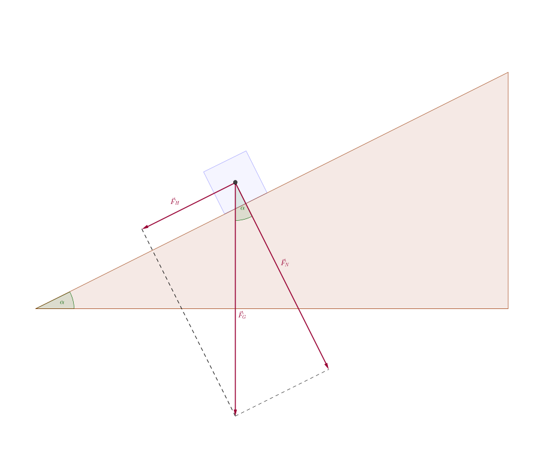

Wir leiten eine Formel für die Zerlegung eines Vektors in Komponenten in Richtung eines Untervektorraumes und seines orthogonalen Komplementes her. Hierfür bezeichne $x\in V$ den vom Nullvektor $o\in V$ verschiedenen Vektor und $M\subset V$ mit $$
  M=\left\{\lambda\cdot a|\,a\in V\setminus\{o\},\lambda\in\mathbb{R}\right\}
$$ einen eindimensionalen Untervektorraum in $V$, der durch einen beliebig, aber fest gewählten Vektor $a$ aufgespannt wird. Gesucht sind die eindeutig bestimmten Vektoren $y\in M$ sowie $h\in M^\perp$ der Zerlegung $x=y+h$.

Bezeichnet $\varphi=\measuredangle{(x,a)}$ und wird benutzt, dass $(y,a)$ linear abhängig sind, so ergeben sich schrittweise:

1. $$ \vert y\vert=\vert x\vert\cdot\cos{\varphi} $$
2. $$ x\cdot a = \left\{\begin{array}{lcl} \vert x\vert\cdot\vert a\vert\cdot\cos{\varphi} & \text{für} & \mathrm{sgn}{(x\cdot a)}=1 \\ \vert x\vert\cdot\vert a\vert\cdot\cos{(\pi-\varphi)} & \text{für} & \mathrm{sgn}{(x\cdot a)}=-1 \end{array}\right. \quad\stackrel{1.}{\leadsto}\quad x\cdot a=\vert y\vert\cdot\vert a\vert\cdot\mathrm{sgn}(x\cdot a) $$
3. $$ \frac{1}{|y|}\cdot y=\frac{1}{|a|}\cdot a\cdot\mathrm{sgn}{(x\cdot a)}\quad\leftrightarrow\quad y=\frac{|y|}{|a|}\cdot\mathrm{sgn}{(x\cdot a)}\cdot a\stackrel{2.}{=}\frac{x\cdot a}{a\cdot a}\cdot a $$ 
4. $$ h=x-y=x-\frac{x\cdot a}{a\cdot a}\cdot a $$

für $|y|\not=0$. Die Vektoren $y\not=o$ und $h\not=o$ sind orthogonal, $y\perp h$, denn es gilt $$ y\cdot h=\left(\frac{x\cdot a}{a\cdot a}\cdot a\right)\cdot\left(x-\frac{x\cdot a}{a\cdot a}\cdot a\right)=\frac{(x\cdot a)^2}{a\cdot a}-\frac{(x\cdot a)^2}{(a\cdot a)^2}\cdot(a\cdot a)=0 $$ 

**Beispiel 7.** Zu gegebener Kraft $\vec{F}=\left(\begin{array}{ccc} 4 & 2 & 6 \end{array}\right)^\top({\rm 1N})$ und Richtung $\vec{s}=\left(\begin{array}{ccc} 2 & -1 & 2 \end{array}\right)^\top({\rm 1m})$ ist die Kraftkomponente $\vec{F}_s$ in Richtung des Weges $\vec{s}$ zu berechnen.

Es gilt $$ \vec{F}\cdot\vec{s}=\left(\begin{array}{r} 4 \\ 2 \\ 6 \end{array}\right)\cdot\left(\begin{array}{r} 2 \\ -1 \\ 2 \end{array}\right)({\rm 1Nm}) = (8-2+12) {\rm Nm} =\underline{18 {\rm Nm}} $$ Für das Quadrat der Norm von $\vec{s}$ ergibt sich $$ \vert\vec{s}\vert^2 = \vec{s}\cdot\vec{s}=\left(\begin{array}{r} 2 \\ -1 \\ 2 \end{array}\right)\cdot\left(\begin{array}{r} 2 \\ -1 \\ 2 \end{array}\right)({\rm 1m^2})=\underline{9 {\rm m^2}} $$ Die Kraftkomponente $\vec{F}_s$ in Richtung $\vec{s}$ berechnet sich $$ \vec{F}_s=\frac{\vec{F}\cdot\vec{s}}{\vec{s}\cdot\vec{s}}\cdot\vec{s}=\frac{18 {\rm Nm}}{9 {\rm m^2}} \left(\begin{array}{r} 2 \\ -1 \\ 2 \end{array}\right) (1 {\rm m})=\underline{\left(\begin{array}{r} 4 \\ -2 \\ 4 \end{array}\right) (1 {\rm N})},\quad \vert\vec{F}_s\vert=\underline{6 {\rm N}} $$

**Beispiel 8.** Zu gegebenem Vektor $x=\left(\begin{array}{ccc} \frac{3}{2} & 2 & \frac{3}{4} \end{array}\right)^\top\in\mathbb{R}^3$ sind bezüglich der kanonischen Basisvektoren $e_j\in\mathbb{R}^3$ mit $j\in\{1,2,3\}$ die Richtungskosinus von ${x}$ bezüglich $e_j$ zu berechnen.

Die orthogonale Projektion von $x$ auf den durch $e_j$ aufgespannten Untervektorraum ergibt $$ \frac{x\cdot e_j}{\vert e_j\vert^2}\cdot e_j=\vert x\vert\cdot\cos{\varphi}_j\cdot e_j = \left\{\begin{array}{lcl} \frac{3}{2}\cdot e_1 & \text{für} & j=1 \\ 2\cdot e_2 & \text{für} & j=2 \\ \frac{3}{4}\cdot e_3 & \text{für} & j=3 \end{array} \right. $$ mit $\varphi_i=\measuredangle(x,e_j)$. Die Ausdrücke $\cos{\varphi_j}$ heißen **Richtungskosinus** von $x=\left(\begin{array}{ccc} x_1 & x_2 & x_3 \end{array}\right)^\top$ bezüglich der Basisvektoren ${e}_j$. Es gilt $$ (\cos{\varphi_1})^2+(\cos{\varphi_2})^2+(\cos{\varphi_3})^2=\frac{x_1^2}{\vert{x}\vert^2}+\frac{x_2^2}{\vert{x}\vert^2}+\frac{x_3^2}{\vert{x}\vert^2}=1 $$ d. h. $\varphi_1$, $\varphi_2$ und $\varphi_3$ sind nicht unabhängig voneinander.

Das Prinzip der orthogonalen Projektion von Vektoren lässt sich nutzen, um zu einem gegebenen System $\{w_1,w_2,...,w_n\}$ von linear unabhängigen Vektoren ein System $\{v_1,v_2,...,v_n\}$ orthogonalen Vektoren zu erzeugen, die beide denselben Untervektorraum aufspannen.

<!-- style="background-color: lightgray;"-->
> [Orthogonalisierungsverfahren nach Gram-Schmidt](https://de.wikipedia.org/wiki/Gram-Schmidtsches_Orthogonalisierungsverfahren). Die Vektoren $v_j$ berechnen sich rekursiv gemäß
>
> $$ \begin{split} v_1 & =w_1 \\ v_2 & =w_2-\frac{w_2\cdot v_1}{v_1\cdot v_1}\cdot v_1 \\ v_3 & =w_3-\frac{w_3\cdot v_1}{v_1\cdot v_1}\cdot v_1-\frac{w_3\cdot v_2}{v_2\cdot v_2}\cdot v_2 \\ & \vdots \\ v_j & = w_j-\left(\sum_{k=1}^{j-1}{\frac{w_j\cdot v_k}{v_k\cdot v_k}\cdot v_k}\right)\,, \quad j\in\{2,3,...,n\} \\ & \vdots \\ v_n & = w_n-\left(\sum_{k=1}^{n-1}{\frac{w_n\cdot v_k}{v_k\cdot v_k}\cdot v_k}\right)\end{split} $$
> worin die auftretenden Multiplikationszeichen das Skalarprodukt zweier Vektoren bzw. das Skalarfache eines Vektors bezeichnen.

>**Satz 2.** Für jeden Vektor $v_j$ mit $j\in\{2,3,...,n\}$ gelten $$ v_j\cdot v_l=0\quad\forall l\in\{1,2,...,j-1\} $$ d. h. die Vektoren $\{v_1,v_2,...,v_n\}$ sind paarweise orthogonal.

**Beweis.** Es lässt sich unmittelbar zeigen, dass $$ v_2\cdot v_1=\left(w_2-\frac{w_2\cdot v_1}{v_1\cdot v_1}\cdot v_1\right)\cdot v_1= w_2\cdot v_1-w_2\cdot v_1=0 $$ gilt. Mit der linearen Unabhängigkeit der Vektoren $w_j$ folgt des Weiteren, dass auch die beiden Vektoren in $\{v_1,v_2\}$ verschieden vom Nullvektor sind und somit $v_1\perp v_2$ gilt. 

Ist ein gemäß obigem Orthogonalisierungsverfahren bestimmtes System von Vektoren $\{v_1,v_2,...,v_{j-1}\}$ orthogonal, so folgt für die Skalarprodukte mit dem dort nachfolgend berechneten Vektor $v_j$ mit $j\in\{2,3,...,n\}$ $$ v_j\cdot v_l = \left[w_j-\left(\sum_{k=1}^{j-1}{\frac{w_j\cdot v_k}{v_k\cdot v_k}\cdot v_k}\right)\right]\cdot v_l=w_j\cdot v_l-\left(\sum_{k=1}^{j-1}{\frac{w_j\cdot v_k}{v_k\cdot v_k}\cdot v_k}\right)\cdot v_l=w_j\cdot v_l-\frac{w_j\cdot v_l}{v_l\cdot v_l}\cdot(v_l\cdot v_l)=0\quad \forall l\in\{1,2,...,j-1\} $$ da $v_k\cdot v_l=0$ für alle $k\not=l$ des vorgenannten Systems gilt. Unter erneuter Benutzung der linearen Unabhängigkeit der Vektoren $w_j$ lässt sich analog die paarweise Orthogonalität der Vektoren in $\{v_1,v_2,...,v_{j}\}$ schließen, und zusammen  mit $v_1\perp v_2$ schließlich die Aussage des Satzes beweisen. 

$\square$

**Beispiel 9.** Gegeben sind die linear unabhängigen Vektoren im euklidischen Vektorraum $\left(\mathbb{R}^3,\cdot\right)$ $$ w_1=\begin{pmatrix} 1 \\ 2 \\ 0 \end{pmatrix}\,,\quad w_2=\begin{pmatrix} 3 \\ 0 \\ -1 \end{pmatrix}\quad\text{und}\quad w_3=\begin{pmatrix} 0 \\ 7 \\ 2 \end{pmatrix} $$ worin das Multiplikationszeichen das kanonische Skalarprodukt gemäß Beispiel 1 darstellt. Die lineare Unabhängigkeit der drei Vektoren ist unmittelbar einsichtig.

Es berechnen sich unter Benutzung des Gram-Schmidtschen Orthogonalisierungsverfahrens schrittweise $$ \begin{split} v_1 & = \begin{pmatrix} 1 \\ 2 \\ 0 \end{pmatrix} \\ v_2 & = \begin{pmatrix} 3 \\ 0 \\ -1 \end{pmatrix}-\frac{3\cdot 1+0\cdot 2-1\cdot 0}{1^2+2^2+0^2}\cdot\begin{pmatrix} 1 \\ 2 \\ 0 \end{pmatrix}=\frac{1}{5}\cdot\begin{pmatrix} 12 \\ -6 \\ -5 \end{pmatrix} \\ v_3 & = \begin{pmatrix} 0 \\ 7 \\ 2 \end{pmatrix}-\frac{0\cdot 1+7\cdot 2+2\cdot 0}{1^2+2^2+0^2}\cdot\begin{pmatrix} 1 \\ 2 \\ 0 \end{pmatrix}-\frac{\frac{1}{5}\cdot\left(0\cdot 12-7\cdot 6-2\cdot 5\right)}{\frac{1}{25}\cdot\left(12^2+(-6)^2+(-5)^2\right)}\cdot\frac{1}{5}\cdot\begin{pmatrix} 12 \\ -6 \\ -5 \end{pmatrix}=\frac{5}{41}\cdot\begin{pmatrix} 2 \\ -1 \\ 6 \end{pmatrix} \end{split} $$ 

Damit lassen sich direkt nachrechnen $$ v_1\cdot v_2 = \frac{1}{5}\cdot\begin{pmatrix} 1 \\ 2 \\ 0 \end{pmatrix}\cdot\begin{pmatrix} 12 \\ -6 \\ -5 \end{pmatrix}=0\,,\quad v_1\cdot v_3  = \frac{5}{41}\cdot\begin{pmatrix} 1 \\ 2 \\ 0 \end{pmatrix}\cdot\begin{pmatrix} 2 \\ -1 \\ 6 \end{pmatrix}=0 \,,\quad v_2\cdot v_3 = \frac{5}{5\cdot 41}\cdot\begin{pmatrix} 12 \\ -6 \\ -5 \end{pmatrix}\cdot\begin{pmatrix} 2 \\ -1 \\ 6 \end{pmatrix}=0 $$ d. h. die Vektoren in $\{v_1,v_2,v_3\}$ bilden ein System orthogonaler Vektoren.

Das Orthogonalisierungsverfahren kann unter Benutzung der Javascript Bibliothek [Algebrite](http://algebrite.org/) interaktiv umgesetzt werden. Im Beispiel werden die Vektoren $\{v_1,v_2,v_3\}$ ausgegeben.

```javascript
w1=[1,2,0]
w2=[3,0,-1]
w3=[0,7,2]
v1=w1
v2=w2-dot(w2,v1)/dot(v1,v1)*v1
v3=w3-dot(w3,v1)/dot(v1,v1)*v1-dot(w3,v2)/dot(v2,v2)*v2
v1
v2
v3
```
@Algebrite.eval

**Bemerkung 3.** Werden die Vektoren eines System orthogonaler Vektoren (im Anschluss) normiert, spricht man entsprechend von einem System *orthonormierter* Vektoren.


Vektorprodukt
===


Für Vektoren des euklidischen dreidimensionalen Vektorraumes $V=\mathbb{R}^3$ mit dem eingeführten (kanonischen) Skalarprodukt lässt sich das Vektorprodukt zweier Vekatoren $a\in\mathbb{R}^3$ und $b\in\mathbb{R}^3$ erklären.

>**Definition 6.** Gegeben seien $a\in\mathbb{R}^3$ und $b\in\mathbb{R}^3$. Dann existiert ein eindeutig bestimmter Vektor $c\in\mathbb{R}^3$ mit
>
>1. $c\in M^\perp$ mit $M^\perp=\{a,b\}$
>2. $|c|=|a|\cdot|b|\cdot\sin{\measuredangle(a,b)}$
>3. Falls $\{a,b\}$ linear unabhängig sind, so bildet das System $[a,b,c]$ ein [Rechtssystem](https://de.wikipedia.org/wiki/Rechtssystem_%28Mathematik%29).
>
> Der Vektor $c$ heißt dann [Vektorprodukt](https://de.wikipedia.org/wiki/Kreuzprodukt) von $a$ und $b$, kurz: $c=a\times b$.

**Bemerkung 4.** Die Eigenschaften aus der vorstehenden Definition legen Richtung, Richtungssinn und Länge des Vektors $c$ fest.

>**Proposition 3.** Gegeben seinen die Vektoren $a\in\mathbb{R}^3$,$b\in\mathbb{R}^3$ und $c\in\mathbb{R}^3$ sowie der Skalar $\lambda\in\mathbb{R}$. Dann gelten für das Vektorprodukt:
>
>1. $a\times b=-b\times a$ (Anti-Kommutativität)
>2. $a\times(b+c)=a\times b+a\times c$ (Distributivität)
>3. $(a+b)\times c=a\times c+b\times c$ (Distributivität)
>4. $\lambda\cdot(a\times b)=(\lambda\cdot a)\times b=a\times(\lambda\cdot b)$ (Skalarvielfaches)
>5. $a\times b=o\;\Leftrightarrow\; a,b$ linear abhängig 
>
> Der Vektor $o$ bezeichnet darin den Nullvektor in $\mathbb{R}^3$.

**Beweisidee.** Die Eigenschaften aus vorstehender Proposition lassen sich unter Zuhilfenahme von Definition 6 sowie geometrischer Überlegungen nachweisen.

Für die Berechnung des Vektorproduktes werden die Faktoren $a$ und $b$ (eindeutig) als Linearkombination in der kanonischen Basis $\{e_1,e_2,e_3\}$ dargestellt $$ a=\sum_{i=1}^3{(a_i\cdot e_i)}\quad\text{und}\quad b=\sum_{i=1}^3{(b_i\cdot e_i)} $$ mit den Koordinaten $a_i$ bzw. $b_i$ bezüglich dieser Basis. Für das Vektorprodukt dieser Vektoren folgt dann unter Verwendung des Distributivgesetzes, sowie unter Nutzung von Antikommutativität und Eigenschaft 4 der vorstehenden Proposition $$ \begin{split} a\times b & = \left(\sum_{i=1}^3{(a_i\cdot e_i)}\right)\times\left(\sum_{i=1}^3{(b_i\cdot e_i)}\right) \\ & = a_1b_1\cdot(e_1\times e_1)+a_2b_2\cdot(e_2\times e_2)+a_3b_3\cdot(e_3\times e_3) \\ & +a_1b_2\cdot(e_1\times e_2)+a_2b_1\cdot(e_2\times e_1)+a_1b_3\cdot(e_1\times e_3)+a_3b_1\cdot(e_3\times e_1)+a_2b_3\cdot(e_2\times e_3)+a_3b_2\cdot(e_3\times e_2) \\ & = (a_2b_3-a_3b_2)\cdot(e_2\times e_3)+(a_3b_1-a_1b_3)\cdot(e_3\times e_1)+(a_1b_2-a_2b_1)\cdot(e_1\times e_2) \\ & = (a_2b_3-a_3b_2)\cdot e_1+(a_3b_1-a_1b_3)\cdot e_2+(a_1b_2-a_2b_1)\cdot e_3 \end{split} $$ Die erhaltene Multiplikationsregel für die Koordinaten des Vektorproduktes lässt sich schematisch ähnlich der Regel von Sarrus für dreireihige Determinanten formulieren. Siehe Abschnitt [Determinanten](#Determinanten). 

1. Die ersten drei Summanden zur Berechnung des Vektorproduktes in der Darstellung $$ c=a\times b=\textcolor{magenta}{(a_{2}b_{3})\cdot e_1}+\textcolor{pink}{(a_{3}b_{1})\cdot e_2}+\textcolor{blue}{(a_{1}b_{2})\cdot e_3}-(a_{2}b_{1})\cdot e_3-(a_{3}b_{2})\cdot e_1-(a_{1}b_{3})\cdot e_2$$ entsprechen den Produkten in dem rechteckig erweiterten Schema der Komponenten der Matrix $$ \begin{array}{|rrr|rr} \textcolor{magenta}{e_{1}} & \textcolor{pink}{e_{2}} & \textcolor{blue}{e_{3}} & e_{1} & e_{2} \\\hdashline a_{1} & \textcolor{magenta}{a_{2}} & \textcolor{pink}{a_{3}} & \textcolor{blue}{a_{1}} & a_{2} \\ b_{1} & b_{2} & \textcolor{magenta}{b_{3}} & \textcolor{pink}{b_{1}} & \textcolor{blue}{b_{2}} \end{array} $$
2. Die letzten drei Subtrahenden zur Berechnung des Vektorproduktes in der Darstellung $$ c=a\times b=(a_{2}b_{3})\cdot e_1+(a_{3}b_{1})\cdot e_2+(a_{1}b_{2})\cdot e_3-\textcolor{brown}{(a_{2}b_{1})\cdot e_3}-\textcolor{orange}{(a_{3}b_{2})\cdot e_1}-\textcolor{red}{(a_{1}b_{3})\cdot e_2}$$ entsprechen den Produkten in dem rechteckig erweiterten Schema der Komponenten der Matrix $$ \begin{array}{|rrr|rr} e_{1} & e_{2} & \textcolor{brown}{e_{3}} & \textcolor{orange}{e_{1}} & \textcolor{red}{e_{2}} \\\hdashline a_{1} & \textcolor{brown}{a_{2}} & \textcolor{orange}{a_{3}} & \textcolor{red}{a_{1}} & a_{2} \\ \textcolor{brown}{b_{1}} & \textcolor{orange}{b_{2}} & \textcolor{red}{b_{3}} & b_{1} & b_{2} \end{array} $$

Die Berechnung des Vektorproduktes zweier Vektoren aus $\mathbb{R}^3$ ist im nachstehenden Video erläutert sowie Eigenschaften aufgezeigt.

!?[Vektorprodukt1](https://www.youtube.com/watch?v=63FWetdwNb8 "Vektorprodukt / Kreuzprodukt, Daniel Jung.")

Das Vektorprodukt zweier Vektoren lässt sich interaktiv unter Benutzung der Javascript-Bibliothek [Algebrite](http://algebrite.org/) berechnen. Entsprechend lassen sich Eigenschaften des Vektorproduktes aus Proposition 3 prüfen.

```javascript
u=[u1,u2,u3]
v=[v1,v2,v3]
cross(u,v)
a=[1,2,3]
b=[-1,1,0]
cross(a,b)-cross(b,a)
```
@Algebrite.eval


**Beispiel 10.** Die Wirkung einer Kraft beziehungsweise eines Systems von Kräften auf einen drehbaren Körper lässt sich mithilfe des [Drehmomentes](https://de.wikipedia.org/wiki/Drehmoment) $\vec{M}$ physikalisch beschreiben. Dieses berechnet sich $\vec{M}=\vec{r}\times\vec{F}$, worin $\vec{F}$ die wirkende (resultierende) Kraft und $\vec{r}$ den Verbindungsvektor vom Bezugspunkt des Drehmoments zum Angriffspunkt der Kraft bezeichnen. Für die vektorielle Größe $\vec{M}$ gelten hierbei

1. $\vec{M}\perp\vec{r}$ und $\vec{M}\perp\vec{F}$ sowie $|\vec{M}|=|\vec{r}|\cdot|\vec{F}|\cdot\sin{\varphi}$ mit $\varphi=\measuredangle{(\vec{r},\vec{F})}$, vergleiche Definition des Vektorproduktes
2. Greift $\vec{F}$ an einem (beliebigen) Punkt $Q$ entlang ihrer Wirkungslinie durch $P$ an, so gilt $\vec{r}_Q=\vec{r}+\overrightarrow{PQ}$ mit $\overrightarrow{PQ}=\vec{s}$. Die in $Q$ angreifende Kraft $\vec{F}$ erzeugt ein Drehmoment $$ \vec{M}_Q=\vec{r}_Q\times\vec{F}=(\vec{r}+\vec{s})\times\vec{F}=\vec{r}\times\vec{F}+\vec{s}\times\vec{F}=\vec{M} $$ d. h. das Drehmoment bleibt entlang der Wirkungslinie von $\vec{F}$ durch $P$ (bzw. $Q$) erhalten.

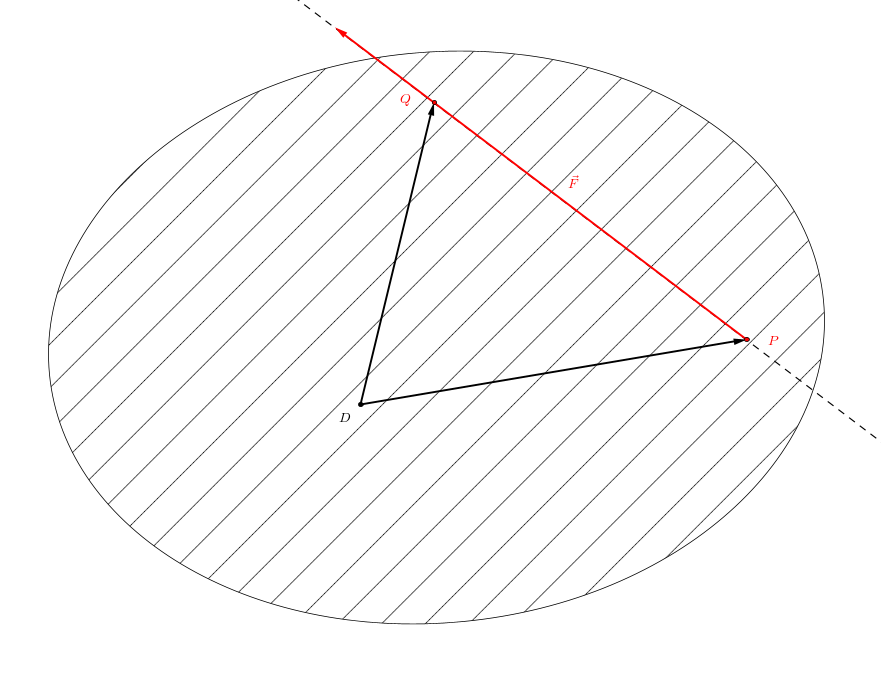


**Bemerkung 5.** Im Ingenieurwesen auftretende, vektorielle Größen, die entlang ihrer Wirkungslinie unverändert bleiben, heißen **linienflüchtig**. Demgegenüber werden auch [ortsgebundene](https://de.wikipedia.org/wiki/Gebundener_Vektor) - (fester Angriffspunkt) und *freien*, physikalischen Größen betrachtet.

Im nachstehenden Video werden einzelne (mathematische) Anwendungsmöglichkeiten des Vektorproduktes erläutert.

!?[Vektorprodukt2](https://www.youtube.com/watch?v=YpbW8uuunXI "Vektorprodukt / Kreuzprodukt, Anwendungsmöglichkeiten, Daniel Jung.")


Spatprodukt
===


>**Definition 7.** Für drei Vektoren $a\in\mathbb{R}^3$,$b\in\mathbb{R}^3$ und $c\in\mathbb{R}^3$ heißt die reelle Zahl $$ (a\times b)\cdot c=\left[\begin{pmatrix} a_1 \\ a_2 \\ a_3 \end{pmatrix}\times\begin{pmatrix} b_1 \\ b_2 \\ b_3 \end{pmatrix}\right]\cdot\begin{pmatrix} c_1 \\ c_2 \\ c_3 \end{pmatrix}=\begin{pmatrix} a_2b_3-a_3b_2 \\ a_3b_1-a_1b_3 \\ a_1b_2-a_2b_1 \end{pmatrix}\cdot\begin{pmatrix} c_1 \\ c_2 \\ c_3 \end{pmatrix}= (a_2b_3-a_3b_2)\cdot c_1+(a_3b_1-a_1b_3)\cdot c_2+(a_1b_2-a_2b_1)\cdot c_3 $$ das [Spatprodukt](https://de.wikipedia.org/wiki/Spatprodukt) der Vektoren $a$, $b$ und $c$.

**Bemerkung 6.** Aus der vorstehenden Definition folgt unmittelbar $(a\times b)\cdot c=\det(a,b,c)$, d. h. das Spatprodukt lässt sich als Determinante einer dreireihigen Matrix darstellen, in deren Zeilen / Spalten die Komponenten der drei Faktoren $a$, $b$ und $c$ stehen. Vergleiche hierzu die Definition einer Determinante dritter Ordnung im Abschnitt [Determinanten](#Determinanten). Mit den Eigenschaften von Determinanten folgen aus dieser Darstellung wiederum die Gleichheiten $$ (a\times b)\cdot c=(b\times c)\cdot a=(c\times a)\cdot b $$ die durch zyklisches Vertauschen der einzelnen Faktoren entstehen. Das Spatprodukt ist jedoch **nicht kommutativ** (bei beliebigem Tauschen der Reihenfolge aller drei Faktoren.)

Für eine geometrische Deutung des Spatproduktes von drei Vektoren $a\in\mathbb{R}^3$,$b\in\mathbb{R}^3$ und $c\in\mathbb{R}^3$ lässt sich im Fall ihrer linearen Unabhängigkeit ein [Spat](https://de.wikipedia.org/wiki/Parallelepiped) (Parallelepiped) vorstellen, dessen Kantenvektoren die gegebenen Vektoren darstellen. Für das Volumen dieses Spats ergibt sich durch direktes Nachrechnen $V=|(a\times b)\cdot c|$.

**Beispiel 11.** Zu berechnen sind Volumen und Oberblächeninhalt des Parallelepipeds, dass durch die Vektoren $$ a=\begin{pmatrix} 5 \\ 1 \\ 2 \end{pmatrix}\,,\quad b=\begin{pmatrix} 1 \\ 6 \\ 3 \end{pmatrix}\quad\text{und}\quad c=\begin{pmatrix} 2 \\ -1 \\ 8 \end{pmatrix} $$ aufgespannt wird.

1. Das Volumen berechnet sich mithilfe des Spatprodukts gemäß Bemerkung 6 $$ V=|\det(a,b,c)|=\left|\begin{pmatrix} 5 & 1 & 2 \\ 1 & 6 & -1 \\ 2 & 3 & 8 \end{pmatrix}\right|=227 $$
2. Der Inhalt der Oberfläche des Parallelepipeds berechnet sich unter Benutzung des Vektorproduktes gemäß $$ A_0=2\cdot\left( |a\times b|+|a\times c|+|b\times c| \right) $$ worin die Normen der Vektorprodukte die Flächeninhalte der paarweise auftretenden Seitenflächen beschreiben. Mit den Produkten $$ a\times b=\begin{pmatrix} 5 \\ 1 \\ 2 \end{pmatrix}\times \begin{pmatrix} 1 \\ 6 \\ 3 \end{pmatrix}=\begin{pmatrix} -9 \\ -13 \\ 29 \end{pmatrix} \,,\quad  a\times c=\begin{pmatrix} 5 \\ 1 \\ 2 \end{pmatrix}\times \begin{pmatrix} 2 \\ -1 \\ 8 \end{pmatrix}=\begin{pmatrix} 10 \\ -36 \\ -7 \end{pmatrix} \quad\text{und}\quad b\times c=\begin{pmatrix} 1 \\ 6 \\ 3 \end{pmatrix}\times \begin{pmatrix} 2 \\ -1 \\ 8 \end{pmatrix}=\begin{pmatrix} 51 \\ -2 \\ -13 \end{pmatrix} $$ ergibt sich $$ A_0=2\cdot\left(\sqrt{81+169+841}+\sqrt{100+1296+49}+\sqrt{2601+4+169}\right)\approx 247.424 $$


Eine Kennzeichnung des Spatproduktes dreier Vektoren aus $\mathbb{R}^3$ ist im nachstehenden Video erklärt. Die Bezugnahme zum Volumen des von den Vektoren aufgespannten Spates ist ebenso genannt. 

!?[Spatprodukt](https://www.youtube.com/watch?v=plM5HpVjycE)


Sicher gewusst
===


Testen Sie Ihr Wissen in diesem Abschnitt bei der Beantwortung der nachstehenden Fragen.

**Frage 1.**[^3] Entscheiden Sie: Ein Skalarprodukt auf einem reellen Vektorraum $V$ ist eine Abbildung

[(X)] die zwei Vektoren aus $V$ eine reelle Zahl (Skalar) zuordnet.
[( )] die zwei Vektoren aus $V$ wieder einen Vektor aus $V$ zuordnet.
[( )] die einem Paar, bestehend aus einem Vektor aus $V$ und reellem Skalar, wieder einen Vektor aus $V$ zuordnet.
[[?]] Unterscheiden Sie das Skalarprodukt gegenüber anderen Produktbildungen durch Kennzeichnung der beteiligten Faktoren und des Produktes.
****************************************

Bei einem Skalarprodukt auf $V$ handelt es sich um eine Abbildung, die je zwei Vektoren aus $V$ eine reelle Zahl zuordnet, also die Abbildung in Antwortoption 1.

Ein Beispiel für Antwortoption 2 ist das Vektorprodukt in $V=\mathbb{R}^3$. Hier wird je zwei Vektoren $a\in V$ und $b\in V$ eindeutig ein Vektor $c=a\times b\in V$ zugeordnet, für den gelten:

* $c\cdot a=c\cdot b=0$
* Für $a\not=o$ und $b\not=o$ gilt $\det(a,b,c)>0$, d. h. $(a,b,c)$ bilden ein Rechtssystem.
* $|c|=|a|\cdot|b|\cdot\measuredangle{(a,b)}$

Antwortoption 3 beschreibt zum Beispiel das Skalarfache eines Vektors.

****************************************

**Frage 2.**[^3] Das in diesem Abschnitt definierte Skalarprodukt in einem reellen euklidischen Vektorraum $(V,\cdot)$ besitzt die Eigenschaft, positiv definit zu sein. Was bedeutet dies für Vektoren $x\in V$?

[( )] $x\cdot x>0$ für ein $x\in V$
[(X)] $x\cdot x>0$ für alle $x\in V\setminus\{o\}$, worin $o$ den Nullvektor in $V$ bezeichnet
[( )] $(x\cdot x=0)\;\rightarrow\;(x=o)$ (Nullvektor)
[( )] $(x=o)$ (Nullvektor) $\;\rightarrow\;(x\cdot x=0)$
[[?]] Siehe Definition des Skalarproduktes. Für eine Interpretation vermöge der durch das Skalarprodukt induzierten Norm nutzen Sie $x\cdot x=|x|^2$.
****************************************

Die korrekte (zweite) Antwort besagt, dass das Skalarprodukt jedes vom Nullvektor $o\in V$ verschiedenen Vektors $x\in V$, $x\not=o$, mit sich selbst eine positive reelle Zahl ergibt.

Die erste Antwortoption fordert dies nur für einen - nicht notwendig für alle - Vektor/-en $x\in V$. Die dritte und vierte Antwortoption bilden die beiden Implikationen der Äquivalenz $x=o\;\leftrightarrow |x|=0$. Vergleiche Satz 1.

****************************************

**Frage 3.**[^3] Gegeben ist der Vektorraum $V=\mathbb{R}^2$ mit dem kanonischen Skalarprodukt. Welche der folgenden Systeme von Vektoren bildet eine orthonormale Basis von $V$?

[[ ]] $ \left(\begin{pmatrix} -1 \\ 1 \end{pmatrix},\begin{pmatrix} 1 \\ 1 \end{pmatrix}\right) $ 
[[ ]] $ \left(\begin{pmatrix} -1 \\ 0 \end{pmatrix} \right) $
[[X]] $ \left(\frac{1}{\sqrt{2}}\cdot\begin{pmatrix} -1 \\ 1 \end{pmatrix},\frac{1}{\sqrt{2}}\cdot\begin{pmatrix} 1 \\ 1 \end{pmatrix}\right) $
[[X]] $ \left(\begin{pmatrix} -1 \\ 0 \end{pmatrix},\begin{pmatrix} 0 \\ -1 \end{pmatrix}\right) $ 
[[ ]] $ \left(\begin{pmatrix} -1 \\ 0 \end{pmatrix},\begin{pmatrix} 0 \\ -1 \end{pmatrix},\frac{1}{\sqrt{2}}\cdot\begin{pmatrix} -1 \\ 1 \end{pmatrix}\right) $ 
[[?]] Als Basis wird eine Menge linear unabhängiger Vektoren bezeichnet, die ein Erzeugendensystem des Vektorraumes $V$ bildet. Die Anzahl der Vektoren einer Basis heißt Dimension von $V$. Vergleiche Abschnitt [Vektoren](#Vektoren). Zwei Vektoren $a\in V$ und $b\in V$ heißen *orthonormal* falls $|a|=|b|=1$ und $a\cdot b=0$ gelten, siehe Bemerkung 3 in diesem Abschnitt.
****************************************

Für die Vektoren in den Antwortoptionen drei und vier gelten jeweils $|a|=|b|=1$ und $a\cdot b=0$, d. h. diese Vektoren sind jeweils orthonormal. Darüberhinaus erfüllen diese Vektoren jeweils die Basiseigenschaft. Es gilt nämlich für einen beliebigen Vektor aus $\mathbb{R}^2$ $$ \begin{pmatrix} x_1 \\ x_2 \end{pmatrix}=-x_1\cdot\begin{pmatrix} -1 \\ 0 \end{pmatrix}-x_2\cdot\begin{pmatrix} 0 \\ -1 \end{pmatrix} \quad\text{bzw.}\quad \begin{pmatrix} x_1 \\ x_2 \end{pmatrix}=\frac{1}{\sqrt{2}}(x_2-x_1)\cdot\frac{1}{\sqrt{2}}\begin{pmatrix} -1 \\ 1 \end{pmatrix}+\frac{1}{\sqrt{2}}(x_2+x_1)\cdot\frac{1}{\sqrt{2}}\cdot\begin{pmatrix} 1 \\ 1 \end{pmatrix} $$ worin die Koeffizienten eindeutig bestimmt sind.

Die Vektoren in der ersten Antwortoption sind zwar orthogonal zueinander. Darüberhinaus bilden diese eine Basis des $\mathbb{R}^2$. Jedoch sind diese Vektoren nicht normiert. Vergleiche hierzu die dritte Antwortoption.

Die zweite un die letzte Antwortoption sind falsch, da die Anzahl der Vektoren in diesen nicht der Dimension $\dim{V}=2$ von $V=\mathbb{R}^2$ entspricht.

****************************************

**Frage 4.** Entscheiden Sie, ob die nachstehende Gleichheit für das Spatprodukt dreier Vektoren $a\in\mathbb{R}^3$,$b\in\mathbb{R}^3$ und $c\in\mathbb{R}^3$ gilt. $$ \det(a,b,c)=(a\times b)\cdot c=a\cdot(b\times c) $$

[(X)] wahr
[( )] falsch
[[?]] Benutzen Sie für den Nachweis, dass das Skalarprodukt kommutativ ist. Des Weiteren die Gleichheiten des Spatproduktes unter zyklischem Tauschen der Faktoren.
****************************************

Durch zyklisches Tauschen der Faktoren gilt wie in Bewerkung 6 aufgeführt $$ (a\times b)\cdot c=(b\times c)\cdot a $$ Wird zusätzlich benutzt, dass das Skalarprodukt zweier Vektoren kommutativ ist, folgt hieraus $$ (a\times b)\cdot c=a\cdot(b\times c) $$

****************************************


[^1]: Zu beachten ist, dass die Produktzeichen in Definition 1 verschiedene Produkte bezeichnen: Zu unterscheiden ist das Skalarprodukt zweier Vektoren vom Skalarvielfachen eines Vektors. 

[^2]: Der Nachweis der Cauchy-Schwarzschen Ungleichung in euklidischen Vektorräumen kann beispielsweise im Buch 'Lineare Algebra' von Klaus Jänich, Seite 180, nachgelesen werden.

[^3]: Quelle: Klaus Jänich, Lineare Algebra, Seite 192 f.


### Eigenwerte und -Vektoren


Definition
=====

In diesem Abschnitt werden sogenannte [Eigenwertprobleme](https://de.wikipedia.org/wiki/Eigenwertproblem) betrachtet. An einem Beispiel sollen zunächst das grundlegende Konzept anschaulich eingeführt und anschließend zentrale Begriffe definiert werden. Danach werden exemplarisch Anwendungen von Eigenwertproblemen innerhalb und außerhalb der Mathematik betrachtet.

**Beispiel 1.** Es soll die Abbildung der Ebene beschrieben werden, welche die Punkte der Ebene an der $x$-Achse eines kartesischen Koordinatensystems spiegelt.

Werden die Koordinaten des Urbildpunktes beziehungsweise Bildpunktes unter dieser Achsenspiegelung mit $x=(x_1,x_2)^\top$ beziehungsweise $x'=(x_1',x_2')^\top$ bezeichnet, so kann die Abbildung $$
  \sigma:\mathbb{R}^2\to\mathbb{R}^2\quad\text{mit}\quad
  \begin{pmatrix} x_1 \\ x_2 \end{pmatrix}\mapsto
  \begin{pmatrix} x_1' \\ x_2' \end{pmatrix}=
  \begin{pmatrix} 1 & 0 \\ 0 & -1 \end{pmatrix}\cdot
  \begin{pmatrix} x_1 \\ x_2 \end{pmatrix}=
  \begin{pmatrix} x_1 \\ -x_2 \end{pmatrix}
$$ in Abhängigkeit der Koordinaten des Urbildes angegeben werden. Siehe nachstehende Abbildung.


Ohne zunächst das geometrische Motiv in den Vordergrund zu stellen, wird nach denjenigen Ortsvektoren $x$ zu Punkten $X$ gefragt, die unter der Abbildung $\sigma$ auf linear abhängigen Vektor $x'=\lambda\cdot x$ abgebildet werden. Lösungen aus dieser Fragestellung werden zur geometrischen Kennzeichnung der Geradenspiegelung genutzt.

1. Der Nullvektor wird unter $\sigma$ auf sich abgebildet, da gilt $$
  o=\begin{pmatrix} 0 \\ 0 \end{pmatrix}=
  \begin{pmatrix} 1 & 0 \\ 0 & -1 \end{pmatrix}\cdot
  \begin{pmatrix} 0 \\ 0 \end{pmatrix}
$$ Diese Lösung wird als *triviale Lösung* bezeichnet.
2. Allgemein werden Ortsvektoren $x$ gesucht, für die gilt $$
  \lambda\cdot\begin{pmatrix} x_1 \\ x_2 \end{pmatrix}=
  \begin{pmatrix} 1 & 0 \\ 0 & -1 \end{pmatrix}\cdot
  \begin{pmatrix} x_1 \\ x_1 \end{pmatrix}
$$ d. h. die auf ein $\lambda$-Faches abbgebildet werden. Wird die Abbildungsmatrix mit $A$ bezeichnet, so stellt sich der Ansatz dar $$
  x'=\lambda\cdot x=A\cdot x\quad\leftrightarrow\quad
  (A-\lambda\cdot E)\cdot x=o
$$ worin $E=\mathrm{diag}{(1,1)}$ die zweireihige Einheitsmatrix bezeichnet. Die rechte Seite der vorstehenden Äquivalenz ist ein System zweier linearer homogener Gleichungen in den Unbekannten $(x_1,x_2)$ $$
  (A-\lambda\cdot E)\cdot x=\begin{pmatrix} 1-\lambda & 0 \\ 0 & -1-\lambda \end{pmatrix}\cdot\begin{pmatrix} x_1 \\ x_2 \end{pmatrix}=\begin{pmatrix} 0 \\ 0 \end{pmatrix}=o
$$ dessen Koeffizientenmatrix $(A-\lambda\cdot E)$ vom Parameter $\lambda$ abhängt. Das Gleichungssystem besitzt neben der trivialen genau dann weitere Lösungen, falls der Rang der Koeffizientenmatrix kleiner $2$ ist $$
  \mathrm{rang}{(A-\lambda\cdot E)}<2\quad\leftrightarrow\quad
  \det{(A-\lambda\cdot E)}=\lambda^2-1=0
$$ Letzteres ist eine quadratische Gleichung im Parameter $\lambda$ mit den beiden Lösungen $\lambda_1=1$ und $\lambda_2=-1$. Im Fall der Lösung $\lambda_1$ nimmt das Gleichungssystem die Form $$
  \begin{pmatrix} 0 & 0 \\ 0 & -2 \end{pmatrix}\cdot\begin{pmatrix} x_1 \\ x_2 \end{pmatrix}=\begin{pmatrix} 0 \\ 0 \end{pmatrix}\quad\leadsto\quad
  \begin{pmatrix} x_1 \\ x_2 \end{pmatrix}=\mu\cdot\begin{pmatrix} 1 \\ 0 \end{pmatrix}
$$ Die Lösungen sind Ortsvektoren der Punkte der Spiegelachse, besitzen demnach eine geometrische Interpretation.[^1] Im Fall der Lösung $\lambda_2$ nimmt das Gleichungssystem die Form $$
  \begin{pmatrix} 2 & 0 \\ 0 & 0 \end{pmatrix}\cdot\begin{pmatrix} x_1 \\ x_2 \end{pmatrix}=\begin{pmatrix} 0 \\ 0 \end{pmatrix}\quad\leadsto\quad
  \begin{pmatrix} x_1 \\ x_2 \end{pmatrix}=\nu\cdot\begin{pmatrix} 0 \\ 1 \end{pmatrix}
$$ Die Lösungen sind Ortsvektoren der Punkte, die auf das $(-1)$-Fache abgebildet werden. Das sind die Punkte der zweiten Koordinatenachse, die die Spiegelrichtung kennzeichnet. Auch diese Vektoren besitzen demnach eine geometrische Interpretation.

>**Definition 1.** Sei ${A}\in\mathbb{R}^{n,n}$ eine $n$-reihige Matrix mit $n\in\mathbb{N}$ und $n\geq2$. Dann heißt die Matrixgleichung $$
  {A\cdot x}=\lambda\cdot{x}\quad\Longleftrightarrow \quad\left({A-\lambda\cdot E}\right){x}={o}
$$ mit $n$-reihiger Einheitsmatrix ${E}$ und Nullvektor ${o}$ die *Eigenwertaufgabe* zur Matrix ${A}$. In der Gleichung bezeichnen:
>
> 1. ${A-\lambda\cdot E}$ die charakteristische Matrix
> 2. $\det{\left({A-\lambda\cdot E}\right)}$ das charakteristische Polynom und $\det{\left({A-\lambda\cdot E}\right)}=0$ die charakteristische Gleichung
> 3. jede Lösung $\lambda\in\mathbb{C}$ obiger Gleichung einen Eigenwert
> 4. jeder Vektor ${x}\in\mathbb{C}^{n\times1}\setminus\{o\}$  einen zum Eigenwert $\lambda$ gehörenden Eigenvektor
>
> zur Matrix ${A}$.

Die Begriffe 'Eigenwert', 'Eigenvektor', 'charakteristisches Polynom' einer quadratischen Matrix wird im nachstehendem Video kurz zusammengefasst.

!?[Eigenwert](https://www.youtube.com/watch?v=xPMoJ8Mu67w&list=PLLTAHuUj-zHgMbsnuYFI4faJVawyKOM97&index=3)


Bestimmung der Eigenwerte und -Vektoren
======


1. Berechne die Eigenwerte $\lambda_i$ als Lösungen der charakteristischen Gleichung $$
   \det{\left({A-\lambda\cdot E}\right)}=0
$$ Dies ist eine reelle algebraische Gleichung $n$-ten Grades mit Lösungen $$
  \lambda_1\in\mathbb{C}\,,\quad\lambda_2\in\mathbb{C}\,,\quad\ldots\,,\quad\lambda_n\in\mathbb{C}
$$
2. Setze die Eigenwerte $\lambda_i$ nacheinander in die Eigenwertaufgabe ein. Es ergibt sich ein System linearer, homogener Gleichungen in den Komponenten der zu $\lambda_i$ gehörenden Eigenvektoren ${x}$. Für $\lambda_i\in\mathbb{R}$ ist die Lösungsmenge ein $k_i$-dimensionaler Untervektorraum in $\mathbb{R}^n$, worin $$
  k_i=n-\mathrm{Rang}\left(A-\lambda_i\cdot E\right)
$$ Die Menge aller Eigenvektoren $x$ zu einem Eigenwert $\lambda_i$ wird Eigenraum zu $\lambda_i$ genannt. Siehe Satz 1.

**Beispiel 2.** Betrachtet wird die Transformation $\kappa:\mathbb{R}^2\to\mathbb{R}^2$ mit $$
  \kappa: x\mapsto x'=A\cdot x
$$ mit der Transformationsmatrix $$
  A(\varphi)=\begin{pmatrix} \cos{\varphi} & -\sin{\varphi} \\ \sin{\varphi} & \cos{\varphi} \end{pmatrix}
$$ worin $\varphi\in[0,2\pi)$. Speziell ergeben sich für die Parameterwerte $\varphi=0$ bzw. $\varphi=\pi$ die Matrizen $$
  A(0)=\begin{pmatrix} 1 & 0 \\ 0 & 1 \end{pmatrix}\quad\text{bzw.}\quad
  A(\pi)=\begin{pmatrix} -1 & 0 \\ 0 & -1 \end{pmatrix}
$$ die Transformation beschreibt die identische Abbildung bzw. die Spiegelung am Koordinatenursprung $O(0,0)$.

Generell beschreibt $\kappa$ eine Drehung der Ebene um $O$ mit dem Drehwinkel $\varphi$. Bezeichnen nämlich $x=(x_1,x_2)^\top$ bzw. $x'=(u_1,u_2)^\top$ die Ortsvektoren eines frei wählbaren Punktes beziehungsweise dessen gedrehtes Bild unter der Drehung, so gilt für die Bildpunktkoordinaten $$
  \begin{pmatrix} u_1 \\ u_2 \end{pmatrix}=
  r\cdot\begin{pmatrix} \cos{(\alpha+\varphi)} \\ \sin{(\alpha+\varphi)} \end{pmatrix}=
  r\cdot\begin{pmatrix} \cos{\varphi}\cdot\cos{\alpha}-\sin{\varphi}\cdot\sin{\alpha} \\ \sin{\varphi}\cdot\cos{\alpha}+\cos{\varphi}\cdot\sin{\alpha} \end{pmatrix}=
  A(\varphi)\cdot\begin{pmatrix} x_1 \\ x_2 \end{pmatrix}
$$ worin $(\alpha,r)$ die Polarkoordinaten von des Punktes $X$ zum Ortsvektor $x$ bezeichnen.

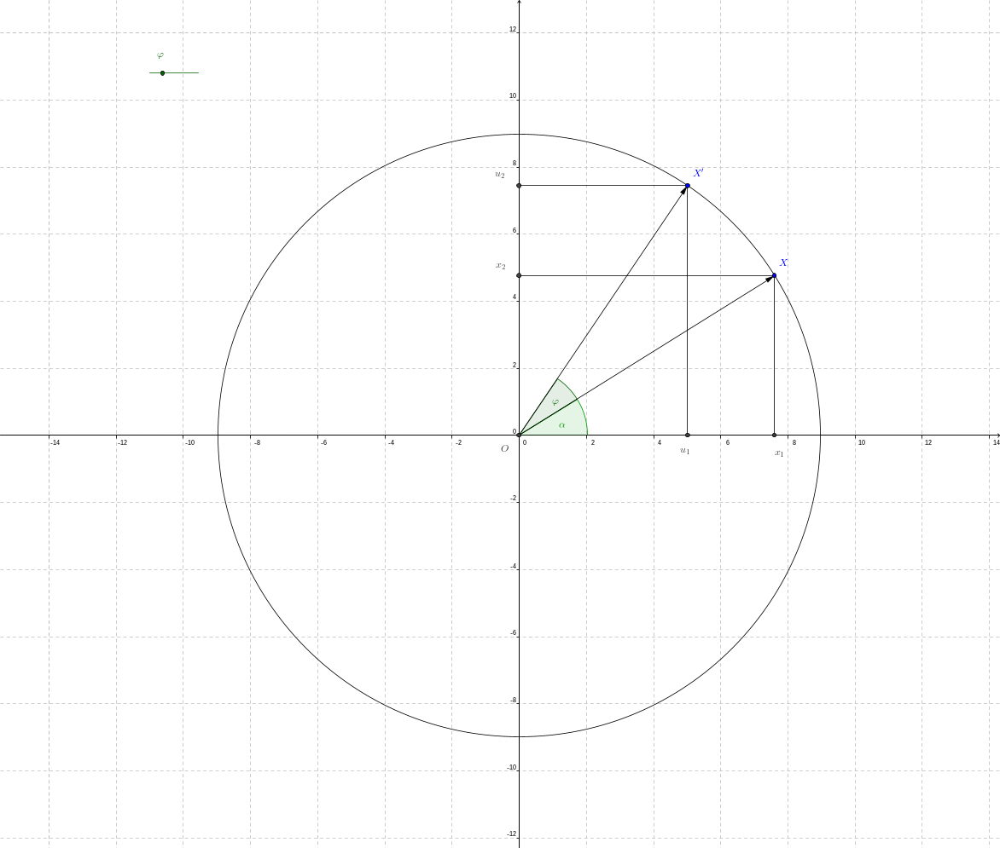

1. Die charakteristische Gleichung zur Matrix $A(\varphi)$ berechnet sich zu $$
  \det{\left({A-\lambda\cdot E}\right)}=
  \det{\left(\begin{array}{ll} \cos{\varphi}-\lambda & -\sin{\varphi} \\ \sin{\varphi} & \cos{\varphi}-\lambda\end{array}\right)}=
  \left(\cos{\varphi}-\lambda\right)^2+\left(\sin{\varphi}\right)^2=0
$$ Unter Anwendung der binomischen Formel und des trigonometrischen Pythagoras ergibt sich daraus äquivalent die Gleichung $$
  0=\lambda^2-2\cdot \lambda\cdot\cos{\varphi}+1
$$ Dies ist eine algebraische Gleichung vom Grad $2$ in der Unbekannten $\lambda$. Da für deren Diskriminante gilt $$
  D=4\cdot\left(\cos{\varphi}\right)^2-4<0\quad\leftrightarrow\quad \varphi\not\in\{0,\pi\}
$$ sind in diesen Fällen die Lösungen komplex nicht reell und ergeben sich mithilfe des Ansatzes $$
  \lambda^2-2\cdot \lambda\cdot\cos{\varphi}+1=(\lambda-\lambda_1)\cdot(\lambda-\bar{\lambda}_1)
$$ unter Benutzung des [Satzes von Vieta](https://de.wikipedia.org/wiki/Satz_von_Vieta) $$
  \lambda_{1}=\cos{\varphi}+i\cdot\sin{\varphi}\,,\quad \lambda_2=\bar{\lambda}_1
$$ worin $i$ mit $i^2=-1$ die imaginäre Einheit und $\lambda_2$ die zu $\lambda_1$ komplex konjugierte Zahl bezeichnen. Für $\varphi=0$ ergeben sich die doppelten, reellen Lösungen $\lambda_1=\lambda_2=1$, für $\varphi=\pi$ dagegen $\lambda_1=\lambda_2=-1$ (doppelte Eigenwerte).
2. Nun lassen sich die zu den Eigenwerten gehörenden Eigenvektoren berechnen. Zunächst soll für $\varphi=\pi$ der Eigenraum zum einzigen Eigenwert $\lambda_1=\lambda_2=-1$ berechnet werden. Das Gleichungssystem ergibt nach Einsetzen von $\varphi$ und $\lambda$ in die Eigenwertaufgabe $$
  \begin{pmatrix} -1-(-1) & 0 \\ 0 & -1-(-1) \end{pmatrix}\cdot\begin{pmatrix} x_1 \\ x_2 \end{pmatrix}=
  \begin{pmatrix} 0 \\ 0 \end{pmatrix}\quad\leadsto\quad
  \begin{pmatrix} x_1 \\ x_2 \end{pmatrix}=\begin{pmatrix} \mu \\ \nu \end{pmatrix}
$$ mit $(\mu,\nu)\in\mathbb{R}^2$. Jeder Vektor $x\in\mathbb{R}^2$ erfüllt die Eigenwertaufgabe und ist somit Eigenvektor zu $\lambda_1$, der Vektorraum $\mathbb{R}^2$ ist Eigenraum zu $\lambda_1$. Für den Fall $\varphi=0$ folgt ein analoges Resultat. Für $\varphi\not\in\{0,\pi\}$ ergeben sich Systeme nichtreeller Gleichungen, deren Lösungen sich nicht in $\mathbb{R}^2$ interpretieren lassen. Es berechnen sich die Eigenräume für $\lambda_1$ $$
  \begin{pmatrix} \cos{\varphi}-(\cos{\varphi}+i\cdot\sin{\varphi}) & -\sin{\varphi} \\ \sin{\varphi} & \cos{\varphi}-(\cos{\varphi}+i\cdot\sin{\varphi}) \end{pmatrix}\cdot
  \begin{pmatrix} x_1 \\ x_2 \end{pmatrix}=\sin{\varphi}\cdot
  \begin{pmatrix} i & -1 \\ 1 & i \end{pmatrix}\cdot\begin{pmatrix} x_1 \\ x_2 \end{pmatrix}=
  \begin{pmatrix} 0 \\ 0 \end{pmatrix}\quad\leftrightarrow\quad i\cdot x_1=x_2
$$ und somit der komplexe Untervektorraum aller Vektoren $$
  \begin{pmatrix} x_1 \\ x_2 \end{pmatrix}=\mu\cdot\begin{pmatrix} 1 \\ i \end{pmatrix}
$$ Analog ergibt sich für $\lambda_2$ der Eigenraum als komplexer Untervektorraum aller Vektoren $$
  \begin{pmatrix} x_1 \\ x_2 \end{pmatrix}=\nu\cdot\begin{pmatrix} 1 \\ -i \end{pmatrix}
$$

Die Berechnung des charakteristischen Polynoms sowie der Eigenwerte und -Vektoren einer reellen Matrix wird in den nachstehenden Videos an Beispielen zwei bzw. dreireihiger Matrizen erläutert.

!?[Eigenwert-Beispiel-1](https://www.youtube.com/watch?v=e_EE0EIuyJk&list=PLLTAHuUj-zHgMbsnuYFI4faJVawyKOM97&index=5)

!?[Eigenwert-Beispiel-2](https://www.youtube.com/watch?v=ATA9zVMVmDY&list=PLLTAHuUj-zHgMbsnuYFI4faJVawyKOM97&index=4)

Die Berechnung der Eigenwerte und Eigenvektoren lässt sich im nachfolgenden Berechnungsfenster unter Verwendung der Javascript-Bibliothek [Algebrite](http://algebrite.org) für symmetrische Matrizen $m$ mit numerischen Komponenten vornehmen.

1. Der Befehl `eigen(m)` berechnet Eigenwerte und Eigenvektoren und speichert diese (ohne Ausgabe) als Hauptdiagonalelemente in der Diagonalmatrix $D$ bzw. als Zeilenvektoren in der Matrix $Q$.
2. Die Befehle `eigenval(m)` beziehungsweise `eigenvec(m)` berechnen die Eigenwerte beziehungsweise Eigenvektoren der Matrix $m$.

```javascript
m=[[1,3],[3,2]]
eigenval(m)
eigenvec(m)
eigen(m)
lambda=D[1][1]
x=Q[1]
dot(m,x)-lambda*x
```
@Algebrite.eval


Eigenschaften
=====


Aus der Definition von Eigenwerten und Eigenvektoren einer Matrix lassen sich die folgenden Eigenschaften ableiten.

>**Satz 1.** Für eine reelle, $n$-reihige Matrix $A$ gelten die folgenden Eigenschaften:
>
>1. Die Determinante der Matrix $A$ ist das Produkt aller Eigenwerte[^2] $$
  \det{A}=\lambda_1\cdot\lambda_2\cdot\ldots\cdot\lambda_n
$$
>2. Die Zahl 'Null' ist genau dann ein Eigenwert der Matrix $A$, wenn $A$ singulär ist, d. h. für $\det{A}=0$.
>3. Die Menge aller Eigenvektoren zu einem Eigenwert $\lambda$ bildet einen Untervektorraum $U_\lambda$, den zu $\lambda$ gehörenden *Eigenraum*.
>4. Die Eigenräume zu verschiedenen Eigenwerten sind bis auf den Nullvektor $o$ verschieden., d. h. $$
  \lambda_i\not=\lambda_j\quad\to\quad U_{\lambda_i}\cap U_{\lambda_j}=\{o\}
$$

**Beweis.**

1. Das charakteristische Polynom von $A$ ist ein reelles Polynom $p_n(\lambda)$ und lässt unter Benutzung des Hauptsatzes der Algebra als Produkt von Linearfaktoren $(\lambda_j-\lambda)$ darstellen, worin $\lambda_j$ einen Eigenwert von $A$ bezeichnet. $$
  \det{(A-\lambda\cdot E)}=\prod_{j=1}^n{\left(\lambda_j-\lambda\right)}=
  (-1)^n\cdot\lambda^n+a_{n-1}\cdot\lambda^{n-1}+a_{n-2}\cdot\lambda^{n-2}+...+a_1\cdot\lambda+a_0=:p_n(\lambda)
$$ Das Absolutglied $a_0$ berechnet sich dabei aus der Produktdarstellung zu $$
  a_0=\prod_{j=1}^n{\lambda_j}=\lambda_1\cdot\lambda_2\cdot\ldots\cdot\lambda_n
$$ Anderseits gilt $$
  \det{A}=\det{(A-0\cdot E)}=p_n(0)=(-1)^n\cdot 0^n+a_{n-1}\cdot 0^{n-1}+a_{n-2}\cdot 0^{n-2}+...+a_1\cdot 0+a_0=a_0
$$
2. Die Zahl 'Null' ist ein Eigenwert der Matrix $A$ genau dann, wenn $$
  \det{(A-0\cdot E)}=\det{A}=0
$$ d. h. wenn die Matrix $A$ singulär ist.
3. Diese Eigenschaft folgt sofort aus der Berechnung der Eigenvektoren als Lösungen eines Systems linearer, homogener Gleichungen.
4. Ist $x$ ein Eigenvektor zu den Eigenwerten $\lambda_i$ und $\lambda_j$, d. h. gilt $x\in U_{\lambda_i}\cap U_{\lambda_j}$, so folgen $$
  A\cdot x=\lambda_i\cdot x\quad\text{und}\quad A\cdot x=\lambda_j\cdot x
$$ woraus unter der Annahme $\lambda_i\not=\lambda_j$ $$
  o=\lambda_i\cdot x-\lambda_j\cdot x=(\lambda_i-\lambda_j)\cdot x\quad\leadsto\quad x=o
$$ folgt.

$\square$

**Bemerkung 1.** Gilt für die Vielfachheit eines Eigenwertes $\lambda$ der Matrix $k>1$, d. h. tritt dieser Eigenwert mehrfach als Lösung der charakteristischen Gleichung auf, so ist die Dimension des zugehörigen Eigenraums höchstens $k$.

**Beispiel 3.** Zur reellen Matrix $$
  A=\begin{pmatrix} -1 & 2 & 2 \\ 2 & 2 & 2 \\ -3 & -6 & -6 \end{pmatrix}
$$ sind zu berechnen:

1. das charakteristische Polynom
2. die Eigenwerte $\lambda_j$
3. jeweils der zu $\lambda_j$ gehörende Eigenraum $U_{\lambda_j}$

---

1. Das charakteristische Polynom von $A$ berechnet sich beispielsweise mit der Regel von Sarrus zu $$
  \det{(A-\lambda\cdot E)}=(-1-\lambda)\cdot(2-\lambda)\cdot(-6-\lambda)-12-24+6\cdot(2-\lambda)+12\cdot(-1-\lambda)-4\cdot(-6-\lambda)=-\lambda^3-5\cdot\lambda^2-6\cdot\lambda
$$
2. Das charakteristische Polynom von $A$ besitzt das Absolutglied 'Null', woraus mit Satz 1 $\det{A}=0$ geschlossen werden kann. Hieraus folgt weiter, dass 'Null' ein Eigenwert der Matrix $A$ ist. Die Berechnung der Lösungen der charakteristischen Gleichung ergibt nach Ausklammern von $(-\lambda)$ $$
  -\lambda^3-5\cdot\lambda^2-6\cdot\lambda=-\lambda\cdot(\lambda^2+5\cdot\lambda+6)=0\quad\leftrightarrow\quad
  \lambda_1=0\;\vee\;\lambda_2=-2\;\vee\;\lambda_3=-3
$$
3. Für den Eigenwert $\lambda_1=0$ berechnen sich die Eigenvektoren aus dem homogenen, linearen Gleichungssystem $$
  (A-\lambda_1\cdot E)\cdot x=
  \begin{pmatrix} -1-0 & 2 & 2 \\ 2 & 2-0 & 2 \\ -3 & -6 & -6-0 \end{pmatrix}\cdot
  \begin{pmatrix} x_1 \\ x_2 \\ x_3 \end{pmatrix}=\begin{pmatrix} 0 \\ 0 \\ 0 \end{pmatrix}
  \quad\leadsto\quad
  \begin{pmatrix} x_1 \\ x_2 \\ x_3 \end{pmatrix}=\alpha\cdot\begin{pmatrix} 0 \\ 1 \\ -1 \end{pmatrix}
$$ worin für den auftretenden Parameter $\alpha\in\mathbb{R}$ gilt. Der Eigenraum $U_0$ ist der eindimensionale Untervektorraum[^3] $$
  U_0=\left\{\left.\begin{pmatrix} x_1 \\ x_2 \\ x_3 \end{pmatrix}=\alpha\cdot\begin{pmatrix} 0 \\ 1 \\ -1 \end{pmatrix}\right|\;\alpha\in\mathbb{R}\right\}
$$ Für jeden Vektor $x\in U_0$ gilt $A\cdot x=\lambda_1\cdot x=o$. (Bitte nachrechnen!) Für den Eigenwert $\lambda_2=-2$ berechnen sich die Eigenvektoren aus dem homogenen, linearen Gleichungssystem $$
  (A-\lambda_2\cdot E)\cdot x=
  \begin{pmatrix} -1-(-2) & 2 & 2 \\ 2 & 2-(-2) & 2 \\ -3 & -6 & -6-(-2) \end{pmatrix}\cdot
  \begin{pmatrix} x_1 \\ x_2 \\ x_3 \end{pmatrix}=\begin{pmatrix} 0 \\ 0 \\ 0 \end{pmatrix}
  \quad\leadsto\quad
  \begin{pmatrix} x_1 \\ x_2 \\ x_3 \end{pmatrix}=\beta\cdot\begin{pmatrix} -2 \\ 1 \\ 0 \end{pmatrix}
$$ worin für den auftretenden Parameter $\beta\in\mathbb{R}$ gilt. Der Eigenraum $U_{-2}$ ist der eindimensionale Untervektorraum[^3] $$
  U_{-2}=\left\{\left.\begin{pmatrix} x_1 \\ x_2 \\ x_3 \end{pmatrix}=\beta\cdot\begin{pmatrix} -2 \\ 1 \\ 0 \end{pmatrix}\right|\;\beta\in\mathbb{R}\right\}
$$ Für jeden Vektor $x\in U_{-2}$ gilt $A\cdot x=\lambda_2\cdot x=o$. (Bitte nachrechnen!) Für den Eigenwert $\lambda_3=-3$ berechnen sich die Eigenvektoren aus dem homogenen, linearen Gleichungssystem $$
  (A-\lambda_3\cdot E)\cdot x=
  \begin{pmatrix} -1-(-3) & 2 & 2 \\ 2 & 2-(-3) & 2 \\ -3 & -6 & -6-(-3) \end{pmatrix}\cdot
  \begin{pmatrix} x_1 \\ x_2 \\ x_3 \end{pmatrix}=\begin{pmatrix} 0 \\ 0 \\ 0 \end{pmatrix}
  \quad\leadsto\quad
  \begin{pmatrix} x_1 \\ x_2 \\ x_3 \end{pmatrix}=\gamma\cdot\begin{pmatrix} -1 \\ 0 \\ 1 \end{pmatrix}
$$ worin für den auftretenden Parameter $\gamma\in\mathbb{R}$ gilt. Der Eigenraum $U_{-3}$ ist der eindimensionale Untervektorraum[^3] $$
  U_{-3}=\left\{\left.\begin{pmatrix} x_1 \\ x_2 \\ x_3 \end{pmatrix}=\gamma\cdot\begin{pmatrix} -1 \\ 0 \\ 1 \end{pmatrix}\right|\;\gamma\in\mathbb{R}\right\}
$$ Für jeden Vektor $x\in U_{-3}$ gilt $A\cdot x=\lambda_3\cdot x=o$. (Bitte nachrechnen!)


Sicher gewusst
=====


Hier können Sie Ihr Wissen über Eigenwerte und -Vektoren testen.

**Frage 1.** Gegeben ist die reelle Matrix $$
  A=\begin{pmatrix} 3 & 2 & 4 \\ 2 & 0 & 2 \\ 4 & 2 & 3 \end{pmatrix}
$$ Entscheiden Sie, welcher der nachstehenden Vektoren ein Eigenvektor der Matrix $A$ ist.

[[ ]] $$x_1=\begin{pmatrix} 1 \\ -1 \\ 1 \end{pmatrix}$$
[[X]] $$x_2=\begin{pmatrix} 1 \\ -4 \\ 1 \end{pmatrix}$$
[[X]] $$x_3=\begin{pmatrix} 1 \\ 0 \\ -1 \end{pmatrix}$$
[[ ]] $$x_4=\begin{pmatrix} 0 \\ 0 \\ 0 \end{pmatrix}$$
[[?]] Ein Vektor $x\not=o$ heißt Eigenvektor zur Matrix $A$, wenn er für ein bestimmtes $\lambda$ die Eigenwertaufgabe $A\cdot x=\lambda\cdot x$ erfüllt. Siehe Definition 1.
****************************************

Wird der Vektor $x_1$ in die Eigenwertaufgabe eingesetzt, so ergibt sich $$
  A\cdot x_1=\begin{pmatrix} 5 \\ 4 \\ 5 \end{pmatrix}\not=\lambda\cdot\begin{pmatrix} 1 \\ -1 \\ 1 \end{pmatrix}
$$ für jede Wahl $\lambda\in\mathbb{R}$. Der Vektor $x_4=o$ ist per Definition kein Eigenvektor der Matrix $A$, obwohl $$
  A\cdot x_4=\begin{pmatrix} 0 \\ 0 \\ 0 \end{pmatrix}=\lambda\cdot\begin{pmatrix} 0 \\ 0 \\ 0 \end{pmatrix}\quad\forall\;\lambda\in\mathbb{R}
$$ Für die übrigen beiden Vektoren gilt jeweils $$
  A\cdot x_2=\begin{pmatrix} -1 \\ 4 \\ -1 \end{pmatrix}=\lambda\cdot\begin{pmatrix} 1 \\ -4 \\ 1 \end{pmatrix}\quad\text{sowie}\quad
  A\cdot x_3=\begin{pmatrix} -1 \\ 0 \\ 1 \end{pmatrix}=\lambda\cdot\begin{pmatrix} 1 \\ 0 \\ -1 \end{pmatrix}
$$ Diese Gleichungen sind jeweils für $\lambda=-1$ erfüllt, so dass $x_2$ und $x_3$ Eigenvektoren zum Eigenwert $\lambda=-1$ sind. Jede Linearkombination aus beiden Vektoren ist außerdem Eigenvektor zum gleichen Eigenwert, da $$
  A\cdot(\alpha\cdot x_2+\beta\cdot x_3)=\alpha\cdot (A\cdot x_2)+\beta\cdot(A\cdot x_3)=\alpha\cdot(-x_2)+\beta\cdot(-x_3)=(-1)\cdot(\alpha\cdot x_2+\beta\cdot x_3)
$$ gilt.

****************************************

Für die nachfolgenden beiden Fragen ist die reelle Matrix $$
  B=\begin{pmatrix} 3 & 1 & -1 \\ 2 & 2 & -1 \\ 2 & 2 & 0\end{pmatrix}
$$ gegeben.

**Frage 2.** Berechnen Sie alle Eigenwerte der Matrix $B$.

[(X)] $$(\lambda_1,\lambda_2,\lambda_3)=(1,2,2)$$
[( )] $$(\lambda_1,\lambda_2)=(1,2)$$
[( )] $$(\lambda_1,\lambda_2,\lambda_3)=(1,1,2)$$
[[?]] Berechnen Sie die charakteristische Gleichung $\det{(A-\lambda\cdot E)}=0$ und bestimmen darin die Lösungen $\lambda$.
****************************************

Die Matrix $B$ ist eine dreireihige Matrix mit dem charakteristischen Polynom $$
  \det{(A-\lambda\cdot E)}=
  \det{\begin{pmatrix} 3-\lambda & 1 & -1 \\ 2 & 2-\lambda & -1 \\ 2 & 2 & -\lambda\end{pmatrix}}=
  -\lambda^3+5\cdot\lambda^2-8\cdot\lambda+4=(1-\lambda)\cdot(2-\lambda)^2
$$ Hieraus lassen sich die Lösungen der zugehörigen charakteristischen Gleichung $\lambda_1=1$ (einfach) und $\lambda_2=\lambda_3=2$ (doppelt) ablesen.

****************************************

**Frage 3.** Berechnen Sie zur Matrix $B$ den Eigenraum $U_2$ zum Eigenwert $\lambda=2$.

[( )] $$ U_{2}=\left\{\left.\begin{pmatrix} x_1 \\ x_2 \\ x_3 \end{pmatrix}=\alpha\cdot\begin{pmatrix} 1 \\ 0 \\ 2 \end{pmatrix}+\beta\cdot\begin{pmatrix} 1 \\ 1 \\ 2 \end{pmatrix}\right|\;\alpha\in\mathbb{R},\; \beta\in\mathbb{R}\right\} $$
[( )] $$ U_{2}=\left\{\left.\begin{pmatrix} x_1 \\ x_2 \\ x_3 \end{pmatrix}=\gamma\cdot\begin{pmatrix} 1 \\ 0 \\ 2 \end{pmatrix}\right|\;\gamma\in\mathbb{R}\right\} $$
[(X)] $$ U_{2}=\left\{\left.\begin{pmatrix} x_1 \\ x_2 \\ x_3 \end{pmatrix}=\delta\cdot\begin{pmatrix} 1 \\ 1 \\ 2 \end{pmatrix}\right|\;\delta\in\mathbb{R}\right\} $$
[[?]] Setzen Sie zur Berechnung den Eigenwert $\lambda=2$ in die Eigenwertaufgabe $(B-\lambda\cdot E)\cdot x=o$ ein und berechnen Sie die Lösung des Gleichungssystems.
****************************************

Nach Einsetzen des Eigenwertes $\lambda=2$ in die Eigenwertaufgabe wird das homogene, lineare Gleichungssystem erhalten $$
  \begin{pmatrix} 3-2 & 1 & -1 \\ 2 & 2-2 & -1 \\ 2 & 2 & -2\end{pmatrix}\cdot
  \begin{pmatrix} x_1 \\ x_2 \\ x_3 \end{pmatrix}=
  \begin{pmatrix} 0 \\ 0 \\ 0 \end{pmatrix}
$$ Dessen Lösung berechnet sich zu $$
  \begin{pmatrix} x_1 \\ x_2 \\ x_3 \end{pmatrix}=\delta\cdot\begin{pmatrix} 1 \\ 1 \\ 2 \end{pmatrix}\,,\quad \delta\in\mathbb{R}
$$ Dies lässt sich durch Einsetzen in die Eigenwertaufgabe prüfen $$
  \begin{pmatrix} 3 & 1 & -1 \\ 2 & 2 & -1 \\ 2 & 2 & 0\end{pmatrix}\cdot
  \begin{pmatrix} 1 \\ 1 \\ 2 \end{pmatrix}=
  \begin{pmatrix} 2 \\ 2 \\ 4 \end{pmatrix}=
  2\cdot\begin{pmatrix} 1 \\ 1 \\ 2 \end{pmatrix}
$$ Der Eigenraum besitzt hier die Dimension $3-2=1$, da der Rang der Koeffizientenmatrix zwei ist. (Die Zeilen eins und drei der Koeffizientenmatrix des Gleichungssystems sind identisch.

****************************************


[^1]: Die Punkte der Spiegelachse sind Fixpunkte unter Geradenspiegelung. Für deren Ortsvektoren gelten also $x'=1\cdot x$.

[^2]: Tritt ein Eigenwert $\lambda_j$ mehrfach auf, so ist dieser entsprechend seiner Vielfachheit zu berücksichtigen.

[^3]: Nach Definition ist der Nullvektor $o$ kein Eigenvektor einer Matrix $A$, so dass dieser streng genommen aus $U_0$ zu entfernen ist.


## Analytische Geometrie


Die analytische Geometrie beschäftigt sich mit Eigenschaften ausgezeichneter Punktmengen in der Ebene oder im dreidimensionalen Raum und verwendet algebraische Methoden - vor allem der linearen Algebra - zur Beantwortung von Fragen beispielsweise zur relativen Lage von Punkten, Geraden und Ebenen.

Für einen Überblick über die Themen dieses Kapitels sehen Sie in der nachstehenden Graphik einige zentrale Begriffe. Schlagen Sie diese in diesem Abschnitt nach.

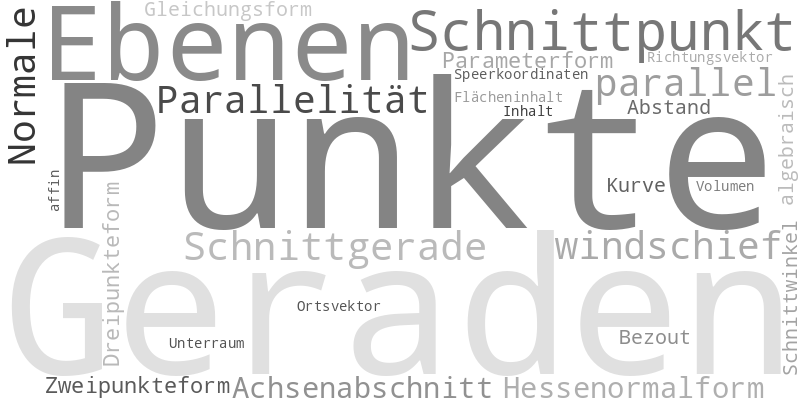<!-- style="display: block; margin-left: auto; margin-right: auto; max-width: 1000px;" -->


Lernziele
-----


* Sie kennen ..


### Affine Räume


In diesem Abschnitt wird der überfällige Zusammenhang zwischen Punkten und Vektoren betrachtet.

>**Definition 1.** Ein [affiner Raum](https://de.wikipedia.org/wiki/Affiner_Raum) $\mathcal{A}$ ist ein Tripel $(\mathcal{P}, \mathcal{V},\alpha)$, bestehend aus einer nichtleeren Menge $\mathcal{P}$, einem reellen Vektorraum $\mathcal{V}$ und einer Abbildung $$
  \alpha: \mathcal{P}\times\mathcal{P}\longrightarrow \mathcal{V}
$$ so dass gilt:
>
>1. Zu jedem Punkt $P\in\mathcal{P}$ und jedem Vektor  $v\in\mathcal{V}$ gibt es genau einen Punkt $Q\in\mathcal{P}$ mit $\alpha(P,Q)=v$.
>2. Für jeweils drei beliebige Punkte $P\in\mathcal{P}$, $Q\in\mathcal{P}$ und $R\in\mathcal{P}$ gilt $$ \alpha(P,Q)+\alpha(Q,R)=\alpha(P,R)$$
>
> Die Elemente von $\mathcal{P}$ heißen **Punkte** des affinen Raumes $\mathcal{A}$.
>
> Die Dimension des affinen Raumes $\mathcal{A}$ ist definiert durch $$\operatorname{dim}(\mathcal{A})=\operatorname{dim}(\mathcal{V})$$ d. h. vermöge des zugehörenden Verkorraumes. 

**Bemerkung 1.** Für $\mathcal{P}=\mathcal{V}=\mathbb{R}^n$ schreiben wir auch $\overrightarrow{PQ}$ anstelle von $\alpha(P,Q)$.

Aus Definition 1 lassen sich zunächst zwei einfache Eigenschaften der Abbildung $\alpha$ ableiten:

* Für $P=Q=R$ erhalten wir aus der Eigenschaft 2. sofort $$
  \alpha(P,P)+\alpha(P,P)=2\cdot \alpha(P,P)=\alpha(P,P)
$$ und somit $\alpha(P,P)=\mathcal{o}$, worin $\mathcal{o}$ den Nullvektor in $\mathcal{V}$ bezeichnet.
* Hingegen bekommen wir für $P=R$ $$
  \alpha(P,Q)+\alpha(Q,P)=\alpha(P,P)=\mathcal{o}
$$ und daher $\alpha(Q,P)=-\alpha(P,Q)$.


**Bemerkung 2.** Zeichnen wir in einem affinen Raum $\mathcal{A}=(\mathcal{P},\mathcal{V},\alpha)$ einen Punkt $O\in\mathcal{P}$ aus, so erhalten wir mittels der Eigenschaft 1 aus Definition 1 eine von $O$ abhängige, eineindeutige Zuordnung zwischen den Punkten in $\mathcal{P}$ und den Vektoren in $\mathcal{V}$. Diese Zuordnung kann durch die Abbildung $$
  \beta:\mathcal{P}\longrightarrow\mathcal{V}\quad\text{mit}\quad \beta(P)=\alpha(O,P)\in\mathcal{V}
$$ beschrieben werden.

>**Definition 2.**
>Es sei $\mathcal{A}=(\mathcal{P},\mathcal{V},\alpha)$ ein affiner Raum, der Punkt $O\in\mathcal{P}$ beliebig aber fest gewählt sowie  die Abbildung $$
  \beta:\mathcal{P}\longrightarrow\mathcal{V}\quad\text{mit}\quad\beta(P)=\alpha(O,P)\in\mathcal{V}
$$
>Dann heißt der Vektor $v=\beta(P)$ [Ortsvektor](https://de.wikipedia.org/wiki/Ortsvektor) des Punktes $P$.

**Beispiel 1.** Wählen wir in der Definition 1 für die Punktmenge $\mathcal{P}$ die Menge $\mathbb{R}^3$, für den Vektorraum $\mathcal{V}$ den reellen Vektorraum $\mathbb{R}^3$  und $$
  \alpha(P,Q)=Q-P
$$ für beliebige $P, Q\in\mathcal{P}=\mathbb{R}^3$, so ist $\mathcal{A}=(\mathcal{P},\mathcal{V},\alpha)$ ein $3$-dimensionaler affiner Raum, denn es gilt mit Definition 1:

1. Für einen beliebigen Punkt $P\in\mathbb{R}^3$ und einen beliebigen Vektor $v\in\mathbb{R}^3$ ist $Q=P+v\in\mathcal{P}$ und $\alpha(P,Q)=Q-P=P+v-P=v$.
2. Für beliebige $P, Q, R\in\mathcal{P}$ ist $\alpha(P,Q)+\alpha(Q,R)=(Q-P) + (R-Q) = R-P=\alpha(P,R)$.

In diesem Beispiel kommen den Elementen der Menge $\mathbb{R}^3$ zwei unterschiedliche Bedeutungen zu: zum einen als Punkte des affinen Raumes, zum anderen als Verschiebungsvektoren, vermittelt durch die Abbildung $\alpha$.

Zeichnen wir in $\mathbb{R}^3$ den Punkt $O=(0,0,0)^\top$ aus, so gilt für die Abbildung $\beta:\mathcal{P}\longrightarrow\mathcal{V}$ aus Definition 2: $$
  \beta(P)=\alpha(O,P)=P-O=P\quad\text{für alle}\quad P\in\mathcal{P}
$$ Somit ist $\beta$ die Identität auf $\mathcal{P}$ und jeder Punkt stimmt gleichzeitig mit seinem Ortsvektor überein.

Wir führen nun den Begriff eines affinen Unterraumes ein:

>**Definition 3.** Ist $\mathcal{A}=(\mathcal{P},\mathcal{V},\alpha)$ ein affiner Raum, $\mathcal{P}_0$ eine Teilmenge von $\mathcal{P}$ und die Menge $$
  \mathcal{V}_0=\left\{\alpha(P,Q)\;\middle |\; P,Q\in\mathcal{P}_0\right\}\subseteq\mathcal{V}
$$ ein Untervektorraum von $\mathcal{V}$, so ist $$
  \mathcal{A}_0=(\mathcal{P}_0,\mathcal{V}_0,\alpha_0)\quad\text{mit}\quad\alpha_0(P,Q)=\alpha(P,Q)\quad\text{für}\quad P\in\mathcal{P}_0\,,Q\in\mathcal{P}_0
$$ ein [affiner Unterraum](https://de.wikipedia.org/wiki/Affiner_Raum) von $\mathcal{A}$.

**Beispiel 2.** Es sei $\mathcal{A}$ der affine Raum aus Beispiel 1. Für $a\in\mathbb{R}^3$ und $b\in\mathbb{R}^3$ setzen wir $$
  \mathcal{P}_0=\left\{a+\lambda\cdot b\,\middle |\; \lambda\in\mathbb{R}\right\}\subseteq\mathcal{P}
$$ Dann ist $\mathcal{P}_0$ Punktmenge des affinen Unterraumes $\mathcal{A}_0=(\mathcal{P}_0,\mathcal{V}_0,\alpha_0)$ mit dem Untervektorraum $$
  \mathcal{V}_0=\left\{\alpha(P,Q)\;\middle |\; P,Q\in\mathcal{P}_0\right\}=\left\{\lambda\cdot b\;\middle |\;\lambda\in\mathbb{R}\right\}
$$ von $\mathcal{V}$ und $\alpha_0(P,Q)=\alpha(P,Q)=Q-P$ für $P, Q\in\mathcal{P}_0$.

Dabei gilt $$\operatorname{dim}(\mathcal{A}_0)=\left\{\begin{array}{ccc} 0 &,\text{falls}& b=(0,0,0)^\top\\ 1 &,\text{falls}& b\neq (0,0,0)^\top \end{array}\right.$$

Für $\operatorname{dim}(\mathcal{A}_0)=0$ ist $\mathcal{P}_0=\{a\}$ und der affine Raum besteht aus einem einzelnen Punkt. Ist hingegen $\operatorname{dim}(\mathcal{A}_0)=1$, so beschreiben die Punkte eine Gerade in $\mathbb{R}^3$.

**Beispiel 3.** Für $A\in\mathbb{R}^{m,n}$ und $b\in\mathbb{R}^n$ betrachten wir das lineare Gleichungssystem $Ax=b$. Dieses ist genau dann lösbar, wenn $$
  \operatorname{Rang}(A)=\operatorname{Rang}(A|b)
$$ gilt. In diesem Fall ist die Lösungsmenge die Punktmenge eines affinen Unterraumes $\mathcal{A}$ von $\mathbb{R}^n$ der Dimension $n-\operatorname{Rang}(A)$.

Denn die Menge $\mathcal{V}=\left\{x\in\mathbb{R}^n\;\middle |\; Ax=\mathcal{o}\right\}\subseteq \mathbb{R}^n$ ist ein Untervektorraum der Dimension $n-\operatorname{Rang}(A)$ und für $$
  x, y\in \mathcal{P}=\left\{x\in\mathbb{R}^n\;\middle |\; Ax=b\right\}
$$ gilt $$ Ay-Ax=b-b=\mathcal{o}=A(y-x) $$ d. h. $\alpha(x,y)=y-x\in\mathcal{V}$.


### Grundelemente in der Ebene


In diesem Abschnitt wird die Darstellung von Grundelementen des affinen Raumes $\mathbb{R}^2$ betrachtet.

Ein Punkt des affinen Raumes $\mathbb{R}^2$ ist ein Element der Menge $\mathbb{R}^2$, zum Beispiel $$ A=\left(\begin{array}{c}1\\2\end{array}\right) $$

Durch je zwei verschiedene Punkte $A$ und $B$ in $\mathbb{R}^2$ wird eindeutig eine Gerade festgelegt. Umgekehrt ist jede Gerade durch zwei verschiedene auf ihr liegende Punkte eindeutig bestimmt.            

<!-- style="background-color: lightgray;"-->
>**Darstellung von Geraden**
>
>* *Allgemeine Gleichung*. Jede Gerade in $\mathbb{R}^2$ kann durch eine lineare Gleichung der Form $$ a\cdot x + b\cdot y +c =0\quad\text{mit}\quad a, b, c\in\mathbb{R}\quad\text{und}\quad a^2+b^2\neq 0 $$ beschrieben werden. Ein Punkt $P=(x_1,x_2)^\top\in\mathbb{R}^2$ liegt genau dann auf der Gerade, wenn die Gleichung $$ a\cdot x_1+b\cdot x_2+c=0 $$ erfüllt ist.
>* *Parameterdarstellung*. Sind $A, B\in\mathbb{R}^2$ mit $A\neq B$ zwei verschiedene Punkte und $g$ die eindeutig durch $A$ und $B$ festgelegte Gerade. Dann kann jeder Punkt $X$ von  $g$ durch die Gleichung $$
  X=A+\lambda\cdot (B-A)=A+\lambda\cdot \overrightarrow{AB}\quad\text{mit}\quad \lambda\in\mathbb{R}
$$ beschrieben werden. Der Vektor $\overrightarrow{AB}$ ist dann ein **Richtungsvektor** von $g$.
>* *Normalengleichung*. Jede Gerade $g$ kann durch einen Normalenvektor $n\in\mathbb{R}^2$ und einen auf ihr liegenden Punkt $A\in\mathbb{R}^2$ durch $$
  n\cdot (X-A)=n\cdot \overrightarrow{AX}=0
$$ angegeben werden. Der Punkt $X\in\mathbb{R}^2$ liegt genau dann auf $g$, wenn die Gleichung erfüllt ist. Ist der Vektor $n$ normiert, d. h. $|n|=1$, so heißt diese Gleichung [Hessesche Normalform](https://de.wikipedia.org/wiki/Hessesche_Normalform) von $g$.


**Beispiel 1.** Gegeben seien die beiden Punkte $A=(1,2)^\top$ und $B=(3,-1)^\top$ in $\mathbb{R}^2$ und $g$ die durch $A$ und $B$ eindeutig festgelegte Gerade. Hieraus berechnen sich: 

1. Eine Gleichung der Geraden $g$ durch Einsetzen der Punktkoordinaten in die allgemeine Gleichung $a\cdot x+b\cdot y+c=0$ mit zu bestimmenden reellen Koeffizienten $a$, $b$ und $c$. $$ \left\{\begin{array}{rrr} a+2b+c & = & 0 \\ 3a-b+c & = & 0\end{array}\right.\quad\leftrightarrow\quad(a,b,c)=\lambda\cdot(3,2,-7)\quad\leadsto\quad 3\cdot x+2\cdot y-7=0 $$ worin $\lambda\in\mathbb{R}^\times$ jede von Null verschiedene, reelle Zahl sein darf. 
2. Eine mögliche Parameterdarstellung von $g$ gemäß $$ X=\left(\begin{array}{c}x\\y\end{array}\right)=\left(\begin{array}{c}1\\2\end{array}\right)+\lambda\cdot \left(\begin{array}{c}2\\-3\end{array}\right)\quad\,,\;\lambda\in\mathbb{R} $$ worin $$ \left(\begin{array}{c}1\\2\end{array}\right)\quad\text{bzw.}\quad \left(\begin{array}{c}2\\-3\end{array}\right)=\left(\begin{array}{c}3\\-1\end{array}\right)-\left(\begin{array}{c}1\\2\end{array}\right) $$ mögliche Stütz- beziehungsweise Richtungsvektor von $g$ darstellen.
3. Des Weiteren ist der Vektor $n=\left(\begin{array}{c}3\\2\end{array}\right)$ orthogonal zu jedem Richtungsvektor von $g$, denn: $$ n\cdot \overrightarrow{AB}=\left(\begin{array}{c}3\\2\end{array}\right)\cdot \left(\begin{array}{c}2\\-3\end{array}\right)=3\cdot 2+2\cdot (-3)=0 $$ Damit ist $n$ ein Normalenvektor von $g$ und die Gerade kann durch die Normalengleichung $$n\cdot (X-A)=\left(\begin{array}{c}3\\2\end{array}\right)\cdot \left(\begin{array}{c}x-1\\y-2\end{array}\right)=0$$ beschrieben werden.

**Bemerkung 1.** Für $|n|=1$ bezeichnet das Absolutglied in der Geradengleichung (Hessesche Normalform) den orientierten Abstand der Geraden $g$ vom Koordinatenursprung.

**Bemerkung 2.** Jede allgemeine Gleichung einer Geraden $g$, die nicht parallel zu einer der beiden Koordinatenachsen liegt, lässt sich in der Form $$ a\cdot x_1+b\cdot x_2+c=0 \quad\leftrightarrow\quad\frac{x}{\alpha}+\frac{y}{\beta}=1 $$ angeben, worin $\alpha=-\frac{c}{a}$ und $\beta=-\frac{c}{b}$ gelten. Die rechte Form wird **Achsenabschnittsform** genannt. Mithilfe der Koeffizienten $a$, $b$ und $c$ in der allgemeinen Gleichung lassen sich somit die Achsenabschnitte $\alpha$ und $\beta$ auf $x$- und $y$-Achse angeben.

**Beispiel 2.** Die Gerade $h$ mit der allgemeinen Gleichung $x-2y+3=0$ besitzt die Achsenabschnittsform $$ \frac{x}{-3}+\frac{y}{\frac{3}{2}}=1 $$ Die Achsenabschnitte auf $x$- beziehungsweise $y$-Achse sind $\alpha=-3$ beziehungsweise $\beta=\frac{3}{2}$.


Sicher gewusst
===


Hier können Sie Ihr Wissen zur Darstellung von Geraden testen.

**Frage 1.** Zu zwei verschiedenen Punkten $P_1(x_1,y_1)$ und $P_2(x_2,y_2)$ lässt sich die Determinantengleichung $$ \det{\begin{pmatrix} 1 & x & y \\ 1 & x_1 & y_1 \\ 1 & x_2 & y_2 \end{pmatrix}}=0 $$ angeben, worin $(x,y)$ die Koordinaten eines allgemeinen Punktes bezeichnen. Die Lösungsmenge $$ \mathcal{L}=\left\{(x,y)\in\mathbb{R}^2:\det{\begin{pmatrix} 1 & x & y \\ 1 & x_1 & y_1 \\ 1 & x_2 & y_2 \end{pmatrix}}=0\right\} $$ der Gleichung beschreibt

[(X)] die Gerade $h=P_1P_2$.
[( )] die Punkte $P_1$ und $P_2$, jedoch keinen weiteren Punkt der Geraden $h=P_1P_2$.
[[?]] Berechnen Sie die Determinante der obigen Gleichung.
****************************************

Werden die Koordinaten der Punkte $P_1$ beziehungsweise $P_2$ in die Matrix eingesetzt, entstehen linear abhängige Zeilen. Die Matrix ist somit singular, ihre Determinante besitzt den Wert Null. Mit den Rechenregeln für Determinanten folgt, dass für einen beliebigen Punkt $P_0\in h$ mit $$ P(x_0,y_0)\quad\sim\quad \begin{pmatrix} x_0 \\ y_0 \end{pmatrix}=\lambda\cdot\begin{pmatrix} x_1 \\ y_1 \end{pmatrix}+(1-\lambda)\cdot\begin{pmatrix} x_2 \\ y_2 \end{pmatrix} $$ folgt $$ \det{\begin{pmatrix} 1 & x_0 & y_0 \\ 1 & x_1 & y_1 \\ 1 & x_2 & y_2 \end{pmatrix}}=\det{\begin{pmatrix} \lambda+(1-\lambda) & \lambda\cdot x_1+(1-\lambda)\cdot x_2 & \lambda\cdot y_1+(1-\lambda)\cdot y_2 \\ 1 & x_1 & y_1 \\ 1 & x_2 & y_2 \end{pmatrix}}=\det{\begin{pmatrix} \lambda & \lambda\cdot x_1 & \lambda\cdot y_1 \\ 1 & x_1 & y_1 \\ 1 & x_2 & y_2 \end{pmatrix}}=\lambda\cdot\det{\begin{pmatrix} 1 & x_1 & y_1 \\ 1 & x_1 & y_1 \\ 1 & x_2 & y_2 \end{pmatrix}}=\lambda\cdot 0=0 $$

****************************************


### Grundelemente im  Raum


In diesem Abschnitt wird die Darstellung von Grundelementen des affinen Raumes $\mathbb{R}^3$ betrachtet.

Punkte, Geraden und Ebenen in $\mathbb{R}^3$ sind genau die $0$-, $1$- und $2$-dimensionalen affinen Unterräume des affinen Raumes $\mathbb{R}^3$. Siehe auch den Abschnitt [Affine Räume](#Affine-Räume).

Ein Punkt des affinen Raumes $\mathbb{R}^3$ ist ein Element der Menge $\mathbb{R}^2$, zum Beispiel $$ A=\left(\begin{array}{c}1\\2\\3\end{array}\right) $$

Durch je zwei verschiedene Punkte $A$ und $B$ in $\mathbb{R}^3$ wird eindeutig eine Gerade festgelegt. Umgekehrt ist jede Gerade durch zwei verschiedene auf ihr liegende Punkte eindeutig bestimmt.            

<!-- style="background-color: lightgray;"-->
> **Darstellung von Geraden**
>
>* *Lösungsmenge zweier linearer Gleichungen.* Die Lösungsmenge zweier[^1] linearer Gleichungen $$ \left\{\begin{array}{rrr} a_1\cdot x_1+b_1\cdot x_2+c_1\cdot x_3+d_1 & = & 0 \\ a_2\cdot x_1+b_2\cdot x_2+c_2\cdot x_3+d_2 & = & 0 \end{array}\right. $$ mit $a_i, b_i, c_i, d_i\in\mathbb{R}$ für $i\in\{1,2\}$ ist genau dann die Punktemenge einer Gerade in $\mathbb{R}^3$, wenn die beiden Vektoren $$ (a_1,b_1,c_1)^\top\quad\text{und}\quad (a_2,b_2,c_2)^\top $$ linear unabhängig sind. Umgekehrt lässt sich jede Gerade durch zwei lineare Gleichungen dieser Form beschreiben.
>
>* *Parameterdarstellung.* Sind $A$ und $B$ zwei verschiedene Punkte des $\mathbb{R}^3$, so kann jeder Punkt $X\in\mathbb{R}^3$ der durch $A$ und $B$ eindeutig festgelegten Geraden durch $$X=A+\lambda\cdot (B-A)=A+\lambda\cdot\overrightarrow{AB}$$ mit $\lambda\in\mathbb{R}$ berechnet werden.

Durch je drei verschiedene Punkte $P$, $Q$ und $R$ in $\mathbb{R}^3$ wird eindeutig eine Ebene festgelegt, wenn die Punkte ein eigentliches Dreieck bilden. Umgekehrt ist jede Ebene durch drei nicht auf einer Geraden liegende Punkte eindeutig bestimmt.            

<!-- style="background-color: lightgray;"-->
>**Darstellung von Ebenen**
>
>* *Lösungsmenge einer linearen Gleichung.* Die Lösungsmenge einer linearen Gleichung der Form $$
  a\cdot x_1+b\cdot x_2+c\cdot x_3+d=0\quad\text{mit}\quad a^2+b^2+c^2\neq 0
$$ ist die Punktmenge einer Ebene $E$ in $\mathbb{R}^3$. Der Punkt $(x,y,z)^\top\in\mathbb{R}^3$ liegt genau dann in $E$, wenn seine Koordinaten die Gleichung lösen. Umgekehrt ist jede Ebene Lösungsmenge einer solchen Gleichung.
>* *Parameterdarstellung.* Sind $P, Q, R\in\mathbb{R}^3$ drei Punkte einer Ebene $E$, welche nicht auf einer gemeinsamen Geraden liegen, so kann jeder Punkt $X$ der Ebene durch die Gleichung $$X=P+\lambda\cdot \left(Q-P\right)+\mu\cdot\left(R-P\right)=P+\lambda\cdot\overrightarrow{PQ}+\mu\cdot\overrightarrow{PR}$$ mit $\lambda, \mu\in\mathbb{R}$ angegeben werden. Der Punkt $P$ wird manchmal **Aufpunkt** von $E$ genannt und die beiden Vektoren $Q-P$ und $R-P$ sind **Richtungsvektoren** der Ebene.
>
>* *Normalenform.* Sind $P, Q, R\in\mathbb{R}^3$ drei Punkte einer Ebene $E$, welche nicht auf einer gemeinsamen Geraden liegen, so kann jeder Punkt $X$ der Ebene durch die Gleichung $$ n\cdot\left(X-P\right)=n\cdot\overrightarrow{PX}=0 $$ mit $$n=(Q-P)\times (R-P)=\overrightarrow{PQ}\times\overrightarrow{PR}$$ beschrieben werden. Hierbei ist $\times$ das Vektorprodukt in $\mathbb{R}^3$. Speziell für Vektoren $n$ der Norm/Länge $|n|=1$ heißt diese Normalengleichung auch [Hessesche Normalform](https://de.wikipedia.org/wiki/Hessesche_Normalform) von $E$. Der Vektor $n$ ist dann ein **Einheitsnormalenvektor** der Ebene $E$.

[^1]: In $\mathbb{R}^3$ kann eine Gerade nicht, wie im Fall des $\mathbb{R}^2$, durch eine einzelne lineare Gleichung beschrieben werden.


### Lage in der Ebene


In diesem Abschnitt sollen nun die relative Lage von Grundelementen der Ebene und nachfolgend des dreidimensionalen Raumes betrachtet werden.


Punkt und Gerade
===


Ist $A$ ein Punkt und $g$ eine Gerade in $\mathbb{R}^2$, so werden genau zwei Fälle ihrer gegenseitigen Lage unterschieden: Entweder der Punkt $A$ liegt auf der Geraden $g$ oder $A$ liegt nicht auf $g$.

**Beispiel 1.** Gegeben seien die Punkte $P=(1,2)^\top$, $Q(-9,1)^\top$ und die Gerade $g$ durch die Parameterdarstellung $$ \left(\begin{array}{cc}x\\y\end{array}\right)=\left(\begin{array}{cc}-1\\3\end{array}\right)+\lambda\cdot \left(\begin{array}{cc}4\\1\end{array}\right) $$ mit mit dem Parameter $\lambda\in\mathbb{R}$. Der Punkt $P$ liegt auf $g$, falls ein Parameterwert $\lambda$ existiert, mit dem $P$ sich eindeutig in der Parameterdarstellung von $g$ berechnen lässt. Wegen $$ \left(\begin{array}{cc}-1\\3\end{array}\right)+\lambda\cdot \left(\begin{array}{cc}4\\1\end{array}\right) = \left(\begin{array}{cc}1\\2\end{array}\right)\quad\leftrightarrow\quad (-1+4\cdot \lambda =1) \;\land\; (3+\lambda =2) $$ nimmt der Parameter in den einzelnen Gleichungen die Werte $\frac{1}{2}$ beziehungsweise $-1$ an. Damit liegt der Punkt $P$ nicht auf der Geraden $g$. Andererseits gilt für den Punkt $Q$ $$ \left(\begin{array}{cc}-1\\3\end{array}\right)+\lambda\cdot \left(\begin{array}{cc}4\\1\end{array}\right) = \left(\begin{array}{cc}-9\\1\end{array}\right)\quad\leftrightarrow\quad (-1+4\cdot \lambda =-9) \;\land\; (3+\lambda =1)\quad\leftrightarrow\quad \lambda=-2 $$ Somit liegt $Q$ auf $g$.

Alternativ lässt sich die Parameterdarstellung von $g$ in eine Gleichungsdarstellung, d. h. eine lineare Gleichung in den Unbekannten $x$ und $y$ umwandeln. Aus der Parameterdarstellung liest man deren Koordinatendarstellungen ab $$ x=-1+4\cdot \lambda \;\land\; y=3+\lambda $$ woraus sich der Parameter $\lambda$ beispielsweise mittels $$ x-4\cdot y = -1+4\lambda-4\cdot (3+\lambda)=-1+4\lambda -12-4\lambda = -13 $$ eliminieren lässt, d. h. die Gerade $g$ wird beschrieben durch die Gleichung $x-4\cdot y+13=0$. Hiermit lassen sich zeigen $P\not\in g$, da $1-4\cdot 2+13=6\not=0$ sowie $Q\in g$, da $-9-4\cdot 1+13=0$.


Zwei Geraden
===


Für zwei Geraden $g$ und $h$ in $\mathbb{R}^2$ sind die folgenden Lagebeziehungen möglich:

* $g$ und $h$ sind identisch (und damit auch parallel)
* $g$ und $h$ schneiden sich in genau einem Punkt
* $g$ und $h$ sind *echt* parallel (und besitzen damit keinen gemeinsamen Punkt)

Die gegenseitige Lage zweier Geraden in $\mathbb{R}^2$ lässt sich somit anhand der Menge der gemeinsamen Punkte kennzeichnen. Werden $g$ und $h$ jeweils durch eine Gleichung in den Variablen $x$ und $y$ beschrieben, so ist die Menge gemeinamer Punkte durch ein System linearer Gleichungen vom Typ $(2,2)$ beschrieben, siehe auch die Abschnitte [Determinanten](#Determinanten) und [Grundelemente in der Ebene](#Grundelemente-in-der-Ebene).

Sind abweichend beide Geraden durch eine Parameterdarstellung gegeben, so sind die gemeinsamen Punkte durch Gleichsetzen der Parameterdarstellungen berechenbar.

**Beispiel 2.** Gegeben seien die Gerade $g$ durch die Parameterdarstellung $$ \left(\begin{array}{cc}x\\y\end{array}\right)=\left(\begin{array}{cc}-1\\3\end{array}\right)+\lambda\cdot \left(\begin{array}{cc}4\\1\end{array}\right)\;\text{mit}\;\lambda\in\mathbb{R} $$ sowie die Gerade $h$ durch $$ \left(\begin{array}{cc}x\\y\end{array}\right)=\left(\begin{array}{cc}-1\\2\end{array}\right)+\mu\cdot \left(\begin{array}{cc}8\\2\end{array}\right)\;\text{mit}\;\mu\in\mathbb{R} $$ Für die Berechnung der gemeinsamen Punkte werden beide Parameterdarstellungen gleichgesetzt $$ \left(\begin{array}{cc}-1\\3\end{array}\right)+\lambda\cdot \left(\begin{array}{cc}4\\1\end{array}\right)=\left(\begin{array}{cc}-1\\2\end{array}\right)+\mu\cdot \left(\begin{array}{cc}8\\2\end{array}\right)\quad\leftrightarrow\quad (-1+4\cdot \lambda=-1+8\cdot\mu) \;\land\; (3+\lambda = 2+2\cdot \mu)$$ Das entstandene System linearer Gleichungen in $(\lambda,\mu)$ besitzt keine Lösung, daher besitzen beide Geraden keinen gemeinsamen Punkt und sind *parallel*.

Alternativ ließen sich die Richtungsvektoren von $g$ und $h$ betrachten. Offensichtlich sind diese linear abhängig, woraus die Parallelität der beiden Geraden folgt. Des Weiteren ist beispielsweise der gegebene Stützpunkt von $h$ kein Punkt der Geraden $g$, woraus folgt, dass beide Geraden keine gemeinsamen Punkte besitzen.

**Beispiel 3.** Gegeben seien die Gerade $g$ durch die Parameterdarstellung $$ \left(\begin{array}{cc}x\\y\end{array}\right)=\left(\begin{array}{cc}-1\\3\end{array}\right)+\lambda\cdot \left(\begin{array}{cc}4\\1\end{array}\right)\;\text{mit}\;\lambda\in\mathbb{R} $$ und die Gerade $h$ durch $$ \left(\begin{array}{cc}x\\y\end{array}\right)=\left(\begin{array}{cc}-1\\2\end{array}\right)+\mu\cdot \left(\begin{array}{cc}4\\2\end{array}\right)\;\text{mit}\;\mu\in\mathbb{R} $$  Für die Berechnung der gemeinsamen Punkte werden beide Parameterdarstellungen gleichgesetzt $$ \left(\begin{array}{cc}-1\\3\end{array}\right)+\lambda\cdot \left(\begin{array}{cc}4\\1\end{array}\right)=\left(\begin{array}{cc}-1\\2\end{array}\right)+\mu\cdot \left(\begin{array}{cc}4\\2\end{array}\right)\quad\leftrightarrow\quad(-1+4\cdot\lambda=-1+4\cdot\mu) \;\land\; (3+\lambda = 2+2\cdot\mu)$$ Das lineare Gleichungssystem besitzt die eindeutig bestimmte Lösung $\lambda =\mu=1$, daher schneiden sich $g$ und $h$ in genau einem Punkt $S=(3,4)^\top$.

Für den Abstand zweier paralleler Geraden ergibt sich:

<!-- style="background-color: lightgray;"-->
>**Abstand paralleler Geraden.** Sind $g$ und $h$ parallele Geraden, so gilt für den Abstand $\operatorname{dist}(g,h)$ von $g$ zu $h$ die Gleichung $$ d(g,h)=\frac{\overrightarrow{PQ}\cdot n}{|n|} $$ wobei $P$ ein beliebiger Punkt auf $g$, der Punkt $Q$ beliebig auf $h$ gewählt ist und $n$ ein Normalenvektor von $g$ und damit von $h$ ist.

**Bemerkung 1.** Diese Gleichung kann auch zur Berechnung des Abstandes eines Punktes von einer Geraden benutzt werden.

<!-- style="background-color: lightgray;"-->
>**Schnittwinkel sich schneidender Geraden.** Der Schnittwinkel zweier sich schneidender Geraden ist der Winkel zwischen zwei Richtungsvektoren der Geraden, welche einen Winkel zwischen $0^\circ$ und $90^\circ$ einschließen.


### Lage im Raum


Zwei Geraden
===


Sind $g$ und $h$ zwei Geraden in $\mathbb{R}^3$, so sind genau vier Fälle ihrer gegenseitigen Lage zu unterschieden.

* $g$ und $h$ sind identisch (und damit zueinander parallel)
* $g$ und $h$ schneiden sich in genau einem Punkte
* $g$ und $h$ sind *echt* parallel (und besitzen somit keinen gemeinsamen Punkt)
* $g$ und $h$ sind windschief (und besitzen somit keinen gemeinsamen Punkt)


<!-- style="background-color: lightgray;"-->
>**Abstand windschiefer Geraden.** Der Abstand zweier windschiefer Geraden ist der Abstand der Lotfußpunkte auf dem gemeinsamen Lot der Geraden.
>
>Sind $g_1$ beziehungsweise $g_2$ die Verbindungsgeraden der Punkte $P_1$ und $Q_1$ beziehungsweise $P_2$ und $Q_2$ des dreidimensionalen affinen Raumes $\mathbb{R}^3$ und die Richuntgsvektoren $$
  b_1=\overrightarrow{P_1Q_1}\quad\text{und}\quad b_2=\overrightarrow{P_2Q_2}
$$ dieser Geraden linear unabhängig, so gilt für den Abstand $\operatorname{dist}(g_1,g_2)$ beider Geraden $g_1$ und $g_2$ $$
  \operatorname{dist}(g_1,g_2)=\frac{|(b_1\times b_2)\cdot\overrightarrow{P_1P_2}|}{\left\|b_1\times b_2\right\|}
$$

**Beweis.** Da die Richtungsvektoren $b_1$ und $b_2$ linear unabhängig sind, sind auch die Vektoren $b_1, b_2, b_1\times b_2$ linear unabhängig. Daher gibt es eindeutig bestimmte reelle Zahlen $\lambda_1, \lambda_2$ und $\alpha$, so dass $$P_1+\lambda_1\cdot b_1+\alpha\cdot (b_1\times b_2)+\lambda_2\cdot b_2-P_2=0,$$ mit dem Nullvektor $0\in\mathbb{R}^3$. Aus $$\lambda_1\cdot b_1+\alpha\cdot (b_1\times b_2)+\lambda_2\cdot b_2=\overrightarrow{P_1P_2}$$ folgt unmittelbar $$
  \operatorname{det}(\overrightarrow{P_1P_2},b_2,b_1\times b_2) = \lambda_1\cdot \operatorname{det}(b_1,b_2,b_1\times b_2)
$$ und daher $$
  \lambda_1 = \frac{\operatorname{det}(\overrightarrow{P_1P_2},b_2,b_1\times b_2)}{\operatorname{det}(b_1,b_2,b_1\times b_2)}
$$ Analog erhält man $$
  \lambda_2 = \frac{\operatorname{det}(b_1,\overrightarrow{P_1P_2},b_1\times b_2)}{\operatorname{det}(b_1,b_2,b_1\times b_2)}\quad\text{sowie}\quad\alpha = \frac{\operatorname{det}(b_1, b_2,\overrightarrow{P_1P_2})}{\operatorname{det}(b_1,b_2,b_1\times b_2)}
$$ Der Abstand der Lotfußpunkte ergibt sich damit zu $$
  \operatorname{dist}{(g_1,g_2)} = \left\|\alpha\cdot (b_1\times b_2)\right\| = |\alpha|\cdot\left\|b_1\times b_2\right\| = \displaystyle\frac{|(b_1\times b_2)\cdot \overrightarrow{P_1P_2}|}{\left\|b_1\times b_2\right\|}
$$ wobei im letzten Schritt die Darstellung der Determinanten in $\alpha$ als Spatprodukte verwendet wurde. An dieser Darstellung erkennt man auch, dass der Abstand die Länge (Norm) der Orthogonalprojektion des Vektors $\overrightarrow{P_1P_2}$ auf den Vektor $b_1\times b_2$ ist.

$\square$

Gerade und Ebene
===


Ist $g$ eine Gerade und $E$ eine Ebene in $\mathbb{R}^3$, so sind genau drei Fälle ihrer gegenseitigen Lage zu unterschieden.

* $g$ liegt in $E$ (und damit parallel zur Ebene)
* $g$ ist *echt* parallel zu $E$, d. h. besitzt mit dieser keine gemeinsamen Punkte
* $g$ schneidet $E$ in genau einem Punkt

<!-- style="background-color: lightgray;"-->
>**Schnittwinkel zwischen einer Gerade und einer Ebene.** Es sei $g$ eine Gerade mit Richtungsvektor $b\in\mathbb{R}^3$ und $E$ eine Ebene mit Normalenvektor $n\in\mathbb{R}^3$ und $g$ und $E$ schneiden sich in genau einem Punkt. Dann kann der Schnittwinkel $\alpha$ zwischen $g$ und $E$ durch $$
  \cos(\alpha)=\frac{|n\cdot b|}{||n||\cdot ||b||}
$$ berechnet werden.


Zwei Ebenen
===


Sind $E$ und $G$ Ebenen in $\mathbb{R}^3$, so sind genau drei Fälle ihrer gegenseitigen Lage zu unterschieden.

* $E$ und $G$ sind identisch (und damit zueinander parallel)
* $E$ und $G$ sind parallel (und besitzen somit keinen gemeinsamen Punkt)
* $E$ und $G$ schneiden sich in einer Geraden

<!-- style="background-color: lightgray;"-->
>**Schnittwinkel zwischen zwei Ebenen.** Es seien $E$ und $G$ Ebene welche sich in einer Geraden schneiden. Ein Normalenvektor von $E$ sei $n$ und ein Normalenvektor von $G$ sei $m$. Dann kann der Schnittwinkel $\alpha$ zwischen $E$ und $G$ durch $$
  \sin(\alpha)=\frac{|n\cdot m|}{||n||\cdot ||m||}
$$ berechnet werden.


## Differentialrechnung

### Funktionsbegriff

Definition und Grundbegriffe
===


In diesem Abschnitt werden Funktionen und ihre Darstellungsformen betrachtet. Ein Ziel ist, den Funktionsbegriff an verschiedenen im weiteren Verlauf zu behandelnden Klassen von Funktionen kenntlich zu machen.

>**Definition 1.** Eine [Funktion](https://de.wikipedia.org/wiki/Funktion_%28Mathematik%29#Definition) einer Menge $D$ in die Menge $Z$ ist eine Menge $f$ mit den nachstehenden Eigenschaften:
>
>1. $f$ ist Teilmenge des kartesischen Produktes $D\times Z$, d. h. $f\subset D\times Z$
>2. Für jedes Element $x\in D$ existiert ein $y\in Z$, so dass $(x,y)\in f$, d. h. $f$ ist *definal*.
>3. Für alle $x\in D$ und für alle $y_1\in Z$ und $y_2\in Z$ gilt die Implikation $$
  \left[(x,y_1)\in f\;\land\;(x,y_2)\in f\right]\quad\rightarrow\quad y_1=y_2
$$ d. h. $f$ ist *rechtseindeutig* bzw. *funktional*.

**Bemerkung 1.**

1. Nach der vorstehenden Definition ordnet eine Funktion $f$ jedem Element $x\in D$ genau ein Element $y\in Z$ zu. Man schreibt daher $$
  f:D\to W,\;x\mapsto y=f(x)
$$ für die Funktion $f$.
2. Die Menge $D$ wird Definitionsmenge von $f$, jedes Element $x\in D$ Argument genannt. Die Menge $Z$ wird Zielmenge von $f$ genannt, jedes Element $y=f(x)$ ein Funktionswert der Funktion. Die Menge aller Funktionswerte $$
  W_f:=f(D)=\left\{y\in Z| y=f(x)\;\land\; x\in D\right\}
$$ wird Wertemenge oder Wertebereich beziehungsweise  **Bild** der Funktion $f$ genannt. Die Menge $$
  G_f:=\left\{(x,y)\in D\times Z|x\in D\;\land\; y=f(x)\right\}
$$ heißt **Funktionsgraph** von $f$. Aus diesem sind Definitionsmenge und Wertemenge der Funktion rekonstruierbar.

Speziell betrachten wir im weiteren Verlauf der Vorlesung u. a. Klassen von Funktionen mit den folgenden Definitions- und Zielmengen.

**Beispiel 1.**

1. Es sind $D\subseteq\mathbb{R}$ und $Z=\mathbb{R}$, zum Beispiel bei der Funktion $$
  f:[0,\infty)\to\mathbb{R},x\mapsto y=f(x)=x^2
$$ Der Funktionsgraph einer solchen Funktion $f$ lässt sich als Punktmenge in der Ebene darstellen. Ist $f$ wie im Beispiel eine stetige Funktion über einem Intervall, so bildet der Funktionsgraph zu $f$ eine zusammenhängende Kurve, d. h. eine zusammenhängende Punktmenge. Das Koordinatenpaar $(x,y)$ aus Abszisse und Ordinate eines Kurvenpunktes sind Argument $x$ und zugehörender Funktionswert $y=f(x)$. Funktionen diesen Typs werden **reelle Funktionen einer reellen Variablen** genannt.
2. Es sind $D\subseteq\mathbb{R}^m$ und $Z=\mathbb{R}$, d. h. die Argumente sind geordnete Tupel reeller Zahlen, denen unter $f$ eine reelle Zahl eindeutig zugeordnet wird. Zum Beispiel beschreibt die Funktion $$
  f:D\to\mathbb{R},(x,y)\mapsto z=f(x,y)=\sqrt{25-x^2-y^2}\,,\quad D=\left\{(x,y)\in\mathbb{R}^2|x^2+y^2\leq 25\right\}
$$ eine Zuordnung von zwei unabhängigen reellen Variablen $(x,y)$ zu einer reellen Variablen $z$. Die Wertemenge ist das Intervall $$
  W_f=\left\{z\in\mathbb{R}|z=f(x,y)=\sqrt{25-x^2-y^2}\;\land\;(x,y)\in D\right\}=[0,5]
$$ während der Funktionsgraph zu $f$ $$
  G_f=\left\{(x,y,z)\mathbb{R}^3|z=f(x,y)=\sqrt{25-x^2-y^2}\;\land\;(x,y)\in D\right\}
$$ die obere Hälfte einer Kugelschale mit Mittelpunkt im Koordinatenursprung und Radius $5$ beschreibt. Funktionen diesen Typs werden **reelle Funktionen in m reellen Variablen** genannt.
3. Für $D\subseteq\mathbb{R}$ und $Z=\mathbb{R}^k$ ist $f:D\to\mathbb{R}^k$. Die 'Funktionswerte' sind in diesem Fall Vektoren / geordnete $k$-Tupel reeller Zahlen. Die Funktionen dieser Klasse werden auch **vektorwertige Funktionen einer reellen Variablen** genannt. Beispiele sind etwa [Bézier-Kurven](https://de.wikipedia.org/wiki/B%C3%A9zierkurve) im $k$-dimensionalen Raum. $$
  f:[0,1]\to y=f(t)=\sum_{j=0}^n{\left[\binom{n}{j}\cdot(1-t)^{1-j}\cdot t^j\cdot p_j\right]}
$$ worin $p_j\in\mathbb{R}^k$ die Stützpunkte der Bézier-Kurve genannt werden.
4. Für $D\subseteq\mathbb{R}$ und $Z=\mathbb{C}$ ist $f:D\to\mathbb{C}$. Die 'Funktionswerte' sind in diesem Fall komplexe Zahlen, die einem reellen Argument eindeutig zugeordnet sind. Funktionen dieser Klasse werden **komplexe Funktionen einer reellen Variablen** genannt. Zum Beispiel $$
  f:[0,2\pi)\to y=f(t)=\exp{(i\cdot t)}\quad\text{mit}\quad i^2=-1
$$ die Eulerdarstellung einer komplexen Zahl. Der Wertebereich dieser Funktion beschreibt einen Kreis in der Gaußschen Zahlenebene um den Koordinatenursprung des Koordinatensystems mit Radius 'Eins'.
5. Sind $D\subseteq\mathbb{N}$ und $Z=\mathbb{R}$, so wird $f:D\to\mathbb{R},n\mapsto y=f(n)$ eine reelle Funktion einer natürlichen Variablen genannt. Zum Beispiel ist $$
  f:n\mapsto y=f(n)=\frac{1}{n}\quad\text{mit}\quad D=\mathbb{N}^\times
$$ Werden die Funktionswerte vom kleinsten Argument beginnend berechnet, so ergibt sich die unendliche Folge $$
  f(1)=1,\;f(2)=\frac{1}{2},\;f(3)=\frac{1}{3},\;...
$$ die kürzer geschrieben werden kann als $$
  \left(f(n)\right)_{n\in\mathbb{N}^\times}=1,\;\frac{1}{2},\;\frac{1}{3},\;...
$$ und **reelle Zahlenfolge** genannt wird. Wertebereich und Funktionsgraph sind in einem topologischen Verständnis diskrete Mengen.

**Bemerkung 2.** Wird eine Funktion $f:D\to Z,\;x\mapsto y=f(x)$ nur auf einer Teilmenge $D'\subset D$ der Definitionsmenge betrachtet, so heißt $$
  f|_{D'}:D'\to Z,\;x\mapsto y=f(x)
$$ *Einschränkung* von $f$ auf $D'$. Der Funktionsgraph der auf $D'$ eingeschränkten Funktion $f_{D'}$ ist eine Teilmenge des Funktionsgraphen $f$ auf $D$ $$
  G_{f_{D'}}:=\left\{(x,y)|y=f(x)\;\land\;x\in D'\right\}\subset G_f
$$

Im vorangestellten Beispiel ist die Funktion $f:\mathbb{N}^\times\to\mathbb{R},x\mapsto y=f(x)$ mit $f(x)=1/x$ sogar auf der Definitionsmenge $\mathbb{R}^\times$ definierbar.

=1/x$ (Hyperbel) und ihrer Einschränkung $f_{\mathbb{N}^\times}$. Der Funktionsgraph dieser Einschränkung besteht aus Punkten auf der Hyperbel mit natürlichen Abszissen.")

**Beispiel 2.** Eine Funktion lässt sich *stückweise* definieren. Zum Beispiel $f:\mathbb{R}\to\mathbb{R}$ mit $$
  f(x)=\left\{\begin{array}{rrr} 0 & \text{für} & x<0 \\ x^2 & \text{für} & x\in[0,1) \\ 2-x & \text{für} & x\geq 1 \end{array}\right.
$$ Die Definitionsmenge $D=\mathbb{R}$ ist hierbei zerlegt in $$
  \mathbb{R}=(-\infty,0)\cup[0,1)\cup[1,\infty)
$$ auf den Teilintervallen bestehen die Funktionen $$
  x\mapsto 0,\;x\in(-\infty,0)\quad\text{sowie}\quad x\mapsto x^2,\;x\in[0,1)\quad\text{und}\quad x\mapsto 2-x,\;x\in[1,\infty)
$$ Der Definitionsbereich der Funktion $f$ ist $\mathbb{R}$, der Wertebereich lässt als Vereinigung der Wertebereiche der drei Teilfunktionen bestimmen $$
  W=\left\{0\right\}\cup[0,1)\cup(\infty,1)=(\infty,1)
$$

Stückweise oder auch achsenabschnittsweise definierte Funktionen einer reellen Variablen werden im nachstehenden Video an einem Beispiel erläutert.

!?[stückweise definierte Funktion](https://www.youtube.com/watch?v=e5mgC1Wa7C4&list=PLLTAHuUj-zHj8RYKLbm4INxaAP4nrSApU&index=30 "_Fig._ Funktionen, stückweise, achsenabschnittsweise definierte Funktionen, Daniel Jung.")


Allgemeine Eigenschaften
===


>**Definition 2.** Eine Funktion $f:D\to Z$ heißt
>
>* [injektiv](https://de.wikipedia.org/wiki/Injektive_Funktion), wenn zu jedem Element der Zielmenge $Z$ ~~höchstens~~ ein Element der Definitionsmenge $D$ existiert, das diesem zugeordnet ist, d. h. $$
  (f(x_1)=f(x_2))\;\to\; (x_1=x_2)
$$ für $x_1\in D$ und $x_2\in D$.
>* [surjektiv](https://de.wikipedia.org/wiki/Surjektive_Funktion), wenn zu jedem Element der Zielmenge $Z$ ~~mindestens~~ ein Element der Definitionsmenge $D$ existiert, das diesem zugeordnet ist, d. h. $$
  \forall y\in Z\;\;\exists x\in D:\;y=f(x)
$$
>* [bijektiv](https://de.wikipedia.org/wiki/Bijektive_Funktion), wenn sie injektiv und surjektiv ist, d. h. wenn zu jedem Element der Zielmenge $Z$ ~~genau~~ ein Element der Definitionsmenge $D$ existiert, das diesem zugeordnet ist $$
  \forall y\in Z\;\;{\exists!} x\in D:\;y=f(x)
$$ Hierin bedeutet das Symbol $\,\exists!\,$ den Existenzquantor "es existiert genau ein", vergleiche Abschnitt [Aussageformen](#Aussageformen).

Die Begriffe 'injektive -', 'surjektive -' und 'bijektive Funktion' werden im nachstehenden Video am Beispiel der Zuordnungsvorschrift $x\mapsto x^2$ erläutert.

!?[injektiv, surjektiv, bijektiv](https://www.youtube.com/watch?v=23jng4oAwI8 "_Fig._ Injektiv, surjektiv, bijektiv, Schaubild mit Funktion, Daniel Jung.")

**Beispiel 3.** Die quadratische Zuordnungsvorschrift $x\mapsto x^2$ wird zur Konstruktion der nachstehenden Funktionen genutzt. $$
  f_1:\mathbb{N}\to\mathbb{N}\,,\quad f_2:[0,\infty)\to[0,\infty)\,,\quad f_3:\mathbb{R}\to\mathbb{R}\quad\text{und}\quad f_4:\mathbb{C}\to\mathbb{C}
$$

* Die Funktionen $f_1$ und $f_2$ sind *injektiv*, da für beliebige Elemente des Definitionsbereichs $D=\mathbb{N}$ beziehungsweise $D=[0,\infty)$ gilt $$
  \left(x_1^2=x_2^2\right)\quad\stackrel{x\in D}{\longrightarrow}\quad (x_1=x_2)
$$  Die Funktionen $f_3$ und $f_4$ sind nicht injektiv, denn für diese gilt beispielsweise $(-1)^2=1^2$ beziehungsweise im Fall von $f_4$ auch $i^2=(-i)^2=-1$ für die imaginäre Einheit.
* Die Funktion $f_2$ ist *surjektiv*, da jede nichtnegative reelle Zahl der Zielmenge Quadrat einer nichtnegativen reellen Zahl ist. Ebenso ist die Funktion $f_4$ surjektiv, da für jedes Element $y\in\mathbb{C}$ der Zielmenge gilt $y=x^2$. Nach dem Hauptsatz der Algebra besitzt jede solche Gleichung genau zwei Lösungen $x_1\in\mathbb{C}$ und $x_2\in\mathbb{C}$.  Die Funktionen $f_1$ und $f_3$ sind nicht *surjektiv*, da im Fall $f_1$ natürliche Zahlen aus der Zielmenge nur dann ein Urbild besitzen, falls sie eine Quadratzahl darstellen. Im Fall von $f_3$ besitzen alle negativen reellen Zahlen der Zielmenge kein reelles Urbild.
* Nach Definition 2 ist unter den hier betrachteten Funktionen nur die Funktion $f_2$ *bijektiv*, da diese sowohl injektiv als auch surjektiv ist.


Umkehrfunktion
===


Eine Funktion $f:D\to Z$ ordnet jedem Argument $x\in D$ eindeutig ein Element $y=f(x)\in W\subseteq Z$ zu. In diesem Fall heißt $x$ ein Urbild von $y$ unter $f$. Ein beliebiges Element $y\in Z$ der Zielmenge kann

* keinem Funktionswert von $f$ entsprechen, d. h. es existiert kein $x\in D$ mit $f(x)=y$[^1]
* genau ein Urbild $x\in D$ besitzen, d. h. $y=f(x)$, oder
* mehrere Urbilder unter $f$ besitzen, d. h. es existieren $x_1\in D$ und $x_2\in D$ mit $y=f(x_1)=f(x_2)$

>**Definition 3.** Besitzt jedes Element $y\in Z$ der Zielmenge einer Funktion $f:D\to Z$ genau ein Urbild, d. h. existieren für alle $y\in Z$ jeweils genau ein $x\in D$ mit $y=f(x)$, so nennt man $f$ **invertierbar**. Die Funktion $$
  f^{-1}:Z\to D,\;y\mapsto x=f^{-1}(y)
$$ welche jedem Element von $y\in Z$ ihr eindeutig zugeordnetes Urbild unter $f$ zuordnet, wird [Umkehrfunktion](https://de.wikipedia.org/wiki/Umkehrfunktion) von $f$ genannt.

>**Satz 1.** Zu jeder bijektiven Funktion $f:D\mapsto Z$ gibt es eine Umkehrfunktion $$
  f^{-1}:Z\to D,\;y\mapsto x=f^{-1}(y)
$$ worin $x=f^{-1}(y)\in D$ das eindeutig bestimmte Argument von $f$ ist, dem $y$ zugeordnet ist, $y=f(x)$.

**Beweisidee.** Bijektive Funktion $f$ sind surjektiv, d. h. Ziel- und Wertemenge sind mengengleich, d. h. $Z=W_f$ beziehungsweise $f(D)=Z$. Damit besitzt jedes Element der Zielmenge mindestens ein Urbild unter $f$. Daneben ist eine bijektive Funktion nach Definition 2 auch injektiv, d. h. jedes Element der Zielmenge ist Funktionswert höchstens eines Argumentes $x\in D$ $$
    (f(x_1)=f(x_2))\;\to\; (x_1=x_2)
$$ Damit ist jedes Element $y\in Z$ Funktionswert genau eines Argumentes $x\in D$, $y=f(x)$ und $x$ umkehrbar eindeutig $y$ zugeordnet.

$\square$

**Beispiel 4.** Gegeben und die unendliche Menge der Primzahlen $$
  \mathcal{P}=\left\{2,3,5,7,11,13,17,19,23,...\right\}
$$ sowie eine Funktion $f:\mathcal{P}\to\mathbb{N}^\times$, die jeder Primzahl ihre Position in der unendlichen Ungleichungskette $$
  2<3<5<7<11<13<17<19<23<...
$$ der Primzahlen zuweist (natürliche Ordnung). Zum Beispiel ist $f(73)=21$, d. h. die [Primzahl $73$](https://www.youtube.com/watch?v=33pH6ELDEeI) ist die 21-te Primzahl. Mit der Unendlichkeit der Menge der Primzahlen folgt, dass $f$ bijektiv ist. Mit Hilfe von Satz 1 lässt sich die Existenz der Umkehrfunktion $f^{-1}$ ableiten mit $$
  f^{-1}:\mathbb{N}^\times\to\mathcal{P}
$$ mit $f^{-1}(n)=$ "die $n$-te Primzahl in der Ungleichungskette". Hier sind z. B. $f^{-1}(21)=73$ und ebenso $f^{-1}(12)=37$.

**Bemerkung 3.** Für bijektive reelle Funktionen $f:D\to Z$ mit $D\subseteq\mathbb{R}$ entsteht der Graph der Umkehrfunktion $f^{-1}$ durch Spiegelung des Graphen $f$ an der Geraden zur Gleichung $y = x$. Siehe nachstehende Abbildung.

.")


Verketten von Funktionen
===


Gegeben sind zwei Funktionen $f:A\to B$ und $g:C\to D$ mit $f(A)\subseteq C$, d. h. das Bild $f(A)$ ist eine Teilmenge von $C$. Dann ist $$
  (g\circ f):A\to D,\;x\mapsto(g\circ f)(x):=g(f(x))\quad \forall x\in A
$$ wieder eine Funktion, die [Verkettung](https://de.wikipedia.org/wiki/Komposition_%28Mathematik%29) bzw. Hintereinanderausführung bzw. Komposition der Funktionen $f$ und $g$. Hierbei wird zunächst auf ein Element $x\in A$ die Funktion $f$ angewandt, auf das Bild $f(x)$ anschließend die Funktion $g$ $$
  x\stackrel{f}{\mapsto} f(x)\stackrel{g}{\mapsto} g(f(x))\quad \forall x\in A
$$ erkennbar daran, dass die Funktion $f$ 'innerhalb' der Klammer steht, die Funktion $g$ hingegen 'außerhalb'.[^2]

**Beispiel 5.** Gegeben sind die reellen Funktionen $$
  f:\mathbb{R}\to\mathbb{R},\;x\to y=f(x)=(x+1)^2\quad\text{und}\quad
  g:[0,\infty)\to\mathbb{R},\;x\to y=g(x)=\sqrt[3]{x}
$$ Die Bilder der beiden Funktionen ergeben $f(\mathbb{R})=[0,\infty)$ beziehungsweise $g([0,\infty))=[0,\infty)$ und sind somit Teilmengen der Definitionsmenge der jeweils anderen Funktion. Damit ergeben sich die beiden Verkettungen $$
  (g\circ f):\mathbb{R}\to \mathbb{R},\;x\mapsto(g\circ f)(x):=\sqrt[3]{(x+1)^2}\quad \forall x\in\mathbb{R}
$$ beziehungsweise $$
  (f\circ g):[0,\infty)\to \mathbb{R},\;x\mapsto(f\circ g)(x):=(\sqrt[3]{x}+1)^2\quad \forall x\in[0,\infty)
$$

Wie im letzten Beispiel ersichtlich, sind Verkettungen von Funktionen im Allgemeinen *nicht kommutativ*. Ausnahmen bilden beispielsweise $$
  f(x)=\lambda\cdot x^n\,,\quad g(x)=\mu\cdot x^m\quad\leadsto\quad (g\circ f)(x)=(f\circ g)(x)=\lambda\cdot\mu\cdot x^{m+n}
$$ mit dem gemeinsamen Definitionsbereich $D=\mathbb{R}$ und Parametern $\lambda\in\mathbb{R}$, $\mu\in\mathbb{R}$ sowie $m\in\mathbb{N}$, $n\in\mathbb{N}$.

Die Verkettung von Funktionen ist *assoziativ*, d. h. für Funktionen $f:A\to B$, $g:B\to C$ und $h:C\to D$ definieren $$
  (h\circ(g\circ f))(x)=h((g\circ f)(x))=h(g(f(x)))\quad\forall\,x\in A
$$ und $$
  ((h\circ g)\circ f)(x)=(h\circ g)(f(x))=h(g(f(x)))\quad\forall\,x\in A
$$ dieselbe Funktion. Daher kann unter Weglassen der Klammern $$
  h\circ g\circ f=h\circ(g\circ f)=(h\circ g)\circ f
$$ geschrieben werden. Die Reihenfolge der einzelnen Funktionen ist jedoch im Allgemeinen beizubehalten.

**Bemerkung 4.** Eine Funktion $f:A\to A$ kann mit sich selbst verkettet werden, es entsteht wieder eine Funktion $A\to A$. Mit der Assoziativität der Verkettung lässt sich nun iterativ fortsetzen $$
  f^{\langle 0\rangle}:=\operatorname{id}_A\,,\quad f^{\langle 1\rangle}:=f\,,\quad f^{\langle 2\rangle}:=f\circ f\,,\quad f^{\langle n+1\rangle}:=f\circ f^{\langle n\rangle}
$$ worin $\operatorname{id}_A:A\to a,\,x\mapsto x$ die identische Abbildung von $A$ auf sich bezeichnet. Die so definierte Funktion $f^{\langle n\rangle}$ mit $n\in\mathbb{N}$ wird **n-te Iterierte** von $f$ bezeichnet. Für die Funktion $$
  f:\mathbb{R}^\times\to\mathbb{R}^\times,\, x\mapsto y=f(x)=\frac{x^2+2}{2\cdot x}
$$ folgt für die Iterierten an der Stelle $x_0=1$ $$
  f^{\langle 1\rangle}(1)=\frac{3}{2}=1.5\,,\quad
  f^{\langle 2\rangle}(1)=\frac{17}{12}\approx 1.4166667\,,\quad
  f^{\langle 3\rangle}(1)=\frac{577}{408}\approx 1.4142157\,,\quad
  f^{\langle 4\rangle}(1)=\frac{665857}{470832}\approx 1.4142136\,,\quad ...
$$ während an der Stelle $x_1=-3$ für die Iterierten folgt $$
  f^{\langle 1\rangle}(-3)=-\frac{11}{6}\approx -1.8333333\,,\quad
  f^{\langle 2\rangle}(-3)=-\frac{193}{132}\approx -1.4621212\,,\quad
  f^{\langle 3\rangle}(-3)=-\frac{72097}{50952}\approx -1.4149984\,,\quad
  f^{\langle 4\rangle}(-3)=-\frac{10390190017}{7346972688}\approx -1.4142138\,,\quad ...
$$ Für ein allgemeines $x$ ergeben sich die Iterierten von $f$ mit $$
  f^{\langle 1\rangle}(x)={{x^2+2}\over{2\,x}}\,,\quad
  f^{\langle 2\rangle}(x)={{x^4+12\,x^2+4}\over{4\,x^3+8\,x}}\,,\quad
  f^{\langle 3\rangle}(x)={{x^8+56\,x^6+280\,x^4+224\,x^2+16}\over{8\,x^7+112\,x^5+224\,x^3+64\,x}}\,,\quad
  f^{\langle 4\rangle}(x)={{x^{16}+240\,x^{14}+7280\,x^{12}+64064\,x^{10}+205920\,x^8+256256\,x^6+116480\,x^4+15360\,x^2+256}\over{16\,x^{15}+1120\,x^{13}+17472\,x^{11}+91520\,x^9+183040\,x^7+139776\,x^5+35840\,x^3+2048\,x}}\,, ...
$$ Der Funktionsgraph zu $f^{\langle 3\rangle}$ ist im Bereich $x\in[-5,5]$ in der nachstehenden Abbildung dargestellt.

/(2\cdot x)$. Im dargestellten Intervall $[-5,5]$ sind beispielsweise $f^{\langle 3\rangle}(-3)\approx -1.4$ und $f^{\langle 3\rangle}(1)\approx 1.4$ ablesbar.")<!-- style="display: block; margin-left: auto; margin-right: auto; max-width: 1000px;" -->


Sicher gewusst
===


Testen Sie Ihr Wissen zu diesem Abschnitt bei der Beantwortung der nachstehenden Fragen.


**Frage 1.** Die reelle Sinusfunktion $\sin:\mathbb{R}\to\mathbb{R}$ ist weder injektiv noch surjektiv. Entscheiden Sie, welche der nachfolgenden Funktionen mit der gemeinsamen Zuordnungsvorschrift $x\mapsto y=\sin{x}$ injektiv bzw. surjektiv sind.

[[$f_1:\left[0,\frac{\pi}{2}\right]\to[-1,1]$] [$f_2:\left[0,\frac{\pi}{2}\right]\to[0,1]$] [$f_3:\left[0,\pi\right]\to[0,1]$]]
[[X] [X] [ ]]  injektiv
[[ ] [X] [X]]  surjektiv
[[?]] Nutzen Sie zur Prüfung der Eigenschaften auch die Funktion $$
  \arcsin:[-1,1]\to \left[-\frac{\pi}{2},\frac{\pi}{2}\right]
$$ die *Arcussin-Funktion* genannt wird. Es gilt $x=\arcsin{(\sin{x})}$ für alle $x\in\left[-\frac{\pi}{2},\frac{\pi}{2}\right]$. Die Funktion $\arcsin$ ist Umkehrfunktion von $$
  \sin:\left[-\frac{\pi}{2},\frac{\pi}{2}\right]\to[-1,1]
$$
****************************************

1. Die Funktion $f_1$ besitzt nur nichtnegative Funktionswerte, ihr Bild ist $$
  f_1\left(\left[0,\frac{\pi}{2}\right]\right)=[0,1]\subset[-1,1]=Z_{f_1}
$$ Damit ist $f_1$ nicht surjektiv. Jedoch ist die Funktion injektiv, da zu jedem $y\in [0,1]$ genau ein $x=\arcsin{y}$ im Definitionsbereich von $f_1$ existiert.
2. Die Funktion $f_2$ besitzt dengleichen Definitionsbereich wie $f_1$, damit ergibt sich $$
  f_2\left(\left[0,\frac{\pi}{2}\right]\right)=f_1\left(\left[0,\frac{\pi}{2}\right]\right)=[0,1]=W_{f_2}
$$ Damit ist $f_2$ surjektiv. Die Funktion injektiv, da zu jedem $y\in W_{f_2}$ genau ein $x=\arcsin{y}$ im Definitionsbereich von $f_2$ existiert.
3. Die Funktion $f_3$ ist mit gleicher Begründung wie für $f_2$ surjektiv. Jedoch ist sie nicht injektiv, da zum Beispiel $$
  \frac{1}{2}=\sin{\left(\frac{\pi}{6}\right)}=\sin{\left(\frac{5}{6}\cdot\pi\right)}
$$

****************************************

**Frage 2.** Gegeben ist eine quadratische Funktion $f$ mit $$
  f:[b,\infty)\to[e,\infty),\;x\mapsto y=f(x)=(x-b)^2+e
$$ die von den reellen Parametern $b$ und $e$ mit $b\not=e$ abhängt.

Geben Sie, falls möglich, die Umkehrfunktion $f^{-1}$ zu $f$ an.

[( )] $$ f^{-1}:[e,\infty)\to [b,\infty),\;x\mapsto y=f^{-1}(x)=\sqrt{x-b}+e $$
[( )] $$ f^{-1}:[b,\infty)\to [e,\infty),\;x\mapsto y=f^{-1}(x)=\sqrt{x-e}+b $$
[( )] $$ f^{-1}:[b,\infty)\to [e,\infty),\;x\mapsto y=f^{-1}(x)=-\sqrt{x-e}+b $$
[(X)] $$ f^{-1}:[e,\infty)\to [b,\infty),\;x\mapsto y=f^{-1}(x)=\sqrt{x-e}+b $$
[( )] Die Funktion $f$ ist nicht invertierbar, besitzt demnach keine Umkehrfunktion.
[[?]] Lässt sich die explizite Bildungsvorschrift $y=f(x)$ einer invertierbaren Funktion $f:x\mapsto y=f(x)$ nach $x$ auflösen, so lässt sich die Zuordnungsvorschrift $x=f^{-1}(y)$ bestimmen. Nach einem Tausch der Variablenbezeichnungen, lassen sich $y=f^{-1}(x)$ und $f$ zusammen in einem Koordinatensystem darstellen.
****************************************

Es gilt $$
  y=f(x)=(x-b)^2+e\;\leftrightarrow\; y-e=(x-b)^2\;\leftrightarrow\;\sqrt{y-e}=|x-b|
$$ worin $|x-b|=x-b$ wegen $x\in[b,\infty)$ gilt. Hieraus ergibt sich die Zuordnungsvorschrift für die Umkehrfunktion $$
  y\mapsto x=f^{-1}(y)=\sqrt{y-e}+b
$$ mit der bezüglich $f^{-1}$ unabhängigen Variablen $y\in[e,\infty)$ und der abhängigen Variablen $x\in[b,\infty)$. Dies ist äquivalent zu $$
  f^{-1}:[e,\infty)\to [b,\infty),\;x\mapsto y=f^{-1}(x)=\sqrt{x-e}+b
$$

****************************************

**Frage 3.** Entscheiden Sie, ob die nachstehenden Abbildungen funktional (rechtseindeutig) im Sinne von Definition 1 sind.

1. Jeder reellen quadratischen Gleichung $x^2+p\cdot x+q=0$ ist ihre Lösung zugeordnet.
2. Jeder reellen quadratischen Gleichung vom Typ $x^2+p\cdot x+\frac{p^2}{4}=0$ ist ihre Lösung zugeordnet.
3. Jeder reellen kubischen Gleichung vom Typ $$
  \left(x^2+a^2\right)\cdot(x-p)=x^3-p\cdot x^2+a^2\cdot x-a^2\cdot p=0
$$ mit $a\not=0$ ist ihre reelle Lösung zugeordnet.

[[funktional] [nicht funktional]]
[( ) (X)]  1.
[(X) ( )]  2.
[(X) ( )]  3.
[[?]] Die Eigenschaft "funktional" gilt genau dann, wenn jedem Element der Definitionsmenge - hier also jeder Gleichung vom entsprechendem Typ - genau ein Element der Zielmenge - also eine genau Lösung - zugeordnet ist. Überlegen Sie, welche Zielmengen in den Beispielen zu wählen sind.
****************************************

1. Nach dem Hauptsatz der Algebra besitzt die reelle quadratische Gleichung genau zwei komplexe Lösungen. Als Zielmenge der Abbildung ist demnach $Z=\mathbb{C}$ zu wählen. Die Lösungen berechnen sich $$
  x_{1,2}=\left\{\begin{array}{rrr}
    -\frac{p}{2}\pm\sqrt{\frac{p^2}{4}-q} & \text{falls} & p^2-4\cdot q\geq 0 \\
    -\frac{p}{2}\pm i\cdot\sqrt{q-\frac{p^2}{4}} & \text{falls} & p^2-4\cdot q< 0
  \end{array}\right.
$$ worin $i$ mit $i^2=-1$ die imaginäre Einheit bezeichnet. Für $p^2-4\cdot q=0$ gilt speziell $x_1=x_2=-\frac{p}{2}$. Hieraus folgt, dass einer reellen quadratischen Gleichung des gegebenen Typs nur im Fall $x_1=x_2\in\mathbb{R}$ genau eine Lösung zugeordnet werden kann. Die Abbildung ist demnach nicht funktional.
2. Als Zielmenge ist wie im Beispiel 1 sinnvoll die Menge der komplexen Zahlen zu wählen, $Z=\mathbb{C}$. Das quadratische Polynom der Gleichung lässt sich in Produktform darstellen $$
  x^2+p\cdot x+\frac{p^2}{4}=\left(x-\frac{p}{2}\right)^2=0
$$ woraus sich die beiden identischen reellen Lösungen $$
  x_1=x_2=\frac{p}{2} \in\mathbb{R}
$$ ablesen lassen. Die Wertemenge ist damit $W=\mathbb{R}$, die Zuordnung zu den Elementen der Wertemenge rechtseindeutig.
3. Die Zielmenge ist laut Aufgabenstellung $Z=\mathbb{R}$. Aus der Produktdarstellung ist erkennbar, dass jede kubische Gleichung dieses Typs genau eine reelle Lösung $x_1=p$ und zwei nichtreelle, komplex konjugierte Lösungen $x_{2,3}=\pm |a|\cdot i$ mit $i^2=-1$ besitzt. Letztere sind für die Abbildung nicht relevant. Die Abbildung ist somit rechtseindeutig.

Vergleichen Sie auch mit dem Vorgehen zum Lösen algebraischer Gleichungen, siehe Abschnitt [Algebraische Gleichungen](#Algebraische-Gleichungen).

****************************************

**Frage 4.** Gegeben ist eine natürliche Zahl $m>1$. Jede Zahl $n\in\mathbb{N}$ lässt sich eindeutig darstellen als $$
  n=a\cdot m+r\quad\text{mit}\quad a\in\mathbb{N},\;r\in\mathbb{N},\; r<m
$$ Betrachtet wir die Funktion $$
  f_m:\mathbb{N}\to\mathbb{N},\;n\mapsto r=f_m(n)
$$

Ist $f_m$ injektiv?

[( )] Ja
[(X)] Nein
[[?]] Nach Definition 2 ist eine Funktion injektiv, wenn zu jedem Element der Wertemenge jeweils nur genau ein Urbild existiert.
****************************************

Für jedes gewählte $m$ ist $n+m=(a+1)\cdot m+r$ und somit $$
  f_m(n)=f_m(n+m)=r\;\rightarrow\;n\not=n+m
$$ Die zu beliebigem $m$ gehörende Funktion $f_m$ ist nicht injektiv.

****************************************

Bestimmen Sie die Wertemenge von $f_m$.

[(X)] $W=\{0,1,2,...,m-1\}$
[( )] $W=\{1,2,...,m\}$
[( )] $W=\mathbb{N}$
[[?]] Obige Gleichung beschreibt die Division einer natürlichen Zahl $n$ durch die natürliche Zahl $m>1$ mit Rest $r\in\mathbb{N}$.
****************************************

Für die (kleinste) natürliche Zahl $n=0$ gilt $f_m(n)=0$. Hieraus folgen unmittelbar $$
  f_m(1)=1\,,\quad f_m(2)=2\,,\quad ...,\quad f_m(m-1)=m-1
$$ Mit $f_m(n)=f_m(n+m)=r$ für alle $n\in\mathbb{N}$ folgt hieraus schließlich $$
  f_m(a\cdot m+r)=r \quad\text{mit}\quad r\in\{0,1,2,...,m-1\}
$$ für beliebige $a\in}mathbb{N}$.

****************************************

[^1]: Existieren Elemente der Zielmenge einer Funktion mit dieser Eigenschaft, so ist die Funktion nicht surjektiv.

[^2]: Die Reihenfolge der Berechnung der Funktionswerte ergibt sich daraus, dass Klammern von "innen nach außen" berechnet werden.


### Stetigkeit

Im vorangehenden Abschnitt sind reelle Zahlenfolgen als spezielle Klasse reeller Funktionen mit natürlicher Definitionsmenge eingeführt worden. Hier werden unter Benutzung reeller Zahlenfolgen von Argumenten beziehungsweise zugeordneten Funktionswerten lokale Aussagen zu reellen Funktionen abgeleitet.


Zahlenfolgen
===


Reelle Zahlenfolgen lassen sich in der folgenden Form darstellen $$
  f:\mathbb{N}\to\mathbb{R},\;n\mapsto a_n:=f(n)\quad\sim\quad \left(a_n\right)_{n=0}^\infty=(a_0,\,a_1,\,a_2,\,a_3\,,\,\ldots)
$$ Die Einträge in der Liste rechts sind Funktionswerte an den Stellen $n$ und werden n-tes [Glied](https://de.wikipedia.org/wiki/Folge_%28Mathematik%29) der Zahlenfolge genannt. Diese sind nach dem Argument $n$ der Funktion geordnet.

**Beispiel 1.**

1. Jedes geordnete $n$-Tupel reeller Zahlen bildet eine reelle endliche Zahlenfolge mit $n$-Gliedern. Zum Beispiel $$
  (1,1,2,3,5,8)\quad\sim\quad a_1=1,\; a_2=1,\; a_3=2,\; a_4=3,\; a_5=5\;\text{und}\; a_6=8
$$ Zu beachten ist, dass in der Darstellung eines geordneten $n$-Tupels zwar der Wertebereich der Funktion, nicht aber der Definitionsbereich angegeben ist. Die Zuordnung ist dadurch nicht (eindeutig) festgelegt.
2. Betrachtet wird die unendliche reelle Zahlenfolge $(a_j)_{j=1}^\infty$ mit dem allgemeinen Glied $$
  a_j=\frac{j}{j+1}=1-\frac{1}{j+1}\quad\leadsto\quad(a_j)_{j=1}^\infty=\left(\frac{1}{2},\;\frac{2}{3},\;\frac{3}{4},\;...\right)
$$ Aus der Darstellung ist ablesbar, dass die Definitionsmenge $D=\mathbb{N}^\times$ ist, die ersten Zahlenfolgenglieder in der Liste sind $$
  a_1=\frac{1}{2},\;a_2=\frac{2}{3},\;a_3=\frac{3}{4},\;...
$$ Die Wertemenge umfasst alle gemeinen Brüche der Form $j/(j+1)$, d. h. $$
  W=\left\{\frac{j}{j+1}|\; j\in D\right\}
$$
3. Das allgemeine Glied einer Zahlenfolge $(a_j)_{j=0}^\infty$ ist durch die Bildungsvorschrift $$
  a_j=(-1)^j\cdot\frac{1}{1+j^2}
$$ gegeben. Hierbei ist $D=\mathbb{N}$ gesetzt, die Zahlenfolge ist unendlich. Sie besitzt somit die Glieder $$
  (a_j)_{j=0}^\infty=\left(1,-\frac{1}{2},\;\frac{1}{5},\;-\frac{1}{10},\;\frac{1}{17},\;...\right)
$$ Benachbarte Glieder der Zahlenfolge besitzen verschiedene Vorzeichen, der Betrag der Glieder nimmt mit zunehmendem Argument ab. Der Graph der Zahlenfolge ist in der nachstehenden Abbildung in einem Ausschnitt dargestellt.

_{j=0}^\infty$. Benachbarte Glieder der Zahlenfolge besitzen unterschiedlichen Vorzeichen.")

**Bemerkung 1.** Gilt für benachbarte Glieder der Zahlenfolge $a_j\cdot a_{j+1}<0$ für alle $j\in D\setminus\max{D}$, d. h. besitzen benachbarte Glieder der Zahlenfolge unterschiedliche Vorzeichen, so heißt die Zahlenfolge **alternierend**.

Zahlenfolgen, deren allgemeines Glied (in Abhängigkeit des Argumentes) angegeben werden kann, sind explizit gegeben. Demgegenüber können Zahlenfolgen auch **rekursiv** gegeben sein: $$
  a_\ell\;\text{mit}\;\ell=\min{(D)}\quad\wedge\quad \exists h:\; a_j=h(a_{j-1},\, a_{j-2},\, ..., \, a_\ell)
$$ mit $\ell<...<j-2<j-1<j$.

**Beispiel 2.**

1. Eine (unendliche) reelle Zahlenfolge $(a_j)_{j\in D}$ mit der Bildungsvorschrift $$
  a_\ell\;\wedge\; a_m=a_{m-1}+d\quad\text{mit}\quad d\in\mathbb{R},\; \ell\in\mathbb{N},\; m\in\mathbb{N},\; m>\ell
$$ heißt [arithmetische Zahlenfolge](https://de.wikipedia.org/wiki/Folge_%28Mathematik%29#Arithmetische_Folgen_und_Reihen). Benachbarte Glieder der Zahlenfolge unterscheiden sich um den konstanten Summanden $d$. Für arithmetische Zahlenfolgen lässt sich aus der rekursiven Definition eine explizite Bildungsvorschrift ableiten. $$
  \begin{split}
    a_{\ell+1} & =a_\ell+d \\ a_{\ell+2} & =a_{\ell+1}+d=a_\ell+2\cdot d \\
    a_{\ell+3} & =a_\ell+3\cdot d \\ & \vdots \\
    a_{\ell+n} & =a_\ell+n\cdot d\quad\text{mit}\quad n\in\mathbb{N}
  \end{split}
$$
2. Eine (unendliche) reelle Zahlenfolge $(a_j)_{j\in D}$ mit der Bildungsvorschrift $$
  a_\ell\;\wedge\; a_m=a_{m-1}\cdot q\quad\text{mit}\quad q\in\mathbb{R},\; \ell\in\mathbb{N},\; m\in\mathbb{N},\; m>\ell
$$ heißt [geometrische Zahlenfolge](https://de.wikipedia.org/wiki/Folge_%28Mathematik%29#Geometrische_Folgen). Benachbarte Glieder der Zahlenfolge unterscheiden sich um den konstanten Faktor $q$. Für geometrische Zahlenfolgen lässt sich aus der rekursiven Definition eine explizite Bildungsvorschrift ableiten. $$
  \begin{split}
    a_{\ell+1} & =a_\ell\cdot q \\ a_{\ell+2} & =a_{\ell+1}\cdot q=a_\ell\cdot q^2 \\
    a_{\ell+3} & =a_\ell\cdot q^3 \\ & \vdots \\
    a_{\ell+n} & =a_\ell\cdot q^n\quad\text{mit}\quad n\in\mathbb{N}
  \end{split}
$$

Unendliche Folgen können gegen einen Grenzwert konvergieren: ein wichtiger Begriff für die Analysis, mit dem sich u. a. Grenzwerte von Funktionen oder aber die Differenzierbarkeit einer Funktion an einer Stelle ihres Definitionsbereiches untersuchen lassen.

>**Definition 1.** Eine unendliche reelle Zahlenfolge $(a_j)_{j\in D}$ mit $D\subseteq\mathbb{N}$ [konvergiert](https://de.wikipedia.org/wiki/Grenzwert_%28Folge%29) gegen eine reelle Zahl $a$, falls für alle $\epsilon>0$ ein $N\in D$ existiert mit $$
  |a_n-a|<\epsilon\quad\forall\;n>N
$$ Die Zahl $a\in\mathbb{R}$ heißt in diesem Fall **Grenzwert** der Zahlenfolge $(a_j)_{j\in D}$. Eine nichtkonvergente Zahlenfolge heißt **divergent**.

Konvergiert eine Zahlenfolge $(a_n)_{n\in D}$ mit $D\subseteq\mathbb{N}$ gegen ihren Grenzwert $a\in\mathbb{R}$, so schreibt man $$
  \lim_{n\to\infty}{a_n}=a\quad\text{bzw.}\quad a_n\stackrel{n\to\infty}{\longrightarrow} a
$$ sprich: "Limes von $a_n$ für $n$ gegen $\infty$".

**Beispiel 3.** Für die unendliche reelle Zahlenfolge $(a_n)_{n=1}^\infty$ mit der Bildungsvorschrift $$
  a_n=\frac{n}{n+1}=1-\frac{1}{n+1}
$$ aus Beispiel 1 ergeben sich die Zahlenfolgenglieder $$
  (a_n)_{n=1}^\infty=\left(\frac{1}{2},\;\frac{2}{3},\;\frac{3}{4},\;...\right)
$$ Die Glieder nähern sich für große Werte $n$ der Zahl 'Eins' an, sind jedoch stets kleiner als diese. Für den Nachweis der Konvergenz wird $a=1$ gesetzt. Für ein beliebig kleines $\epsilon>0$ ist $$
  \left| \frac{n}{n+1}-1\right|=\left| \frac{n}{n+1}-\frac{n+1}{n+1}\right|=\left| -\frac{1}{n+1}\right|=\frac{1}{n+1} <\epsilon \quad\leftrightarrow\quad n>\frac{1}{\epsilon}-1
$$ Wird $N=\lfloor \frac{1}{\epsilon}-1 \rfloor$ gesetzt, so gilt für alle (nachfolgenden) $n>N$, dass der Abstand von $a_n$ zu $a$ kleiner als $\epsilon$ ist. Die Zahl $a=1$ ist Grenzwert der Zahlenfolge $(a_n)_{n=1}^\infty$.

**Beispiel 4.** Für die unendliche, reelle, alternierende Zahlenfolge $(a_n)_{n=1}^\infty$ mit der Bildungsvorschrift $$
  a_n=(-1)^n\cdot\frac{1}{1+n^2}
$$ aus Beispiel 1 ergeben sich die Zahlenfolgenglieder $$
  (a_n)_{n=1}^\infty=\left(1,\;-\frac{1}{2},\;\frac{1}{5},\;-\frac{1}{10},\;\frac{1}{17},\;...\right)
$$ Die Glieder nähern sich für große Werte $n$ der Zahl 'Null' an. Für den Nachweis der Konvergenz wird $a=0$ gesetzt. Für ein beliebig kleines $\epsilon>0$ ist $$
  \left| (-1)^n\cdot\frac{1}{1+n^2}-0\right|=\frac{1}{1+n^2} <\epsilon \quad\leftrightarrow\quad n>\sqrt{\frac{1}{\epsilon}-1}
$$ worin $\epsilon\leq1$ vorausgesetzt wird. Für alle $n>\sqrt{\frac{1}{\epsilon}-1}$ ist der Abstand von $a_n$ zu $a$ kleiner als $\epsilon$. Die Zahl $a=0$ ist Grenzwert der Zahlenfolge $(a_n)_{n=1}^\infty$.

**Bemerkung 2.** Konvergiert eine reelle unendliche Zahlenfolge gegen den Grenzwert 'Null', so wird die Zahlenfolge *Nullfolge* genannt.

>**Satz 1.** Gegeben sind zwei Zahlenfolgen $(a_k)_{k\in\mathbb{N}}$ und $(b_k)_{k\in\mathbb{N}}$.
>
>1. Gelten $a_k\leq b_k$ für alle $k$ und $$
  \lim_{k\rightarrow\infty}{(a_k)}=g_a,\quad \lim_{k\rightarrow\infty}{(b_k)}=g_b
$$ dann folgt $g_a\leq g_b$ (*Vergleichssatz*).
>2. Gelten $a_k\leq \textcolor{blue}{c_k}\leq b_k$ für alle $k$ und $$
  \lim_{k\rightarrow\infty}{(a_k)}=\textcolor{red}{g_a},\quad \lim_{k\rightarrow\infty}{(b_k)}=\textcolor{red}{g_a}
$$ dann folgt $\lim_{k\rightarrow\infty}{(\textcolor{blue}{c_k})}=\textcolor{red}{g_a}$ (*Einschürungssatz*).[^1]

>**Satz 2.** Gegeben sind zwei konvergente Zahlenfolgen $(a_k)_{k\in\mathbb{N}}$ und $(b_k)_{k\in\mathbb{N}}$ mit $$
  \lim_{k\rightarrow\infty}{(a_k)}=a,\quad \lim_{k\rightarrow\infty}{(b_k)}=b
$$ Dann gelten für die Verknüpfungen :
>
>1. $$ \lim_{k\rightarrow\infty}{(a_k\pm b_k)}=a\pm b $$
>2. $$ \lim_{k\rightarrow\infty}{(a_k\cdot b_k)}=a\cdot b $$
>3. $$ \lim_{k\rightarrow\infty}{\left(\frac{a_k}{b_k}\right)}=\frac{a}{b} $$
>
> Letztere, falls der Nenner $b$ beziehungsweise $b_k$ der Quaotienten ungleich 'Null' sind.

**Beweis.** Beispielsweise gilt für die erste Regel $$
  |a_k-a|<\frac{\epsilon}{2}\;\land\; |b_k-b|<\frac{\epsilon}{2} \quad\forall k>N \;\text{mit}\; N=\max{(N_a,N_b)}
$$ worin $N_a$ beziehungsweise $N_b$ die zu dem Wert $\frac{\epsilon}{2}>0$ bestimmten Argumente der Zahlenfolgen sind, ab der alle folgenden Zahlenfolgenglieder in den Umgebungen $\left(a-\frac{\epsilon}{2},a+\frac{\epsilon}{2}\right)$ beziehungsweise $\left(b-\frac{\epsilon}{2},b+\frac{\epsilon}{2}\right)$ liegen. Damit folgt schließlich $$
  |(a_k+b_k)-(a+b)|\leq|a_k-a|+|b_k-b|<\frac{\epsilon}{2}+\frac{\epsilon}{2}=\epsilon
$$

$\square$

**Beispiel 5.** Gegeben ist die unendliche Zahlenfolge $$
  f:\mathbb{N}\to \mathbb{R},\; n\mapsto \frac{3\cdot n^2-4\cdot n+5}{4\cdot n^2-5\cdot n+6}
$$ Für den Nenner gilt $$
  4\cdot n^2-5\cdot n+6=4\cdot\left(n^2-\frac{5}{4}\cdot n+\frac{3}{2}\right)=0\quad\leftrightarrow\quad n_{1,2}=\frac{5}{8}\pm\sqrt{\frac{25}{64}-\frac{3}{2}}\;\not\in\mathbb{R}
$$ Damit lässt sich unter Benutzung der Rechenregeln für Grenzwerte aus Satz 2 schrittweise berechnen $$
  \begin{split}
    \lim_{n\to\infty}{\left(\frac{3\cdot n^2-4\cdot n+5}{4\cdot n^2-5\cdot n+6}\right)} & = \lim_{n\to\infty}{\left(\frac{n^2\cdot\left(3-4\cdot \frac{1}{n}+5\cdot\frac{1}{n^2}\right)}{n^2\cdot\left(4-5\cdot\frac{1}{n}+6\cdot\frac{1}{n^2}\right)}\right)} \\
    & = \frac{\lim_{n\to\infty}\left(3-4\cdot \frac{1}{n}+5\cdot\frac{1}{n^2}\right)}{\lim_{n\to\infty}\left(4-5\cdot\frac{1}{n}+6\cdot\frac{1}{n^2}\right)} \\
    & = \frac{\lim_{n\to\infty}{(3)}-\lim_{n\to\infty}{(4)}\cdot \lim_{n\to\infty}{\left(\frac{1}{n}\right)}+\lim_{n\to\infty}{(5)}\cdot\lim_{n\to\infty}{\left(\frac{1}{n^2}\right)}}{\lim_{n\to\infty}{(4)}-\lim_{n\to\infty}{(5)}\cdot\lim_{n\to\infty}{\left(\frac{1}{n}\right)}+\lim_{n\to\infty}{(6)}\cdot\lim_{n\to\infty}{\left(\frac{1}{n^2}\right)}}
  \end{split}
$$ Die darin auftretenden Grenzwerte ergeben $$
  \lim_{n\to\infty}{\left(\frac{1}{n}\right)}=0\,,\quad \lim_{n\to\infty}{\left(\frac{1}{n^2}\right)}=0
$$ so dass sich für den Quotienten $$
  \lim_{n\to\infty}{\left(\frac{3\cdot n^2-4\cdot n+5}{4\cdot n^2-5\cdot n+6}\right)}=\frac{3-4\cdot 0+5\cdot 0}{4-5\cdot 0++6\cdot 0}=\frac{3}{4}
$$ ergibt. Das ist der Quotient der Koeffizienten zu $n^2$ aus Zähler und Nenner.

**Bemerkung 3.** Das Vorgehen in Beispiel 5 ist auf beliebige gebrochenrationale Funktionsterme $f(n)=Z(n)/N(n)$ übertragbar:

*Im Zählerpolynom $Z(n)$ und Nennerpolynom $N(n)$ wird jeweils die höchste in $N(n)$ auftretende Potenz von $n$ ausgeklammert.*

Tritt die höchste auftretende Potenz von $n$

1. im Nenner $N(n)$, jedoch nicht im Zähler $Z(n)$ von $f(n)$ auf, so gilt $\lim_{n\to\infty}{f(n)}=0$.
2. im Zähler $Z(n)$, jedoch nicht im Nenner $Z(n)$ von $f(n)$ auf, so gilt $\lim_{n\to\infty}{f(n)}=\infty$.
3. im Nenner $N(n)$ und Zähler $Z(n)$ von $f(n)$ auf, so ist der Grenzwert $\lim_{n\to\infty}{f(n)}$ gleich dem Quotienten der Koeffizienten zu dieser Potenz in Zähler und Nenner.

Des Weiteren gilt der folgende Satz.

>**Satz 3.** Mit dem [Vollständigkeitsaxiom](https://de.wikipedia.org/wiki/Supremumseigenschaft) für den Körper der reellen Zahlen folgt für unendliche, reelle Zahlenfolgen:
>
> 1. Jede nach oben beschränkte, monoton wachsende Zahlenfolge ist konvergent (gegen ihr Supremum).
> 2. Jede nach unten beschränkte, monoton fallende Zahlenfolge ist konvergent (gegen ihr Infimum).


Stetigkeit
===


>**Definition 2.** Für ein $\delta\in(0,\infty)$ heißen die Mengen $$
  U_\delta(x_0)=\left\{x\in\mathbb{R}|\;|x-x_0|<\delta\right\}\quad\text{sowie}\quad U_\delta^0(x_0):=U_\delta(x_0)\setminus\{x_0\}
$$ die *$\delta$-Umgebung* beziehungsweise *punktierte $\delta$-Umgebung* von $x_0\in\mathbb{R}$.

>**Definition 3.** Seien $f:D\to\mathbb{R}$ mit $d\subseteq\mathbb{R}$ eine reellwertige Funktion der reellen Variablen $x$ und $U_\delta^0(x_0)\subset D$ für ein $x_0\in\mathbb{R}$. Existiert ein $g\in\mathbb{R}$ mit $$
  \left(\lim_{n\to\infty}{x_n}=x_0\right)\quad\rightarrow\quad\left(\lim_{n\to\infty}{f(x_n)}=g\right)
$$ für beliebige Zahlenfolgen von Argumenten $x_n$, so heißt $g$ [Funktionsgrenzwert](https://de.wikipedia.org/wiki/Grenzwert_%28Funktion%29) von $f$ für $x$ gegen $x_0$.
>
> Andernfalls divergiert $f$ für $x$ gegen $x_0$.

Existiert der Funktionsgrenzwert $g$ einer Funktion $f$ an der Stelle $x_0$, so schreibt man $$
  \lim_{x\to x_0}{f(x)}=g\quad\text{bzw.}\quad f(x)\stackrel{x\to x_0}{\longrightarrow}g
$$

**Bemerkung 4.** Wird in Definition 3 bezüglich beliebiger $\delta>0$ abweichend $x_n\in(x_0,x_0+\delta)$ für alle $n>N$ betrachtet, so heißt $\lim_{x\to x_0}{f(x)}=g$ *rechtsseitiger* Grenzwert von $f$, für $x_n\in(x_0-\delta,x_0)$ *linksseitiger* Grenzwert. Zwei gebräuchliche Schreibweisen sind in der nachstehenden Tabelle aufgeführt.

| linksseitiger Grenzwert | rechtsseitiger Grenzwert |
| :--------- | :--------- |
| $\lim_{x\to x_0-0}{f(x)}=g$ | $\lim_{x\to x_0+0}{f(x)}=g$ |
| $\lim_{x\nearrow x_0}{f(x)}=g$ | $\lim_{x\searrow x_0}{f(x)}=g$ |

**Bemerkung 5.** Das Verhalten der Funktionswerte von $f$ für unbegrenzt wachsende / fallende Argumente lässt sich mittels (bestimmt) divergenter Folgen von Argumenten untersuchen.

>**Satz 4.** Für Funktionen $f_i:x\mapsto y=f(x_i)$ mit $x\in D$ und $i\in\{1,2\}$ existieren die Funktionsgrenzwerte $$
   \lim_{x\rightarrow x_0}{f_i(x)}=g_i
$$ Dann folgen für Verknüpfungen dieser Funktionen:
>
>1. Summe: $\lim_{x\rightarrow x_0}{\left(f_1(x)\pm f_2(x)\right)}=\lim_{x\rightarrow x_0}{f_1(x)}\pm\lim_{x\rightarrow x_0}{f_2(x)}=g_1\pm g_2$
>2. Produkt: $\lim_{x\rightarrow x_0}{\left(f_1(x)\cdot f_2(x)\right)}=\lim_{x\rightarrow x_0}{f_1(x)}\cdot\lim_{x\rightarrow x_0}{f_2(x)}=g_1\cdot g_2$
>3. Quotient: Falls $g_2\neq 0$, so folgt $$
     \lim_{x\rightarrow x_0}{\left(\frac{f_1(x)}{f_2(x)}\right)}=\frac{\lim_{x\rightarrow x_0}{f_1(x)}}{\lim_{x\rightarrow x_0}{f_2(x)}}=\frac{g_1}{g_2}
$$
>
> Für die Verkettung zweier Funktionen $$
  \left(f_2\circ f_1\right):x\mapsto y=f_2(f_1(x))\quad \text{mit}\quad x\in D_{f_1}\,,\; f_1(D)\subseteq D_{f_2}
$$ gilt $$
 \left(\lim_{x\rightarrow x_0}{f_1(x)}=\textcolor{blue}{g_1}\right)\;\wedge\;
 \left(\lim_{x\rightarrow \textcolor{blue}{g_1}}{f_2(x)}=g_2\right)\quad\rightarrow\quad
 \left(\lim_{x\rightarrow x_0}{f_2(f_1(x))}=g_2\right).
$$

**Beispiel 6.** Für die reelle Funktion $f$ seien $$
  f(x)=\frac{x^3-x}{x-1}\;\text{und}\;D=\mathbb{R}\setminus\{1\}
$$ gegeben. Mit Hilfe der Zerlegung des Zählers ergibt sich $$
  f(x)=\frac{x^3-x}{x-1}=\frac{x\cdot(x-1)\cdot(x+1)}{x-1}\stackrel{x\not=1}{=}x^2+x=\left(x+\frac{1}{2}\right)^2-\frac{1}{4}
$$ Dies ist der Funktionsterm einer quadratischen Funktion. Der Graph zu $f$ ist eine nach oben geöffnete Parabel mit Scheitelpunkt $S\left(-\frac{1}{2},-\frac{1}{4}\right)$, die allerdings im Punkt $(1,2)$ "geschlitzt" ist: Dieser gehört nicht zum Funktionsgraphen. Für den (links-/rechtsseitigen) Funktionsgrenzwert für $x\to 1$ gilt $$
  \lim_{x\rightarrow 1\pm0}{f(x)}=\lim_{x\rightarrow 1\pm0}{(x^2+x)}=1\cdot 1+1=2
$$ nach Anwendung von Satz 4.

$ geschlitzt: Dieser gehört nicht zum Funktionsgraphen.")

**Beispiel 7.** Gegeben ist die reelle Funktion $f:\mathbb{R}\to\mathbb{R}$ mit $$
  x\mapsto y=f(x)=\operatorname{sgn}{(x-1)}:=\left\{\begin{array}{rrr} 1 & \text{für} & x>1 \\ 0 & \text{für} & x=1 \\ -1 & \text{für} & x<1 \end{array}\right.
$$ d. h. es ist $W_f=\{-1,0,1\}$ die Wertemenge der Funktion $f$. Der Funktionsgraph von $f$ ist in der nachstehenden Abbildung graphisch dargestellt. Für die einseitigen Grenzwerte ergeben sich $$
  \lim_{x\rightarrow 1-0}{f(x)}=\lim_{x\rightarrow 1-0}{-1}=-1\,,\quad
  \lim_{x\rightarrow 1+0}{f(x)}=\lim_{x\rightarrow 1+0}{1}=1
$$ d. h. linksseitiger und rechtsseitiger Grenzwert von $f$ für $x\to 1\pm0$ unterscheiden sich hier. Des Weiteren stimmen diese nicht mit dem Funktionswert $f(1)=0$ überein. Siehe nachstehende Abbildung.

$, d. h. insbesondere $f(1)=0$.")

>**Definition 4.** Eine Funktion $f:D\to\mathbb{R}$ mit $D\subseteq\mathbb{R}$ heißt [stetig](https://de.wikipedia.org/wiki/Stetige_Funktion#Definition) an der Stelle $x_0\in D$ genau dann, wenn
>
>1. eine $\delta$-Umgebung $U_\delta(x_0)\subset D$ existiert und
>2. der Grenzwert $\lim_{x\to x_0}{f(x)}=g$ mit $g\in\mathbb{R}$ existiert und
>3. $f(x_0)=g$ gilt
>
> Gilt wenigstens eine der drei Bedingungen nicht, so heißt $f$ in $x_0$ **nicht stetig**.

**Bemerkung 6.** Ist $f$ an jeder Stelle $x_0\in D$ stetig, so heißt $f$ stetig. An Intervallgrenzen wird auf links- bzw. rechtsseitig steig untersucht.

**Beispiel 8.**

1. Gegeben ist die Funktion $f_1:\mathbb{R}\to\mathbb{R}$ mit $$
  f_1(x)=\left\{\begin{array}{rrr} 1 & \text{für} & x\geq 1 \\ -1 & \text{für} & x<1 \end{array}\right.
$$ Die Funktion ist auf $\mathbb{R}$ definiert und für beliebige $x<1$ und $x>1$ stetig ($f_1$ ist auf diesen Intervallen jeweils konstant). An der Stelle $x_0=1$ sind $f_1(1)=1$ sowie $$
  \lim_{x\to 1-0}{f_1(x)}=\lim_{x\to 1-0}{(-1)}=-1\quad\text{und}\quad
  \lim_{x\to 1+0}{f_1(x)}=\lim_{x\to 1+0}{(1)}=1
$$ und somit ist $f$ rechtsseitig stetig in $x_0=1$, jedoch nicht linksseitig stetig in $x_0$.
2. Wird stattdessen die Funktion $f_2:\mathbb{R}\to\mathbb{R}$ mit $$
  f_2(x)=\left\{\begin{array}{rrr} 1 & \text{für} & x> 1 \\ -1 & \text{für} & x\leq 1 \end{array}\right.
$$ betrachtet, so ist für beliebige $x<1$ und $x>1$ stetig ($f_2$ ist auf diesen Intervallen jeweils konstant). An der Stelle $x_0=1$ sind $f_2(1)=-1$ sowie $$
  \lim_{x\to 1-0}{f_2(x)}=\lim_{x\to 1-0}{(-1)}=-1\quad\text{und}\quad
  \lim_{x\to 1+0}{f_2(x)}=\lim_{x\to 1+0}{(1)}=1
$$ und somit ist $f$ linksseitig stetig in $x_0=1$, jedoch nicht rechtsseitig stetig in $x_0$.
3. Die reelle Funktion $f:D=\mathbb{R}\setminus\{1\}\to\mathbb{R}$ mit $$
  f(x)=\frac{x^3-x}{x-1}=x^2+x
$$ ist an jeder Stelle des Definitionsbereichs stetig. Für die beiden einseitigen Grenzwerte gilt $$
  \lim_{x\to 1-0}{f(x)}=\lim_{x\to 1+0}{f(x)}=2
$$ vergleiche Beispiel 6. Um $f$ zu einer auf $\mathbb{R}$ stetigen Funktion $g$ fortzusetzen, ist $g:\mathbb{R}\to\mathbb{R}$ mit $$
  g(x)=\left\{\begin{array}{rrr} f(x) & \text{für} & x\not=1 \\ 2 & \text{für} & x=1 \end{array}\right.
$$ zu wählen. Für die Funktion $g$ gilt $$
  \lim_{x\to 1-0}{g(x)}=\lim_{x\to 1+0}{g(x)}=g(1)=2
$$ somit ist $g$ in $x=1$ stetig.

<!-- style="background-color: lightgray;"-->
>Eine Funktion $f:D\to\mathbb{R}$ mit $d\subseteq\mathbb{R}$ ist an einer Stelle $x_0\in D$ **nicht stetig**, falls beispielsweise
>
>1. zwar links- und rechtsseitiger Grenzwert existieren und einander gleich sind, jedoch diese verschieden vom Funktionswert $f(x_0)$ sind $$
  \lim_{x\to x_0-0}{f(x)}=\lim_{x\to x_0+0}{f(x)}\not=f(x_0)
$$ Siehe Aufgabe 3 im vorangestellten Beispiel 8.
>2. links- und rechtsseitiger Grenzwert existieren, jedoch verschieden sind $$
  \lim_{x\to x_0-0}{f(x)}\not=\lim_{x\to x_0+0}{f(x)}
$$ Eine solche Stelle $x_0$ wird **Sprungstelle endlicher Höhe** genannt. Vergleiche die Aufgaben 1 und 2 im vorangestellten Beispiel 8.
>3. wenigstens einer der beiden einseitigen Grenzwerte in $x_0$ nicht existiert.


Eigenschaften stetiger Funktionen
===

Nachstehend sind ausgewählte Eigenschaften von stetigen, reellen Funktionen einer reellen Variablen zusammengestellt.

1. Aus den Rechenregeln für Funktionsgrenzwerte folgt, dass Summe, Differenz, Produkt und Quotient stetiger Funktionen wieder stetig sind. Des Weiteren ist auch die Verkettung stetiger Funktionen wieder stetig.
2. Jede auf einem abgeschlossenen Intervall $[a,b]\subset\mathbb{R}$ stetige Funktion $f$ ist dort beschränkt. Sie besitzt an einer Stelle $x_1\in[a,b]$ ihren minimalen Funktionswert $f(x_1)$, ebenso ihren maximalen Funktionswert $f(x_2)$ für ein $x_2\in[a,b]$. Es gilt $$
  f(x_1)\leq f(x)\leq f(x_2) \quad\forall\; x\in[a,b]
$$
3. Sei $f$ eine auf einem abgeschlossenen Intervall $[a,b]$ definierte und dort stetige Funktion. Für eine beliebige Zahl $y$ zwischen $f(a)$ und $f(b)$ existiert mindestens ein $x\in(a,b)$ mit $f(x)=y$. Diese Aussage wird **Zwischenwertsatz** genannt. Siehe nachstehende Abbildung. $ und $f(b)$: Jeder Wert $y$ zwischen diesen Funktionswerten wird als Funktionswert an mindestens einer Stelle $x\in(a,b)$ angenommen.")

Der Zwischenwertsatz ermöglicht es, eine Gleichungen $f(x)=0$ mit stetigem $f$ *näherungsweise* zu lösen. Sind $x_1$ und $x_2$ zwei Argumente mit $f(x_1)\cdot f(x_2)<0$ (die Funktionswerte haben verschiedene Vorzeichen), so besitzt die $(x_1,f(x_1))$ und $(x_2,f(x_2))$ verbindende Sekante die Gleichung $$
  \frac{f(x_2)-f(x_1)}{x_2-x_1}=\frac{f(x_1)-y}{x_1-x}
$$ Die Nullstelle $x_S$ der Sekante berechnet sich durch den Ansatz $y=0$ $$
  \frac{f(x_2)-f(x_1)}{x_2-x_1}=\frac{f(x_1)-0}{x_1-x}\quad\rightarrow\quad x_S=x_1-f(x_1)\cdot \frac{x_2-x_1}{f(x_2)-f(x_1)}=\frac{x_1\cdot f(x_2)-x_2\cdot f(x_1)}{f(x_2)-f(x_1)}
$$ Die Stelle $x_S$ liefert eine Näherungslösung für $f(x)=0$. Das Verfahren wird **Regula falsi** oder auch Sekantenverfahren genannt.

**Bemerkung 7.** Gilt $f(x_S)=0$, so ist $x_S$ eine exakte Lösung der Gleichung $f(x)=0$. Andernfalls gilt $f(x_S)\not=0$ und somit entweder $f(x_S)\cdot f(x_1)<0$ oder $f(x_S)\cdot f(x_2)<0$. Die Regula falsi lässt sich somit für $(x_1,x_S)$ beziehungsweise $(x_S,x_2)$ wiederholen.

Der $(k+1)$-te Iterationsschritt der [Regula-Falsi](https://de.wikipedia.org/wiki/Regula_falsi#Das_Regula-Falsi-Iterationsverfahren_%28Primitivform%29) ist nachstehend als Pseudocode dargestellt.

```python
Berechne c_[k+1]=(a_k*f(b_k)-b_k*f(a_k))/(f(b_k)-f(a_k))
Falls f(c_[k+1])=0 dann Ende
andernfalls wähle a_[k+1] und b_[k+1] wie folgt
  Falls f(c_[k+1])*f(a_[k])<0 dann
    a_[k+1]=a_[k]
    b_[k+1]=c_[k+1]
  Falls f(c_[k+1])*f(b_[k])<0 dann
    a_[k+1]=c_[k+1]
    b_[k+1]=b_[k]
  Ende
Ende
```

**Beispiel 9.** Gegeben ist die Funktion $f:\mathbb{R}\to\mathbb{R}$ mit $$
  f(x)=\frac{1}{5}\cdot x^5-x^4+x^3-\frac{1}{5}
$$ siehe nachstehende Abbildung für deren Funktionsgraph.

=\frac{1}{5}\cdot x^5-x^4+x^3-\frac{1}{5}$. An der Stelle $x=1$ berührt $G_f$ die erste Achse, an einer weiteren Stelle $x\approx 3.6$ scheidet dieser die erste Achse.")

Die Funktion $f$ besitzt die (doppelt zu zählende) Nullstelle $x_{1,2}=1$, und lässt sich darstellen $$
  f(x)=\frac{1}{5}\cdot(x-1)^2\cdot(x^3-3\cdot x^2-2\cdot x-1)
$$ Das Polynom $p(x)=x^3-3\cdot x^2-2\cdot x-1$ besitzt die Polynomwerte

<!-- data-type="none" -->
| $x$ | $p(x)$ |
| :--- | :--- |
| $2$ | $-9$ |
| $3$ | $-7$ |
| $4$ | $7$ |

Wegen der Stetigkeit von $f$ auf ihrem Definitionsbereich $\mathbb{R}$ existiert nach dem Zwischenwertsatz im Intervall $(3,4)$ eine weitere Nullstelle $x_3$ von $f$. Diese lässt sich unter Benutzung des Iterationsverfahrens der Regula falsi näherungsweise berechnen. Siehe Bemerkung 7. Nach der Formel $$
  c_{k+1}=\frac{a_k\cdot f(b_k)-b_k\cdot f(a_k)}{f(b_k)-f(a_k)}
$$ erhält man einen Zwischenwert $c_{k+1}\in(a_k,b_k)$. Für $f(c_{k+1})\not=0$ setzt man $a_{k+1}$ und $b_{k+1}$ wie folgt:

* $a_{k+1}=c_{k+1}$, $b_{k+1}=b_{k}$, falls $f(c_{k+1})$ und $f(b_k)$ verschiedene Vorzeichen haben bzw.
* $a_{k+1}=a_{k}$, $b_{k+1}=c_{k+1}$, falls $f(c_{k+1})$ und $f(a_k)$ verschiedene Vorzeichen haben

und geht in den nächsten Iterationsschritt. Die Rechnung für das vorliegende Beispiel ist in nachfolgender Tabelle dargestellt.

<!-- data-type="none" -->
| $k$ | $a_k$ | $c_{k+1}$ | $b_k$ | $p(a_k)$ | $p(c_{k+1})$ | $p(b_k)$ |
| :--- | :--- | :--- | :--- | :--- | :--- | :--- |
| $0$ | $3$ | $3.5$ | $4$ | $-7$ | $-1.875$ | $7$ |
| $1$ | $3.5$ | $3.606$ | $4$ | $-1.875$ | $-0.338$ | $7$ |
| $2$ | $3.606$ | $3.624$ | $4$ | $-0.338$ | $-0.055$ | $7$ |
| $3$ | $3.624$ | $\textcolor{red}{3.627}$ | $4$ | $-0.055$ | $-0.009$ | $7$ |
| $4$ | $3.627$ | $\textcolor{red}{3.627}$ | $4$ | $-0.055$ | $\textcolor{red}{-0.001}$ | $7$ |

Die berechneten Zwischenwerte $c_{k+1}$ und $f(c_{k+1})$ sind auf drei Nachkommastellen gerundet dargestellt, als Abbruchbedingung wird $|c_{k+1}-c_{k}|<0.001$ gewählt. Hiermit ergibt sich der Näherungswert der gesuchten Nullstelle $x_3\approx c_5\approx 3.627$ mit $p(c_5)\approx-0.001$ beziehungsweise $f(c_5)\approx-0.001$.

Das Iterationsverfahren Regula falsi zur Berechnung einer Näherungslösung $x_0$ mit $f(x_0)\approx0$ ist im nachstehenden Video erläutert.

!?[Regula falsi](https://www.youtube.com/watch?v=qCpcUS3N51I "Mathe Peter, Regula Falsi Verfahren, numerische Berechnung von Nullstellen.")


Sicher gewusst
===

Testen Sie Ihr Wissen bei der Beantwortung der nachstehenden Fragen.

**Frage 1.** Gegeben ist eine geometrische Zahlenfolge $$
  f:\mathbb{N}\to\mathbb{R},\; n\mapsto a_n=f(n)=q^n
$$ worin $q$ ein reeller Parameter ist. Entscheiden Sie, für welche Wahl von $q$ die Zahlenfolge $f$ konvergiert beziehungsweise divergiert.

[[konvergent] [divergent]]
[( ) (X)]  $q<-1$
[( ) (X)]  $q=-1$
[(X) ( )]  $|q|<1$
[(X) ( )]  $q=1$
[( ) (X)]  $q>1$
[[?]] Nutzen Sie zum Nachweis Definition 1 für die Festlegung von Konvergenz / Divergenz. Beachten Sie den Unterschied zwischen den Formulierungen "für alle $n\in\mathbb{N}$ mit $n>N$ gilt" und "für unendliche viele $n\in\mathbb{N}$ gilt" in den Allaussagen.
****************************************

1. Für $q<-1$ ist $f$ divergent. Die Vorzeichen von $a_n$ alternieren, ihr Betrag $\left|a_n\right|=\left|q^n\right|$ wächst über alle Schranken hinweg. Beispielsweise ist für $q=-2$ die Zahlenfolge $$
  (a_n)_{n\in\mathbb{N}}=\left(1,\;-2,\;4,\;-8,\;16,\;-32,\; ...\right)
$$ Für gerade beziehungsweise ungerade Argumente gibt es zwei divergente Teilfolgen $$
  (a_{2n})_{n\in\mathbb{N}}=(1,\;4,\;16,\; ...)\quad\text{bzw.}\quad(a_{2n+1})_{n\in\mathbb{N}}=(-2,\;-8,\; -32,\;...)
$$ mit mit $\lim_{n\to\infty}{(a_{2n})}=\infty$ beziehungsweise $\lim_{n\to\infty}{(a_{2n+1})}=-\infty$.
2. Für $q=-1$ entsteht die alternierende Zahlenfolge $$
  (a_n)_{n\in\mathbb{N}}=\left(1,\;-1,\;1,\;-1,\;1,\;-1,\; ...\right)
$$ Nach der Definition der Konvergenz gibt es keine beliebig kleine Umgebung $(a-\epsilon,a+\epsilon)$, in der (ab einem $N\in\mathbb{N}$) alle folgenden Glieder $a_n$ der unendlichen Zahlenfolge mit $n>N$ liegen. Die Zahlenfolge ist somit divergent. Allerdings existieren für gerade beziehungsweise ungerade Argumente zwei konstante Teilfolgen $$
  (a_{2n})_{n\in\mathbb{N}}=(1,\;1,\;1,\; ...)\quad\text{bzw.}\quad(a_{2n+1})_{n\in\mathbb{N}}=(-1,\;-1,\; -1,\;...)
$$ mit mit $\lim_{n\to\infty}{(a_{2n})}=1$ beziehungsweise $\lim_{n\to\infty}{(a_{2n+1})}=-1$. Diese sind Häufungswerte der Zahlenfolge.
3. Für ein beliebiges aber festes $q$ mit $|q|<1$ ist die Zahlenfolge konvergent mit Grenzwert $a=0$, denn $$
  \left|q^n-0\right|<\epsilon\quad\leftrightarrow\quad n>\frac{\ln{\epsilon}}{\ln{|q|}}
$$ Die Zahlenfolge ist eine Nullfolge.
4. Für $q=1$ ist die Zahlenfolge eine konstante Folge $$
  (a_n)_{n\in\mathbb{N}}=\left(1,\;1,\;1,\;1,\;1,\;1,\; ...\right)
$$ mit dem Grenzwert 'Eins'. Alle Folgenglieder liegen für beliebige $\epsilon>0$ in der Umgebung $(1-\epsilon,1+\epsilon)$.
5. Für $q>1$ ist $f$ divergent. Die Glieder $a_n=q^n$ der unendlichen Zahlenfolge wachsen über alle Schranken hinweg. Beispielsweise ist für $q=2$ die Zahlenfolge $$
  (a_n)_{n\in\mathbb{N}}=\left(1,\;2,\;4,\;8,\;16,\;32,\; ...\right)
$$ Man schreibt $\lim_{n\to\infty}{(a_{n})}=\infty$ und nennt die Zahlenfolge bestimmt divergent.

****************************************

**Frage 2.** Berechnen Sie - falls existent - den Grenzwert der nachstehenden unendlichen Zahlenfolge $(a_n)_{n\in\mathbb{N}}$ mit dem allgemeinen Glied $$
  a_n=\frac{100+n}{1-n^2}
$$

[( )] $-1$
[(X)] $0$
[( )] $100$
[( )] Der Grenzwert existiert nicht. Die Zahlenfolge ist divergent.
[[?]] Um die Rechenregeln für Grenzwerte nutzen zu können, erweist es sich als günstig, in Zähler und Nenner von $a_n$ die höchste im Nenner auftretende Potenz von $n$ auszuklammern.
****************************************

$$\begin{split}
    \lim_{n\to\infty}{\left(\frac{100+n}{1-n^2}\right)} & =
    \lim_{n\to\infty}{\left(\frac{n^2\cdot\left(100\cdot \frac{1}{n^2}+\frac{1}{n}\right)}{n^2\cdot\left(\frac{1}{n^2}-1\right)}\right)} \\
    & = \frac{\lim_{n\to\infty}\left(100\cdot \frac{1}{n^2}+\frac{1}{n}\right)}{\lim_{n\to\infty}\left(\frac{1}{n^2}-1\right)} \\
    & = \frac{\lim_{n\to\infty}{(100)}\cdot \lim_{n\to\infty}{\left(\frac{1}{n^2}\right)}+\lim_{n\to\infty}{\left(\frac{1}{n}\right)}}{\lim_{n\to\infty}{\left(\frac{1}{n^2}\right)}-\lim_{n\to\infty}{(1)}} \\
    & = \frac{100\cdot 0+0}{0-1}=0
  \end{split}
$$

****************************************

**Frage 3.** Gegeben sind die nachstehenden Funktionen $f:\mathbb{R}\to\mathbb{R}$. Entscheiden Sie, welche der Funktionen in $x_0=1$ stetig sind.

[[stetig] [nicht stetig]]
[(X) ( )]  $f(x)=|x-1|$
[( ) (X)]  $f(x)=\left\{\begin{array}{lll}\frac{x+2}{x-1} & \text{für} & x\not=1 \\ 3 & \text{für} & x=1 \end{array}\right.$
[( ) (X)]  $f(x)=\left\{\begin{array}{lll}\frac{x^3-x}{x-1} & \text{für} & x\not=1 \\ 1 & \text{für} & x=1 \end{array}\right.$
[[?]] Nach Definition 4 sind der Funktionswert sowie links- und rechtsseitiger Grenzwert an der Stelle $x_0$ zu untersuchen.
****************************************

1. Die Funktion $f$ mit $f(x)=|x-1|$ ist stetig in $x_0=1$, da gilt $$
  \lim_{x\rightarrow 1\pm0}{f(x)}=0=f(1)
$$
2. Die Funktion $f$ mit $$
  f(x)=\left\{\begin{array}{lll}\frac{x+2}{x-1} & \text{für} & x\not=1 \\ 3 & \text{für} & x=1 \end{array}\right.
$$ stetig in $D=\mathbb{R}\setminus\{1\}$, jedoch gilt in $x_0=1$ $$
  \lim_{x\rightarrow 1\pm0}{\left(\frac{x+2}{x-1}\right)}=\pm\infty
$$ d. h. keiner der beiden einseitigen Grenzwerte existiert, jedoch aber $f(1)=3$. Die Funktion ist an dieser Stelle nicht stetig. Für den Nachweis, dass die beiden einseitigen Grenzwerte nicht existieren - und mithin die Funktion $f$ an der Stelle $x_0=1$ nicht stetig ist - wählt man beispielsweise eine geeignete, gegen $x_0$ konvergente Zahlenfolge $(x_n)_{n\in\mathbb{N}^\times}$ von Argumenten mit $$
  x_n=1-\frac{1}{n}\quad\leadsto\quad \lim_{n\to\infty}{x_n}=1
$$ und $x_n<1$ für alle $n$. Damit folgt $$
  \lim_{x\to 1-0}{f(x)}=\lim_{n\to\infty}{\left(\frac{\left(1-\frac{1}{n}\right)+2}{\left(1-\frac{1}{n}\right)-1}\right)}=
  \lim_{n\to\infty}{\left(\frac{3-\frac{1}{n}}{-\frac{1}{n}}\right)}=
  \lim_{n\to\infty}{\left(\frac{-3\cdot n+1}{1}\right)}=-\infty
$$ Analog lässt sich unter Verwendung von $\tilde{x}_n=1+\frac{1}{n}$ die Aussage $\lim_{x\to1+0}{f(x)}=\infty$ nachweisen.
3. Die Funktion $f$ mit $$
  f(x)=\left\{\begin{array}{lll}\frac{x^3-x}{x-1} & \text{für} & x\not=1 \\ 1 & \text{für} & x=1 \end{array}\right.
$$ ist nicht stetig in $x_0=1$, da $$
  \lim_{x\rightarrow 1\pm0}{\left(\frac{x^3-x}{x-1}\right)}=2
$$ aber $f(1)=1$. D. h. beide einseitige Grenzwerte existieren, sind aber verschieden vom Funktionswert an dieser Stelle.

****************************************

[^1]: Die Zahlenfolge $c_k$ ist ebenso konvergent mit Grenzwert $g_a$.


## Integralrechnung

## Differentialgleichungen
